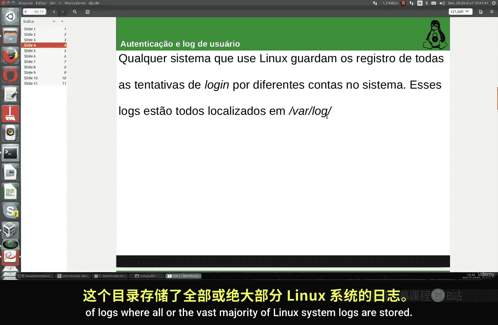
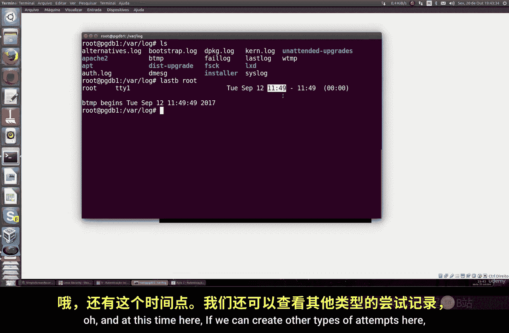
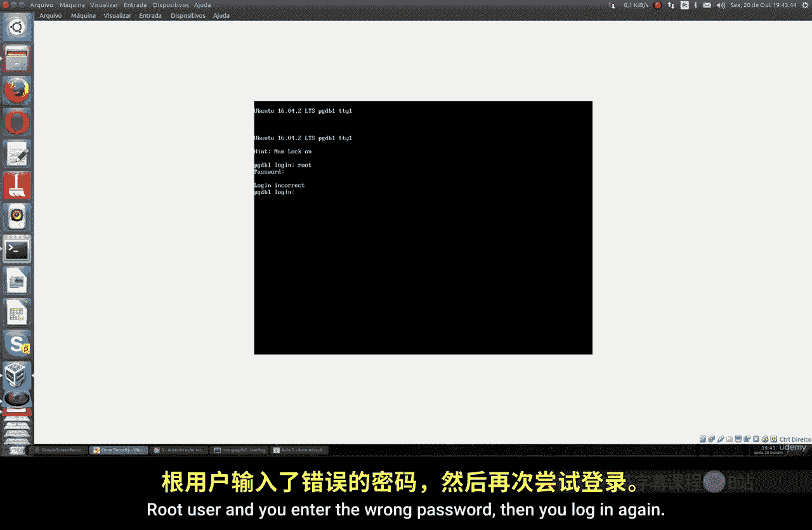
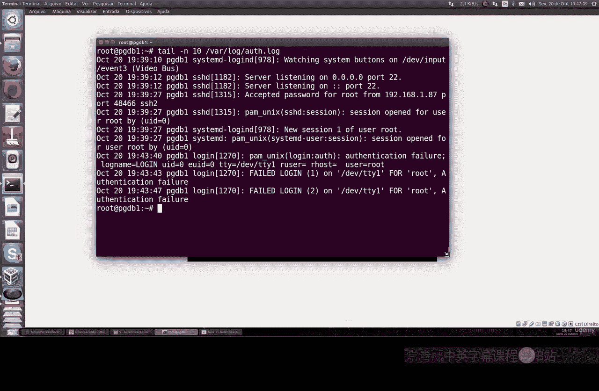
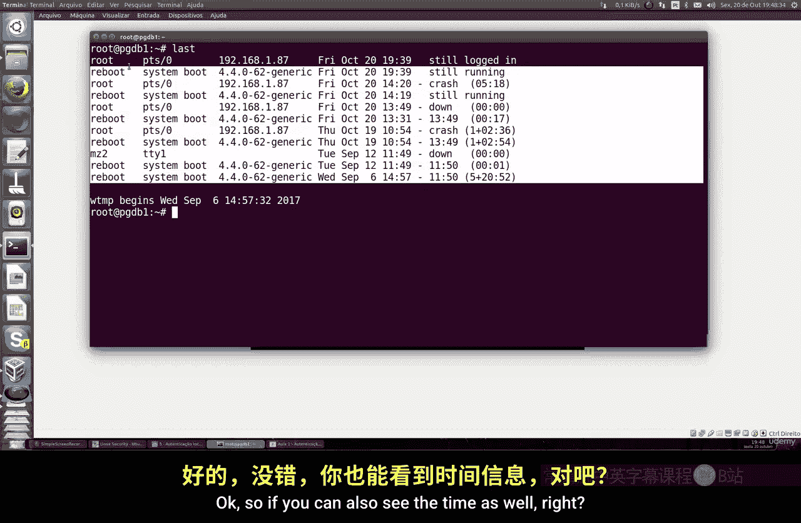
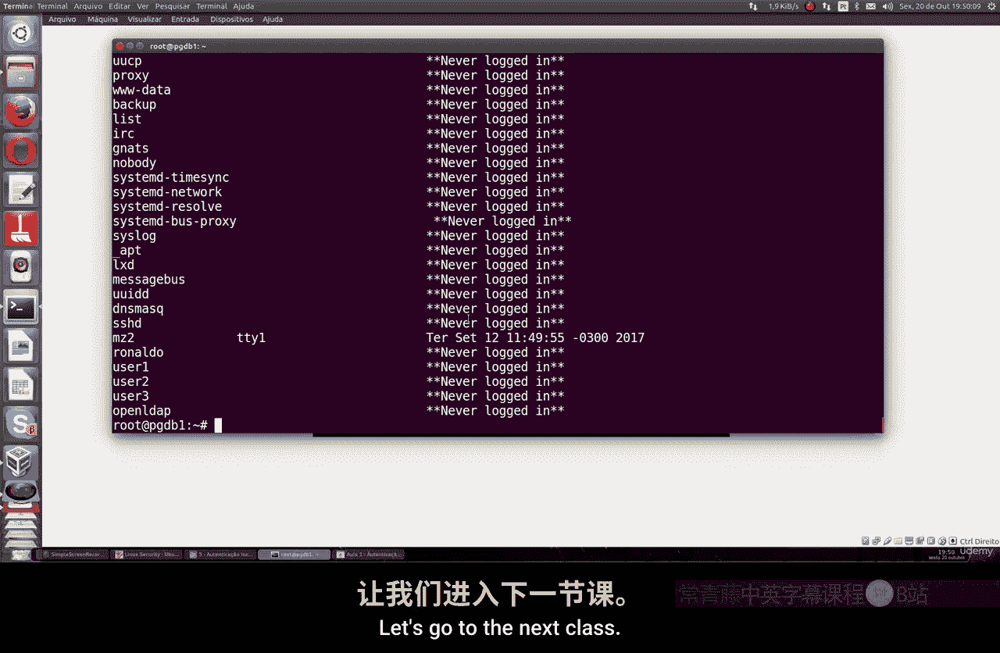

# 018：用户认证与日志记录 🔍

在本节课中，我们将要学习Linux系统中的用户认证与日志记录。这对于所有类型的Linux管理员来说都是一个非常重要的主题，因为通过日志，你可以追踪所有尝试登录的记录，无论是成功还是失败的操作，以及任何用户在系统上的行为。

## 日志目录概览

上一节我们介绍了日志的重要性，本节中我们来看看日志存储的位置。Linux系统的大部分日志都存储在 `/var/log` 目录中。这是一个包含各种系统和服务日志的目录。




你可以使用 `cd /var/log` 命令进入该目录查看。这里不仅包含认证日志，还包含所有Linux系统程序的日志，例如Apache、PHPAdmin、DPKG以及系统自身的日志。

## 查看特定用户的登录尝试

如果你想查看特定用户（例如 `root`）的登录尝试记录，包括失败的密码尝试、日期和时间，可以使用 `lastb` 命令。

以下是使用 `lastb` 命令查看 `root` 用户登录尝试的示例：
```bash
lastb root
```
执行该命令后，系统会显示 `root` 用户的所有登录尝试。例如，它会显示成功的登录发生在9月12日的某个时间。






如果你故意输入错误密码，然后再次登录，这些失败的尝试也会被记录下来。


日志会精确显示日期和时间。例如，`root` 用户在 `tty1`（第一个终端）上的失败登录尝试，记录为“Friday, October 20 at 7:43 pm”。同样，你也可以查看其他用户（如之前创建的 `user`）的登录记录。

## 查看内核日志

除了认证日志，你还可以查看Linux内核的日志，这包含了硬件与软件交互层面的信息。

要查看所有内核日志，可以使用 `dmesg` 命令：
```bash
dmesg
```
这个命令会显示大量信息，包括USB、系统、SSH、RAID以及磁盘驱动器相关的日志。

由于信息量巨大，你可以使用管道 `|` 和 `grep` 命令来过滤出你感兴趣的内容。

以下是使用 `grep` 过滤出包含“USB”关键词的日志的示例：
```bash
dmesg | grep USB
```
通过这种方式，你可以以非常有趣的方式过滤和查看系统内核记录的具体信息。

## 查看日志文件的末尾内容

有时，你可能只想查看某个日志文件最新的几条记录。

要查看指定日志文件（例如认证日志 `/var/log/auth.log`）的最后10行，可以使用 `tail` 命令：
```bash
tail -10 /var/log/auth.log
```




执行后，它会显示该系统认证日志中最新的10条记录，其中就包括我们之前故意进行的失败登录尝试。

## 查看用户登录历史

如果你想以更简洁的方式查看所有用户最近的登录尝试，包括系统重启记录，可以使用 `last` 命令。

`last` 命令会格式化地显示所有用户的登录历史、使用的终端类型以及连接时间等信息。
```bash
last
```




通过这个命令，你可以清晰地看到每次连接的发生时间，甚至系统崩溃或关机的时间。

## 查看用户最后登录时间

最后，如果你想查看系统上每个用户最后一次登录的详细信息，可以使用 `lastlog` 命令。

`lastlog` 命令会读取 `/etc/shadow` 系统文件，并显示每个用户的最后登录记录。
```bash
lastlog
```
例如，输出会显示用户 `rinaldo` 从未登录过，用户 `mz2` 在某个日期和时间登录过一次，而 `root` 用户则显示了其最近登录的IP地址、日期和时间等信息。

## 总结



本节课中我们一起学习了Linux用户认证与日志记录的核心知识。Linux拥有多种不同的日志文件类型来记录系统的各种细节。通过本节课介绍的 `lastb`、`dmesg`、`tail`、`last` 和 `lastlog` 等命令，你可以根据需求查看所有相关的记录和详细信息。掌握这些技能对于进行系统审计和故障排查至关重要。