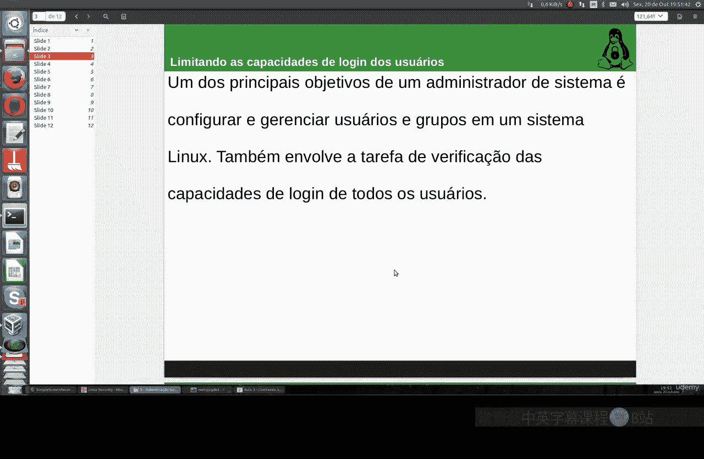
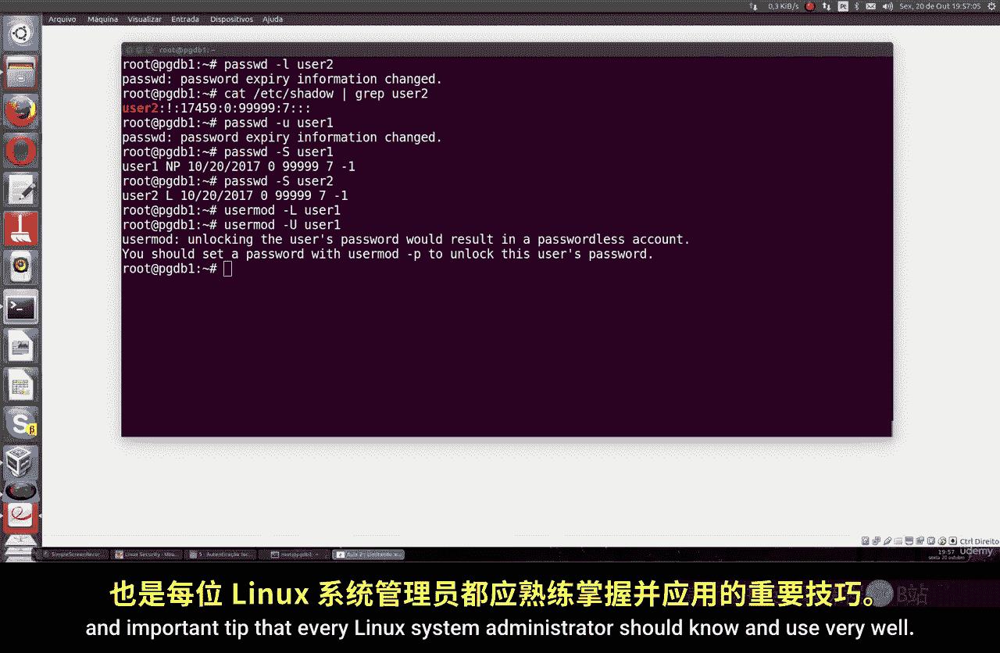

# 019：限制用户登录能力 🔒

在本节课中，我们将学习如何限制Linux系统中用户的登录能力。这是每位Linux系统管理员都应掌握的核心技能，无论你使用的是CentOS、Ubuntu、Debian还是Fedora。

上一节我们介绍了用户和组的基本管理，本节中我们来看看如何通过修改用户配置来限制其登录权限。

## 查看用户信息



首先，我们可以通过查看 `/etc/passwd` 文件来获取用户的详细信息，包括其登录Shell。使用 `grep` 命令可以过滤出特定用户的信息。

以下是查看用户 `user1` 信息的命令示例：

```bash
cat /etc/passwd | grep user1
```

执行此命令后，你将看到该用户的详细信息，例如其主目录和登录Shell。

## 通过修改Shell限制登录

一种限制用户登录的方法是将其登录Shell更改为一个特殊值（如 `/sbin/nologin`）。这可以通过 `usermod` 命令实现。

以下是修改用户 `user1` 登录Shell的命令：

```bash
usermod -s /sbin/nologin user1
```

执行此命令后，用户 `user1` 将无法登录系统。若尝试登录，系统会提示“account is not available”。

## 使用 `passwd` 命令锁定账户

另一种方法是使用 `passwd` 命令锁定用户账户。这会使用户的密码哈希值失效。

以下是锁定用户 `user2` 账户的命令：

```bash
passwd -l user2
```

锁定后，你可以通过以下命令查看用户状态，密码字段前的 `!` 或 `!!` 表示账户已被锁定：

```bash
grep user2 /etc/shadow
```

## 解锁用户账户

如果需要恢复用户的登录权限，可以使用 `passwd` 命令解锁账户。

以下是解锁用户 `user2` 的命令：

```bash
passwd -u user2
```

## 验证账户锁定状态

你可以使用 `passwd` 命令配合 `-S` 参数来快速查看用户的锁定状态。

以下是查看用户状态的命令：

```bash
passwd -S user2
```

输出结果中，若显示 `L` 则表示锁定（Locked），`P` 表示密码有效（Password set），`NP` 表示无密码（No Password）。

## 使用 `usermod` 命令锁定与解锁

除了 `passwd` 命令，`usermod` 命令也提供了锁定和解锁功能。

以下是使用 `usermod` 命令锁定和解锁用户 `user2` 的示例：

```bash
# 锁定账户
usermod -L user2

# 解锁账户
usermod -U user2
```



本节课中我们一起学习了多种在Linux系统上限制和管理用户登录能力的方法。我们介绍了如何通过修改登录Shell、使用 `passwd` 命令以及 `usermod` 命令来锁定和解锁用户账户。掌握这些技巧对于系统安全管理至关重要。