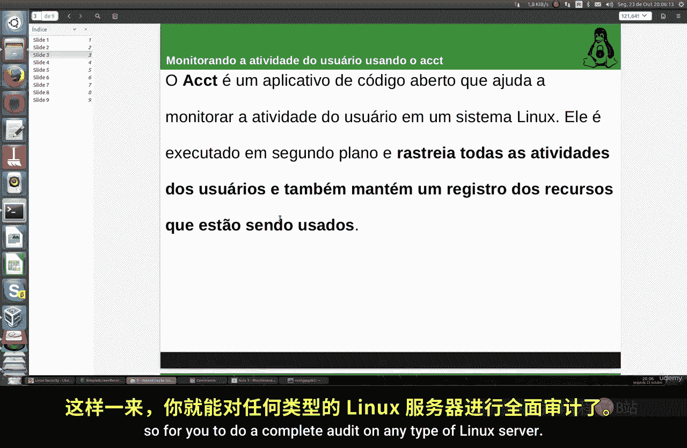
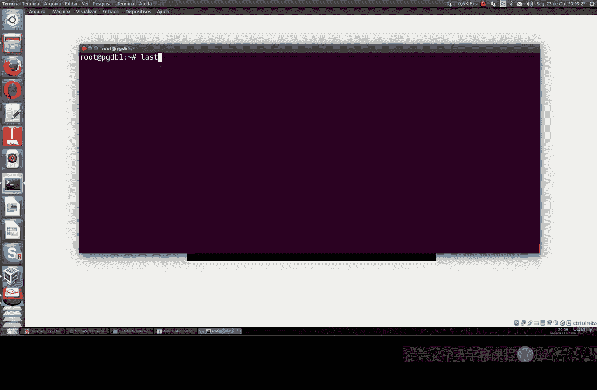
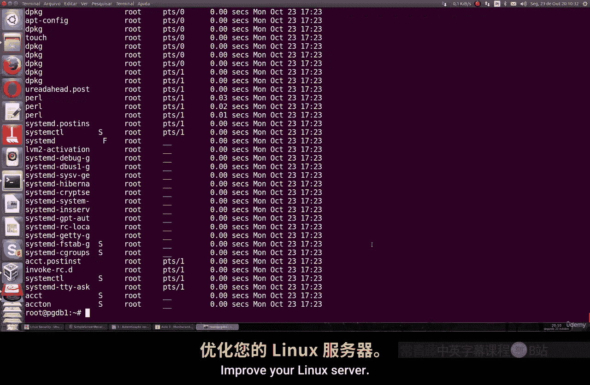

# 020：使用acct监控用户活动 👁️

在本节课中，我们将学习如何使用一个名为`acct`的实用工具来监控和审计Linux服务器上的用户活动。这个工具功能强大，可以追踪系统上所有用户的活动，并记录每个用户所使用的资源。

## 概述



`acct`（即`psacct`或`acct`包）是一个进程记账工具。它默认并未安装在Ubuntu或Debian系统上。通过安装这个工具，我们可以获取用户登录、命令执行以及连接时长等详细信息，这对于系统审计和监控非常有帮助。

## 安装acct工具

首先，我们需要在系统上安装`acct`工具。安装命令因Linux发行版而异。

以下是针对不同系统的安装命令：

*   **对于Ubuntu/Debian系统**，使用以下命令安装：
    ```bash
    sudo apt-get install acct
    ```
*   **对于CentOS/RHEL/Fedora/Oracle Linux系统**，使用以下命令安装：
    ```bash
    sudo yum install psacct
    ```

安装完成后，相关的命令在两种系统上基本一致。

## 监控用户连接时间

上一节我们安装了`acct`工具，本节中我们来看看如何使用它来监控用户的连接时间。`acct`提供了多个命令来查看不同类型的活动信息。

以下是查看用户连接时间的常用命令：

*   **查看所有用户的总连接时间**：运行`ac`命令，它会显示系统上所有用户累计的连接时间总和。
    ```bash
    ac
    ```
*   **查看每日用户连接时间**：使用`ac -d`命令，可以查看每一天每个用户的连接时长统计。
    ```bash
    ac -d
    ```
*   **查看单个用户的总连接时间**：使用`ac -p`命令，后面跟上用户名，可以查看特定用户的连接总时长。
    ```bash
    ac -p root
    ```
*   **查看特定用户的详细连接时间**：直接使用`ac`命令后接用户名，可以查看该用户的连接记录。
    ```bash
    ac root
    ```

## 审计用户执行的命令

除了连接时间，我们还可以审计用户具体执行过哪些命令。`lastcomm`命令可以显示之前执行过的所有命令的详细记录，这对于深入审计非常有用。



运行`lastcomm`命令，你将看到一份详细的列表，其中包含：

*   命令名称
*   执行该命令的用户名
*   命令执行的终端
*   命令开始执行的日期和时间
*   命令运行的时长

例如，要查看`root`用户执行过的命令，可以运行：
```bash
lastcomm root
```
这个功能让你能够详细了解用户在系统上的操作历史。

## 总结



本节课中我们一起学习了如何使用`acct`工具包来监控Linux服务器上的用户活动。我们首先介绍了如何在不同发行版上安装`acct`，然后学习了使用`ac`命令来查看用户的连接时间统计，包括总时长、每日统计以及特定用户的时长。最后，我们探讨了如何使用`lastcomm`命令来审计用户历史上执行过的具体命令，这为系统管理和安全审计提供了有力的支持。