# 021：使用USB设备与PAM进行登录认证 🔑

在本节课中，我们将学习如何使用USB设备（如U盘或移动硬盘）作为登录认证的令牌，替代传统的用户名和密码方式。这是一种增强系统访问安全性的方法。

## 概述

我们将配置Linux系统，使其允许特定的用户通过插入预先配置好的USB设备来完成登录认证。当USB设备（令牌）插入时，用户无需输入密码即可登录；当设备移除时，系统将恢复要求密码。本教程主要基于Ubuntu和Debian系统进行演示。

## 准备工作

上一节我们介绍了命令行基础操作，本节中我们来看看如何将物理设备用于系统认证。首先，你需要准备一个USB设备（如U盘）和一个Linux环境（可以是物理机或虚拟机）。

以下是开始前需要确认的事项：
*   一个可用的USB设备（容量1GB以上即可）。
*   一个Ubuntu或Debian系统（本教程基于Ubuntu Server，但逻辑适用于其他版本）。
*   如果在虚拟机（如VirtualBox）中操作，需确保已为虚拟机配置并连接USB设备。

## 安装必要软件包

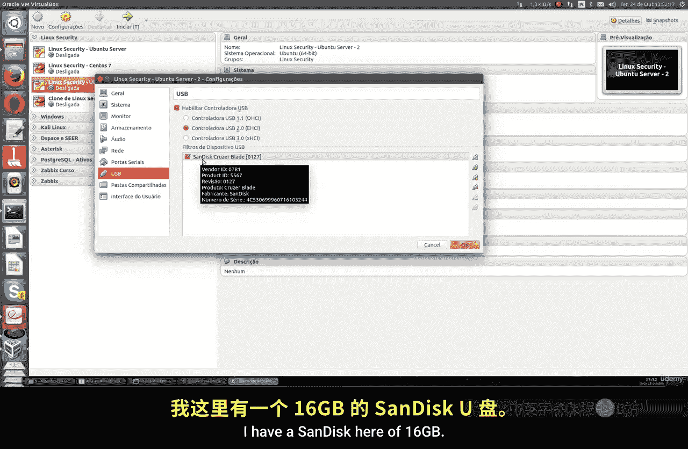

为了使用USB设备进行认证，我们需要安装 `pamusb-tools` 软件包。在较新的Ubuntu（16.04+）和Debian（8/9+）版本中，该软件包可能不在默认仓库中。

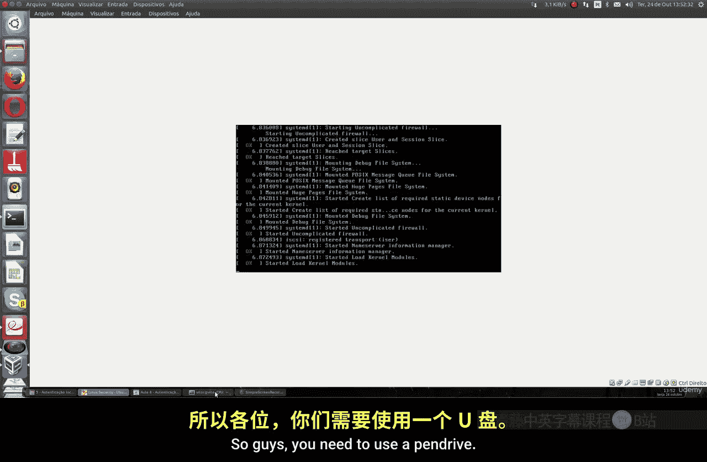

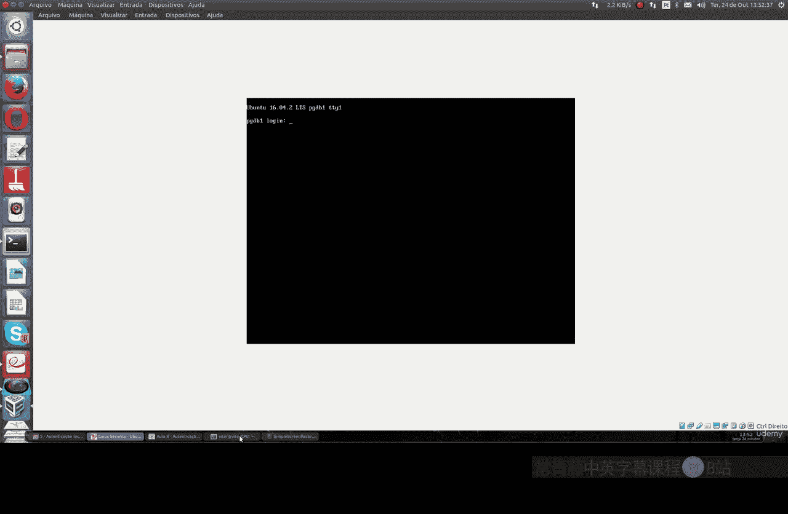

因此，我们需要先添加其PPA仓库，然后进行安装。

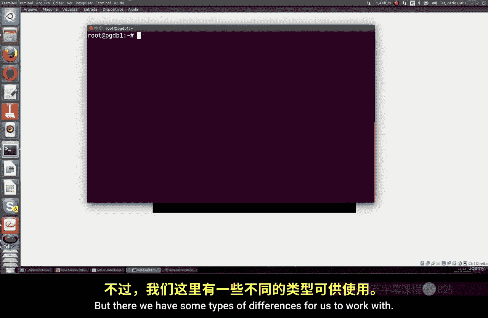

```bash
sudo add-apt-repository ppa:mkusb/ppa
sudo apt update
sudo apt install pamusb-tools
```

同时，我们还需要安装 `usbmount` 工具，它可以帮助系统自动挂载USB设备。

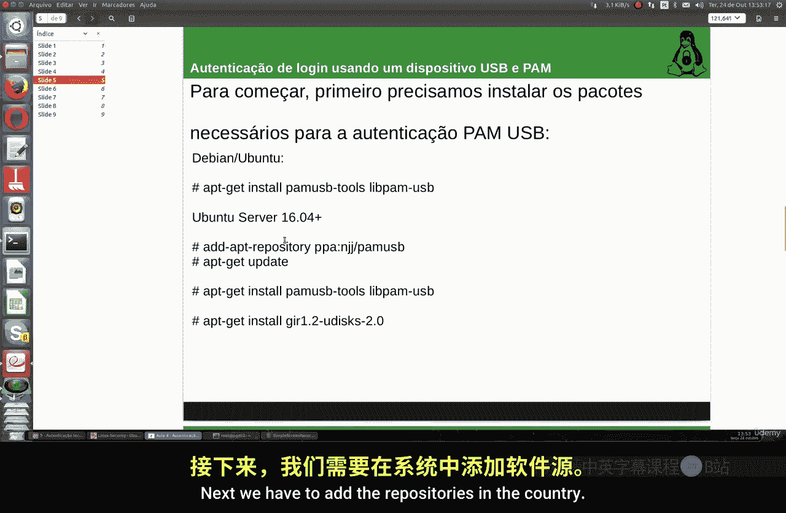

```bash
sudo apt install usbmount
```

安装完成后，我们就可以开始配置系统了。

## 配置USB设备为认证令牌

首先，我们需要识别USB设备在系统中的位置。使用 `lsblk` 或 `fdisk -l` 命令查看。

```bash
sudo fdisk -l
```

假设你的U盘被识别为 `/dev/sdb`。接下来，我们将这个设备注册到PAM USB配置中。

运行以下命令来添加设备。你需要为设备指定一个名称，例如 `usb-token`。

```bash
sudo pamusb-conf --add-device usb-token
```

命令执行后，系统会扫描所有USB设备并列出。选择你的U盘对应的序列号或型号。确认后，配置信息会以XML格式保存。

你可以查看生成的配置文件以确认设置。

```bash
sudo cat /etc/pamusb.conf
```

在配置文件中，你可以看到设备的唯一ID、名称（`usb-token`）等信息。

## 为用户配置USB认证

设备配置好后，我们需要指定哪个用户将使用此USB设备进行认证。

例如，我们为用户 `user1` 配置USB认证。运行以下命令：

```bash
sudo pamusb-conf --add-user user1
```

系统会询问使用哪个设备进行认证，选择我们之前创建的 `usb-token`。确认后，用户的配置信息也会被写入 `/etc/pamusb.conf` 文件。

你可以再次查看配置文件，会发现增加了用户 `user1` 及其关联设备 `usb-token` 的配置节。

## 测试USB认证登录

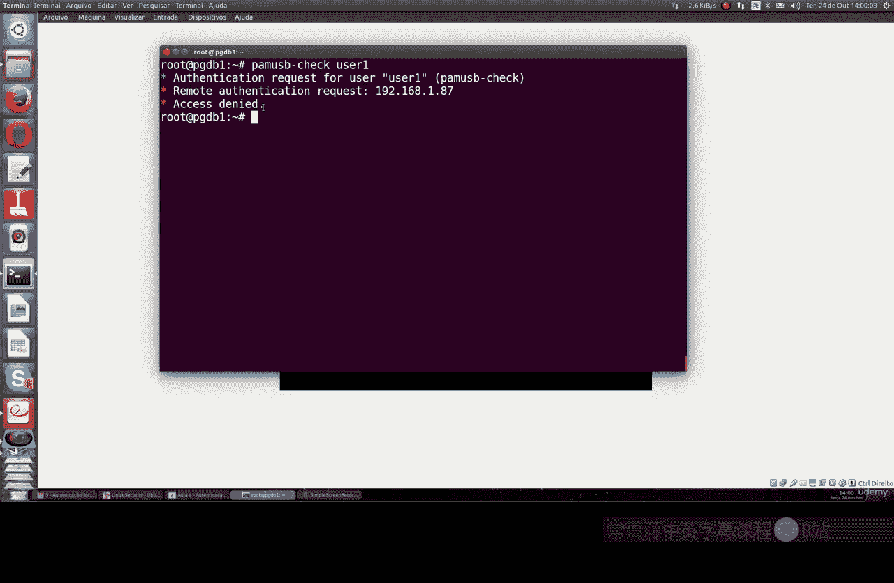

现在，让我们测试配置是否生效。首先，确保USB设备已连接到系统。

我们可以使用以下命令检查特定用户的认证方式：

```bash
sudo pamusb-check --user user1
```

如果配置正确，命令会提示该用户需要通过USB设备认证。

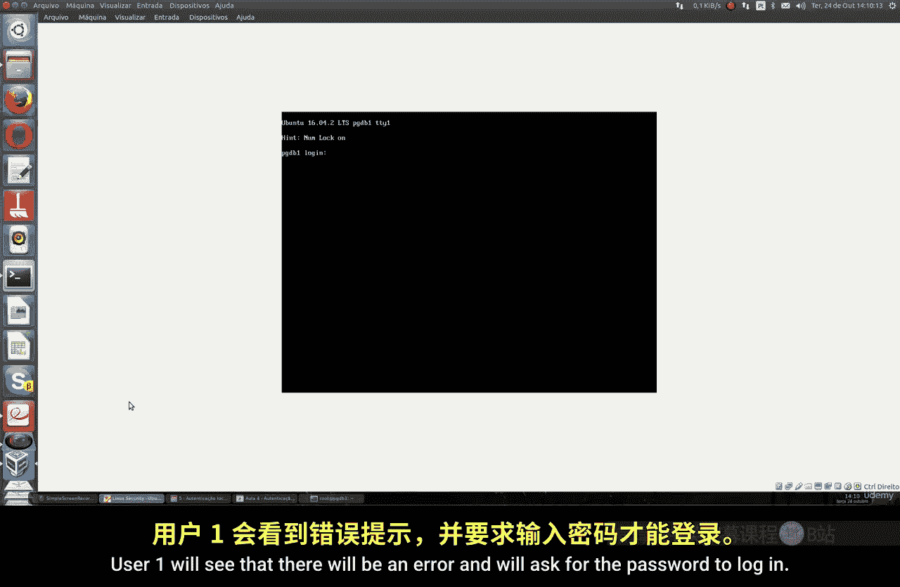

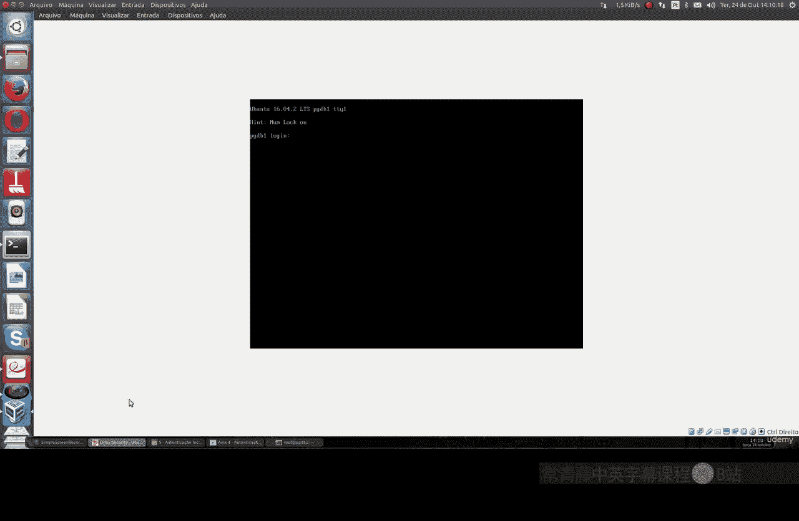

**关键测试步骤：**
1.  保持USB设备插入状态，尝试切换到 `user1` 用户（`su - user1`）。你应该能直接登录，无需输入密码，因为USB设备充当了令牌。
2.  尝试切换到未配置USB认证的其他用户（如 `user2`），系统会要求输入密码。
3.  **最终验证**：安全移除USB设备，再次尝试切换到 `user1` 用户。此时认证会失败，系统会回退并要求你输入 `user1` 的密码。

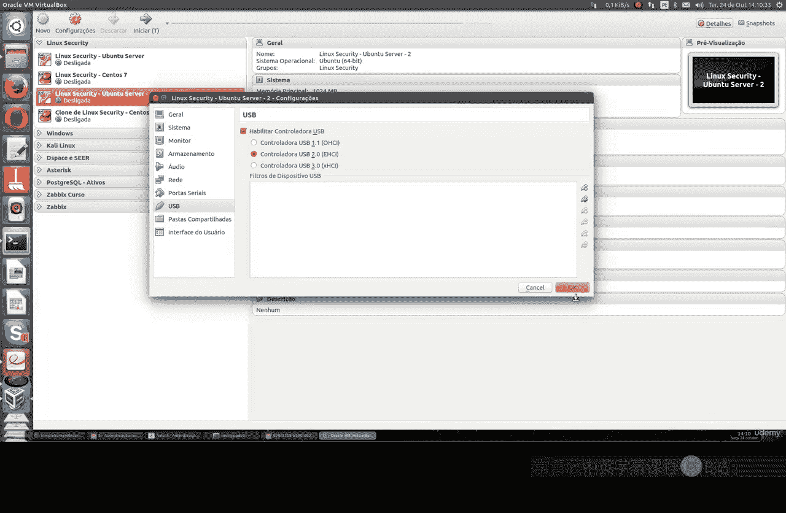

通过以上步骤，你可以验证USB令牌认证是否按预期工作。

## 图形界面环境配置（可选）

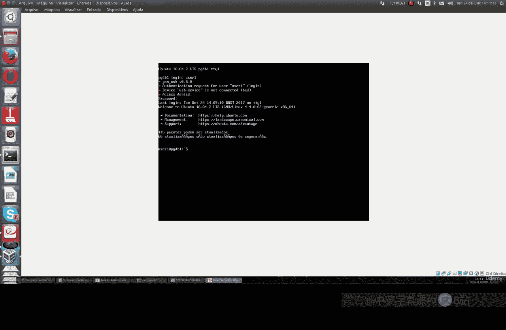

如果你在带有图形登录管理器（如GDM、LightDM、KDM）的桌面环境中使用此功能，可能需要在PAM配置中为图形会话显式启用 `pam_usb` 模块。

这通常涉及编辑 `/etc/pam.d/` 目录下的相应配置文件（例如 `gdm-password` 或 `lightdm`），添加类似下面的一行：

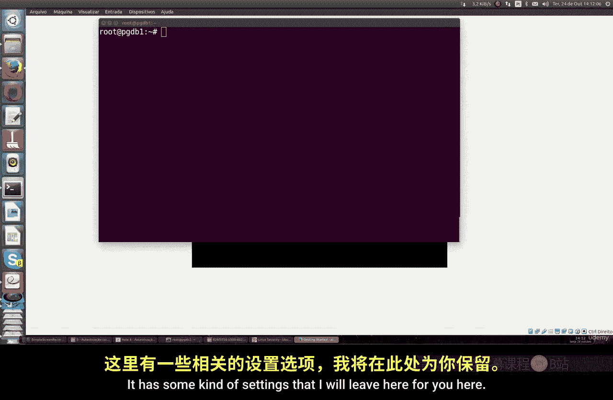

```
auth    sufficient      pam_usb.so
```

**注意**：服务器环境通常没有图形界面，因此此步骤是可选的。修改PAM配置前请务必备份原文件，错误的配置可能导致无法登录系统。

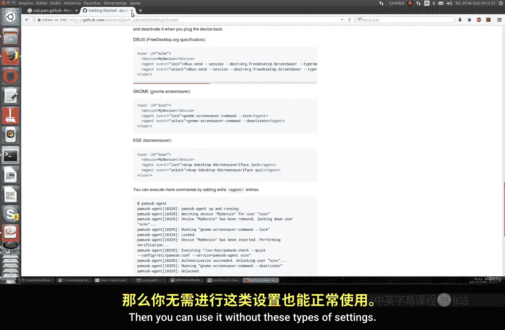

## 总结

本节课我们一起学习了如何将USB设备配置为Linux系统的登录认证令牌。我们完成了从安装必要工具、注册USB设备、关联用户到最终测试的完整流程。这种方法为特定用户提供了一种便捷且物理隔离的双因素认证方式，增强了本地登录的安全性。

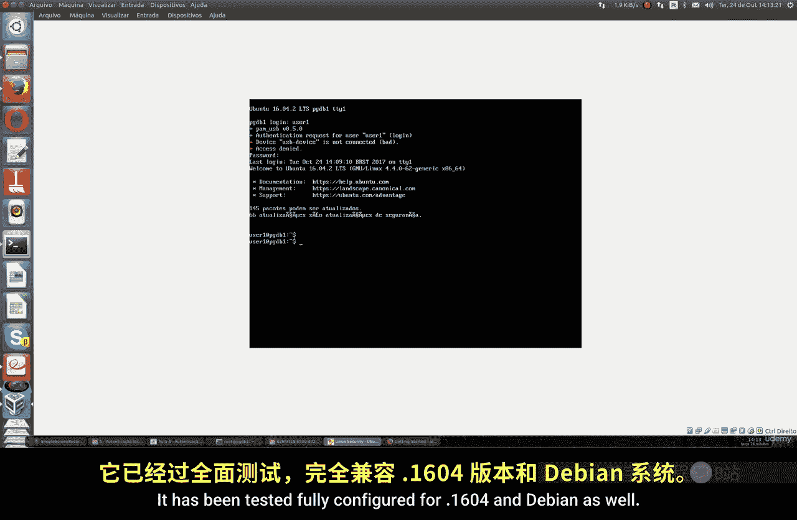

请注意，本教程主要适用于Ubuntu和Debian系发行版。对于Fedora、RHEL等其他发行版，软件包和配置方法可能有所不同，请根据具体系统寻找适配方案。