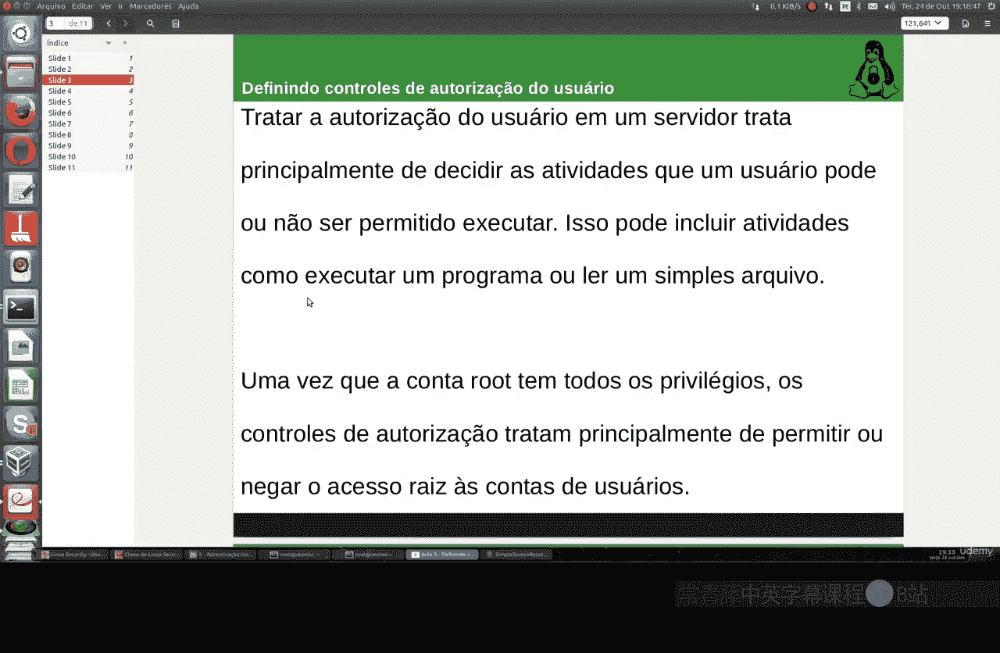
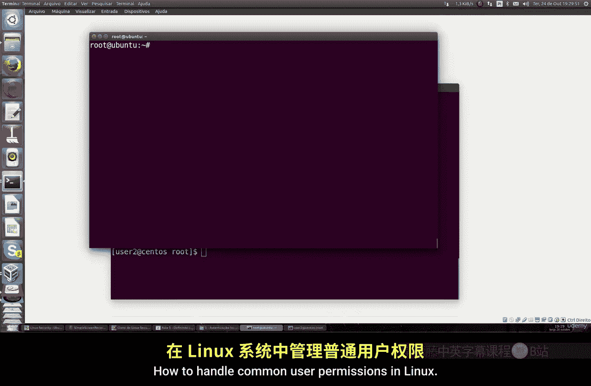

# 022：定义用户授权控制 🔐

在本节课中，我们将学习如何在Linux服务器上定义和控制不同用户的授权。主要内容包括如何允许特定用户执行通常只有root用户才能运行的命令，以及如何为用户分配特定的管理权限。

上一节我们介绍了用户管理的基础知识，本节中我们来看看如何精确控制用户的权限。



## 理解用户权限层级

Linux系统中，root账户拥有所有权限，可以执行任何操作。普通用户则权限受限。但我们可以通过配置，将某些特定的命令或管理任务授权给指定的普通用户，从而实现任务委派和权限分配。

## 权限控制实践

以下是配置用户权限的具体步骤。

### 1. 默认权限限制

默认情况下，普通用户无法以其他用户身份执行命令。例如，用户`user1`尝试以用户`user2`的身份运行`ps`命令时，系统会拒绝并可能报告安全事件。

**命令示例**：
```bash
su - user2 ps
```
执行此命令会要求输入`user2`的密码，但即使密码正确，普通用户通常也没有权限执行，系统会提示“user2 is not in the file”或类似错误。

### 2. 使用`sudoers`文件进行授权

要允许`user2`以`user1`的身份执行`ps`命令，需要编辑`/etc/sudoers`文件。此文件必须由root用户编辑。

**编辑命令**：
```bash
sudo visudo
```
此命令会使用默认编辑器（如nano）打开`sudoers`文件，它能进行语法检查，比直接编辑更安全。

### 3. 配置授权规则

在`sudoers`文件末尾，添加如下规则：
```
user1 ALL=(user2) /bin/ps
```
这条规则的含义是：允许`user1`用户以`user2`用户的身份执行`/bin/ps`命令。

保存并退出编辑器后，`user1`就可以使用以下命令，并在输入`user2`的密码后成功执行：
```bash
sudo -u user2 ps
```

### 4. 配置免密码执行

如果希望`user1`执行上述命令时无需输入`user2`的密码，可以将规则修改为：
```
user1 ALL=(user2) NOPASSWD: /bin/ps
```
配置后，`user1`直接运行`sudo -u user2 ps`即可，系统不会提示输入密码。

### 5. 设置全局密码策略

如果希望特定用户（如`user1`）在执行任何`sudo`命令时都必须输入自己的密码，可以添加如下默认规则：
```
Defaults:user1 timestamp_timeout=0
```
此设置会强制`user1`每次使用`sudo`时都进行密码验证。

### 6. 委派特定管理任务

我们可以授权一个普通用户管理其他用户的密码。例如，允许`user1`更改`user2`和`user3`的密码。

在`sudoers`文件中添加：
```
user1 ALL=(root) /usr/bin/passwd user2, /usr/bin/passwd user3
```
现在，`user1`可以使用`sudo`来运行`passwd`命令为`user2`和`user3`修改密码：
```bash
sudo passwd user2
sudo passwd user3
```
系统会要求输入`user1`自己的密码进行验证。

## 总结



本节课中我们一起学习了Linux用户授权控制的核心方法。通过编辑`/etc/sudoers`文件，系统管理员可以灵活地将特定命令的执行权限委派给普通用户，可以要求或不要求密码验证。这种机制在保证系统安全的同时，也提供了权限管理的灵活性，是Linux系统管理中的重要技能。