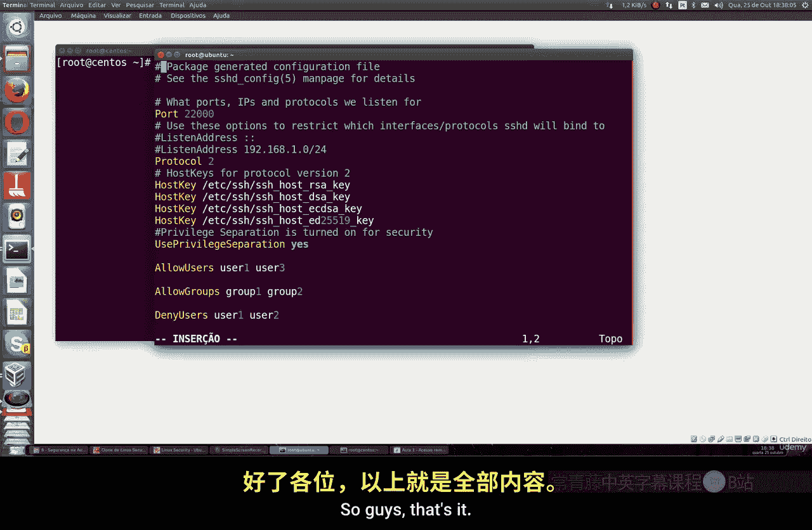
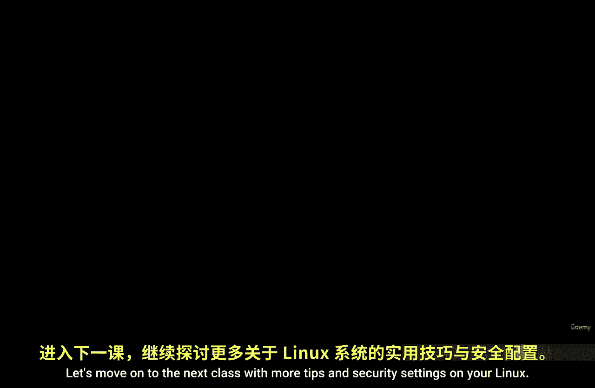

# 023：使用SSH远程访问服务器与主机 🔐

在本节课中，我们将学习如何使用SSH协议安全地远程访问和管理Linux服务器。我们将涵盖SSH的基本概念、安装方法、连接步骤以及一系列增强服务器安全性的关键配置。

---

## 什么是SSH？

上一节我们介绍了基本的命令行操作，本节中我们来看看如何远程连接服务器。SSH，即安全外壳协议，是一种广泛使用的网络协议，用于通过加密通道安全地登录到远程系统。它是远程访问各类Linux系统最常用的方法。

Linux系统默认使用OpenSSH，这是SSH协议的一个开源实现。它适用于Linux、Solaris、FreeBSD等多种系统。一些Linux发行版，如Rocky Linux，默认已安装此协议。其他系统可能需要单独安装。

SSH默认运行在**端口22**上，就像Apache Web服务器默认运行在端口80一样。

---

## 安装与基本连接

以下是安装OpenSSH服务器的方法。

对于基于Ubuntu和Debian的系统，使用以下命令：
```bash
sudo apt-get install openssh-server
```

对于基于Red Hat、Fedora或CentOS的系统，使用以下命令：
```bash
sudo yum install openssh-server
# 或使用 dnf (Fedora/RHEL 8+)
sudo dnf install openssh-server
```

安装完成后，启动SSH服务。现在，SSH已准备就绪。

要连接到远程服务器，首先需要知道目标服务器的IP地址。然后，在本地终端使用`ssh`命令。

基本连接命令格式如下：
```bash
ssh username@server_ip_address
```

例如，以`root`用户连接到IP为`192.168.1.100`的服务器：
```bash
ssh root@192.168.1.100
```

系统会提示你输入对应用户的密码。输入正确密码后，即可成功登录远程机器。

---

## 增强SSH安全性：更改默认端口

使用默认端口22会带来安全风险，尤其是将服务器暴露在互联网上时。因此，首要的安全措施之一是更改SSH默认端口。

我们需要编辑SSH服务器的配置文件`/etc/ssh/sshd_config`。

1.  使用文本编辑器（如`vi`或`nano`）打开配置文件：
    ```bash
    sudo vi /etc/ssh/sshd_config
    ```

2.  找到包含`#Port 22`的行，删除开头的`#`号，并将`22`更改为一个高位端口号（例如`22000`）：
    ```
    Port 22000
    ```

3.  保存并关闭文件。

**在CentOS/RHEL/Fedora系统上**，还需要配置防火墙和SELinux以允许新端口：
```bash
# 允许新端口通过防火墙
sudo firewall-cmd --permanent --add-port=22000/tcp
sudo firewall-cmd --reload

# 为SELinux添加新端口策略
sudo semanage port -a -t ssh_port_t -p tcp 22000
```

**在Ubuntu/Debian系统上**，通常只需配置防火墙（如UFW）：
```bash
sudo ufw allow 22000/tcp
sudo ufw reload
```

4.  最后，重启SSH服务使更改生效：
    ```bash
    sudo systemctl restart sshd
    # 或使用旧版命令
    sudo service ssh restart
    ```

现在，连接时必须指定新端口：
```bash
ssh -p 22000 username@server_ip_address
```

---

## 禁用Root用户直接登录

允许root用户直接通过SSH登录是一个安全隐患。最佳实践是使用普通用户登录，然后在需要时使用`sudo`提权。

在SSH配置文件中进行以下设置：

1.  找到`#PermitRootLogin yes`这一行。
2.  将其改为`PermitRootLogin no`。
    ```
    PermitRootLogin no
    ```
3.  保存文件并重启SSH服务。

完成此设置后，将无法直接以root身份登录。你必须先使用一个普通用户账户登录，例如：
```bash
ssh user001@server_ip_address
```
登录后，如果需要执行管理员任务，再使用`sudo`命令。

---

## 限制允许登录的用户和组

你可以进一步控制哪些用户或用户组可以通过SSH访问系统。以下是相关配置选项。

在`/etc/ssh/sshd_config`文件中，你可以使用以下指令：

*   **`AllowUsers`**：指定允许登录的用户列表（用空格分隔）。
    ```
    AllowUsers alice bob charlie
    ```
*   **`AllowGroups`**：指定允许登录的用户组。
    ```
    AllowGroups sshusers
    ```
*   **`DenyUsers`**：指定明确拒绝登录的用户。
    ```
    DenyUsers hacker baduser
    ```
*   **`DenyGroups`**：指定明确拒绝登录的用户组。

使用`AllowGroups`通常是更高效的管理方式，你只需将允许SSH登录的用户加入一个特定的组（例如`sshusers`），然后在配置中允许该组即可。

修改后，别忘了重启SSH服务。

---

## 限制SSH监听地址

默认情况下，SSH服务监听服务器上所有网络接口的连接。你可以将其限制为特定的IP地址或网段，以减少暴露面。

在配置文件中，找到`#ListenAddress 0.0.0.0`（对所有IPv4接口）和`#ListenAddress ::`（对所有IPv6接口）的行。

例如，如果你只想让SSH监听内网`192.168.1.0/24`网段的连接，可以这样设置：
```
ListenAddress 192.168.1.100
# 或者监听整个子网（某些版本支持）
# ListenAddress 192.168.1.0
```

你也可以指定一个外部IP或DNS名称。修改后重启SSH服务。

---

## 其他安全建议

*   **使用SSH协议版本2**：确保配置中包含`Protocol 2`。这是现代系统的默认设置，比不安全的版本1更安全。
*   **使用密钥认证**：虽然本节课未详细展开，但使用SSH密钥对（公钥/私钥）进行认证比密码更安全。你可以禁用密码登录，仅允许密钥登录。
*   **保持软件更新**：定期更新系统和OpenSSH软件包，以获取安全补丁。

---

## 总结





本节课中我们一起学习了SSH远程访问的核心知识。我们了解了SSH的基本概念，学会了如何安装OpenSSH服务器并进行基本连接。更重要的是，我们探讨了多项关键的安全加固措施：**更改默认端口**、**禁用Root直接登录**、**限制登录用户与组**以及**限制监听地址**。综合运用这些配置，可以显著提升你的Linux服务器在面对网络攻击时的安全性，为日常运维打下坚实的安全基础。