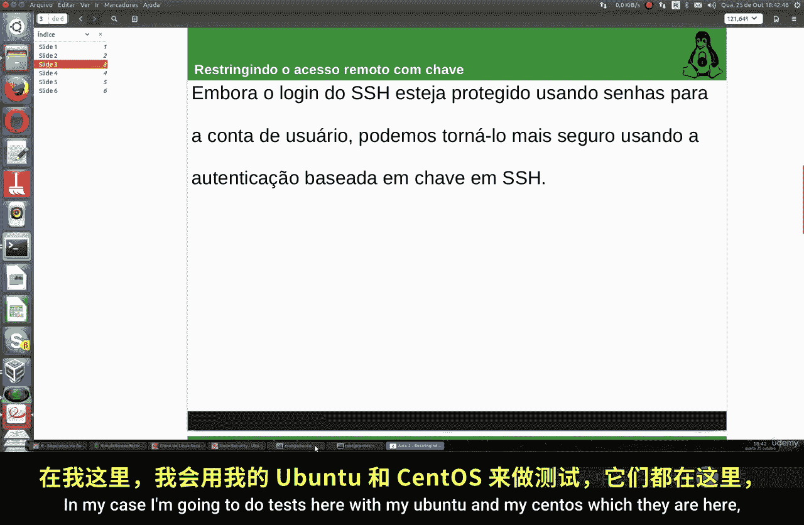
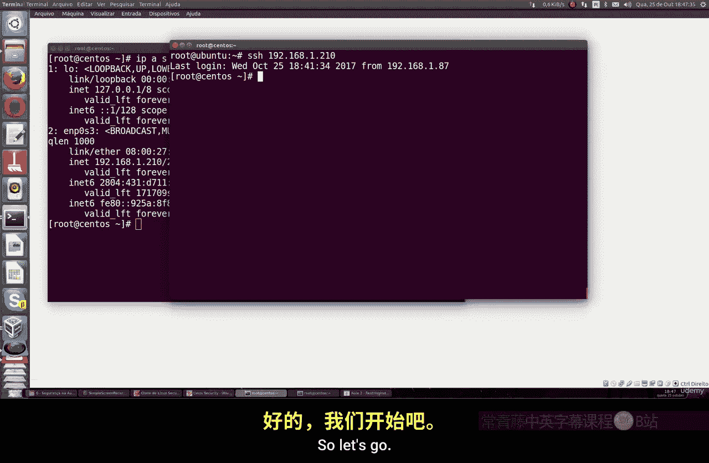

Linux命令行基础：P24：使用基于密钥的SSH登录

在本节课中，我们将学习如何配置基于密钥的SSH登录。这种方法允许你无需输入密码即可远程连接到Linux服务器，既方便又安全。

上一节我们介绍了SSH的基本连接方式，本节中我们来看看如何通过密钥对实现免密登录。

### 生成SSH密钥对



首先，我们需要在客户端机器上生成一对SSH密钥。密钥对包括一个私钥和一个公钥。私钥保存在你的本地机器上，必须严格保密；公钥则可以发送给任何你想要连接的服务器。

以下是生成密钥对的命令：

```bash
ssh-keygen -t rsa
```

执行此命令后，系统会提示你几个问题：
*   密钥的保存路径。通常直接按回车使用默认路径即可。
*   是否设置密钥的密码短语。你可以设置一个额外的密码来增强安全性，也可以留空直接按回车，以实现完全免密登录。

命令成功执行后，会生成一个2048位的RSA密钥对，这是一个强度很高的加密密钥。

### 将公钥复制到服务器

生成密钥对后，需要将公钥部署到目标服务器上。这样，当你尝试连接时，服务器就可以用你的公钥来验证你的身份。

我们可以使用一个专用命令来完成这个操作：

```bash
ssh-copy-id root@192.168.1.210
```

请将上述命令中的IP地址 `192.168.1.210` 替换为你目标服务器的实际IP地址。执行命令后，系统会要求你输入服务器上 `root` 用户的密码。验证成功后，你的公钥就会被自动添加到服务器 `root` 用户家目录下的 `~/.ssh/authorized_keys` 文件中。

### 测试基于密钥的登录

公钥部署完成后，就可以测试免密登录了。

尝试使用SSH命令连接服务器：

```bash
ssh root@192.168.1.210
```

如果配置正确，你将无需输入密码，直接以 `root` 用户身份登录到服务器。这证明基于密钥的认证已成功启用。

### 关键注意事项

以下是配置过程中需要牢记的几个要点：
*   **用户对应关系**：公钥被复制到哪个服务器的哪个用户目录下，你就只能以那个用户身份免密登录到那台服务器。你可以为不同的服务器和用户重复此过程。
*   **私钥安全**：你的私钥（默认位于 `~/.ssh/id_rsa`）等同于密码，必须妥善保管，切勿泄露给他人。
*   **密码短语**：如果你在生成密钥时设置了密码短语，那么每次使用密钥登录时仍需要输入该短语。这提供了双重验证，但失去了完全免密的便利性。你可以根据安全需求进行选择。

本节课中我们一起学习了如何设置基于密钥的SSH认证。我们首先生成了RSA密钥对，然后将公钥复制到远程服务器，最后成功实现了免密码安全登录。这种方法极大地简化了日常远程管理操作，并提供了比单纯密码更强大的安全性。



接下来，我们将继续学习远程连接中的其他安全增强措施。