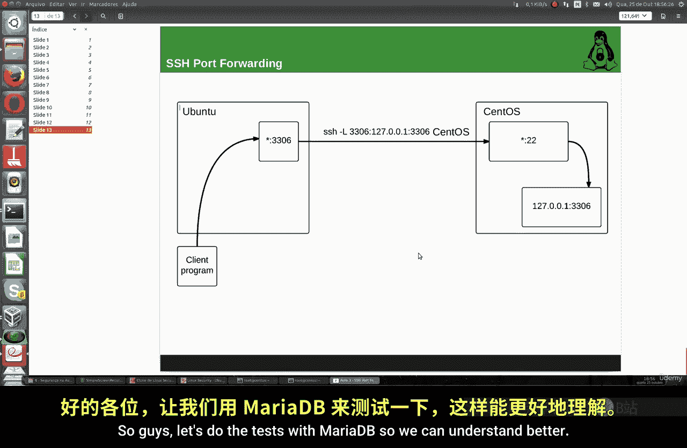
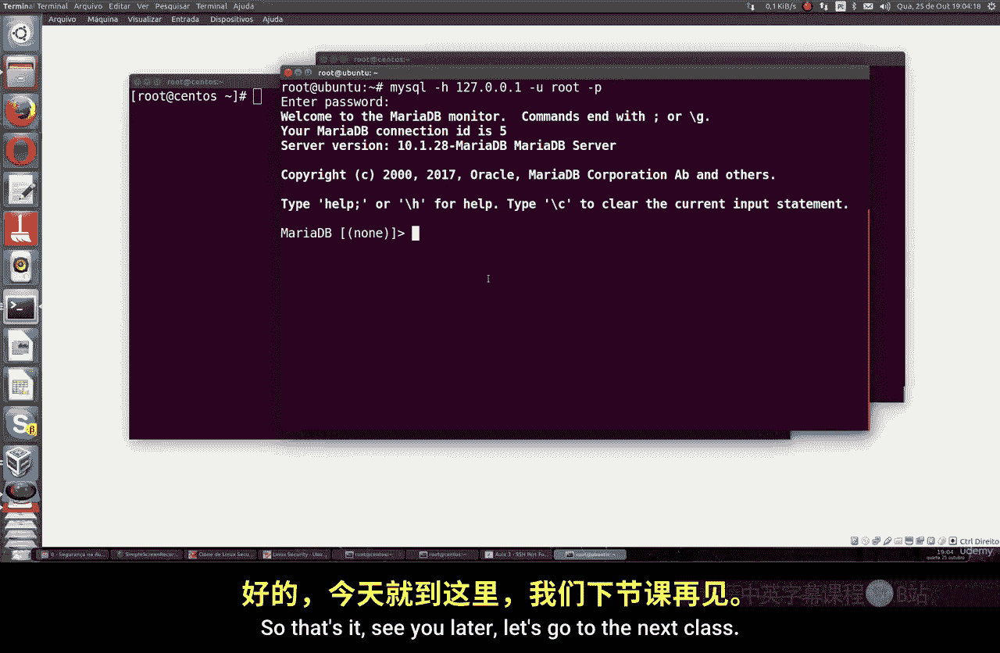

# 025：SSH端口转发 🚀

在本节课中，我们将要学习SSH端口转发的概念与实践。这是一种通过SSH隧道将客户端机器的应用端口安全地连接到服务器机器（或反之）的技术，无需在服务器上直接开放应用端口，从而增强系统安全性。

上一节我们介绍了SSH密钥认证，本节中我们来看看如何利用SSH建立安全的端口隧道。

## 核心概念

SSH端口转发允许你通过SSH连接（默认端口22）来“转发”或“隧道化”其他应用程序的网络流量。其核心思想是：**将本地机器上的一个端口，通过SSH加密隧道，映射到远程服务器上的一个端口**。

以下是其基本工作原理：
*   你有一个运行在服务器上的应用程序（例如数据库，端口3306）。
*   你**不**直接在服务器防火墙上开放3306端口。
*   你在本地机器上建立一个SSH隧道，将本地的某个端口（例如3306）通过SSH连接转发到服务器的3306端口。
*   你的本地应用程序连接到本地的3306端口，流量通过加密的SSH隧道安全地到达服务器上的实际应用。

这相当于一种“欺骗”系统的方式，让你能够安全地访问远程服务，就像它们在本地运行一样。

## 实践演示：通过SSH隧道连接MariaDB



为了更好理解，我们将进行一个实际演示。我们有两台机器：
*   **客户端**：Ubuntu机器（仅安装数据库客户端）。
*   **服务器**：openSUSE机器（安装MariaDB数据库服务器）。

我们的目标是：从Ubuntu客户端，通过SSH隧道，安全地连接到openSUSE服务器上的MariaDB，而无需在服务器上开放3306端口。

### 第一步：在服务器上安装并配置MariaDB

首先，我们需要在openSUSE服务器上设置MariaDB数据库。

以下是安装与初始配置步骤：
1.  添加MariaDB仓库并安装。
    ```bash
    sudo zypper addrepo https://download.opensuse.org/repositories/server:database:MariaDB/openSUSE_Leap_15.3/server:database:MariaDB.repo
    sudo zypper refresh
    sudo zypper install mariadb mariadb-client
    ```
2.  启动MariaDB服务并运行安全初始化脚本。
    ```bash
    sudo systemctl start mariadb
    sudo systemctl enable mariadb
    sudo mysql_secure_installation
    ```
    在初始化过程中，为root用户设置一个密码（例如：123456）。默认配置通常只允许root用户从`localhost`（即服务器本身）连接，这正符合我们的安全需求。

### 第二步：在客户端安装MariaDB客户端

在Ubuntu客户端上，我们只需要安装用于连接数据库的客户端工具。

执行以下命令：
```bash
sudo apt update
sudo apt install mariadb-client
```
安装完成后，你可以使用 `mysql --version` 命令验证客户端是否安装成功。

### 第三步：建立SSH端口转发隧道

这是最关键的一步。我们将在Ubuntu客户端上建立一个SSH隧道。

打开终端，运行以下命令：
```bash
ssh -L 3306:localhost:3306 user@your_server_ip
```
**命令解析**：
*   `-L 3306:localhost:3306`：这是端口转发的关键参数。
    *   第一个`3306`是**客户端本地端口**。
    *   `localhost:3306` 指的是**服务器端**（即`your_server_ip`那台机器）上的`localhost:3306`（即MariaDB服务）。
*   `user@your_server_ip`：你的SSH用户名和服务器IP地址。

执行命令后，会提示输入SSH密码。输入正确密码后，你将登录到服务器的SSH会话，同时隧道已在后台建立。**保持这个终端窗口打开**，以维持隧道连接。

### 第四步：通过隧道连接数据库

现在，SSH隧道已经建立。我们需要**打开一个新的终端窗口**（保持隧道终端运行），在Ubuntu客户端上连接数据库。

在新的终端中，运行MariaDB客户端命令：
```bash
mysql -h 127.0.0.1 -P 3306 -u root -p
```
**命令解析**：
*   `-h 127.0.0.1`：指定主机为本地环回地址。因为隧道将本地3306端口的流量转发走了，所以这里连接的是**本地端口**。
*   `-P 3306`：指定端口为3306（即我们隧道映射的本地端口）。
*   `-u root -p`：以root用户登录，并提示输入密码。

输入之前在服务器上为MariaDB的root用户设置的密码（例如：123456）。如果一切正常，你将成功登录，并且进入的是**openSUSE服务器**上的MariaDB，而不是本地（Ubuntu）的数据库（因为本地并未安装服务器）。

## 安全优势与总结

本节课中我们一起学习了SSH端口转发的原理和实战操作。

通过这种方式，你无需在数据库服务器上开放3306端口到公网，所有流量都通过加密的SSH端口22进行传输。这极大地减少了系统暴露的攻击面，避免了针对数据库端口的直接扫描和攻击。

你可以将SSH端口转发应用于任何需要远程访问的内部服务，如VNC、Web管理界面（8080）、或其他TCP服务。结合之前课程学习的SSH密钥认证，你可以实现无需密码、且高度安全的远程服务访问。



记住核心命令格式：`ssh -L [本地端口]:[远程主机]:[远程端口] [用户]@[SSH服务器地址]`。这是一个强大且必备的系统管理安全技巧。