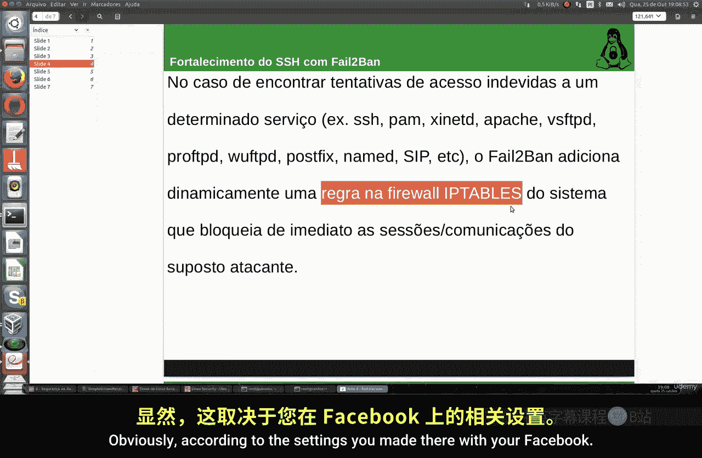
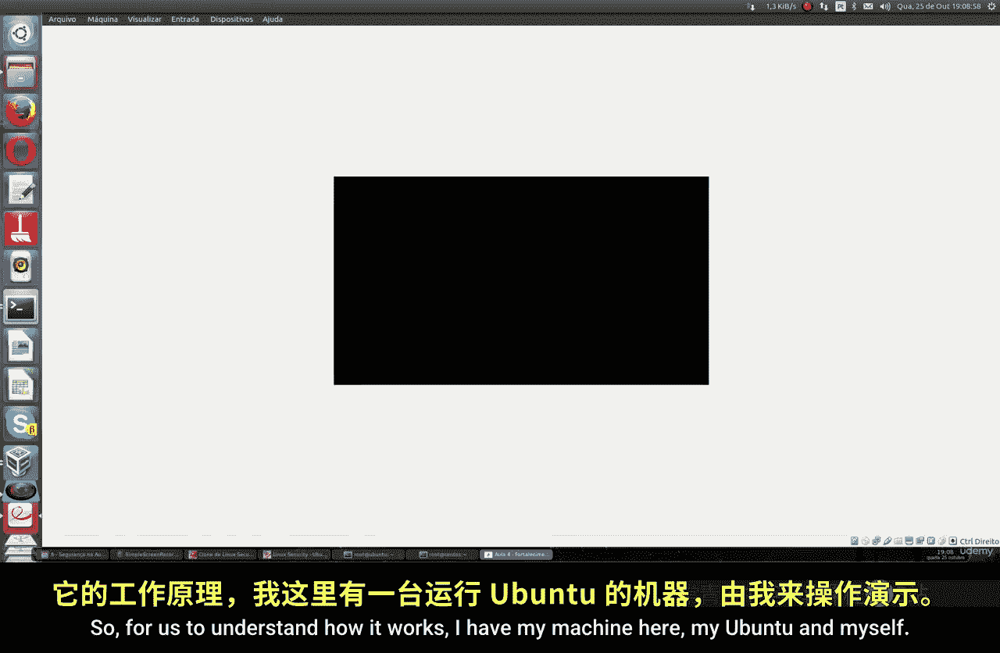
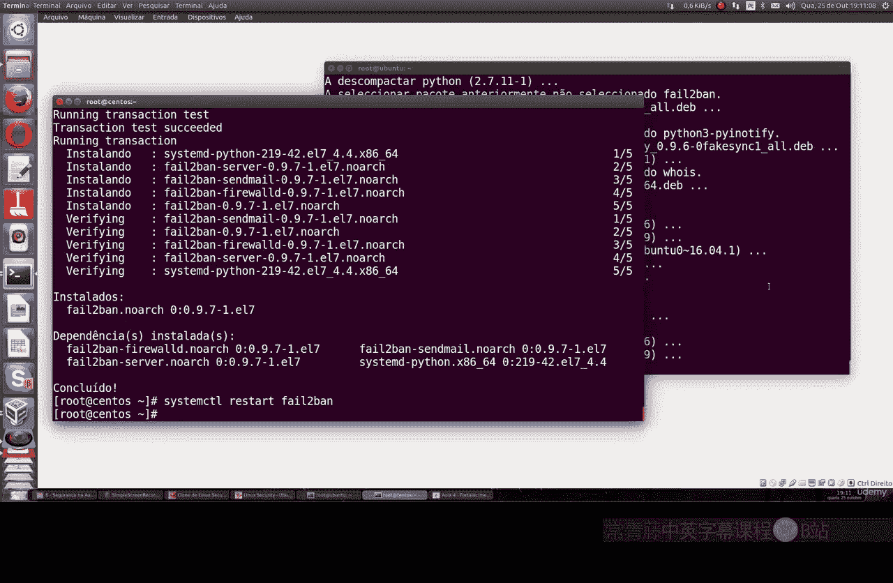
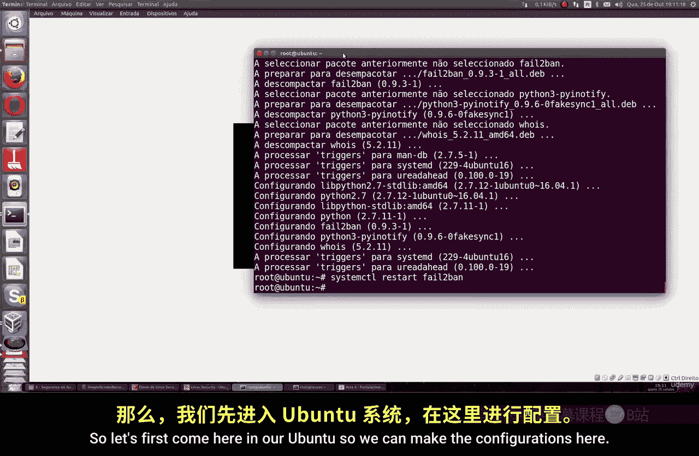
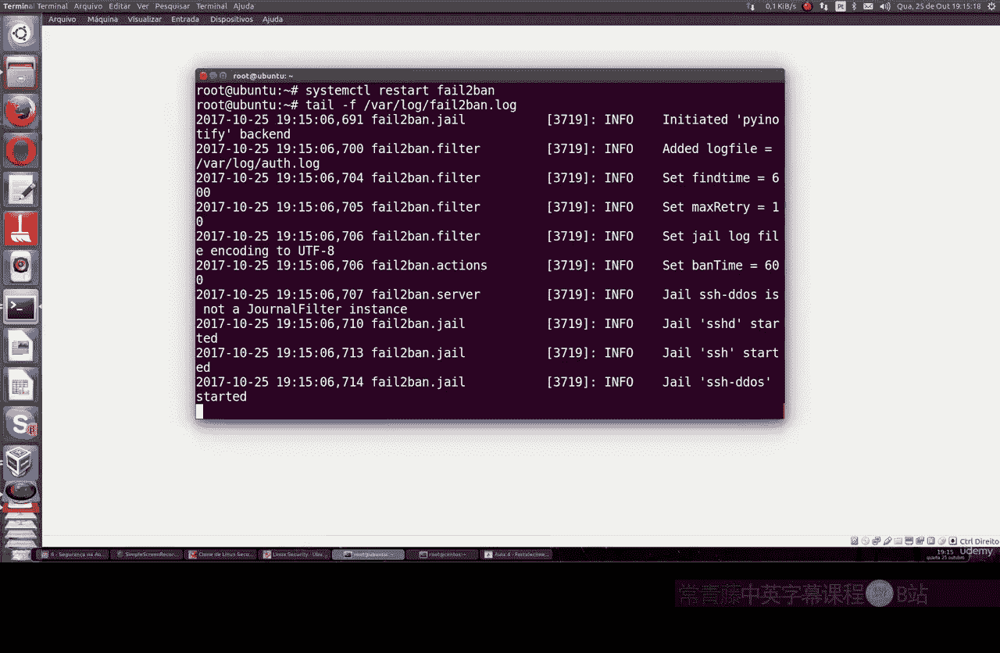
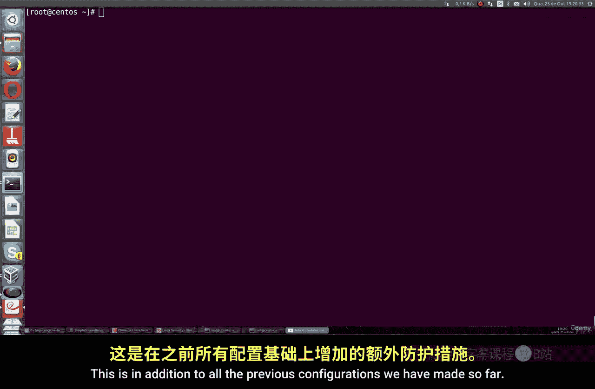

# 026：使用Fail2Ban加固SSH 🔒

在本节课中，我们将学习如何使用Fail2Ban工具来增强SSH远程连接的安全性。Fail2Ban是一个自动化的保护机制，通过监控系统日志并与防火墙（如iptables）协同工作，来阻止恶意攻击者的连接尝试。

---

## 概述

Fail2Ban是Linux系统上一种重要的保护机制。它通过持续监控各种服务（如SSH、Apache、Nginx等）的日志文件，检测异常或恶意的访问行为，并自动更新防火墙规则来封锁攻击者的IP地址。对于任何Linux系统管理员来说，配置和使用Fail2Ban都是一项基本且必要的安全措施。



---



## Fail2Ban的工作原理

上一节我们介绍了Fail2Ban的基本概念，本节中我们来看看它的具体工作流程。

Fail2Ban会定期扫描指定服务的日志文件。当它发现来自同一IP地址的失败登录尝试次数超过预设的阈值时，便会触发封锁机制。该机制通过与系统防火墙（通常是iptables）集成，自动添加规则来阻止该IP地址的进一步连接。



其核心逻辑可以用以下伪代码描述：
```
监控 日志文件
如果 检测到来自IP_A的失败登录尝试 > 最大重试次数:
    则 在iptables中添加规则以封锁IP_A
    持续封锁 指定时间（如15分钟）
```



---

## 安装Fail2Ban

以下是Fail2Ban在两种常见Linux发行版上的安装方法。

**在Ubuntu/Debian系统上：**
```bash
sudo apt update
sudo apt install fail2ban
```

**在Fedora/CentOS系统上：**
```bash
sudo yum install epel-release  # 如果需要，先启用EPEL仓库
sudo yum install fail2ban
```

安装完成后，需要启动并启用Fail2Ban服务，以确保它随系统启动。

**在Ubuntu/Debian上：**
```bash
sudo systemctl start fail2ban
sudo systemctl enable fail2ban
```

**在Fedora/CentOS上：**
```bash
sudo systemctl start fail2ban
sudo systemctl enable fail2ban
```

---

## 配置Fail2Ban

Fail2Ban的主要配置文件位于 `/etc/fail2ban/` 目录。我们不直接修改默认的 `jail.conf` 文件，而是创建或修改 `jail.local` 文件来进行自定义配置，这样可以避免软件更新时覆盖我们的设置。



以下是针对SSH服务的一个基础配置示例。我们将创建一个规则：如果同一IP地址在SSH登录中失败3次，则将其封锁15分钟。

1.  使用文本编辑器创建或编辑配置文件：
    ```bash
    sudo nano /etc/fail2ban/jail.local
    ```

2.  将以下配置内容添加到文件中：
    ```
    [sshd]
    enabled = true
    port = ssh
    filter = sshd
    logpath = /var/log/auth.log
    maxretry = 3
    bantime = 900
    ignoreip = 127.0.0.1/8
    ```
    *   `[sshd]`: 定义针对SSH服务的监控规则。
    *   `enabled = true`: 启用此规则。
    *   `port = ssh`: 指定监控的端口（SSH默认22端口）。
    *   `filter = sshd`: 使用针对SSH的过滤规则。
    *   `logpath = /var/log/auth.log`: 指定Ubuntu/Debian系统上SSH日志的路径。
    *   `maxretry = 3`: 最大重试次数，超过即触发封锁。
    *   `bantime = 900`: 封锁时间，单位为秒（900秒=15分钟）。
    *   `ignoreip = 127.0.0.1/8`: 忽略本地回环地址，避免封锁自己。

    **注意**：在CentOS/Fedora等基于RHEL的系统上，SSH日志路径通常为 `/var/log/secure`，因此需要将 `logpath` 一行修改为：
    ```
    logpath = /var/log/secure
    ```

3.  保存并退出编辑器。

4.  重新加载Fail2Ban配置以使更改生效：
    ```bash
    sudo systemctl restart fail2ban
    ```

---

## 监控与测试

配置完成后，我们可以通过多种方式验证Fail2Ban是否正常工作。

**1. 查看Fail2Ban日志：**
Fail2Ban会将自己的操作记录到系统日志中。我们可以使用以下命令实时监控：
```bash
sudo tail -f /var/log/fail2ban.log
```

**2. 查看iptables规则：**
当Fail2Ban封锁一个IP时，它会在iptables中添加相应的规则。我们可以查看这些规则：
```bash
sudo iptables -L -n
```
在输出中，你应该能看到一个名为 `f2b-sshd` 的链（Chain），里面包含了被封锁的IP地址。

**3. 进行模拟测试：**
为了测试配置，你可以尝试从另一台机器（或使用错误的密码从本机）进行SSH登录，并故意输错密码超过3次。之后，再次尝试连接会发现连接被拒绝。同时，在 `fail2ban.log` 和 `iptables` 规则中都能看到相应的封锁记录。

---

## 总结



本节课中我们一起学习了如何使用Fail2Ban来加固SSH服务的安全。我们了解了Fail2Ban通过监控日志和联动防火墙来自动化防御暴力破解攻击的原理，掌握了在Ubuntu和CentOS系统上安装、配置Fail2Ban的方法，并学会了如何通过查看日志和防火墙规则来监控其工作状态。将Fail2Ban与之前课程中学习的SSH密钥认证、修改默认端口等安全措施结合使用，可以极大地提升Linux服务器的整体安全性。