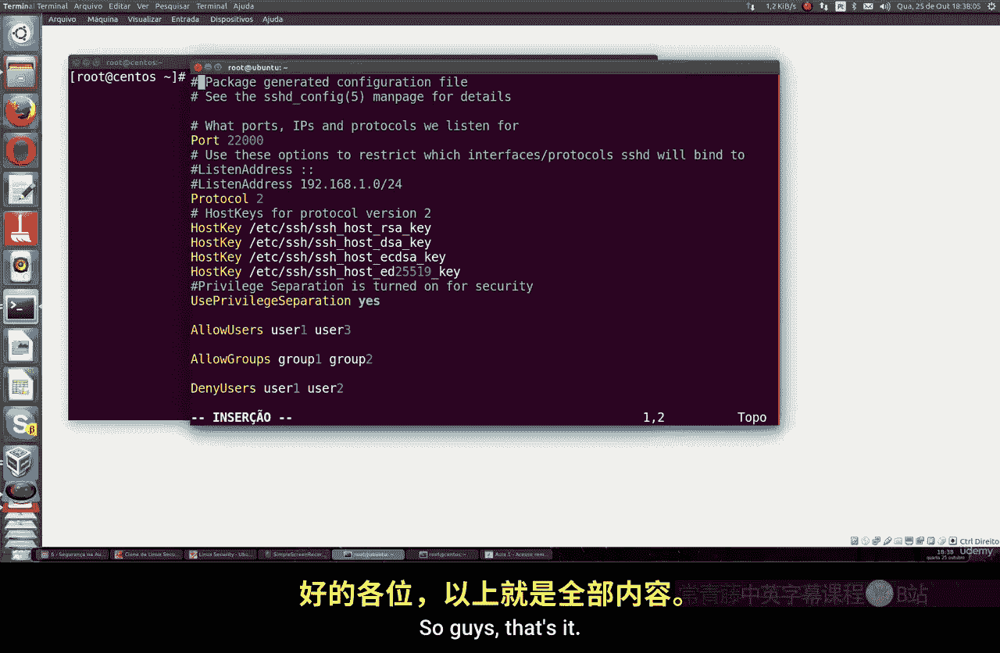
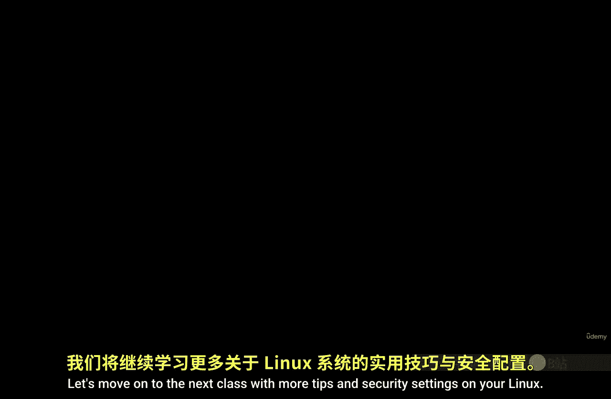

# 027：使用SSH安全远程管理服务器

## 概述
在本节课中，我们将学习如何使用SSH协议安全地远程访问和管理Linux服务器。我们将涵盖SSH的基本概念、安装、连接方法以及一系列增强服务器安全性的关键配置。

## SSH协议简介
上一节我们介绍了日志管理，本节中我们来看看如何安全地进行远程服务器管理。SSH是一种广泛使用的网络协议，全称为**安全外壳协议**。它用于以加密方式安全地登录到远程系统，是远程访问各类Linux系统最常用的方法。

Linux系统默认使用**OpenSSH**，这是SSH协议的一个开源实现。它适用于Linux、Solaris、FreeBSD等多种操作系统。一些Linux发行版，如Rocky Linux，默认已安装OpenSSH服务器；其他系统可能需要手动安装。

## 安装OpenSSH服务器
以下是针对不同Linux发行版的安装命令。

对于基于Debian的系统（如Ubuntu）：
```bash
apt-get install openssh-server
```

对于基于Red Hat的系统（如Fedora、CentOS）：
```bash
yum install openssh-server
# 或使用 dnf（新版本Fedora）
dnf install openssh-server
```

安装完成后，启动SSH服务即可使用。

## 基本连接方法
SSH默认运行在**22号端口**。要连接到远程服务器，你需要知道其IP地址。

使用以下命令格式进行连接：
```bash
ssh root@服务器IP地址
```
输入root用户的密码后，即可成功登录。

如果你想指定其他用户登录，可以使用：
```bash
ssh 用户名@服务器IP地址
```
例如，从一台Ubuntu机器连接到CentOS服务器，命令是相同的。

## 增强SSH安全性：修改默认端口
使用默认的22端口会将服务器暴露在大量自动化攻击之下。因此，改变默认端口是首要的安全措施。

编辑SSH服务器配置文件：
```bash
vi /etc/ssh/sshd_config
```
在配置文件中找到 `#Port 22` 这一行，取消注释并将22改为一个高位端口号（例如22000）：
```
Port 22000
```
保存文件。

**在CentOS/RHEL/Fedora系统上**，还需要调整SELinux策略并更新防火墙规则：
```bash
# 允许新端口通过SELinux
semanage port -a -t ssh_port_t -p tcp 22000
# 在防火墙中开放新端口
firewall-cmd --permanent --add-port=22000/tcp
firewall-cmd --reload
```

**在Ubuntu/Debian系统上**，通常只需重启SSH服务：
```bash
systemctl restart ssh
# 或 service ssh restart
```

完成配置后，使用新端口连接：
```bash
ssh -p 22000 root@服务器IP地址
```

## 增强SSH安全性：禁用Root用户直接登录
允许root用户直接通过SSH登录存在安全风险。最佳实践是禁用此功能，强制使用普通用户登录，然后再通过`su`或`sudo`切换权限。

再次编辑 `/etc/ssh/sshd_config` 文件，找到以下行并进行修改：
```
#PermitRootLogin yes
```
将其改为：
```
PermitRootLogin no
```
保存并重启SSH服务。

此后，尝试用root直接连接将会被拒绝。你必须先使用一个普通用户账户登录：
```bash
ssh -p 22000 普通用户名@服务器IP地址
```
登录后，如果需要管理员权限，再使用 `su -` 或 `sudo` 命令。

## 增强SSH安全性：限制允许登录的用户和组
你可以进一步控制哪些用户或用户组可以通过SSH访问服务器，这提供了更精细的访问控制。

在 `/etc/ssh/sshd_config` 文件中，可以使用以下指令：

*   **允许特定用户**：只有列出的用户可以登录。
    ```
    AllowUsers alice bob charlie
    ```
*   **允许特定组**：只有属于列出的组的成员可以登录。
    ```
    AllowGroup sshusers developers
    ```
*   **拒绝特定用户**：明确拒绝某些用户登录。
    ```
    DenyUsers baduser hacker
    ```
*   **拒绝特定组**：明确拒绝某些组的成员登录。
    ```
    DenyGroup nogroup
    ```

你可以组合使用这些指令。配置完成后，别忘了重启SSH服务。

## 增强SSH安全性：限制监听地址
默认情况下，SSH服务监听服务器上所有网络接口。你可以将其限制为只监听特定的IP地址，例如仅监听内部管理网络的IP，从而减少暴露面。

在配置文件中修改 `ListenAddress` 指令：
```
# 监听所有IPv4地址（默认）
# ListenAddress 0.0.0.0
# 监听所有IPv6地址（默认）
# ListenAddress ::

# 仅监听特定IP，例如内网IP 192.168.1.100
ListenAddress 192.168.1.100
# 或监听一个网段
# ListenAddress 192.168.1.0/24
```
此配置意味着只有从指定IP地址发起的连接才能访问SSH服务。

## 总结
本节课中我们一起学习了如何通过SSH安全地远程管理Linux服务器。我们从SSH协议和安装讲起，然后深入探讨了四个关键的安全加固步骤：
1.  **修改默认端口**：避免使用22端口，减少自动化扫描攻击。
2.  **禁用Root直接登录**：增加攻击者获取最高权限的难度。
3.  **限制登录用户/组**：实现精细化的访问控制。
4.  **限制监听地址**：将SSH服务绑定到特定的管理网络IP，缩小攻击面。





综合运用这些配置，可以显著提升你的Linux服务器在面对网络攻击时的安全性，使其更加坚固。在接下来的课程中，我们将继续探索更多Linux安全与管理的实用技巧。