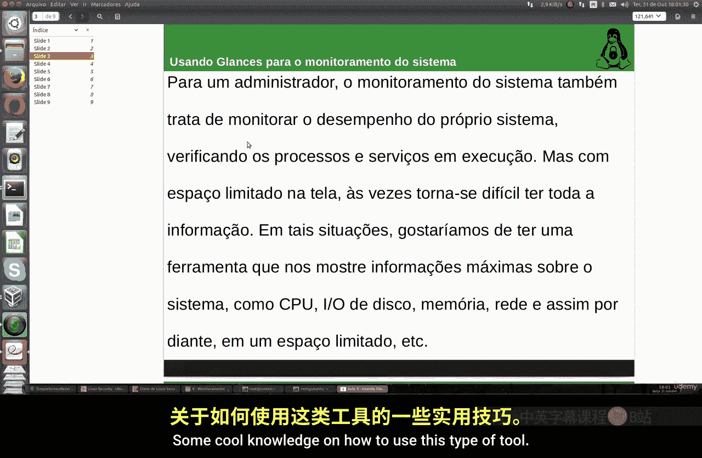
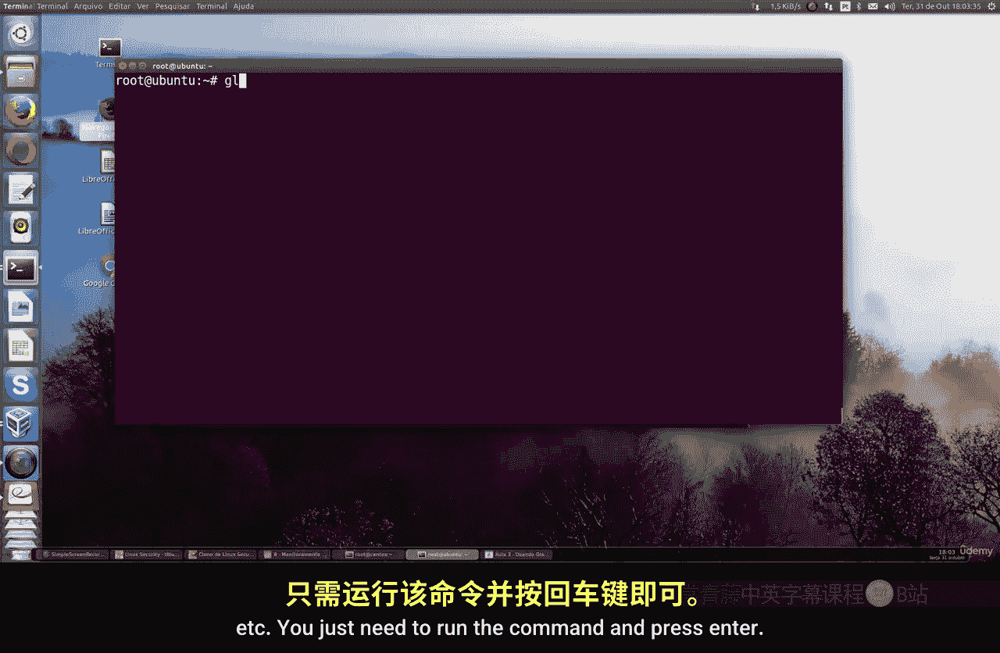
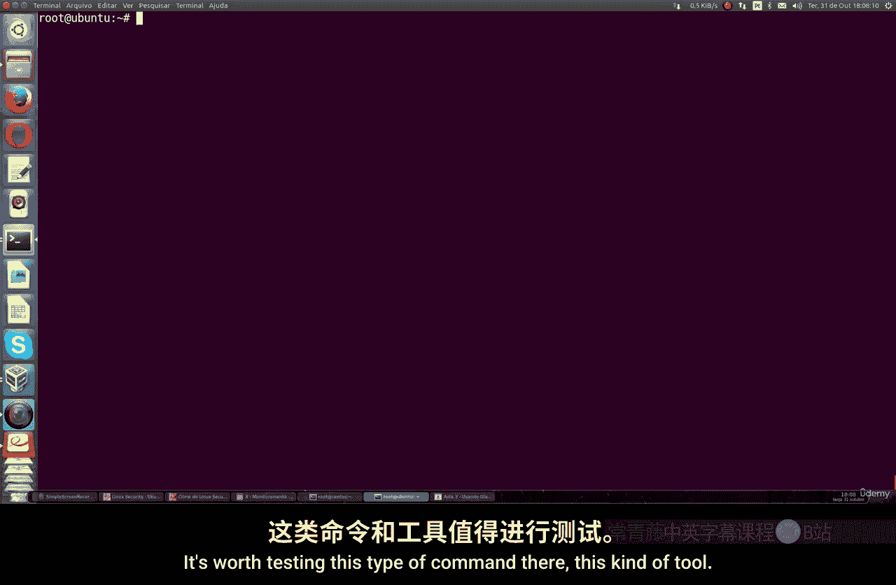

# 028：使用Glances进行系统监控 👁️

## 概述
在本节课中，我们将学习如何使用一个名为 **Glances** 的工具来监控Linux系统的性能。Glances能够实时、详细地展示CPU、内存、磁盘I/O、网络以及运行中服务等关键信息，帮助我们全面了解系统状态。

---

## 安装Glances

上一节我们介绍了系统监控的重要性，本节中我们来看看如何安装Glances工具。

在Ubuntu或类似的Linux发行版上，安装过程非常简单。你只需要运行一个命令即可。

以下是安装步骤：
1.  打开终端。
2.  输入命令：`sudo apt install glances`
3.  按下回车键执行。

安装完成后，Glances就可以使用了。它是一个基于Python的工具，安装名称在不同发行版中通常保持一致。

---

## 配置与启动Glances

安装好工具后，我们可能希望它能随系统启动，或者进行一些自定义设置。

默认情况下，Glances不会在系统启动时自动运行。我们可以通过编辑其配置文件来启用这个功能。

以下是配置步骤：
1.  打开Glances的默认配置文件。
2.  找到与守护进程（daemon）相关的行。
3.  将对应的值从 `false` 改为 `true` 以启用它。
4.  保存并退出配置文件。

完成配置后，你就可以在终端中直接输入 `glances` 命令并按下回车来启动它了。

---

## 理解Glances的监控界面

启动Glances后，你会看到一个信息丰富的监控界面。它比常见的 `top` 命令提供更详细的数据。

界面上会实时显示以下核心信息：
*   **CPU使用率**：显示用户进程、系统进程等各自占用的CPU百分比。
*   **内存（RAM）**：展示已用内存、缓存、缓冲区的具体情况。
*   **交换空间（Swap）**：显示交换内存的使用情况。
*   **磁盘I/O**：监控磁盘的输入输出负载。
*   **网络**：显示网络接口的流量。
*   **运行中的进程/服务**：列出当前活动的进程，包括其PID、所属用户、内存占用等。

Glances的一个强大功能是它的**颜色警报系统**，可以直观地反映系统状态：
*   **绿色**：一切正常。
*   **蓝色**：需要关注该资源（如CPU、内存、网络等）。
*   **紫色**：警告状态。
*   **红色**：关键警报，表示系统出现了严重问题，需要立即检查。

当界面底部显示“No warning or critical alert detected”时，意味着系统当前没有检测到任何异常。

---

## 常用操作与自定义

了解了基本界面后，我们来看看如何与Glances交互并进行个性化设置。

Glances默认每秒刷新一次数据。你可以使用快捷键来调整刷新频率。

以下是一些常用操作：
*   按下 `5` 键，可以将刷新间隔设置为5秒。
*   按下 `h` 键，可以查看帮助信息，获取所有可用的快捷键。

如果你希望修改监控界面中的颜色方案，可以编辑Glances的配置文件。在配置文件中，你可以调整不同警报级别对应的颜色，甚至可以配置温度传感器的显示颜色。

---

## 总结
本节课中，我们一起学习了 **Glances** 这款强大的系统监控工具。我们从安装和配置讲起，然后详细解读了其监控界面中展示的各类信息，特别是其颜色警报系统。最后，我们还了解了一些调整刷新频率和自定义显示颜色的基本操作。Glances能提供比 `top` 等基础命令更全面的系统洞察，是进行系统性能分析和故障排查的实用工具。