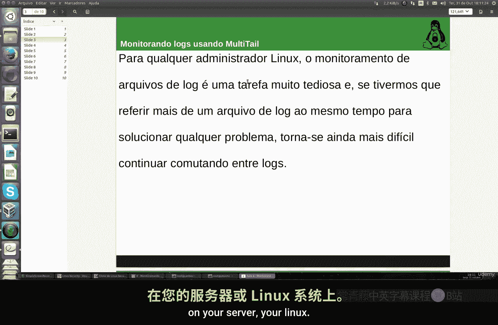
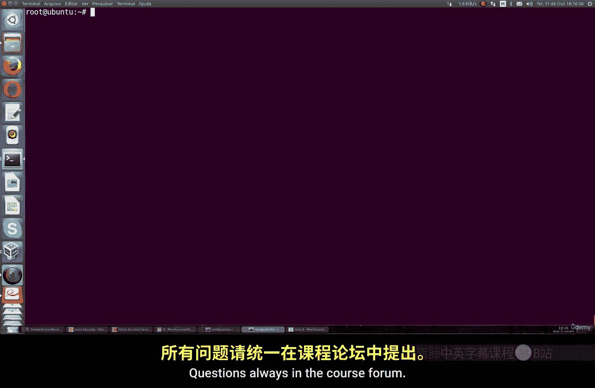

# 029：使用MultiTail监控日志 📊

在本节课中，我们将学习如何使用一个名为MultiTail的强大工具来同时监控多个日志文件。这对于系统管理员来说是一个极其高效和实用的方法，尤其是在需要同时观察多个相互关联的日志时。

上一节我们介绍了基本的日志查看命令，本节中我们来看看如何通过一个工具提升监控效率。

## 安装MultiTail

首先，我们需要在系统上安装MultiTail工具。安装过程在不同的Linux发行版上基本一致。



以下是安装命令：
```bash
# 在基于Debian/Ubuntu的系统上
sudo apt install multitail

# 在基于Fedora/Red Hat的系统上
sudo yum install multitail
# 或使用 dnf (较新版本)
sudo dnf install multitail
```
安装完成后，就可以开始使用`multitail`命令了。

## 基本使用：同时监控两个日志

要使用MultiTail，你需要先选择希望同时观察的日志文件。例如，我们可以同时监控系统认证日志和系统日志。

运行以下命令：
```bash
sudo multitail /var/log/auth.log /var/log/syslog
```
执行后，你的终端屏幕会被分割成上下两个部分。上半部分显示`auth.log`（认证日志）的内容，下半部分显示`syslog`（系统日志）的内容。两个日志的更新都会实时显示。

要退出MultiTail视图，只需按下 `q` 键。

## 高级视图与导航

MultiTail提供了灵活的视图管理功能。

*   **切换焦点**：按下 `b` 键，会弹出一个列表让你选择想要聚焦查看的日志窗口。
*   **滚动日志**：在聚焦某个窗口后，你可以使用方向键或 `Page Up`/`Page Down` 键来滚动查看历史内容。
*   **保存日志快照**：你可以将当前屏幕上的日志内容保存到一个文件中。按下 `Ctrl-g`，然后输入文件名（例如 `log_snapshot.txt`），即可保存。之后可以用 `ls` 命令查看生成的文件。

## 自定义布局：监控多个日志

MultiTail的强大之处在于可以自定义监控布局。例如，你可以将屏幕分成两列来同时监控三个日志。

以下是具体操作：
```bash
sudo multitail -s 2 /var/log/syslog /var/log/auth.log /var/log/dpkg.log
```
在这个命令中：
*   `-s 2` 参数告诉MultiTail将屏幕分成2列。
*   后面跟着的三个文件路径是你想监控的日志。

执行后，`syslog`和`auth.log`会显示在第一列（上下排列），`dpkg.log`则会独占第二列。这样你就可以一目了然地监控三个不同的日志流。

## 使用颜色高亮

为了使不同日志的区分更加直观，MultiTail允许为日志行添加颜色高亮。这能让你更快地定位到关键信息的开始和结束。

例如，在监控两个日志时，你可以为其中一个日志的特定字段（如“ERROR”关键词）设置颜色。虽然配置颜色规则需要更复杂的语法（通常使用`-c`参数和颜色方案），但基本概念是：通过定义颜色，让重要的日志条目在视觉上脱颖而出，从而提升问题排查的效率。



本节课中我们一起学习了MultiTail工具的核心用法。我们掌握了如何安装它、如何同时监控两个或多个日志文件、如何进行窗口导航和保存快照，以及了解了使用颜色高亮来提升可读性的概念。对于任何Linux系统管理员而言，MultiTail都是一个监控系统活动的不可或缺的利器。