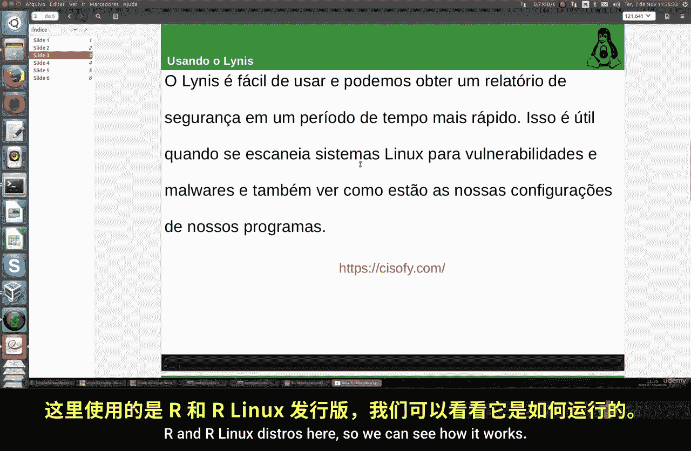
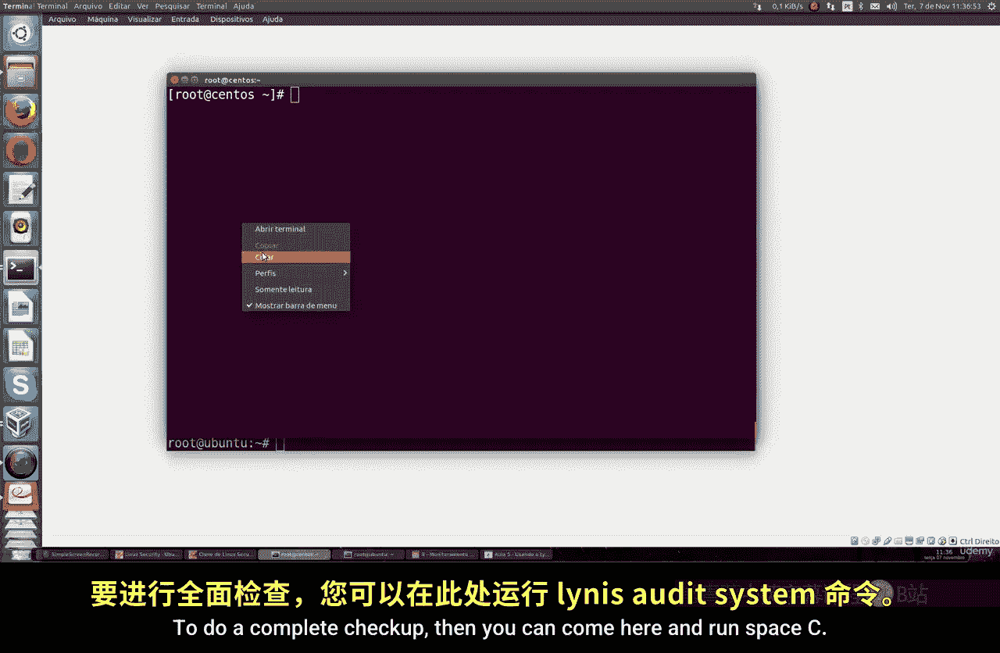
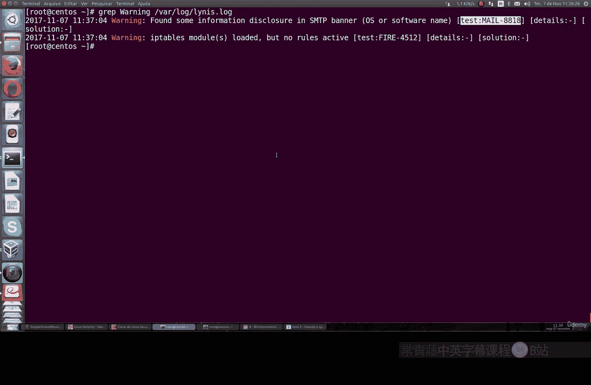
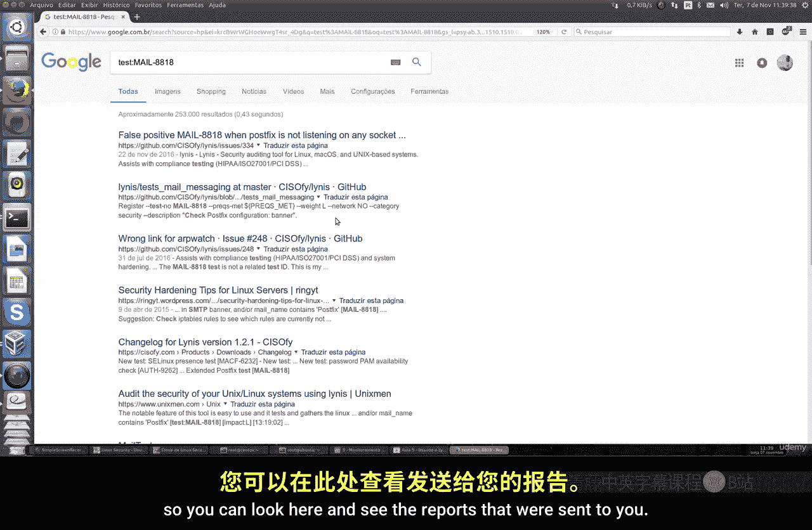
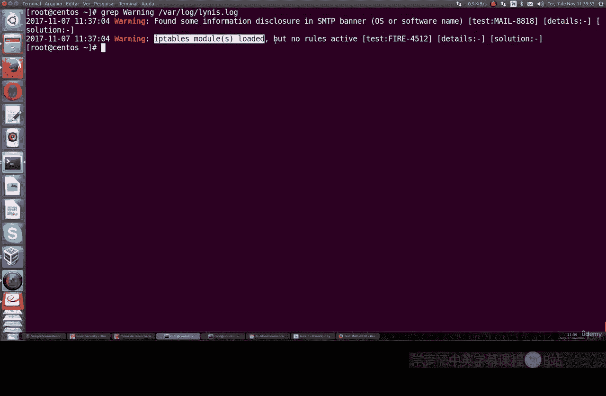
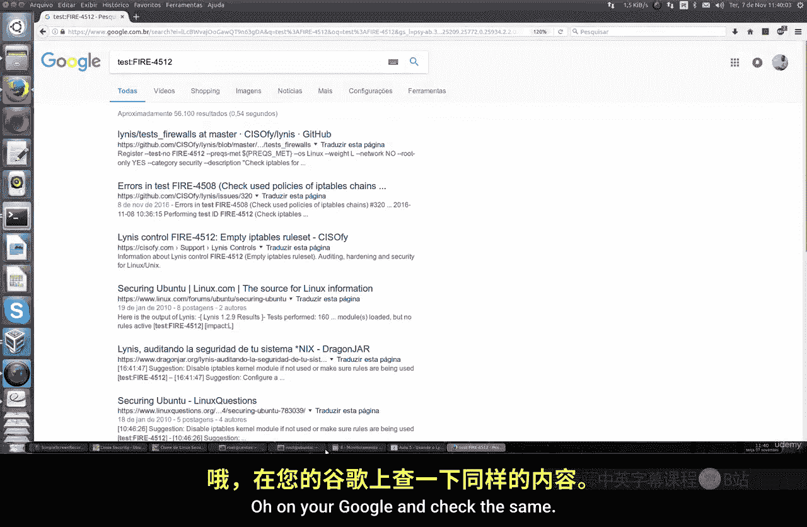
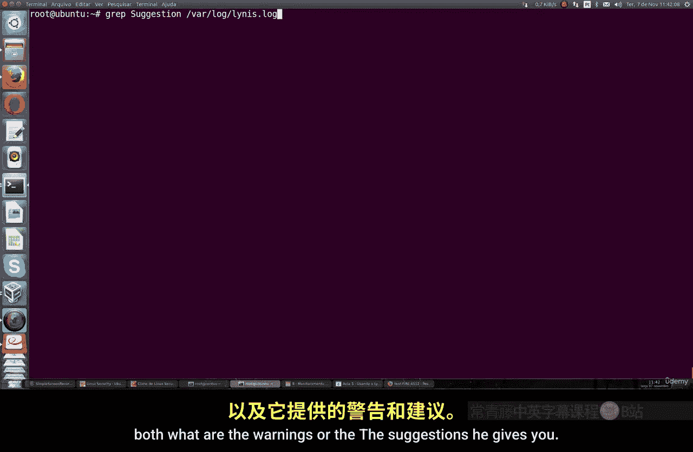

# 030：使用Lynis进行系统审计 🔍

在本节课中，我们将要学习如何使用一个名为Lynis的流行工具来监控和审计你的Linux系统。Lynis能够生成一份完整的系统报告，帮助你检查系统安全状况，例如扫描数据库参数、检查Web服务器（如Apache）的推荐安全设置、审查iptables规则和SSH连接等。

## 概述

Lynis是一个跨平台的程序，不仅适用于Linux，也适用于macOS和其他类Unix系统（如FreeBSD）。它能够快速地对你的系统进行完整扫描，以发现或识别可能存在的漏洞、恶意软件，或者检查系统中某些程序的配置情况。接下来，我们将通过实际操作来了解它的工作方式。

## 安装Lynis

首先，我们需要在系统上安装Lynis。安装过程非常简单。



以下是针对不同Linux发行版的安装命令：

*   **对于Ubuntu、Debian及其衍生系统（如Linux Mint）**，可以使用APT包管理器进行安装：
    ```bash
    sudo apt-get install lynis
    ```
*   **对于CentOS、Fedora、Red Hat等系统**，可以使用YUM或DNF包管理器进行安装。

安装完成后，我们就可以开始使用Lynis了。



## 执行系统审计

上一节我们介绍了如何安装Lynis，本节中我们来看看如何使用它进行完整的系统审计。

执行审计的基本命令是 `lynis audit system`。运行此命令后，Lynis将对你的Linux系统进行全面检查，涵盖所有主要程序和参数，并生成一份详细的报告。

```bash
sudo lynis audit system
```

审计完成后，Lynis会生成一份完整的报告。这份报告会记录在日志文件中，同时也会生成一个专门的报告文件。报告内容非常详细，包括了对内核、本地目录权限、加密设置、标识横幅等各方面的检查。

如果Lynis发现了任何重要问题或潜在漏洞，它会在报告中以“警告”的形式高亮显示，并给出“OK”状态或改进建议，方便你进行核查。

## 过滤与分析审计结果

审计报告可能非常详尽。为了更高效地分析关键问题，我们可以使用 `grep` 命令来过滤日志文件。

以下是过滤日志以快速定位关键警告的方法：





例如，你可以使用以下命令，仅列出Lynis检测到的最关键的警告：



```bash
sudo grep Warning /var/log/lynis.log
```



或者，更精确地过滤“警告”部分：

```bash
sudo grep -E \"\\[Warning\\]\" /var/log/lynis.log
```

运行后，你可能只会看到少数几个警告。每个警告都会包含相关信息，例如“SMTP横幅信息未找到”或“iptables模块已加载但当前没有活跃规则”。你可以将这些具体的漏洞名称复制并粘贴到搜索引擎中，以查找相关的已报告问题或解决方案（有时可能是误报）。

## 查看详细建议

除了警告，Lynis还会提供大量的配置建议，告诉你哪些安全措施是值得实施的，而你的系统尚未完成。

你可以通过查看报告文件或再次过滤日志来获取这些建议：



```bash
sudo grep -E \"\\[Suggestion\\]\" /var/log/lynis.log
```

这些建议可能涉及系统更新的提示（如发现Linux版本过时）、服务配置（如SSH允许root登录）、软件包漏洞等。仔细检查这些建议，对于加固你的系统安全非常有帮助。

## 总结

本节课中我们一起学习了如何使用Lynis工具。我们了解了它的安装方法，学会了如何执行完整的系统审计来扫描漏洞和检查配置。我们还掌握了通过过滤日志文件来快速查看关键警告和详细安全建议的技巧。Lynis是一个强大而快速的工具，定期使用它进行系统检查，可以帮助你及时发现并修复安全问题，是维护Linux系统安全性的好帮手。