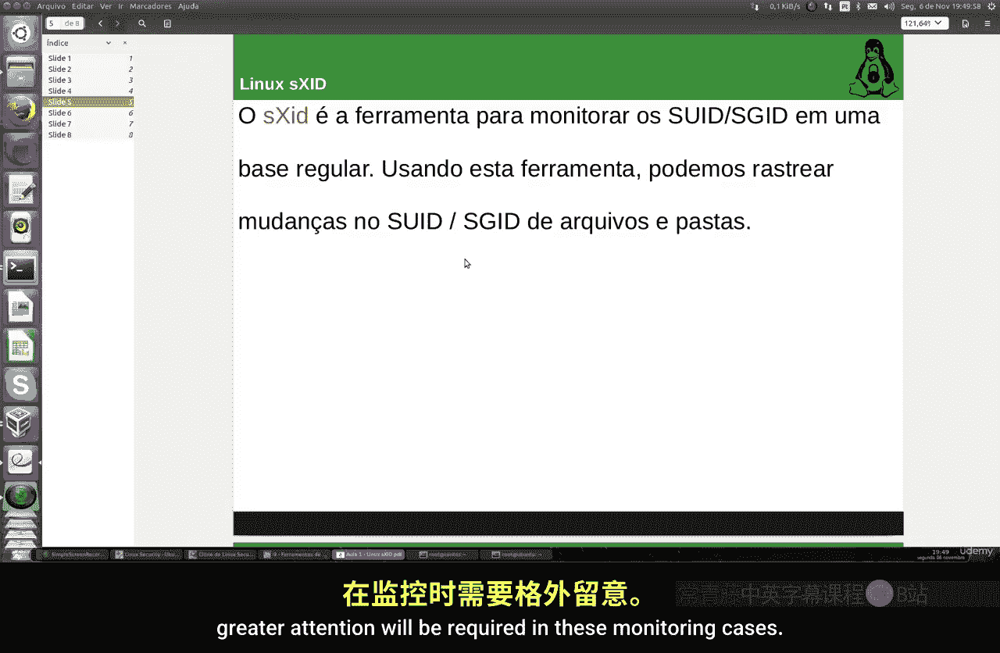
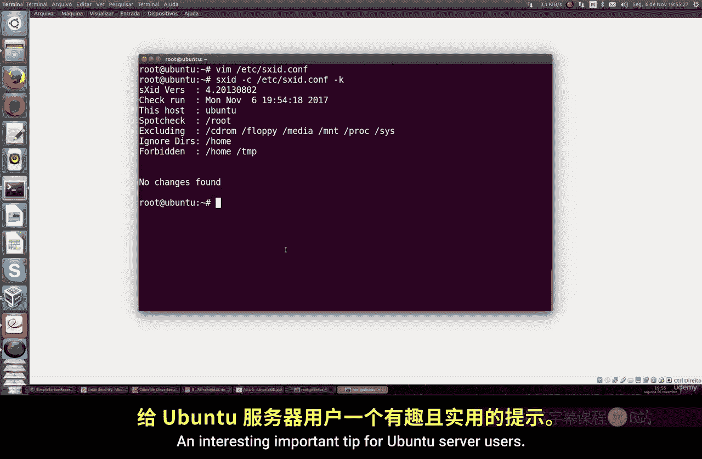

Linux命令行基础：Part 2：Linux特殊权限与sXID监控工具 🔍

在本节课中，我们将学习Linux系统中的特殊权限，并介绍如何使用sXID工具来监控这些权限的变更，以增强系统的安全性。

---

### 特殊权限简介

上一节我们介绍了Linux中常规的读、写和执行权限。本节中，我们来看看Linux中存在的特殊权限。除了基本的读、写和执行权限外，Linux还提供了几种特殊权限，例如**Set User ID (SUID)** 和 **Set Group ID (SGID)**。这些权限允许用户在执行特定文件或程序时，暂时获得文件所有者（通常是root用户）的权限。这为系统管理员提供了更精细的控制能力，可以限制或授权用户执行某些关键操作。

---

### sXID监控工具

由于特殊权限功能强大但使用较少，对其进行监控尤为重要。为此，我们可以使用一个名为`sXID`的工具。该工具目前主要适用于Ubuntu Server系统，它能定期监控系统中特殊权限的变更情况。



以下是sXID的主要功能：
*   **跟踪变更**：监控由你配置的特定文件和目录的特殊权限变化。
*   **生成报告**：当检测到权限变更时，可以生成日志文件或发送警告通知。
*   **集中管理**：帮助你集中关注这些需要更高安全级别的特殊权限情况。

---

### 安装与配置sXID

首先，我们需要安装sXID程序。在Ubuntu Server上，可以使用以下命令：

```bash
sudo apt-get install sxid
```

安装完成后，需要编辑其配置文件进行定制。配置文件位于 `/etc/sxid.conf`。你可以使用任何文本编辑器打开它。

在配置文件中，你可以进行以下设置：
*   **监控范围**：指定需要监控的目录、文件或程序。默认配置会监控根目录（`/`），但会自动排除如`/proc`、`/sys`等虚拟文件系统以及外部存储设备。
*   **排除目录**：你可以移除默认排除的目录，或添加你不想监控的路径。
*   **报告方式**：可以配置电子邮件地址，以便自动发送监控报告。你也可以设置`NOTIFY`选项，即使没有变更也发送报告（通常不建议）。
*   **日志管理**：设置保留的日志文件数量，以控制磁盘空间占用。

一个常见的做法是忽略`/home`目录的监控，因为普通用户经常修改自己的文件，这些变更通常不重要。但如果你有需要，也可以将其纳入监控范围。配置完成后，保存文件即可。

---

### 运行与查看监控

配置完成后，sXid会根据你的设置自动监控所选目录。你也可以手动运行命令来立即查看当前的监控状态。运行以下命令：

```bash
sudo sxid
```

命令执行后，会输出一份报告，内容包括：
*   程序版本和检查时间。
*   被检查的目录列表（如重要的`/`根目录）。
*   被排除和忽略的目录列表（如`/tmp`）。
*   本次检查发现的变更摘要。

如果sXid在自动监控中发现了任何权限变更，它会在指定的日志文件中生成详细报告。为了更高效地管理，建议你将此日志系统集成到中央日志服务器，或配置邮件告警功能。

---

### 总结



本节课中我们一起学习了Linux的特殊权限（SUID/SGID）及其潜在的安全影响。为了有效管理这些权限，我们介绍了sXID这款监控工具，涵盖了其安装、配置和运行的基本步骤。通过使用sXID，系统管理员可以更好地跟踪特殊权限的变更，及时发现潜在的安全风险，这对于Ubuntu Server用户来说是一个重要且实用的安全增强技巧。