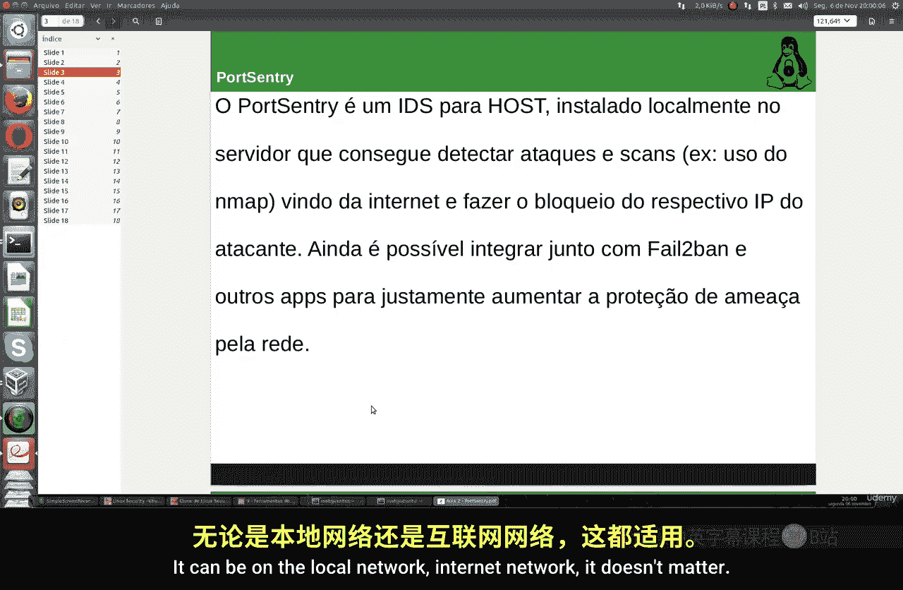
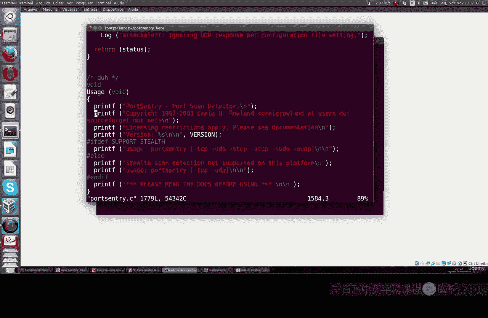
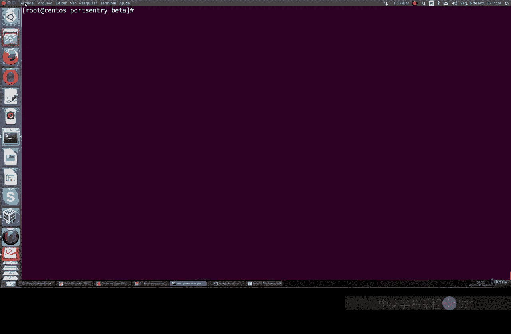
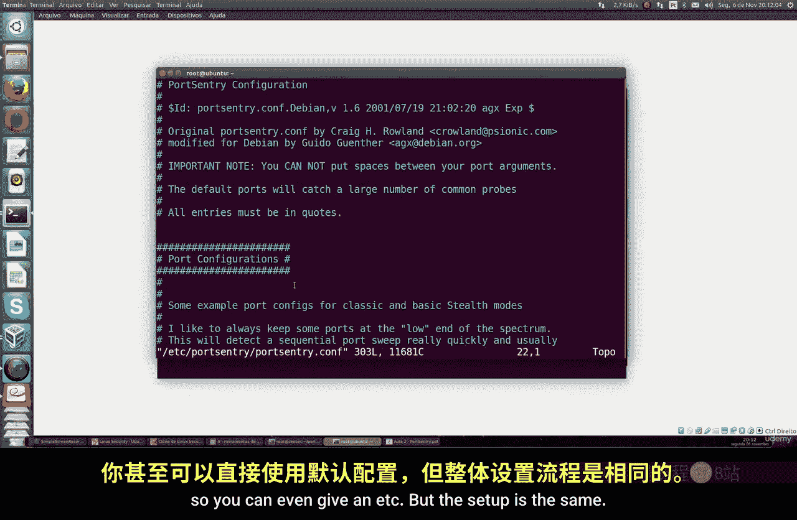
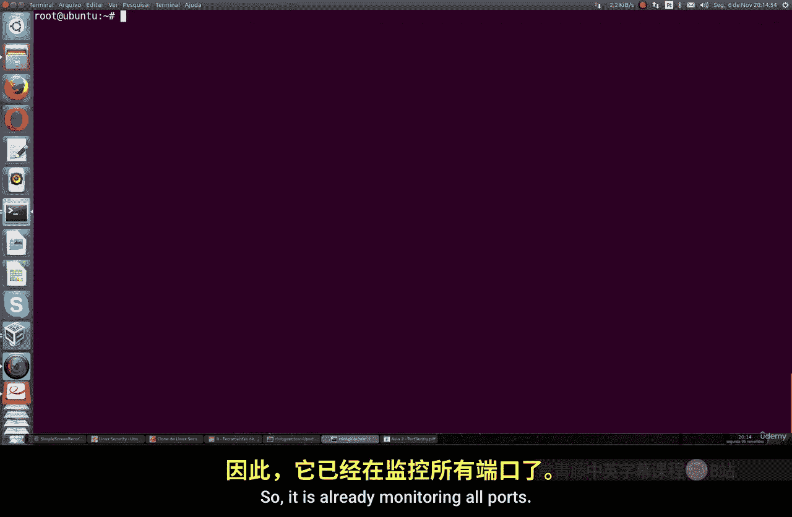
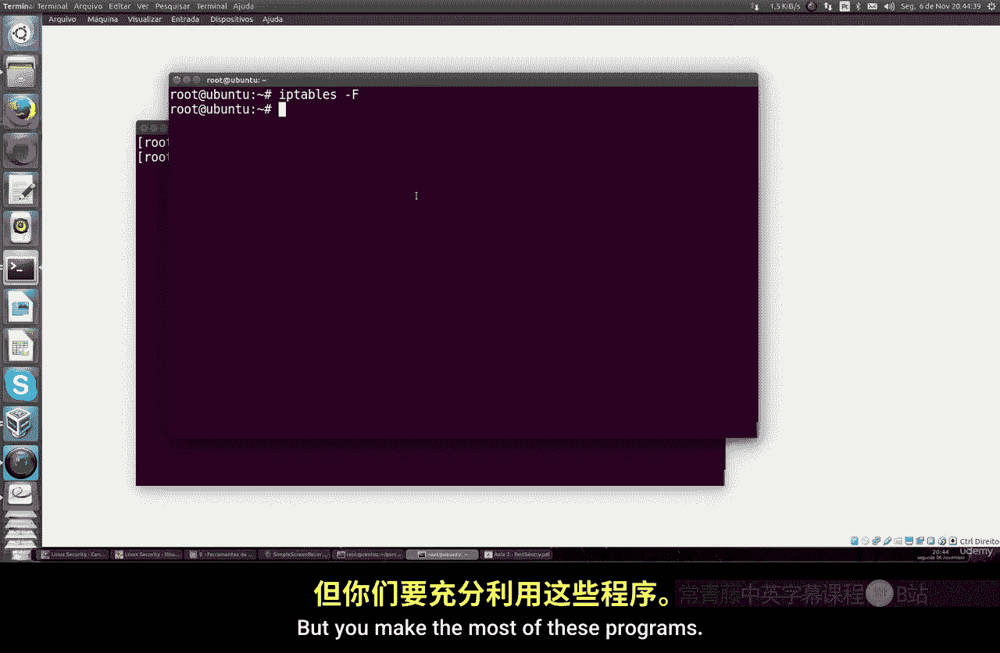

# 032：PortSentry配置与使用 🛡️

在本节课中，我们将学习一个非常有趣的工具——PortSentry。这是一个重要的安全工具，能够检测攻击或任何类型的端口扫描行为，例如检查端口是否开放、检查系统横幅等。它可以阻止使用网络扫描器（如强大的Nmap）的IP地址，甚至可以与其他应用程序（如防火墙）联动，以增强对来自本地网络或互联网威胁的防护。



## 在CentOS系统上安装PortSentry

上一节我们介绍了PortSentry的基本概念，本节中我们来看看如何在CentOS系统上手动编译和安装它。这个过程需要一些步骤。



以下是安装步骤：

1.  首先，使用`wget`命令下载程序。如果你的系统没有安装`wget`，可以使用`yum install wget`命令进行安装。
    ```bash
    yum install wget
    wget [下载链接]
    ```
2.  下载的文件是压缩包，使用`tar`命令解压。
    ```bash
    tar -xvf [文件名]
    ```
3.  进入解压后的目录。在版本1.2中，配置文件`portentry_config.h`的第1584行存在一个简单的换行错误，需要手动修正。你可以使用`vi`编辑器打开文件并删除错误的换行符。
    ```bash
    vi portentry_config.h
    ```
4.  如果在编译时遇到错误，可能是因为缺少C语言编译环境。运行以下命令安装开发工具包。
    ```bash
    yum groupinstall "Development Tools"
    ```
5.  修正错误并安装好编译环境后，就可以运行配置和编译命令了。
    ```bash
    ./configure
    make
    make install
    ```

## 配置PortSentry

安装完成后，我们需要对PortSentry进行配置，以指定需要监控的端口和响应行为。

以下是关键配置项：

1.  进入配置目录，编辑`portsentry.conf`文件。你需要设置要监控的端口。**关键点**：这些端口必须是系统上任何真实服务都未在使用的端口（例如，不要包含SSH或数据库服务的端口），以免错误地阻止合法IP。
    ```bash
    cd /usr/local/psionic/portsentry/
    vi portsentry.conf
    ```
2.  在配置文件中，找到`TCP_PORTS`和`UDP_PORTS`选项，按需修改端口列表。默认列表提供了一些不常用的端口作为示例。
3.  配置响应动作。找到`BLOCK_UDP`和`BLOCK_TCP`选项，设置为`1`以启用对UDP和TCP扫描的阻止。
4.  设置阻止方式。通过`KILL_ROUTE`选项，可以指定使用`iptables`来阻止攻击者IP。例如，设置为`/sbin/iptables -I INPUT -s $TARGET$ -j DROP`。
5.  （可选）你可以设置`BANNER`选项，当有人扫描时，向其发送一条自定义警告信息。

保存并退出配置文件。

## 启动与测试PortSentry



配置完成后，就可以启动PortSentry守护进程，并测试其效果。



1.  在CentOS上，进入PortSentry目录并以后台模式启动它。
    ```bash
    ./portsentry -tcp
    ./portsentry -udp
    ```
2.  启动后，你可以使用`iptables -L -n`命令查看是否有IP已被阻止规则。
3.  现在，可以从另一台机器使用`nmap`等工具对安装了PortSentry的服务器进行端口扫描。如果扫描了被监控的端口，扫描源的IP地址应该会被自动加入`iptables`的阻止列表。
4.  你可以查看PortSentry的日志文件（如`/usr/local/psionic/portsentry/portsentry.history`）来确认阻止记录。

## 在Ubuntu系统上安装与配置PortSentry

在Ubuntu系统上，安装过程更为简便，我们将使用包管理器。



1.  使用`apt-get`命令直接安装PortSentry。
    ```bash
    apt-get update
    apt-get install portsentry
    ```
2.  安装完成后，主要的配置文件位于`/etc/portsentry/portsentry.conf`。其配置内容与CentOS版本类似，你需要同样设置监控端口、启用阻止选项（`BLOCK_UDP`/`BLOCK_TCP`），并配置`KILL_ROUTE`（例如使用`iptables`）。
3.  此外，可以编辑`/etc/portsentry/portsentry.ignore`文件，将本地网络IP或可信IP加入忽略列表，防止它们被误阻止。
4.  配置完成后，重启PortSentry服务。
    ```bash
    service portsentry restart
    service portsentry status # 检查运行状态
    ```

## 功能验证与故障排除

最后，我们来验证PortSentry是否正常工作，并了解一些基本的故障排除方法。

1.  在Ubuntu服务器启动PortSentry后，从另一台客户端机器尝试对其执行`ping`或`nmap`扫描。
    ```bash
    # 在客户端执行
    nmap -sT [服务器IP]
    ping [服务器IP]
    ```
2.  如果配置正确，扫描尝试后，客户端的IP会被服务器上的`iptables`阻止，导致`ping`不通，后续扫描也会失败。
3.  你可以在服务器上通过以下命令查看阻止记录：
    *   `iptables -L -n`：查看`iptables`规则。
    *   `tail -f /var/log/syslog` 或 `tail -f /var/log/messages`：查看系统日志。
    *   `cat /etc/hosts.deny`：如果配置了TCP Wrappers，也可以在这里看到被阻止的IP。
4.  如果测试中遇到问题或需要重置，可以清空`iptables`的规则（**谨慎操作，这会移除所有自定义规则**）。
    ```bash
    iptables -F
    ```
    然后重新启动PortSentry服务。



本节课中我们一起学习了PortSentry这款端口扫描检测与主动防御工具。我们掌握了在CentOS上手动编译安装、在Ubuntu上通过包管理安装的方法，详细讲解了其核心配置，包括监控端口设置、阻止机制联动（如`iptables`），并完成了功能测试与验证。正确配置和使用PortSentry能有效增强服务器对恶意扫描的防护能力。