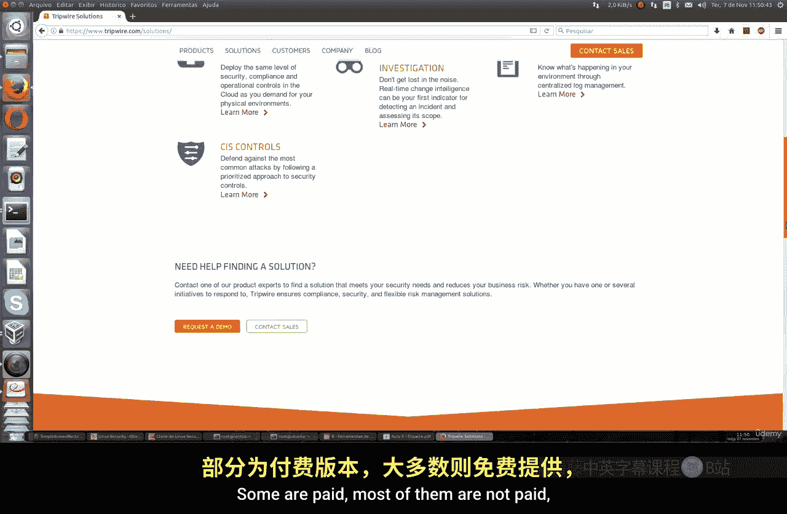
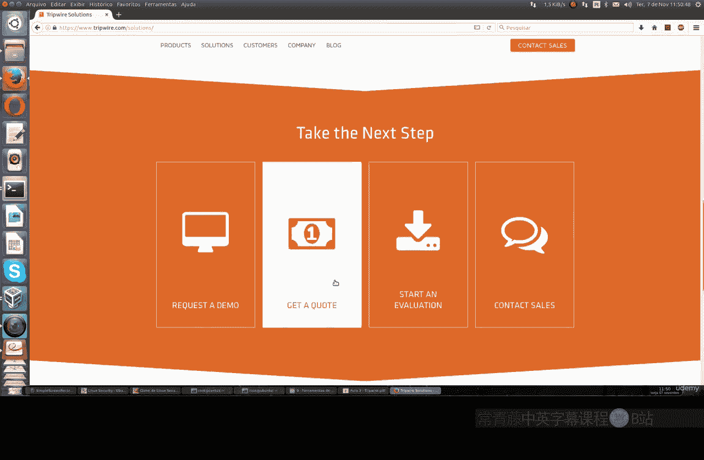
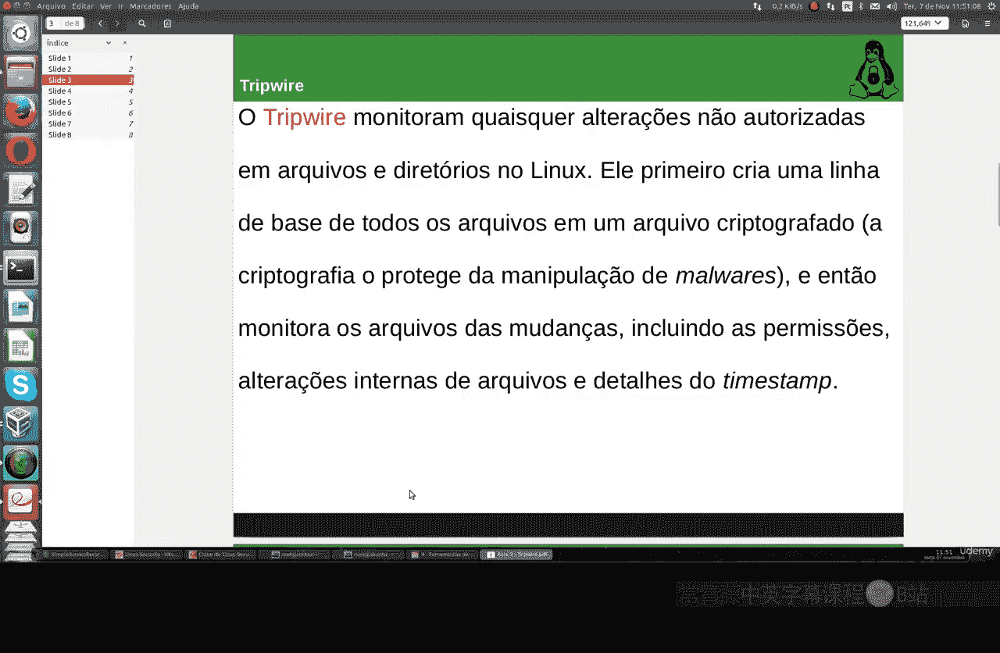
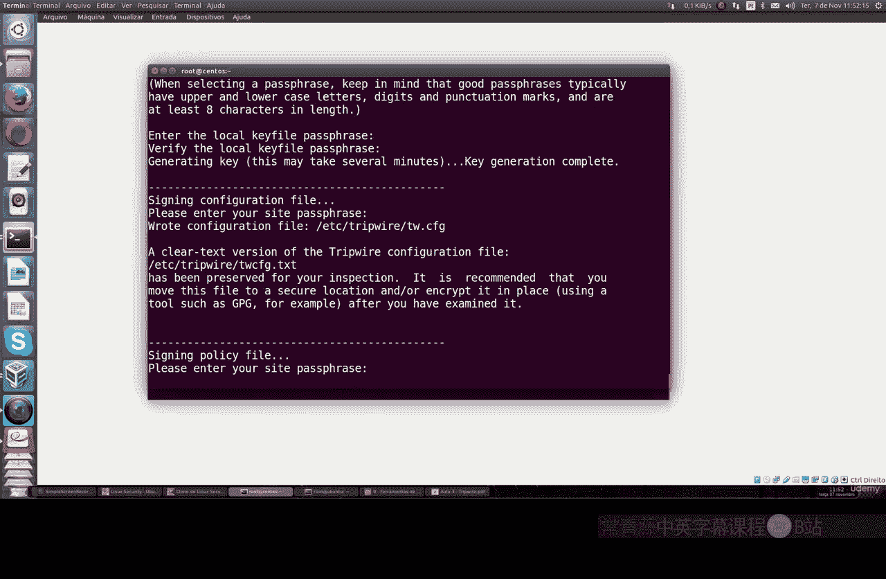
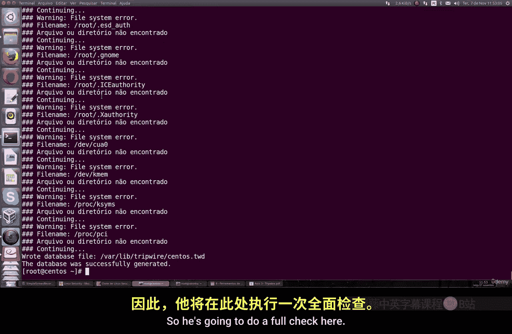
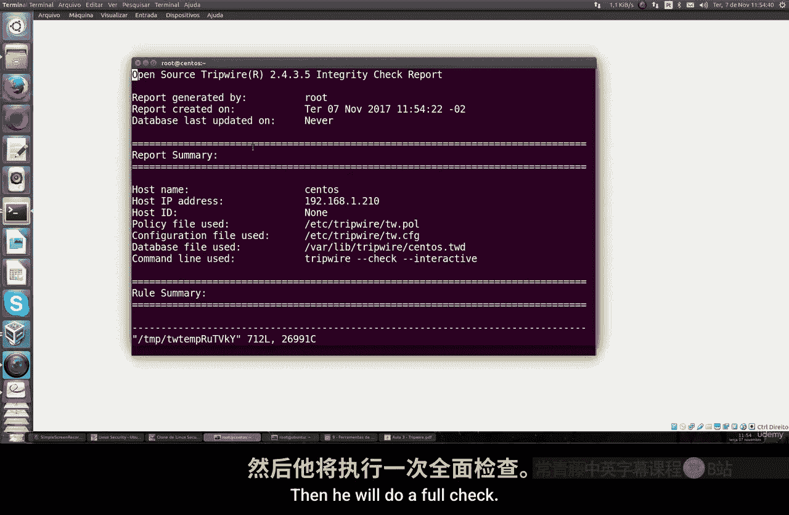
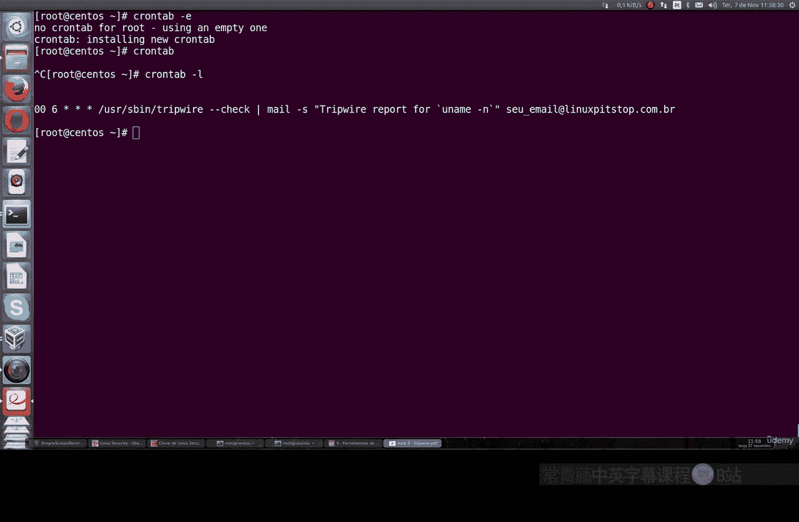

# 033：Tripwire文件完整性监控工具 🛡️

在本节课中，我们将学习一个名为Tripwire的强大工具。Tripwire是一个公司名称，它提供多种有趣的Linux安全解决方案。我们将使用其开源免费版本。该工具主要用于监控Linux系统中文件和目录的任何未经授权的更改。

## 概述

首先，Tripwire会创建一个包含您Linux系统上所有文件信息的加密基准数据库。加密可以防止恶意程序篡改数据。之后，它便开始监控所有文件和目录的潜在变更，包括用户权限修改、文件内容变化等。即使是创建一个新文件，也会在其生成的报告中体现出来。

您可以在其官方网站上查看更多信息。这是一家提供多种安全解决方案的公司，不仅限于开源部分，还包括云计算等领域。不过，本节课我们将专注于其文件完整性监控功能。

## 安装与初始设置





现在，让我们打开Ubuntu终端开始操作。



以下是安装和初始设置的步骤：

1.  **安装Tripwire**
    首先，如果您的软件仓库中尚未安装Tripwire，请先安装它。我们将命令展示在下方以便执行。

    ```bash
    sudo apt update
    sudo apt install tripwire
    ```

2.  **创建加密密钥**
    安装完成后，我们需要进行初始配置并创建一个密码。这个密码将作为加密密钥，以增强安全性。

    ```bash
    sudo tripwire --init
    ```
    执行此命令后，系统会提示您输入一个密码。请设置一个强密码，最好包含大写字母、小写字母和数字，并且与系统登录密码不同。



3.  **初始化数据库**
    密码设置完成后，我们需要初始化Tripwire的数据库。这个数据库将作为监控的基准。

    ```bash
    sudo twadmin --create-polfile /etc/tripwire/twpol.txt
    sudo tripwire --init
    ```
    系统会再次要求输入之前设置的密码。初始化过程会扫描系统文件，并可能提示某些文件或目录未找到的错误，这是正常现象，因为它正在进行全面检查。

## 监控与报告生成

数据库初始化完成后，Tripwire便开始监控您的Linux系统。从现在起，任何类型的更改，无论是在主目录、根目录还是其他任何地方创建、删除文件或修改权限，都会被该程序记录。



为了演示，我们可以进行一个简单的测试。

1.  **创建一个测试文件**
    例如，我们使用`touch`命令创建一个名为`testing`的新文件。

    ```bash
    sudo touch /testing
    ```

2.  **执行完整性检查**
    接下来，我们运行交互式检查命令来执行审计，查看是否有文件被创建、删除或权限被更改。

    ```bash
    sudo tripwire --check --interactive
    ```
    命令执行后，Tripwire会生成一份详细的报告。

## 解读报告



生成的报告内容非常详尽。报告顶部包含机器名、IP地址等信息。向下滚动，您会看到一个完整的表格，列出了所有发生变更的项目。

在报告中，您可以找到：
*   **添加的文件**：例如，我们刚刚创建的`testing`文件。
*   **修改者**：显示是`root`用户进行了此项操作。
*   **变更类型**：明确指出了是“文件添加”。
*   **完整性校验**：所有信息都使用MD5哈希算法进行加密校验，确保报告的可靠性。

报告还会列出它找到的所有文件以及未找到的文件。浏览完报告后，输入密码即可退出。

## 自动化监控

手动运行检查命令固然可行，但更高效的方式是配置自动化任务。您可以使用`cron`定时任务来自动生成报告。

例如，您可以设置每天凌晨6点自动执行一次完整性检查，甚至可以通过配置`postfix`将报告发送到指定邮箱。

以下是如何添加一个`cron`任务的示例：

1.  编辑当前用户的cron任务列表。
    ```bash
    crontab -e
    ```
2.  在文件末尾添加一行，设置每天6点运行检查（报告将输出到指定文件）。
    ```bash
    0 6 * * * /usr/sbin/tripwire --check > /var/log/tripwire_report_$(date +\%Y\%m\%d).log 2>&1
    ```
3.  保存并退出。您可以使用`crontab -l`命令来查看已设置的任务列表。

通过这种方式，您可以定期（如每日或每周）获取系统变更的完整报告，具体频率取决于系统的使用情况。

## 总结



本节课我们一起学习了Tripwire文件完整性监控工具。我们了解了它的基本用途是监控Linux系统中的未授权变更。我们完成了从安装、初始配置（包括设置加密密钥和初始化数据库）到手动执行检查并解读报告的完整流程。最后，我们还探讨了如何通过`cron`配置自动化检查任务，实现主动监控。定期使用此类工具对于维护系统安全、及时发现异常变更至关重要。