# 034：Linux完整安全审计工具Lynis 🛡️

在本节课中，我们将要学习一个名为Lynis的强大工具，它用于对Linux系统进行全面的安全审计。我们将了解它的功能、如何获取、运行以及如何解读其生成的报告。

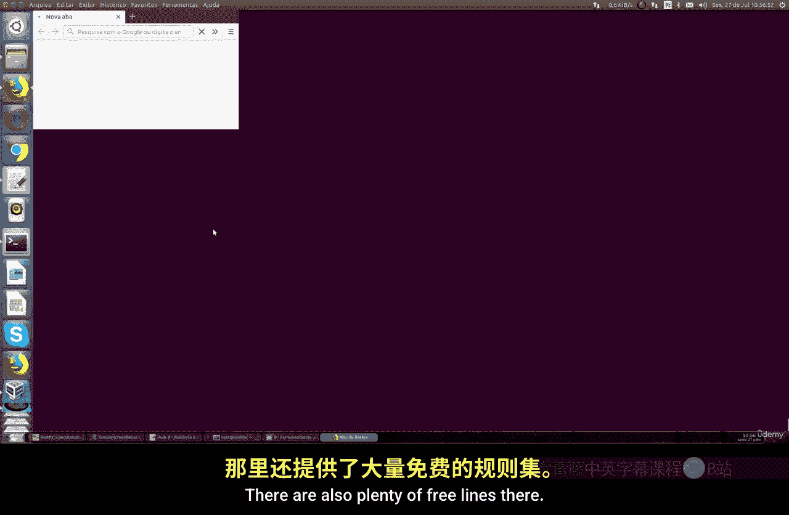

Lynis是一个用Shell脚本编写的开源安全审计工具，适用于任何Linux发行版。它可以扫描系统中的漏洞、错误配置以及安装不当的软件，从而评估系统的安全状况。它能检查系统的主要部分，包括已安装的程序（如PostgreSQL、MySQL等数据库）、Web服务器（如Apache、Nginx）、远程连接服务（如OpenVPN、SSH）以及Linux内核自身的漏洞。

## 获取与运行Lynis

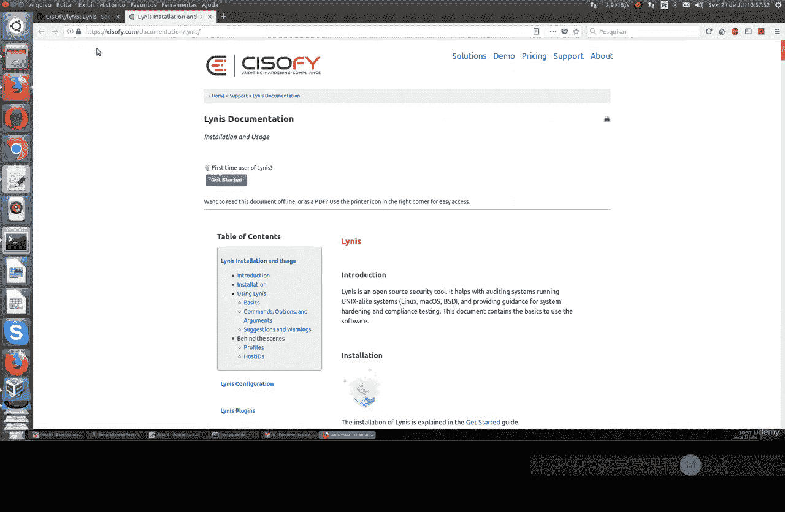

上一节我们介绍了Lynis的基本概念，本节中我们来看看如何获取并运行它。

获取Lynis非常简单，只需从GitHub克隆其仓库即可。它是一个稍大的文件，但下载过程直接。

```bash
git clone https://github.com/CISOfy/lynis
cd lynis
```

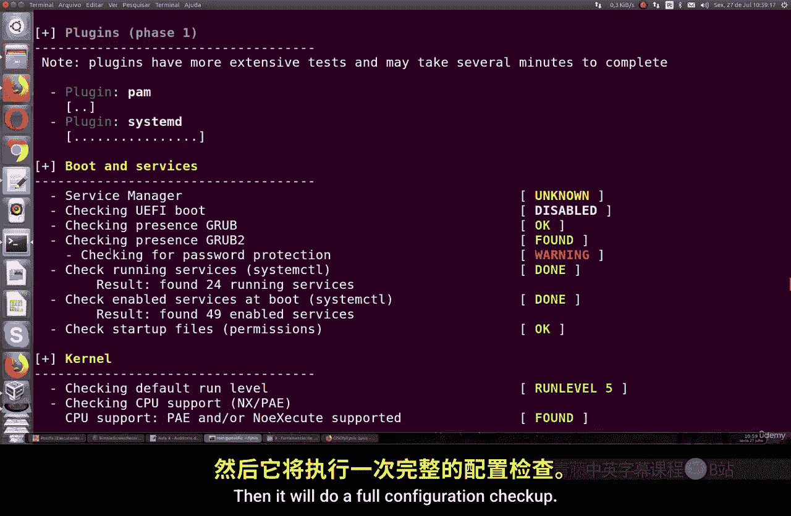

进入Lynis目录后，你可以使用`./lynis audit system`命令来启动对系统的全面审计。执行此命令需要root权限，以确保能访问所有必要的系统文件和配置。

```bash
sudo ./lynis audit system
```

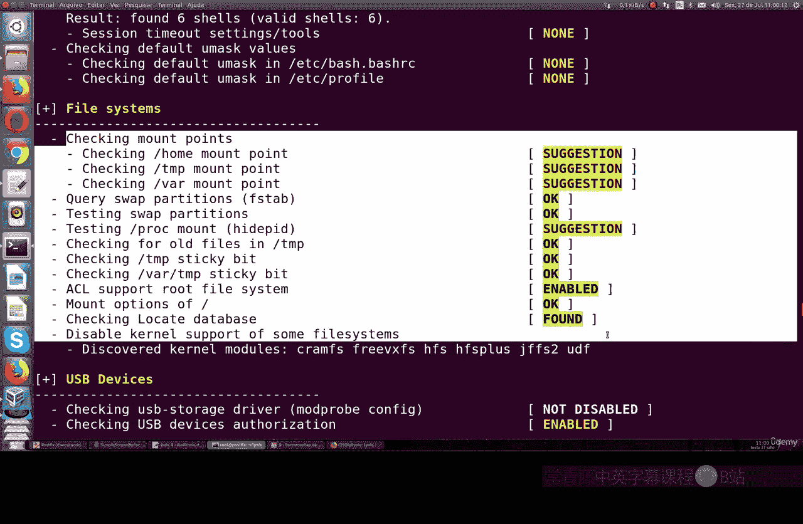

运行后，Lynis会开始检查多项内容。

## Lynis审计内容详解

Lynis的审计过程是系统性的，它会遍历系统的各个层面。以下是其主要检查的类别：

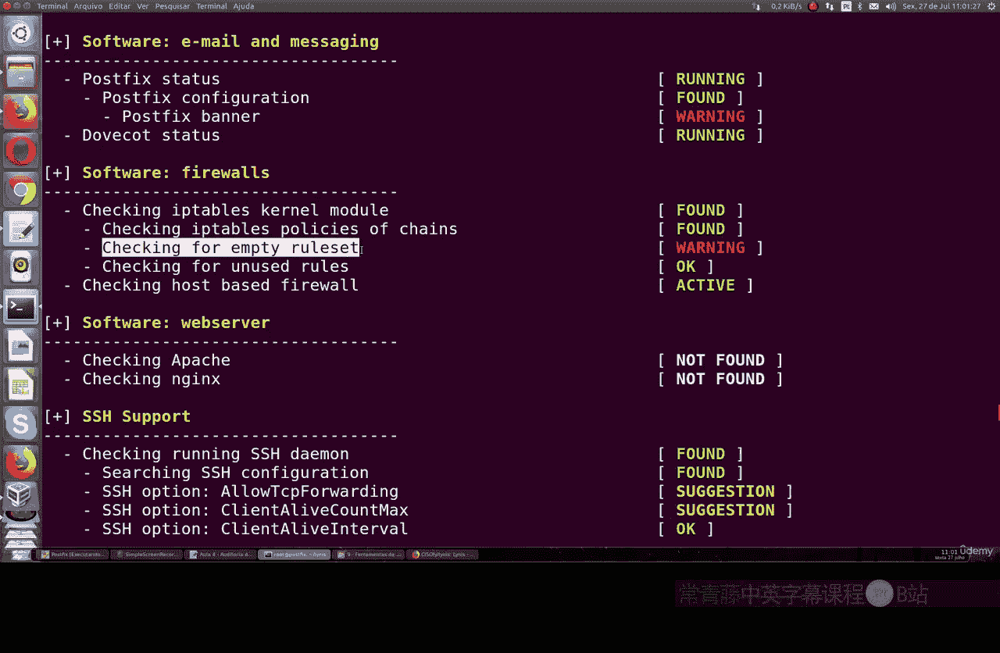

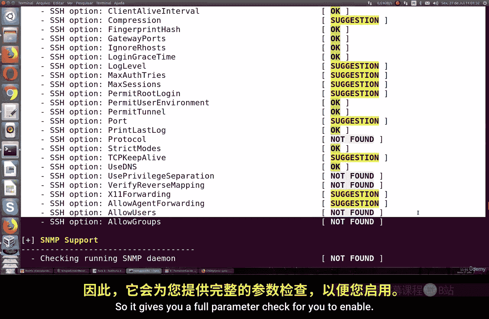

*   **系统信息**：检查操作系统版本、内核版本和硬件平台。
*   **引导与服务**：审查启动加载程序（如GRUB）的配置和系统服务。
*   **内核**：分析内核配置、加载的模块及其安全设置。
*   **进程、用户与认证**：检查运行中的进程、用户、组以及密码策略。
*   **Shell配置**：审查Shell配置文件的安全性。
*   **文件系统**：检查重要文件的权限和配置，包括USB存储设备的访问控制。
*   **存储与日志**：审查存储配置和系统日志设置。
*   **网络**：检查网络配置、端口、防火墙（如iptables）状态以及邮件服务器（如Postfix）的配置。
*   **软件包管理**：扫描已安装软件包的已知漏洞。
*   **Web与数据库服务器**：审计如Apache、Nginx、PHP及各种数据库的配置。
*   **SSH服务**：提供SSH服务的详细参数检查与加固建议。

## 理解审计报告与建议

审计完成后，Lynis会在终端生成一份详细的报告。报告末尾会给出一个包含警告和建议的摘要。

例如，报告可能显示：
*   **警告**：发现一个或多个软件包存在漏洞；iptables防火墙模块未加载。
*   **建议**：系统需要重启以应用某些内核更改；SSH配置需要调整以符合安全最佳实践。

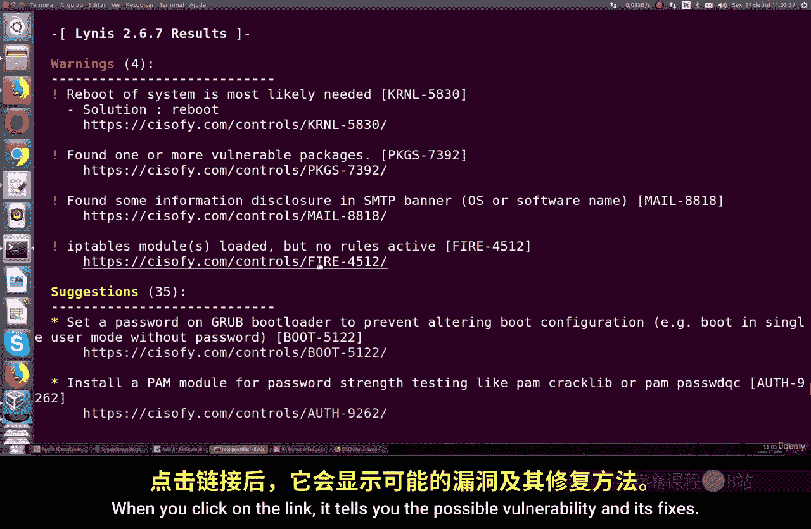

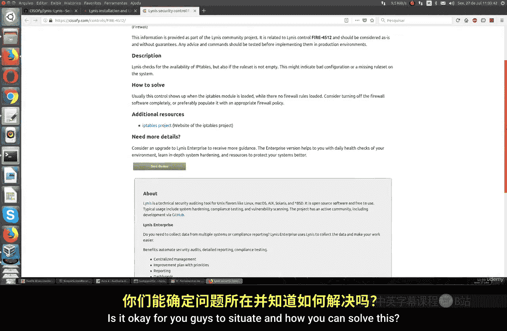

对于每个发现的问题，Lynis通常会提供一个链接或标识符（如CVE编号），你可以据此查找详细的漏洞描述和解决方案。

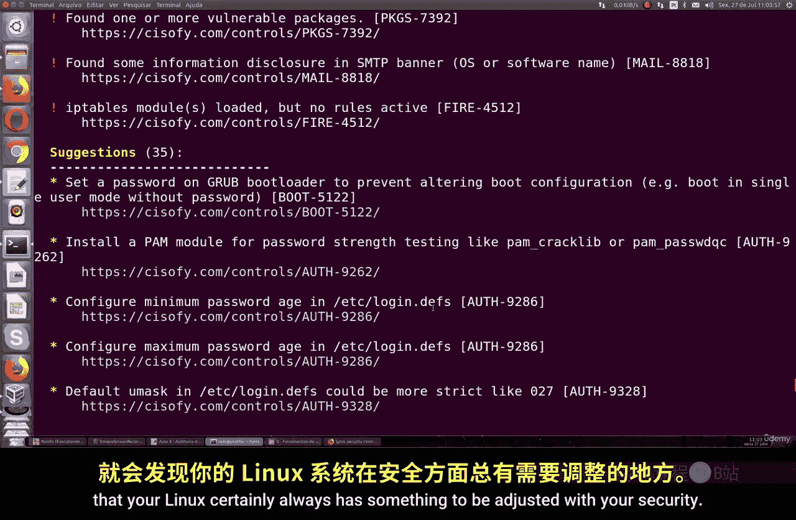

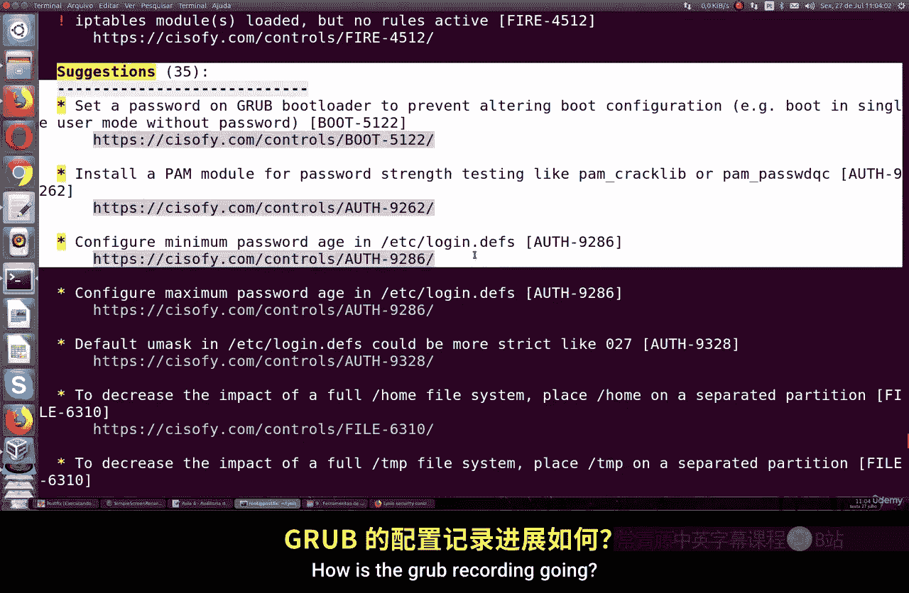

报告还会针对具体服务给出明确的配置建议。例如，对于SSH服务，它可能会建议：
*   将参数 `PermitRootLogin` 从 `yes` 改为 `no`。
*   将 `MaxAuthTries`（最大认证尝试次数）从6降低到2。
*   将 `MaxSessions`（最大会话数）从10减少到2。

这些建议都是安全领域的最佳实践，旨在减少攻击面。所有扫描的详细日志也会被保存，供你后续分析。

## 总结

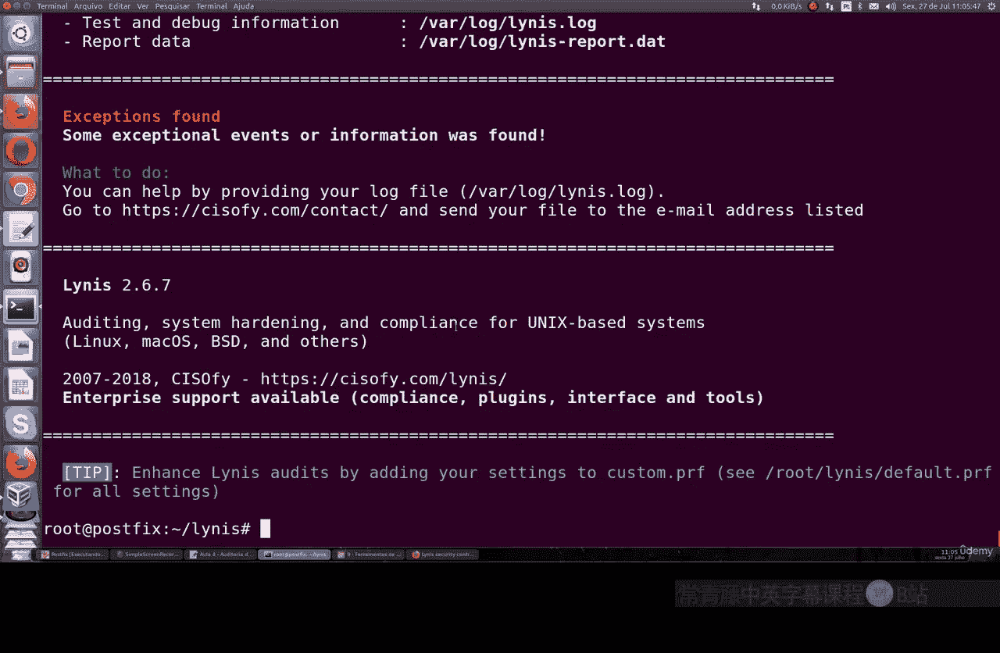

本节课中我们一起学习了如何使用Lynis工具对Linux系统进行安全审计。我们了解了它是一款功能全面的开源工具，能够检查系统配置、软件漏洞并提供具体的加固建议。通过克隆项目、以root权限运行审计命令，我们可以获得一份详细的系统安全状况报告，并根据其中的警告和建议来提升系统的安全性。定期使用此类工具进行审计，是维护Linux服务器安全的重要环节。