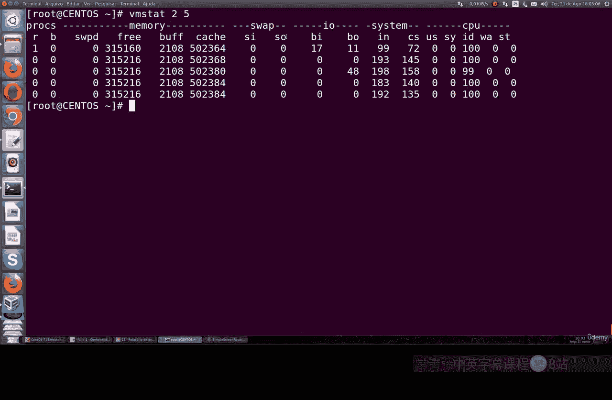
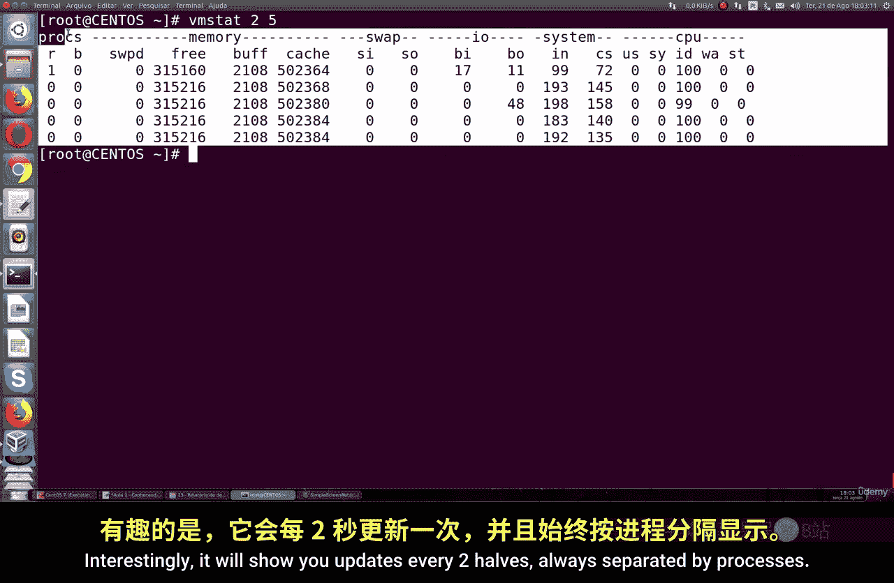
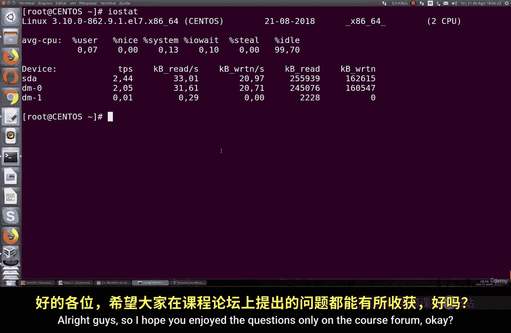

# 035：理解系统性能 🖥️

在本节课中，我们将学习如何监控和理解Linux系统的性能。这对于保持服务器稳定运行至关重要。我们将介绍一系列命令行工具，帮助你查看CPU、内存和磁盘I/O的使用情况，从而发现并解决潜在的性能问题。

## 监控CPU与内存：top命令

上一节我们介绍了系统性能监控的重要性，本节中我们来看看最基础的工具——`top`命令。`top`命令可以实时显示系统中各个进程的资源占用状况。

运行`top`命令后，屏幕顶部会显示系统概览信息。

以下是关于CPU使用率的各项指标含义：

*   **us**: 用户进程占用CPU时间的百分比。
*   **sy**: 内核进程占用CPU时间的百分比。
*   **ni**: 低优先级（nice值）用户进程占用的CPU时间百分比。
*   **id**: CPU空闲时间的百分比。这个值通常很高，如果过低则表明CPU负载很重。
*   **wa**: CPU等待磁盘I/O操作完成的时间百分比。这是一个重要的性能指标。
*   **hi**: CPU处理硬件中断的时间百分比。
*   **si**: CPU处理软件中断的时间百分比。
*   **st**: 在虚拟化环境中，被其他虚拟机“偷走”的CPU时间百分比。

在CPU信息下方，是内存使用情况。

以下是关于内存使用情况的说明：

*   第一行显示物理内存总量、已用量、空闲量、缓冲区和缓存用量。
*   第二行显示交换分区（swap）的总量、已用量和空闲量。交换分区是当物理内存不足时，使用磁盘空间来模拟内存。

## 快速查看内存：free命令

除了`top`，我们还有其他更简洁的命令来快速查看内存。`free`命令可以清晰地展示内存和交换分区的使用情况。

使用`free -m`命令可以以MB为单位显示信息，结果更易读。

```
free -m
```

输出会显示总内存、已用内存、空闲内存、共享内存以及缓冲/缓存的内存大小。对于交换分区，同样会显示总量、已用量和空闲量。

如果你想专门查看交换分区的详细信息，可以使用`swapon`命令。

```
swapon -s
```

这个命令会显示当前激活的交换分区及其大小和位置。如果你想增加交换空间，可以基于这个信息创建新的交换分区。

## 综合性能报告：vmstat命令

为了获得更综合的性能快照，我们可以使用`vmstat`命令。它能报告关于进程、内存、分页、块I/O、陷阱和CPU活动的信息。

`vmstat`命令可以设置采样间隔和次数。例如，以下命令将每隔2秒采样一次，总共采样5次：

```
vmstat 2 5
```

以下是`vmstat`输出中关键字段的简要说明：

*   **procs**: 显示运行和等待的进程数量。
*   **memory**: 显示内存使用情况，包括空闲内存和缓冲/缓存。
*   **swap**: 显示交换分区的换入（si）和换出（so）情况。
*   **io**: 显示块设备的读（bi）和写（bo）情况。
*   **system**: 显示每秒的中断数（in）和上下文切换数（cs）。
*   **cpu**: 显示CPU时间在用户态（us）、内核态（sy）、空闲（id）和等待I/O（wa）上的百分比分布。

## 监控磁盘I/O：iostat命令





最后，我们来学习一个专注于磁盘输入/输出性能的工具。`iostat`命令需要单独安装，它提供了详细的磁盘读写统计信息。

在基于RPM的系统（如CentOS/Fedora）上，你可以通过`sysstat`包来安装`iostat`：

```
yum install sysstat
```

安装后，直接运行`iostat`命令。

```
iostat
```

`iostat`的输出分为两部分：
1.  **CPU利用率报告**：与`top`命令中的CPU行信息类似。
2.  **设备利用率报告**：为每个块设备（磁盘分区）显示以下信息：
    *   `tps`: 每秒的传输次数。
    *   `kB_read/s`: 每秒从设备读取的数据量（KB）。
    *   `kB_wrtn/s`: 每秒向设备写入的数据量（KB）。
    *   `kB_read`: 读取的总数据量。
    *   `kB_wrtn`: 写入的总数据量。

通过观察这些值，你可以判断磁盘的读写负载是否过高。

---



本节课中我们一起学习了多个监控Linux系统性能的命令行工具。我们从基础的`top`和`free`命令开始，了解了如何查看CPU和内存状态。接着，我们使用`vmstat`获得了一个综合的性能报告。最后，我们介绍了需要安装的`iostat`工具，用于深入监控磁盘I/O性能。掌握这些工具，将帮助你有效地诊断系统瓶颈，确保服务器稳定高效运行。