# 037：正确安装与使用ClamAV防病毒软件 🛡️

在本节课中，我们将学习如何在Linux系统上安装和使用ClamAV防病毒软件。ClamAV是一款由Cisco维护的、功能强大的开源防病毒工具，适用于Linux、Windows、macOS及多种BSD发行版。虽然Linux系统相对安全，但额外的安全措施总是有益的，尤其是在服务器环境中。

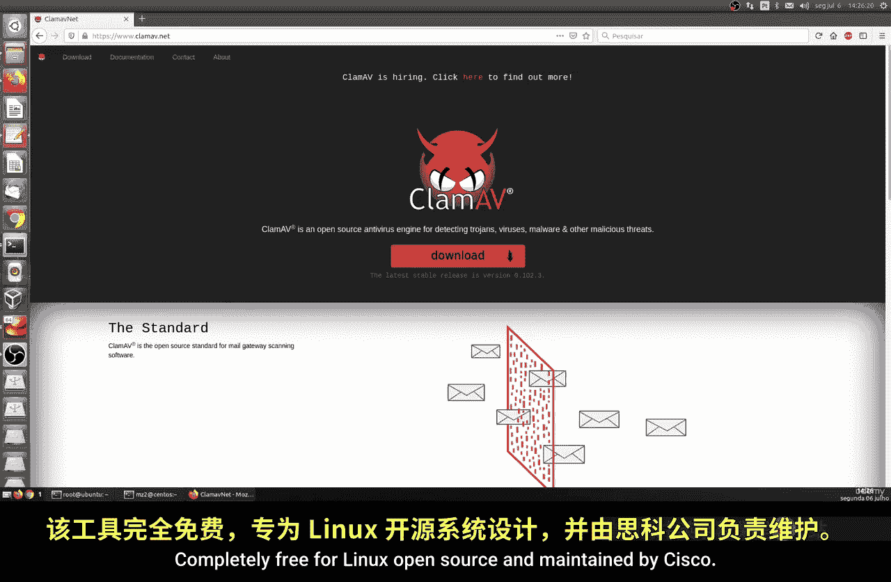

## 概述

ClamAV是一款跨平台、开源且免费的防病毒软件，拥有庞大的社区支持和持续更新的病毒数据库。它特别适合用于服务器和生产环境，以增强系统的安全性。本节将指导你完成ClamAV的安装、基本配置和使用方法。

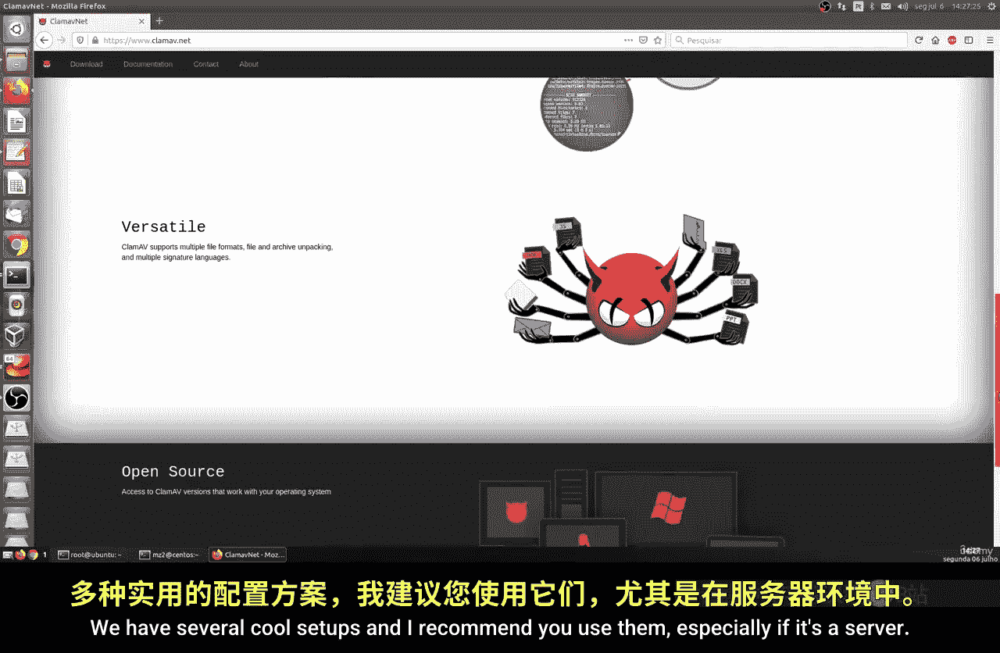

## 安装ClamAV

上一节我们介绍了ClamAV的基本信息，本节中我们来看看如何在不同Linux发行版上安装它。

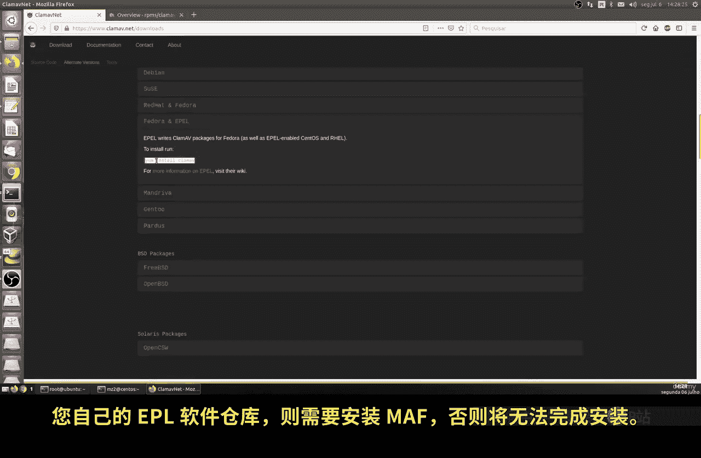

ClamAV支持多种安装方式，包括通过包管理器安装或从源代码编译。对于大多数用户，使用系统自带的包管理器是最简单的方法。

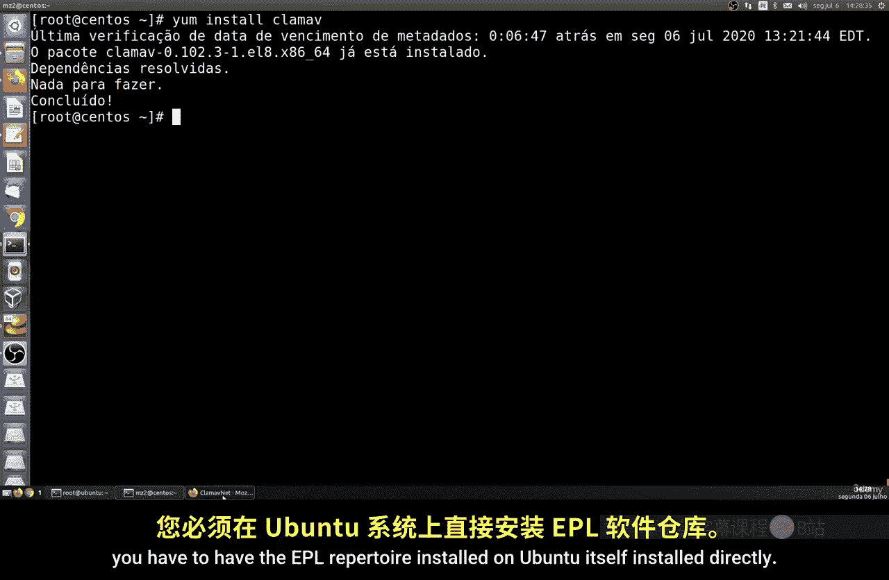

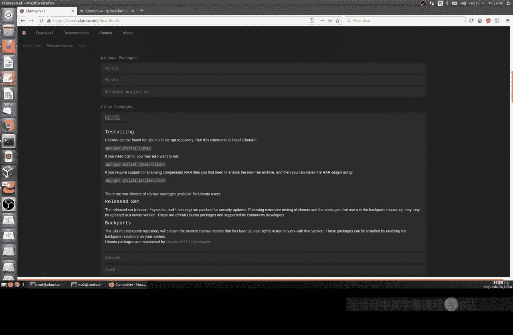

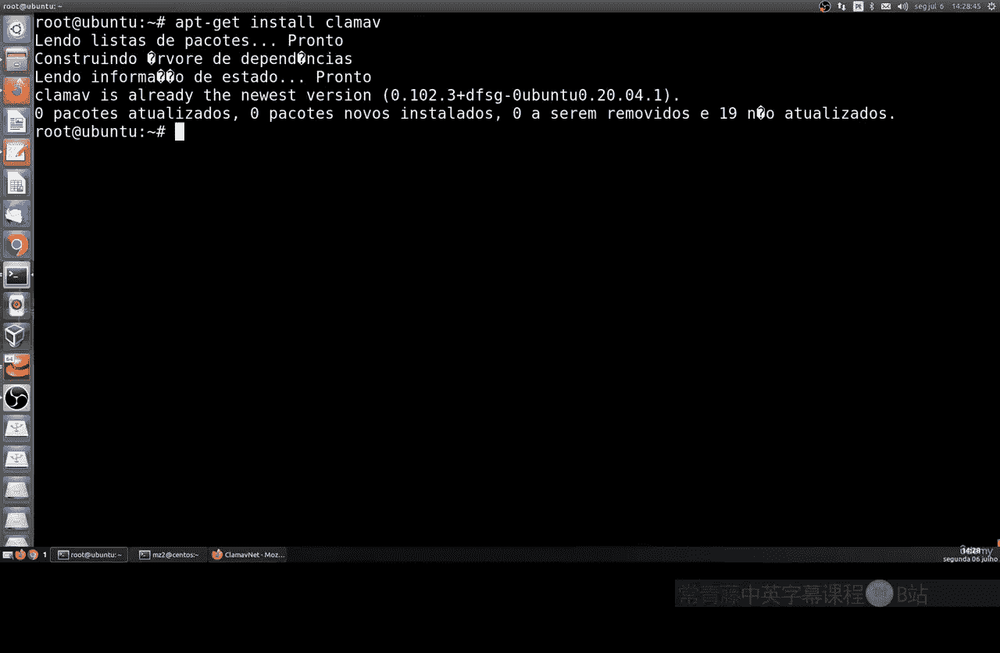

以下是针对不同发行版的安装命令：

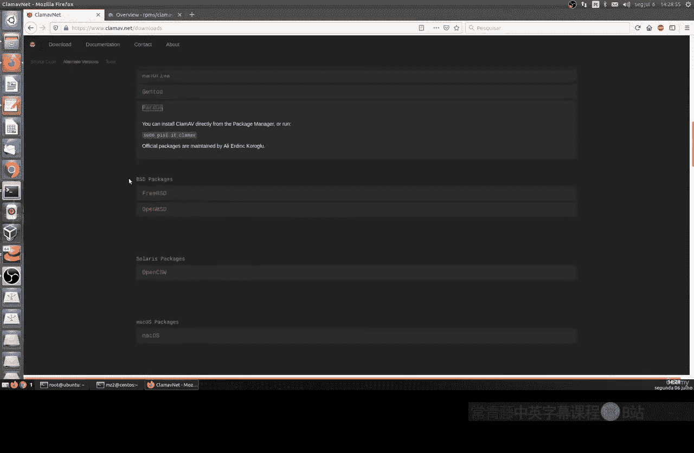

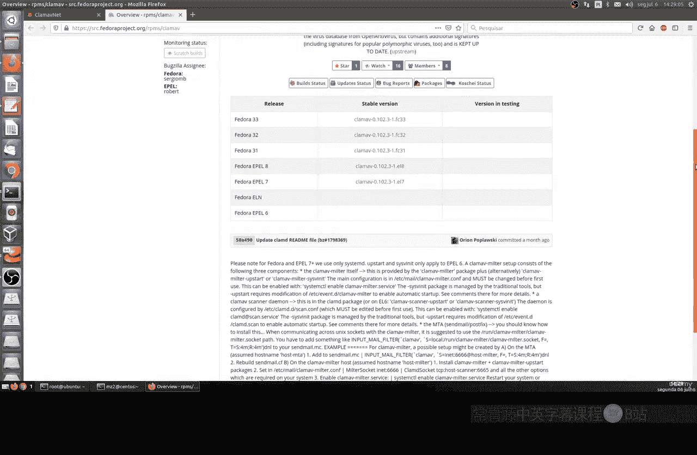

*   **Ubuntu/Debian**: 使用 `apt` 包管理器。首先确保已启用EPEL仓库（如果需要），然后执行安装命令。
    ```bash
    sudo apt update
    sudo apt install clamav clamav-daemon
    ```
*   **Fedora/RHEL/CentOS**: 使用 `dnf` 或 `yum` 包管理器。
    ```bash
    sudo dnf install clamav clamav-update  # Fedora
    sudo yum install clamav clamav-update  # RHEL/CentOS
    ```
*   **其他发行版**: 请参考ClamAV官方网站的下载页面，那里提供了详细的、针对不同发行版的逐步安装指南。

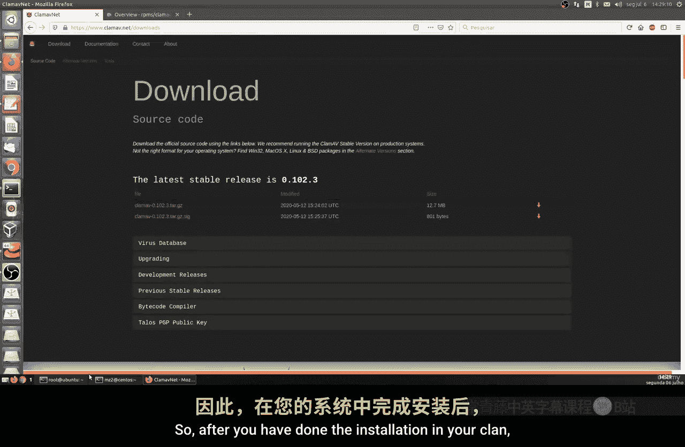

安装完成后，需要启用并启动ClamAV服务，以确保它在后台运行并自动更新。

## 更新病毒数据库

与任何防病毒软件一样，保持病毒数据库的最新状态至关重要。ClamAV提供了专门的命令来手动更新数据库。

运行以下命令可以检查并更新病毒数据库：
```bash
sudo freshclam
```
该命令会连接ClamAV的服务器，检查本地数据库版本，并下载最新的病毒定义。在许多现代发行版上，这项更新任务通常是自动配置的，但手动运行 `freshclam` 可以确保立即获取最新保护。

## 使用ClamAV扫描文件

现在我们已经安装并更新了ClamAV，接下来看看如何使用它来扫描系统中的文件和目录。

基本的扫描命令是 `clamscan`。你可以指定要扫描的特定目录或文件。

以下是 `clamscan` 命令的一些常用示例：

*   **扫描特定目录（递归扫描所有文件，包括隐藏文件）**:
    ```bash
    sudo clamscan -r /path/to/your/directory
    ```
    参数 `-r` 表示递归扫描。建议使用 `sudo` 权限运行，以避免因文件权限问题而漏扫某些文件。
*   **扫描整个系统**:
    ```bash
    sudo clamscan -r /
    ```
    这是一个全面的扫描，会检查系统上的所有文件。这个过程可能需要很长时间，具体取决于系统的大小和文件数量。
*   **扫描并自动移除受感染文件**:
    ```bash
    sudo clamscan -r --remove /path/to/scan
    ```
    使用 `--remove` 参数会让ClamAV在发现受感染文件时自动删除它们。请谨慎使用此选项。

扫描完成后，`clamscan` 会输出一份报告，显示扫描的引擎版本、检查的目录和文件数量，以及发现的受感染文件数量。

## 管理ClamAV服务

为了确保ClamAV在系统启动时自动运行并在后台保持更新，我们需要管理其服务。

以下是如何管理ClamAV守护进程（clamav-daemon）的常用命令：

*   **启动服务**:
    ```bash
    sudo systemctl start clamav-daemon
    ```
*   **启用开机自启**:
    ```bash
    sudo systemctl enable clamav-daemon
    ```
*   **检查服务状态**:
    ```bash
    sudo systemctl status clamav-daemon
    ```
    这个命令会显示服务是否正在活跃运行，以及最近的日志片段。
*   **检查更新服务的状态**:
    ```bash
    sudo systemctl status clamav-freshclam
    ```
    这个服务负责自动更新病毒数据库。

## 查看日志与配置

ClamAV的日志文件记录了扫描结果、更新状态和可能的错误信息，是排查问题的重要依据。

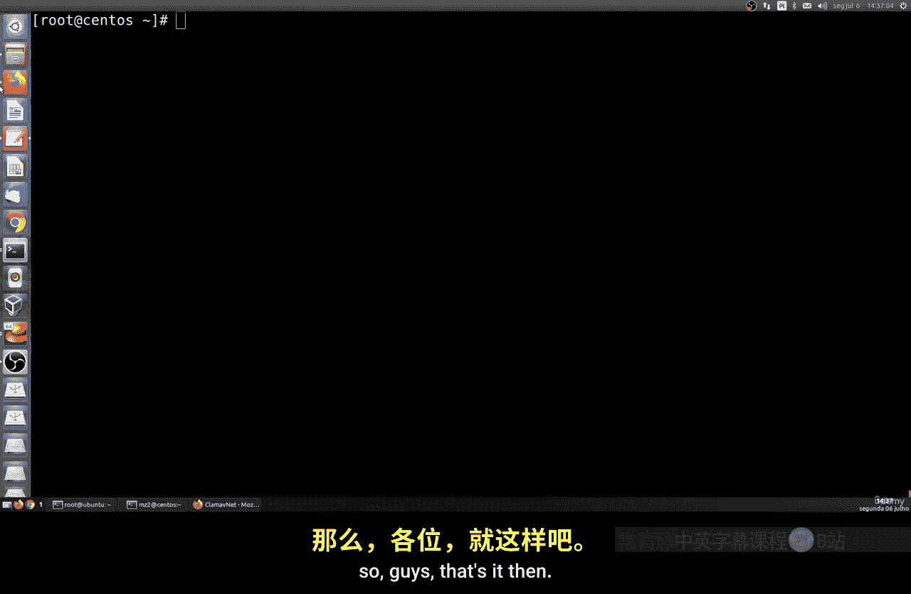

日志文件通常位于 `/var/log/clamav/` 目录下，例如 `clamav.log` 或 `freshclam.log`。你可以使用 `tail` 或 `cat` 命令查看它们：
```bash
sudo tail -f /var/log/clamav/freshclam.log
```
ClamAV的主配置文件通常位于 `/etc/clamav/clamd.conf` 和 `/etc/clamav/freshclam.conf`。对于大多数用户，默认配置已足够使用。如需进行高级定制（如调整扫描选项、设置排除路径等），请参考官方文档后再修改这些配置文件。

## 总结

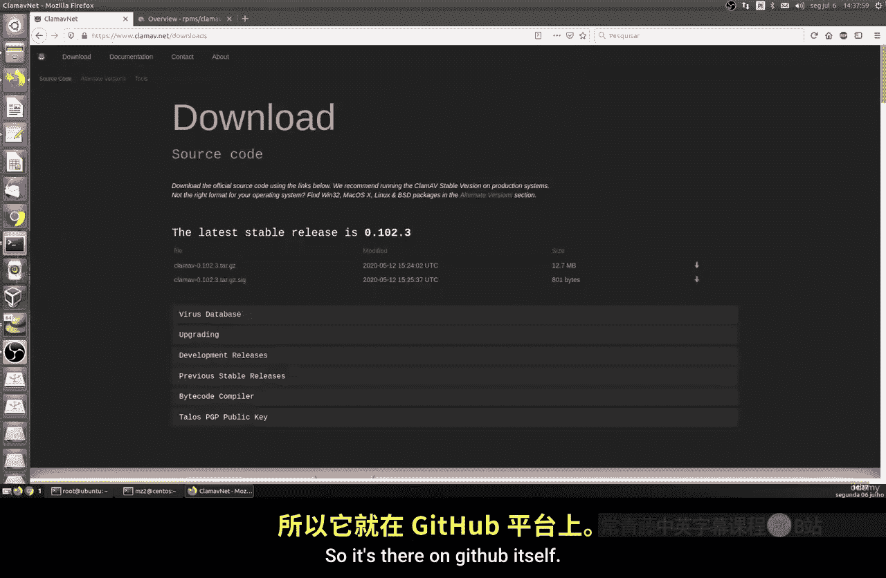

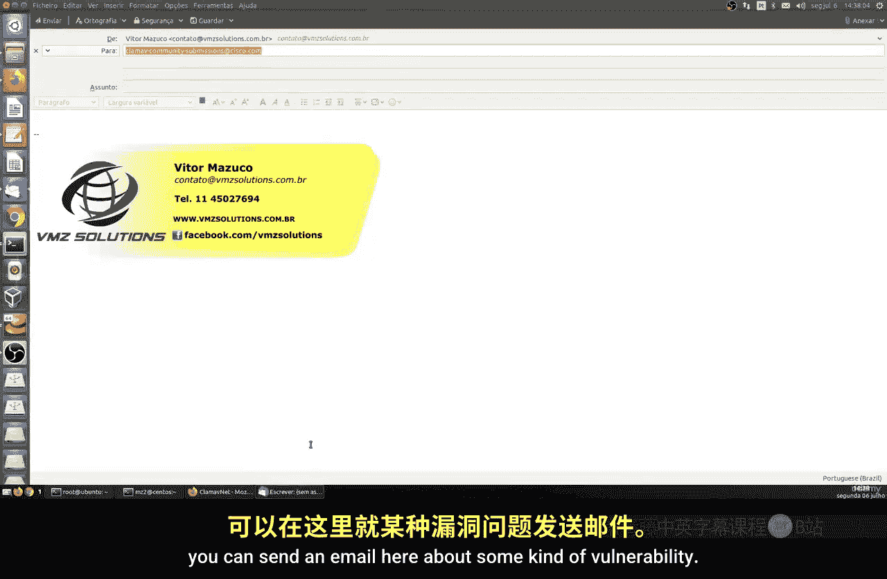

本节课中我们一起学习了ClamAV防病毒软件的安装与使用。我们了解了ClamAV作为一款开源、跨平台安全工具的价值，掌握了通过包管理器安装它的方法，学会了使用 `freshclam` 更新病毒库以及使用 `clamscan` 命令扫描文件和目录。此外，我们还介绍了如何管理ClamAV的后台服务以及如何查看其日志和配置文件。

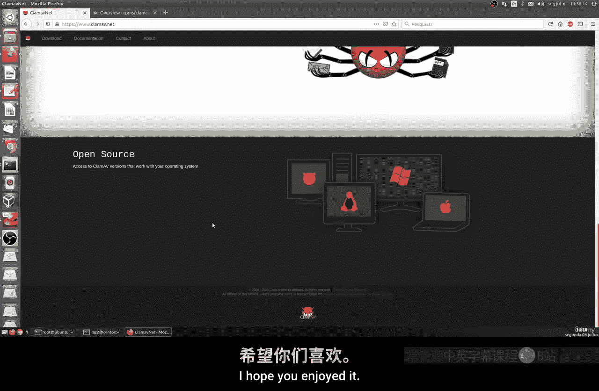

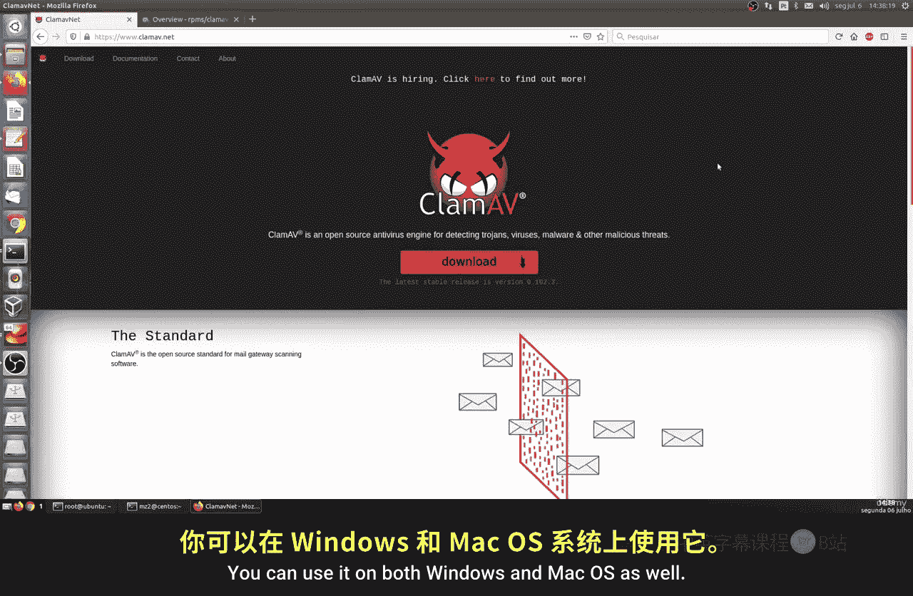


ClamAV功能强大且配置灵活，是加固Linux系统安全的有力工具。建议你访问其[官方网站](https://www.clamav.net/)和[GitHub仓库](https://github.com/Cisco-Talos/clamav)以获取更详细的文档，并参与社区贡献。