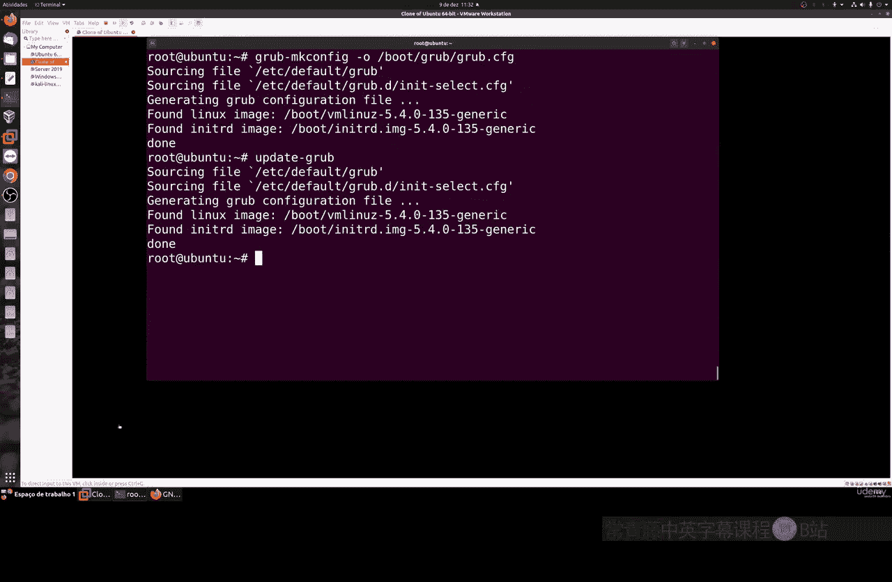
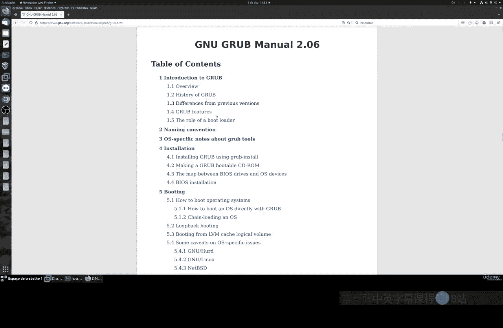

# 038：GRUB介绍 🚀

在本节课中，我们将要学习一个非常重要的软件——GRUB。它是计算机启动过程中的关键组件，负责加载操作系统。

## 什么是GRUB？

上一节我们介绍了命令行基础，本节中我们来看看引导加载程序。GRUB是一个引导加载程序。当您安装任何操作系统，无论是Windows还是Linux，都需要一个引导加载程序。计算机主板上的BIOS需要一个引导加载程序来启动系统。不仅是计算机，您的手机、平板电脑也需要这类系统。

GRUB本质上是一个**引导加载程序**，即加载操作系统的软件。当您打开计算机电源后，在Linux系统中，我们使用的就是GRUB这个引导管理器。

## GRUB的作用与特点

您可能在系统启动时见过它。它是一个广泛可用的系统。我们最常使用的Linux系统，如Red Hat、Ubuntu、Debian、Linux Mint、Fedora等，都使用相同类型的GRUB系统，并且它是完全免费的。

GRUB也是一个平台。例如，如果您想在同一块硬盘上同时使用另一个操作系统和Linux，您可以使用GRUB来实现。因此，我们可以选择想要使用的系统类型，无论是Windows还是Linux。

不仅如此，您还可以为不同类型的Linux或Windows创建分区，这取决于您的硬盘容量。此外，GRUB还可以编辑配置、提供可编程接口以及恢复模块。GRUB的恢复模块在Linux系统出现任何类型的故障或问题时非常有用。

## GRUB版本与默认安装

目前我们使用的是稳定版的GRUB 2。版本1是遗留版本，已不再使用。基本上，当您安装Linux时，系统会默认安装GRUB。

一些Linux发行版不会立即显示GRUB界面。例如，某些桌面系统如Ubuntu和Fedora，如果您的硬盘同一分区上没有其他不同的操作系统，GRUB默认不会显示，系统会直接启动。

如果您有其他系统的分区，例如Windows，那么启动时会暂停并自动显示GRUB界面，让您选择要启动的系统。GRUB只是一个引导加载程序，它不会改变您计算机上的任何内容。例如，如果您一直使用Windows，GRUB不会改变Windows的任何设置。它只是在开机时加载操作系统的软件。

## 如何访问GRUB界面

如果您在虚拟机或真实机器上遇到同样的问题（即启动时看不到GRUB），可以在重启系统时按住键盘上的**左Shift键**。这样就会显示GRUB界面。

如果系统中有其他不同的操作系统，例如Windows，GRUB界面会显示Windows和Linux选项。它还包括恢复模式选项。例如，如果您安装的内核出现问题（如内核恐慌），或者系统、显卡驱动有任何问题，您可以选择恢复模式。这允许您在加载完整系统之前执行某些维护或命令。

## GRUB配置与更新

在终端中以root模式运行命令来编辑GRUB配置非常简单。我们通常在更新后使用这类命令来重新加载GRUB。

以下是更新GRUB配置的命令：

对于Ubuntu和Debian系统：
```bash
sudo update-grub
```

对于RHEL和CentOS等系统，命令类似但略有不同：
```bash
sudo grub2-mkconfig -o /boot/grub2/grub.cfg
```

每次编辑GRUB后，都需要重新加载它。在下一节课中，我们将学习如何编辑GRUB。



## 重要性与深入学习建议

GRUB是一个简单的系统，但包含很多内容。它有许多命令和参数。我们后续会有其他关于GRUB的课程，学习如何配置和进行一些自定义，例如更换启动源、镜像或内核。

当您升级Linux系统时，这也很重要。通常，安装新内核后，您的启动版本中会安装多个内核。有时一个新内核可能导致问题，因此我们可以通过GRUB使用旧版本的内核。我们可以通过GRUB管理所有这些。

建议阅读GRUB手册，内容非常全面。如果您有任何疑问或想更深入了解，可以查阅手册。

## ⚠️ 重要安全警告



最重要的是，**不要**在您的真实机器上实践本节或接下来关于GRUB的课程内容。请在虚拟机中进行这些操作。我们将要在下节课展示的命令，请在虚拟机中尝试。

因为GRUB是引导系统，如果您没有经验，在真实机器上操作并不安全。请使用虚拟机，例如VirtualBox。这样如果出现问题，您的真实机器将完好无损。因此，请务必在虚拟机中编辑或实践这些GRUB课程内容。

---


本节课中我们一起学习了GRUB引导加载程序的基本概念、作用、访问方法以及更新配置的命令。我们了解了它在多系统启动和系统恢复中的重要性，并强调了在虚拟机中进行实践的安全准则。下一节课我们将深入学习GRUB的配置编辑。