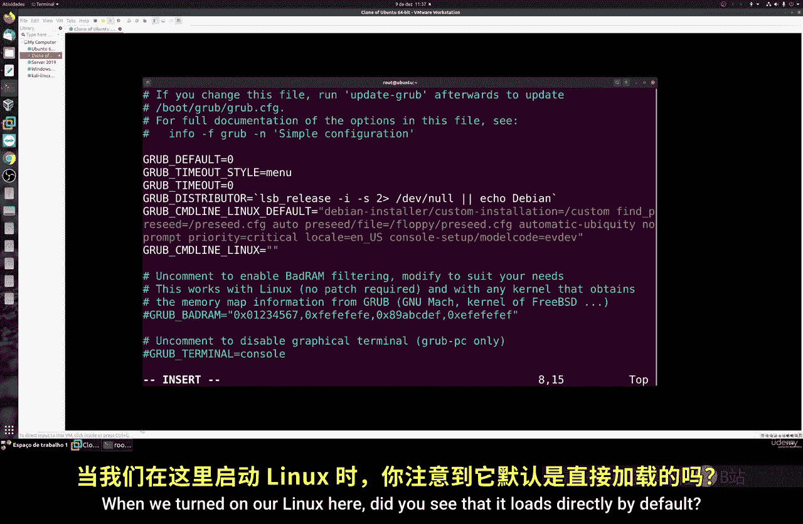
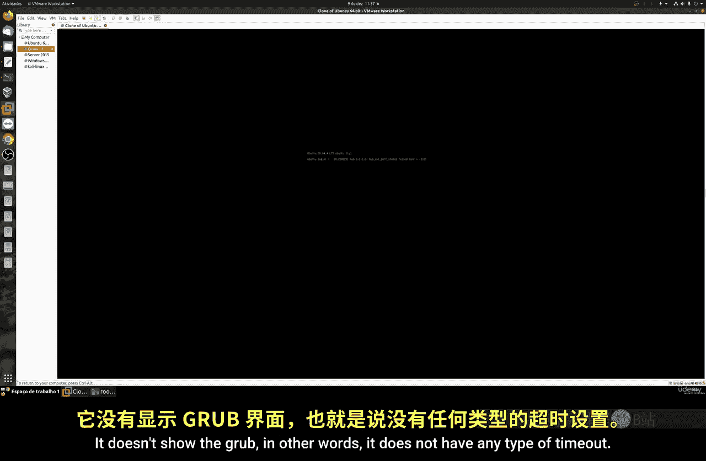
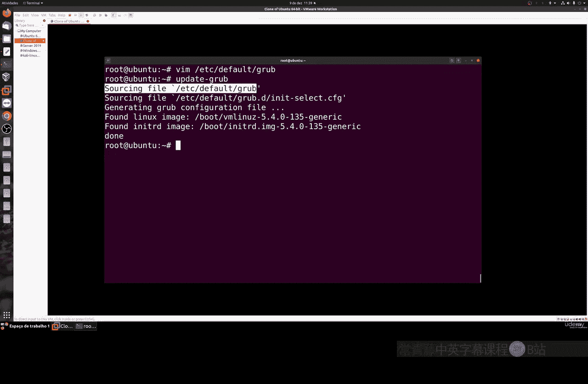
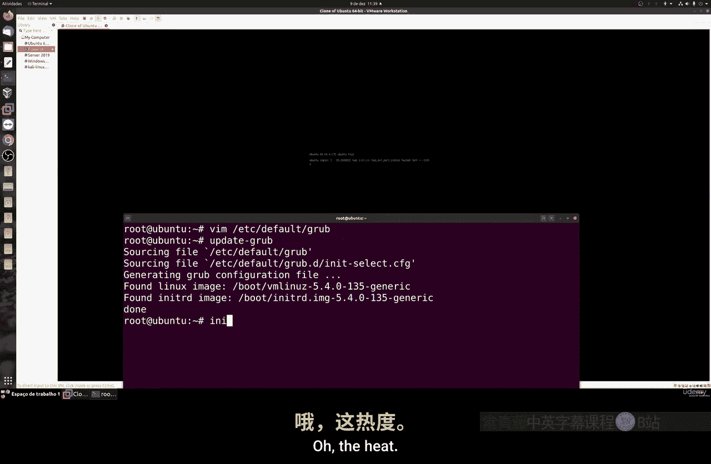
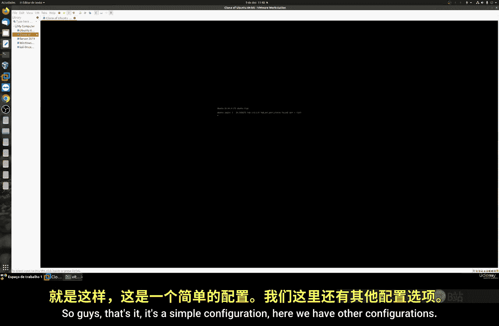
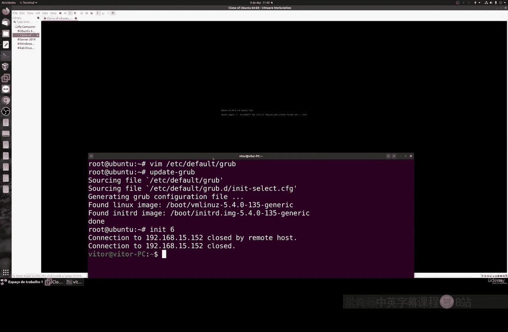
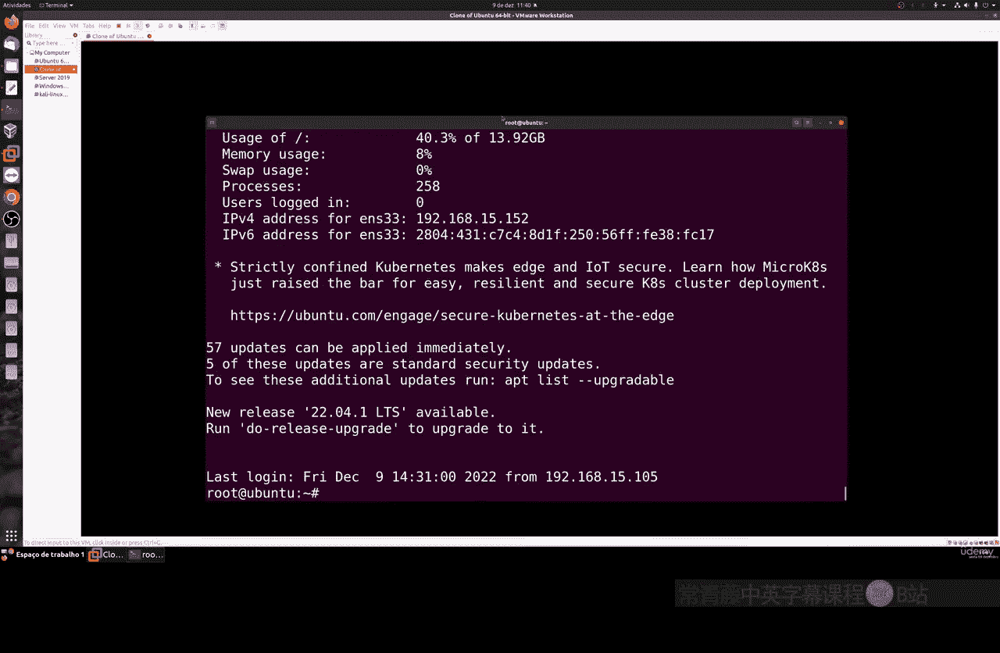
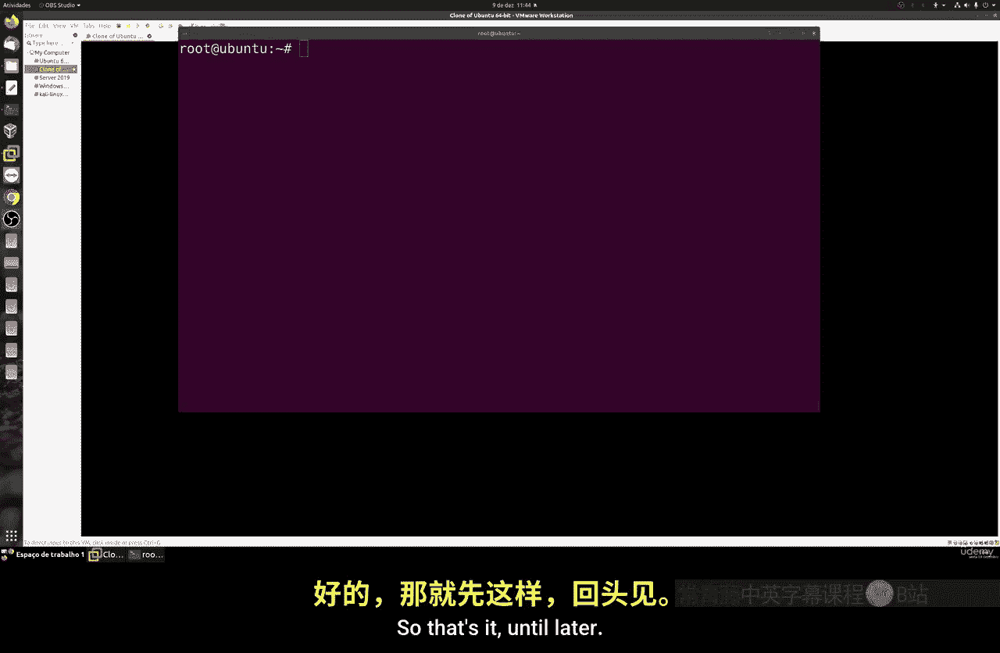

# 039：首次GRUB配置 🛠️

在本节课中，我们将学习如何对GRUB引导加载程序进行首次基本配置。我们将编辑GRUB的主要配置文件，以显示启动菜单并设置等待时间。

## 概述

GRUB是大多数Linux发行版使用的引导加载程序。它负责在计算机启动时加载操作系统。默认情况下，系统可能直接启动而不显示菜单。本节课我们将修改配置文件，让GRUB菜单在启动时显示出来，并设置一个短暂的等待时间。

上一节我们介绍了GRUB的基本概念，本节中我们来看看如何修改其核心配置文件。



## 配置GRUB默认文件



GRUB的主要配置文件通常是 `/etc/default/grub`。我们在此文件中进行基本设置。

首先，我们需要将 `GRUB_TIMEOUT_STYLE` 的值从默认的 `hidden` 改为 `menu`。这样修改后，启动时就会显示GRUB菜单。

其次，我们可以调整 `GRUB_TIMEOUT` 的值。这个值以秒为单位，定义了菜单在自动选择默认项前的等待时间。例如，将其设置为 `10` 表示有10秒时间可供选择。

以下是修改配置文件的步骤：



1.  使用文本编辑器（如 `nano` 或 `vi`）打开配置文件：
    ```bash
    sudo nano /etc/default/grub
    ```
2.  找到 `GRUB_TIMEOUT_STYLE=hidden` 这一行，将其修改为：
    ```bash
    GRUB_TIMEOUT_STYLE=menu
    ```
3.  找到 `GRUB_TIMEOUT` 行，确保其值为正数，例如：
    ```bash
    GRUB_TIMEOUT=10
    ```
4.  保存文件并退出编辑器。



**重要提示**：请务必在虚拟机中进行此操作。如果在实体机上操作出错，恢复起来会困难得多。

## 更新GRUB配置

每次编辑完 `/etc/default/grub` 文件后，都必须更新GRUB，才能使更改生效。

对于基于Debian/Ubuntu的系统，使用以下命令：
```bash
sudo update-grub
```



对于基于Red Hat/Fedora的系统，使用以下命令：
```bash
sudo grub2-mkconfig -o /boot/grub2/grub.cfg
```





执行更新命令后，新的配置会被编译并写入 `/boot/grub/grub.cfg` 文件。

## 验证更改

更新完成后，可以重启系统以验证更改是否生效。
```bash
sudo reboot
```

重启后，你应该能看到GRUB菜单出现，并有一个10秒的倒计时。在倒计时期间，你可以使用键盘方向键选择不同的启动项（例如，不同的内核版本或高级选项），倒计时会暂停。如果10秒内未进行任何操作，系统将自动启动默认项。

## GRUB目录结构简介

在验证了基本配置生效后，让我们简单了解一下GRUB相关的目录和文件，以便有更全面的认识。

除了我们刚才编辑的 `/etc/default/grub` 主配置文件外，GRUB还有其他重要的目录：

*   `/boot/grub/`：此目录包含GRUB的核心文件、模块、字体以及主题文件。我们可以在这里放置图片或主题来进一步自定义GRUB的视觉外观。
*   `/etc/grub.d/`：此目录包含一系列按数字顺序（如 `00_header`, `10_linux`, `30_os-prober`）执行的脚本。`update-grub` 命令会运行这些脚本来生成最终的 `grub.cfg` 文件。

**请注意**：`/etc/grub.d/` 目录下的脚本和 `/boot/grub/` 目录下的核心模块较为复杂。如果没有足够的知识，不建议直接修改它们，以免导致系统无法启动。

## 总结

本节课中我们一起学习了GRUB的首次配置。我们主要完成了两件事：
1.  通过编辑 `/etc/default/grub` 文件，将启动样式改为 `menu` 并设置了超时时间。
2.  学会了使用 `update-grub`（或 `grub2-mkconfig`）命令来使配置更改生效。



这是一个简单的配置，但它让我们能够在启动时看到并选择不同的选项。我们还简要了解了GRUB相关的其他目录，为后续可能进行的更深入定制打下了基础。在接下来的课程中，我们将尝试进行一些更有趣的配置编辑。