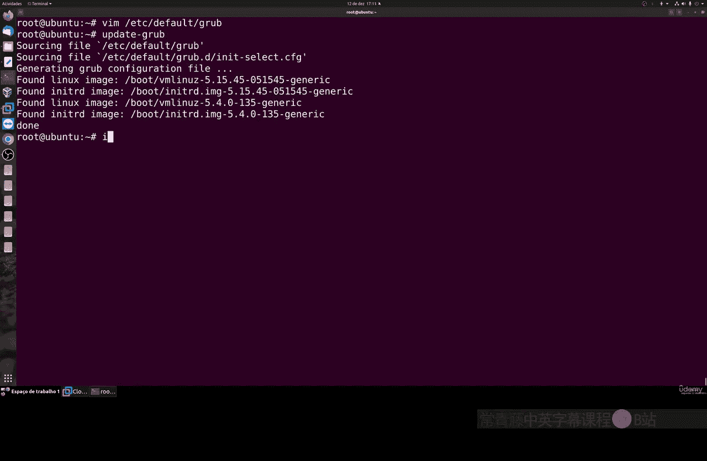
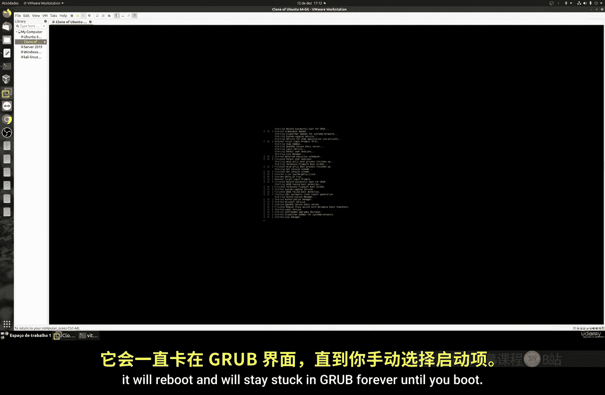
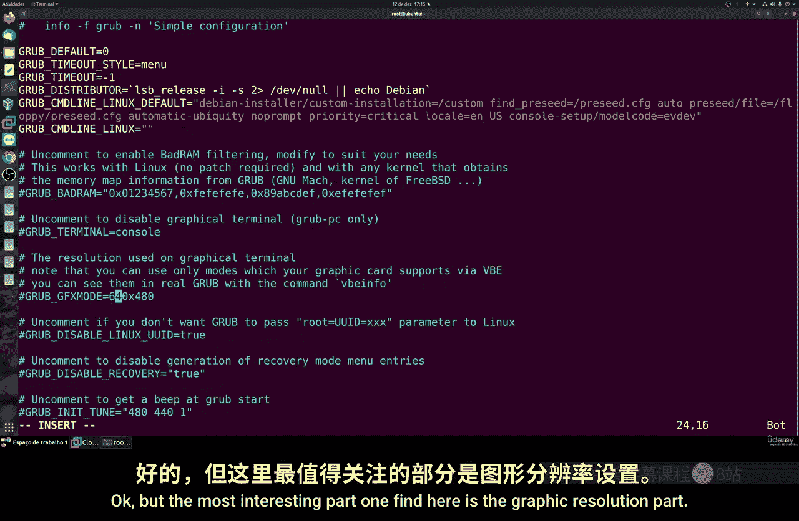
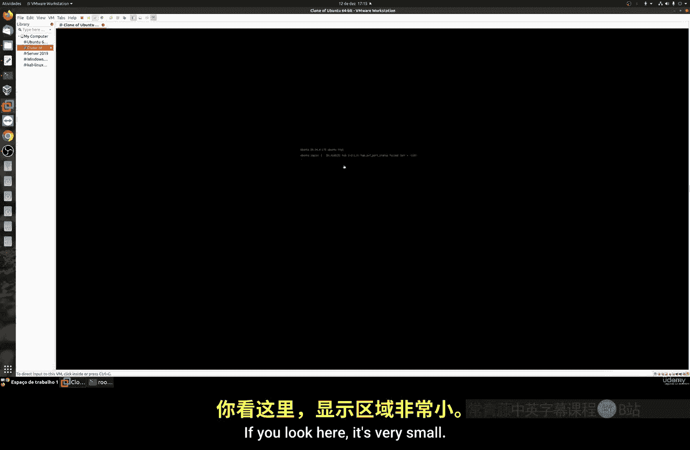
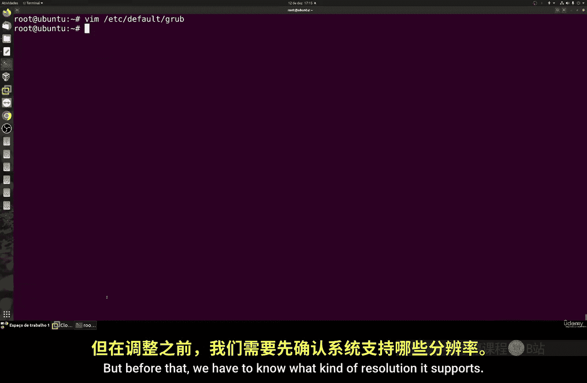
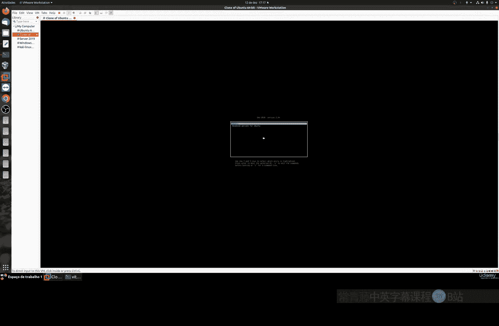
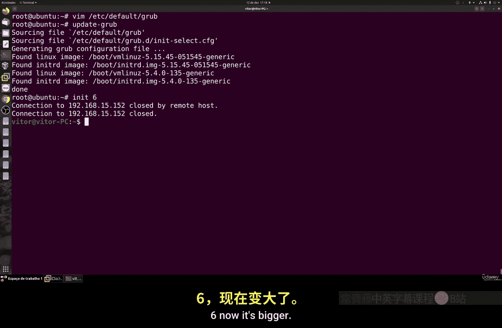
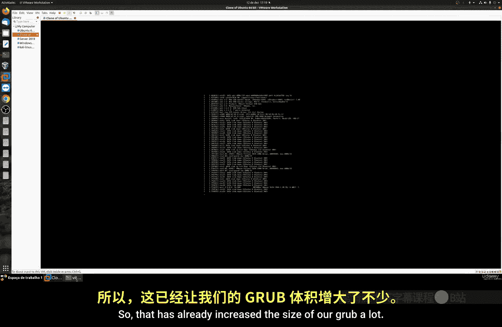
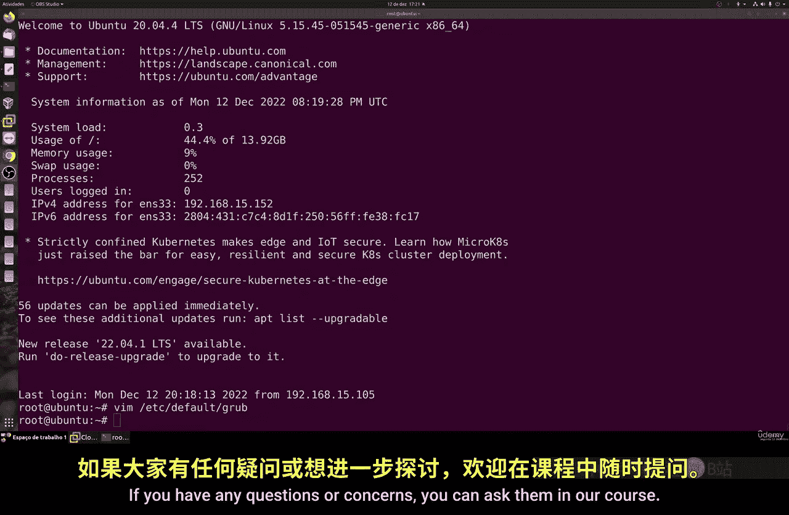

# 040：自定义GRUB第一部分 🛠️

在本节课中，我们将学习如何自定义GRUB引导加载程序。我们将逐步探索其配置文件，了解如何修改默认启动项、超时设置、分辨率等核心参数，并学习在修改时需要注意的重要事项。

## 概述GRUB配置文件

上一节我们介绍了GRUB的基本概念，本节中我们来看看其核心配置文件 `/etc/default/grub`。这是控制GRUB行为的主要文件。

### 默认启动内核

`GRUB_DEFAULT` 参数定义了系统默认启动的内核条目。其计数从0开始。例如，`GRUB_DEFAULT=0` 表示启动菜单中的第一个条目（通常是最新安装的内核）。

**公式：**
`GRUB_DEFAULT = 菜单项索引号`

Linux内核会频繁更新。系统升级时，可能会安装多个内核版本。你可以使用以下命令查看当前可用的内核及其顺序：

```bash
grep menuentry /boot/grub/grub.cfg
```

命令输出会显示类似 `0: Ubuntu, with Linux 5.15.0-xx-generic` 的列表，这里的数字就是索引号。

为什么需要选择旧内核？有时最新的内核可能与你的硬件（特别是NVIDIA或AMD显卡）或某些软件存在兼容性问题。此时，你可以将 `GRUB_DEFAULT` 设置为一个旧内核的索引号（例如 `3`），系统就会默认启动那个版本。

**重要提示：** 内核文件存储在 `/boot` 分区，该分区空间通常有限。如果不断安装新内核而不清理旧版本，可能会导致分区空间不足，引发系统启动问题。因此，只应在必要时才切换内核，并定期使用 `sudo apt autoremove` 等命令清理旧内核。

### 启动菜单超时设置

`GRUB_TIMEOUT` 参数控制GRUB菜单显示的时间（单位：秒）。

*   `GRUB_TIMEOUT=10`：菜单显示10秒，超时后自动启动默认项。
*   `GRUB_TIMEOUT=-1`：菜单将一直显示，**不会自动启动**，必须手动选择。

**警告：** 对于服务器或远程管理的机器，**切勿**将超时设置为 `-1`。否则重启后系统将卡在GRUB菜单，无法自动进入系统。此设置仅适用于需要频繁切换系统的本地设备（如双系统笔记本）。

### 内核启动参数

`GRUB_CMDLINE_LINUX_DEFAULT` 参数用于向内核传递默认的启动选项。这些选项会影响所有菜单条目。



例如，常见的 `quiet splash` 选项会隐藏启动时的详细文本信息，并显示图形化的启动画面（splash screen）。对于大多数用户，保持默认设置即可，无需修改。



### 控制台与终端设置

`GRUB_TERMINAL` 部分定义了GRUB使用的输出终端。通常不需要修改此设置。

## 调整GRUB界面分辨率

默认的GRUB界面分辨率可能较小。我们可以调整 `GRUB_GFXMODE` 参数来改善显示效果。

首先，我们需要知道你的显示器支持哪些分辨率。可以在GRUB命令行中查看：

1.  在GRUB菜单界面，按下 `c` 键进入命令行模式。
2.  输入命令 `videoinfo` 或 `set pager=1` 后输入 `videoinfo` 来查看支持的分辨率列表。

你会看到类似 `1024x768, 800x600, 640x480` 的输出。选择一个你的显示器支持且看起来舒适的分辨率。





然后，编辑 `/etc/default/grub` 文件，修改或添加以下行：



```bash
GRUB_GFXMODE=1024x768
```

你也可以设置为 `auto`，让GRUB自动选择最佳分辨率：

```bash
GRUB_GFXMODE=auto
```

修改后，**必须**运行以下命令更新GRUB配置，更改才会生效：



```bash
sudo update-grub
```



## 其他可选设置



以下是配置文件中其他一些可以关注的设置：

*   **禁用启动蜂鸣声：** 有些机器（特别是台式机和服务器）在启动时会发出“滴”的一声蜂鸣。如果你觉得烦人，可以取消 `GRUB_INIT_TUNE` 这一行的注释（删除行首的 `#`），并为其设置一个空值来禁用它。具体参数可以查阅文档。
*   **不要禁用恢复模式：** 配置文件中可能有关于恢复模式（recovery mode）的条目。**强烈建议不要禁用它们**。当系统出现问题时，恢复模式是重要的故障排查和修复工具。

## 总结

本节课中我们一起学习了GRUB引导加载程序的自定义基础。我们重点探讨了：
1.  **`GRUB_DEFAULT`**：如何设置默认启动的内核版本，并了解了多内核管理的注意事项。
2.  **`GRUB_TIMEOUT`**：如何设置启动菜单的等待时间，并强调了服务器环境不能设置为`-1`。
3.  **`GRUB_GFXMODE`**：如何查询显示器支持的分辨率并调整GRUB的界面大小。
4.  其他设置如启动参数和蜂鸣声的简要说明。



记住，修改 `/etc/default/grub` 文件后，**必须执行 `sudo update-grub` 命令**才能使更改生效。自定义GRUB时请谨慎操作，尤其是在生产服务器上。下一节，我们将继续探索GRUB的更高级自定义选项，如背景图片和字体。