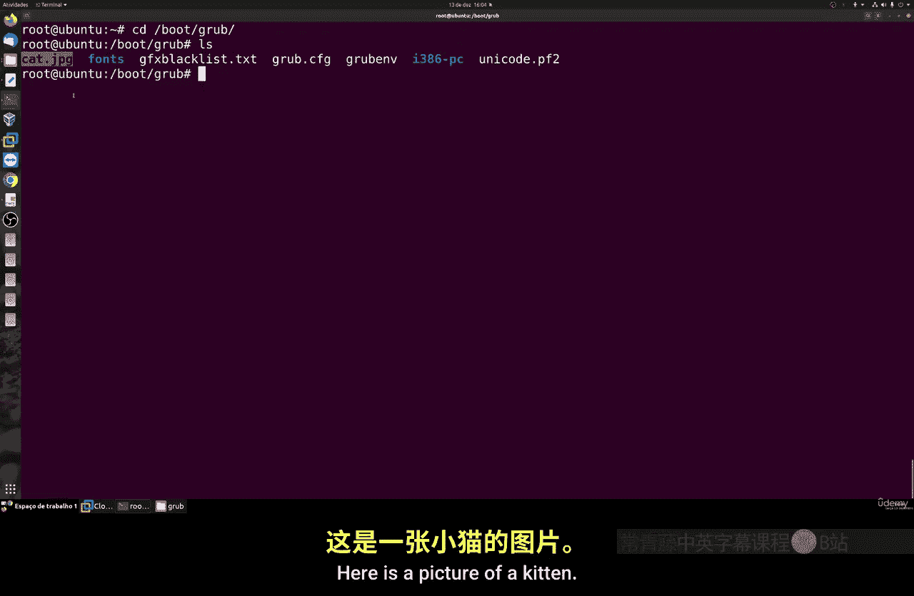
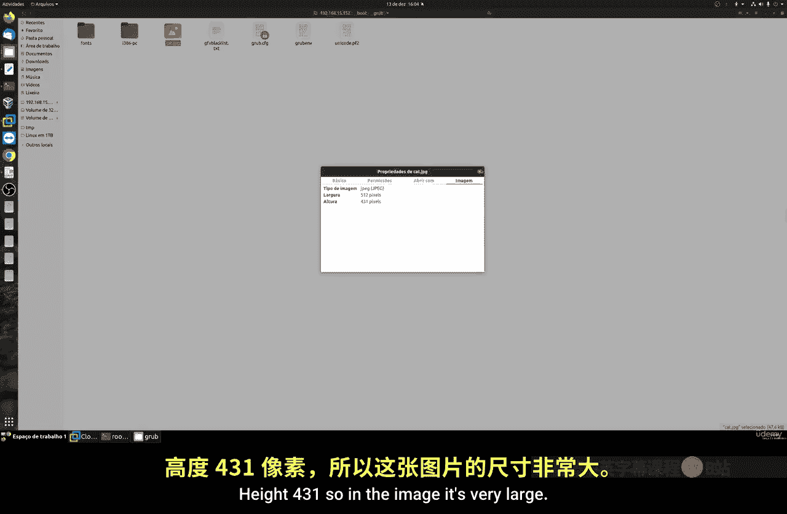
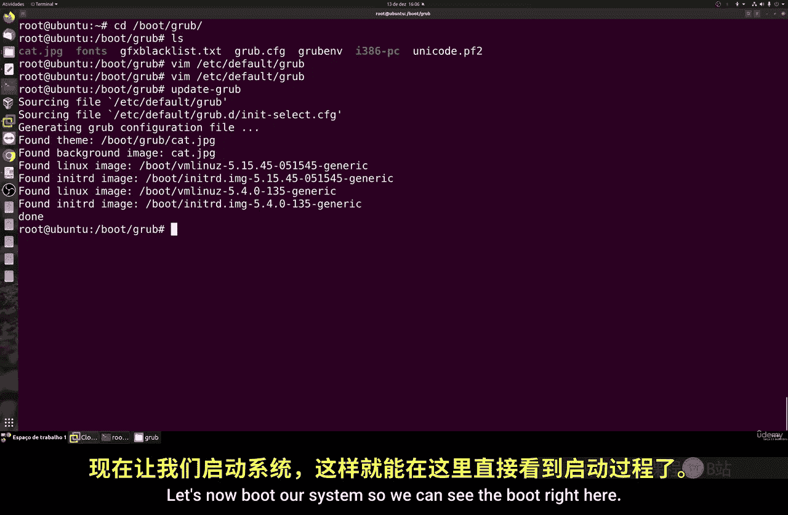
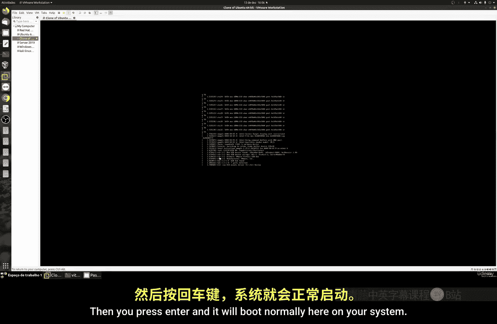
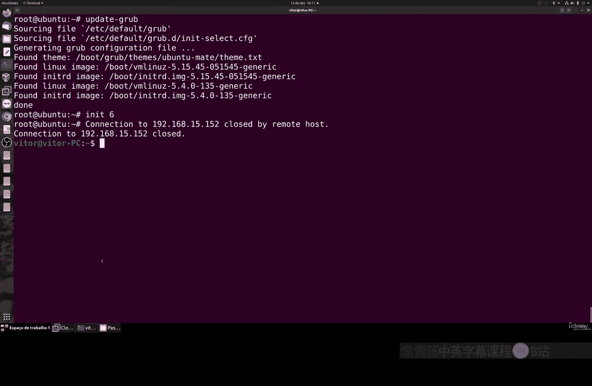
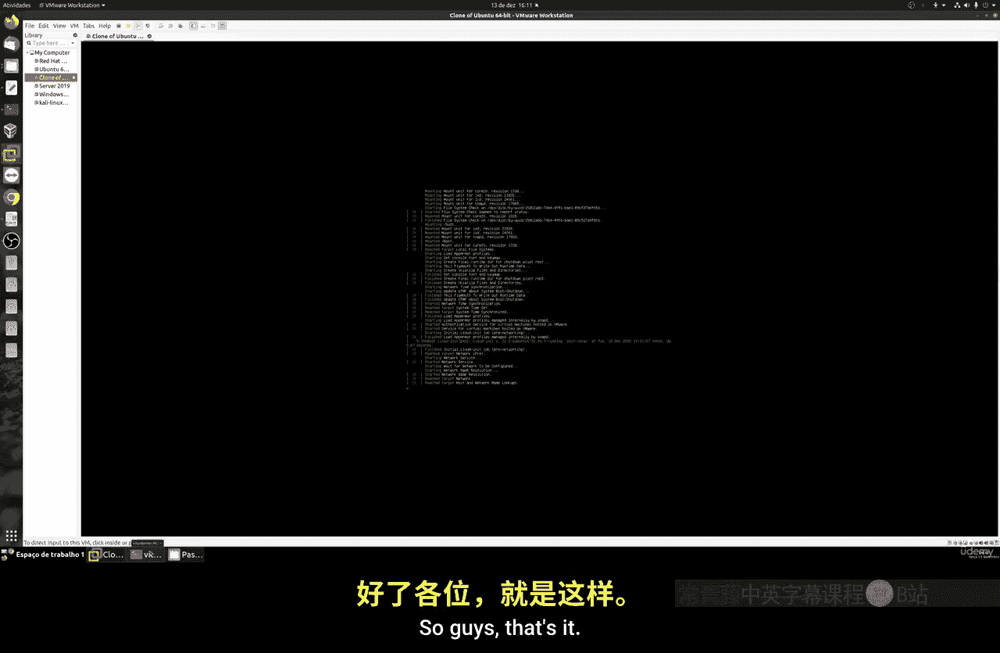
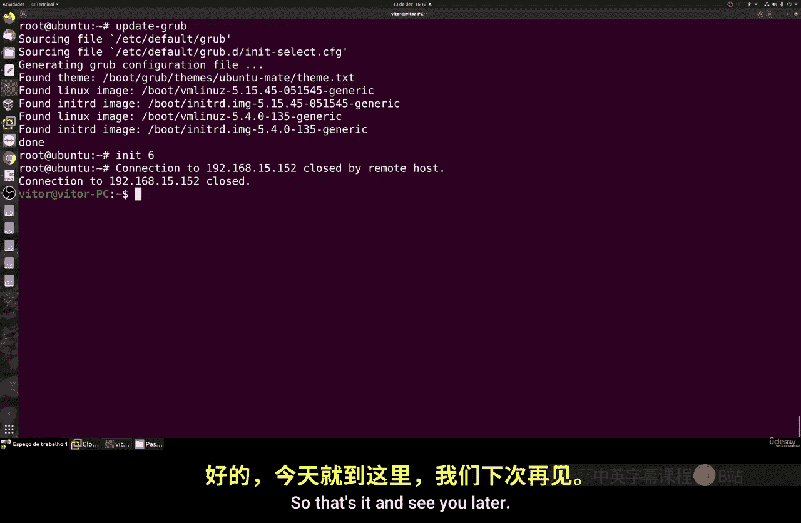

# 041：自定义GRUB第二部分 🎨

在本节课中，我们将学习如何个性化GRUB引导加载程序的外观。我们将重点介绍如何更改GRUB的背景图片以及如何安装和使用预制的GRUB主题。



上一节我们介绍了GRUB的一些基本设置，本节中我们来看看如何通过更换背景图片和应用主题来美化GRUB界面。



## 更改GRUB背景图片 🖼️

首先，我们学习如何更改GRUB的默认黑色背景图片。你可以使用任何你喜欢的图片，但需要确保它不会干扰菜单文字的阅读。





以下是更换背景图片的步骤：

1.  **准备图片**：确保图片格式为 **PNG**、**JPG** 或 **TIF**。其他格式的图片将无法使用。
2.  **放置图片**：将图片文件放入 `/boot/grub/` 目录中。你可以通过SCP、SSH、Samba等多种方式传输文件，或直接使用 `wget` 命令下载。
3.  **编辑配置文件**：使用文本编辑器（如 `nano` 或 `vim`）打开 `/etc/default/grub` 文件。
4.  **指定图片路径**：在配置文件中找到或添加 `GRUB_BACKGROUND` 选项，并将其值设置为图片的完整路径。例如：
    ```bash
    GRUB_BACKGROUND="/boot/grub/cat.jpg"
    ```
5.  **更新GRUB**：保存配置文件后，运行以下命令使更改生效：
    ```bash
    sudo update-grub
    ```
6.  **重启验证**：重启系统，在GRUB引导界面即可看到新的背景图片。

**注意**：建议选择对比度适中、不会干扰文字显示的图片。

## 应用GRUB主题 🎭

除了自定义背景，你还可以为GRUB安装完整的主题来改变其整体风格。对于Ubuntu及其衍生系统（如Linux Mint），这个过程相对简单。

以下是安装和应用GRUB主题的步骤：

1.  **搜索可用主题**：在终端中，你可以使用以下命令搜索可用的GRUB主题包：
    ```bash
    apt search grub-theme
    ```
2.  **安装主题**：选择一个你喜欢的主题进行安装。例如，安装Ubuntu MATE主题：
    ```bash
    sudo apt install grub2-theme-ubuntu-mate
    ```
3.  **定位主题文件**：安装后，主题文件通常位于 `/boot/grub/themes/` 目录下。每个主题都有一个 `theme.txt` 配置文件。
4.  **编辑配置文件**：再次打开 `/etc/default/grub` 文件。
5.  **指定主题路径**：找到或添加 `GRUB_THEME` 选项，将其值指向主题的 `theme.txt` 文件。例如：
    ```bash
    GRUB_THEME="/boot/grub/themes/ubuntu-mate/theme.txt"
    ```
6.  **更新GRUB**：保存更改并运行更新命令：
    ```bash
    sudo update-grub
    ```
7.  **重启验证**：重启系统以查看应用的新主题。



**重要提示**：请确保你使用的主题与你的系统版本兼容。使用不兼容的主题可能导致GRUB显示异常。建议从官方源或可信社区获取主题。





本节课中我们一起学习了如何通过更换背景图片和应用预制主题来个性化GRUB引导加载程序的外观。这些设置主要是为了美观，但能让你的系统启动过程更具个性。请记住，在修改系统关键组件如GRUB时，务必谨慎操作。