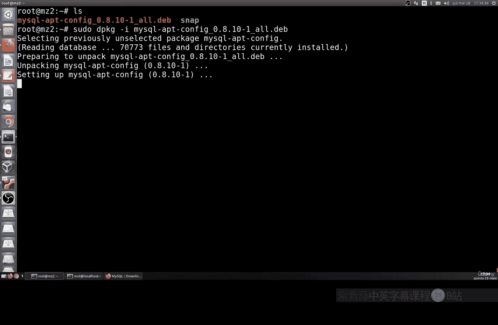
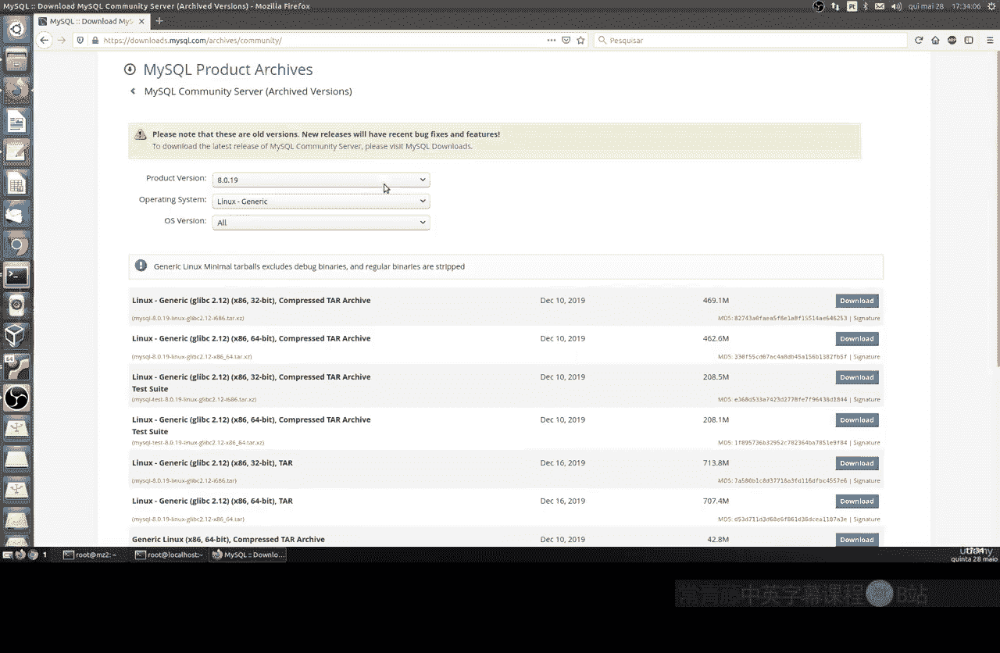
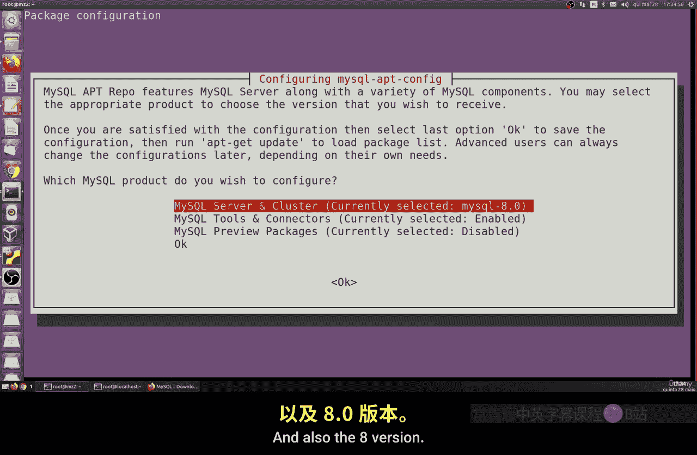
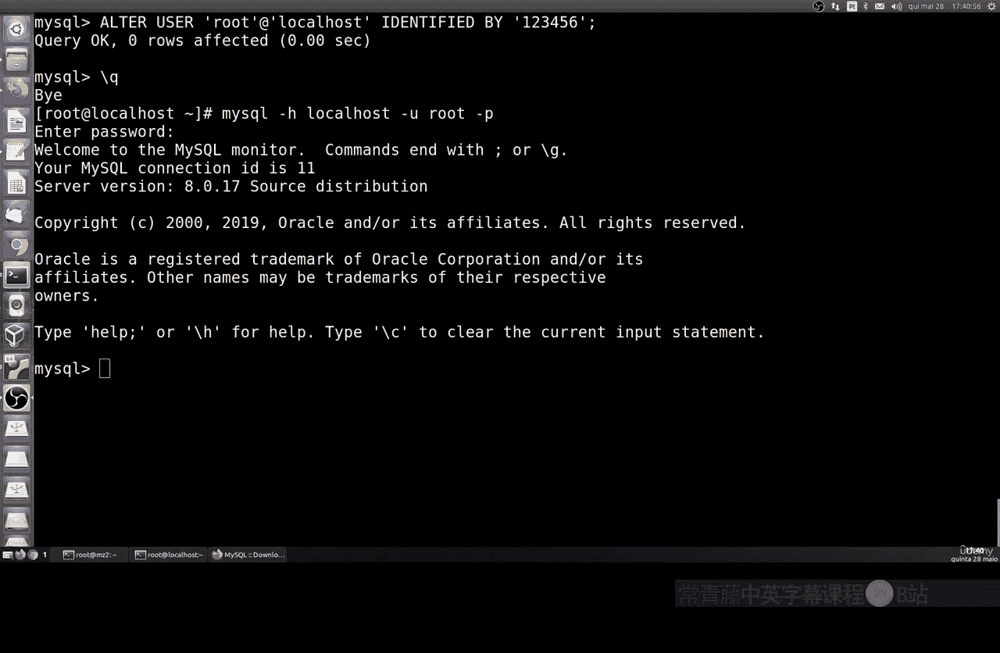

# 042：MySQL安装 🗄️

在本节课中，我们将学习如何在Ubuntu Server和CentOS系统上安装MySQL数据库。MySQL是一个功能强大、完全免费且高度可定制的数据库管理系统，非常适合在Linux服务器上运行。

Linux因其健壮性、免费和高度可定制性，是作为服务器的绝佳选择。你可以在虚拟机、实体机、大型服务器甚至树莓派（一种信用卡大小的微型计算机）上使用Linux。MySQL可以部署在本地或远程，安装过程非常简单。

## 官方资源与版本选择

以下是MySQL的官方下载页面，其中包含了适用于各种操作系统（如Microsoft Windows、Fedora、macOS、FreeBSD等）的安装版本。MySQL是完全开源的，拥有免费的许可证。


我们将选择MySQL 8.0版本进行安装。对于Ubuntu系统，我们将使用`.deb`包和`dpkg`工具进行安装。



在下载页面，你需要根据你的Ubuntu版本（如14、16、18、20等）选择对应的安装包。





## 在Ubuntu系统上安装MySQL


上一节我们介绍了准备工作，本节中我们来看看在Ubuntu上的具体安装步骤。

首先，更新系统软件包列表并安装MySQL服务器及其所有依赖项。安装过程会自动配置系统，通常很快就能完成。


```bash
sudo apt update
sudo apt install mysql-server
```

安装完成后，我们需要检查MySQL服务是否正在运行。

```bash
sudo systemctl status mysql
```

如果服务状态显示为“active (running)”，则表示MySQL已成功启动并运行。服务默认设置为开机自启。

接下来，我们登录到MySQL数据库。初始的root用户可能没有密码。

```bash
mysql -u root -p
```

按提示直接按回车键（如果未设置密码）。成功登录后，你将看到MySQL的命令行提示符。为了安全起见，建议立即修改root用户的密码。

```sql
ALTER USER 'root'@'localhost' IDENTIFIED BY '你的新密码';
```

## 在CentOS系统上安装MySQL

在Ubuntu上完成安装后，我们来看看在CentOS（或RHEL、Fedora等基于Red Hat的系统）上的安装过程。步骤同样非常直接。

首先，我们需要添加MySQL的官方仓库，然后安装MySQL服务器。

```bash
sudo yum localinstall https://dev.mysql.com/get/mysql80-community-release-el7-3.noarch.rpm
sudo yum install mysql-community-server
```

安装完成后，启动MySQL服务并设置开机自启。

```bash
sudo systemctl start mysqld
sudo systemctl enable mysqld
```

检查服务状态以确保其正常运行。

```bash
sudo systemctl status mysqld
```

服务运行后，我们可以登录MySQL。初始情况下，会生成一个临时密码，但为了演示，我们假设root用户无密码登录（具体取决于版本和安装方式）。

```bash
mysql -u root -p
```

按回车键尝试无密码登录。登录后，同样建议立即修改root用户密码。

```sql
ALTER USER 'root'@'localhost' IDENTIFIED BY '你的新密码';
```

此外，你还可以通过指定主机IP进行远程连接。

```bash
mysql -h 服务器IP地址 -u root -p
```

## 总结

本节课中我们一起学习了在Linux系统上安装MySQL数据库。我们分别演示了在Ubuntu和CentOS这两个主流发行版上的完整安装流程，包括更新系统、安装软件包、启动服务、验证状态以及初次登录和修改密码。安装过程简单明了，为后续深入学习MySQL数据库管理打下了基础。



