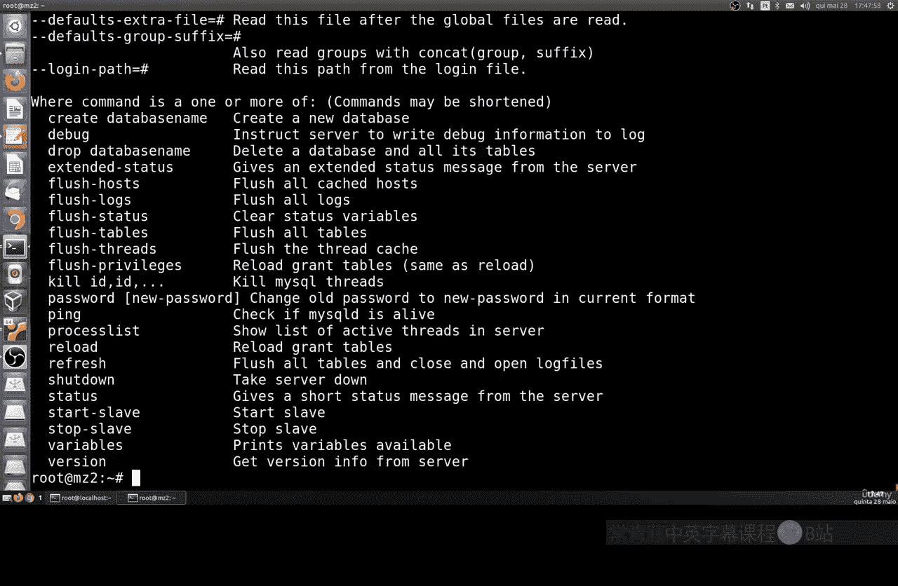
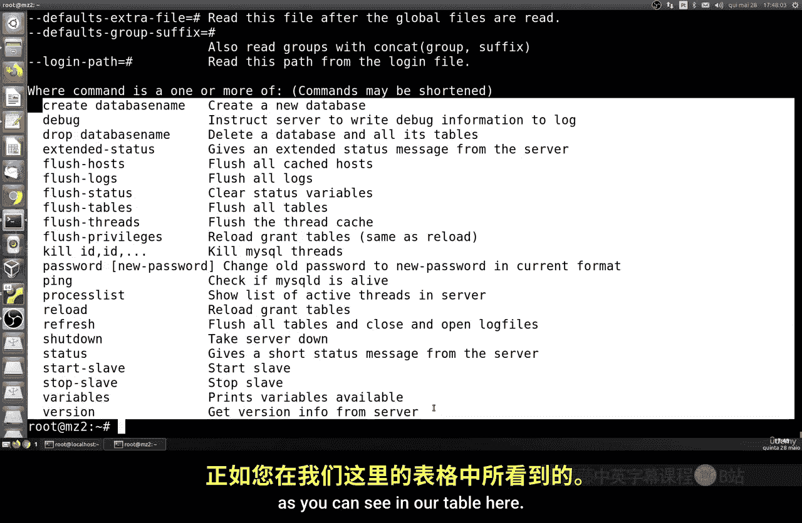
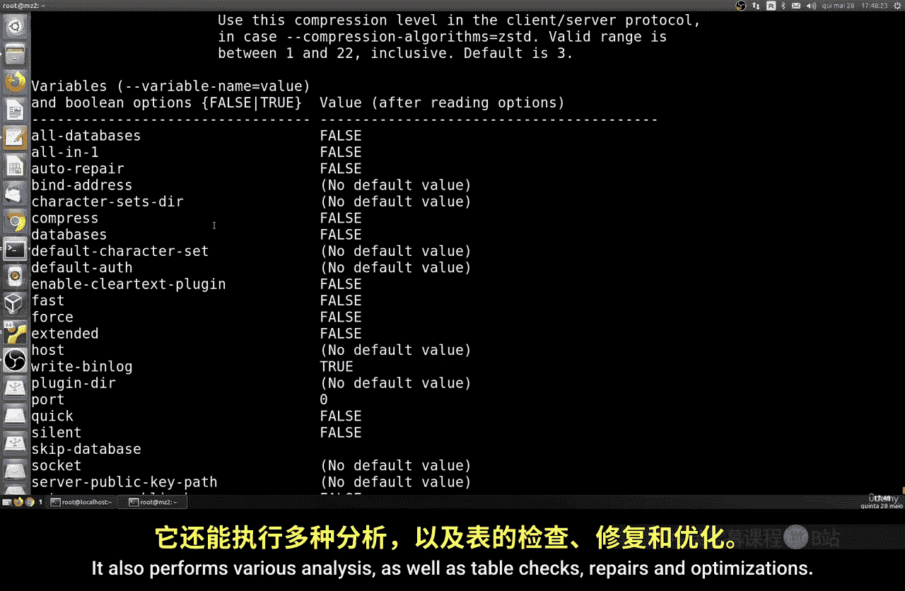
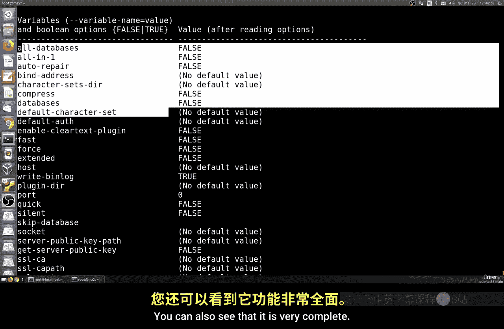

# 043：MySQL程序概览 🗂️

在本节课中，我们将学习MySQL安装后附带的各种实用程序。了解这些程序的功能，对于管理和维护MySQL数据库系统至关重要。

上一节我们介绍了MySQL的安装，本节中我们来看看安装后系统包含哪些主要程序。

## 服务器端程序

MySQL系统包含服务器端和客户端程序。它们可以运行在同一台机器上。以下是主要的服务器端启动和管理程序：

*   **`mysqld_safe`**：这是一个服务器启动脚本。它会尝试启动MySQL服务器守护进程（`mysqld`）。
*   **`mysqld`**：这是MySQL服务器守护进程本身，是数据库服务的核心程序。
*   **`mysqld_multi`**：这是一个用于启动多个MySQL服务器的程序脚本。如果你需要在一台机器上运行多个数据库实例，这个命令非常有用。

## 安全与配置工具

安装完成后，进行基本的安全配置非常重要。以下是相关的工具：

*   **`mysql_secure_installation`**：这是一个执行基本安全配置的命令。它会引导你完成一系列设置，例如：
    *   为`root`用户设置密码。
    *   移除匿名用户。
    *   禁止`root`用户远程登录。
    *   删除测试数据库（`test`）。
    *   重新加载权限表使更改立即生效。

*   **`mysql_ssl_rsa_setup`**：此程序用于生成SSL证书、密钥和密钥对文件，以支持MySQL的安全连接。

*   **`mysql_tzinfo_to_sql`**：此程序用于加载主机系统的时区信息到MySQL数据库中。

## 客户端与管理程序

客户端程序用于连接服务器并执行操作。以下是重要的客户端工具：

*   **`mysql`**：这是最常用的MySQL命令行客户端，用于连接`mysqld`服务器并执行SQL命令。
*   **`mysqladmin`**：这是一个客户端管理程序，用于执行各种管理操作，例如：
    *   创建或删除数据库。
    *   重新加载权限表。
    *   重新打开日志文件。
*   **`mysqlcheck`**：此程序用于表维护，可以执行分析、检查、修复和优化表的操作。
*   **`mysqldump`**：这是一个备份程序，可以将数据库转储为SQL文本、XML或其他格式。可以备份单个数据库、多个数据库或特定表。
*   **`mysqlimport`**：此程序使用`LOAD DATA INFILE`语句，将文本文件导入到对应的数据库表中。
*   **`mysqlshow`**：此程序用于快速查看数据库、表、列和索引的信息。

## 测试与诊断工具

以下工具用于测试服务器性能和诊断问题：

*   **`mysqlslap`**：此程序用于模拟多个客户端并发访问服务器，以测试服务器的负载能力。
*   **`mysqlbinlog`**：此程序用于查看和处理MySQL的二进制日志文件。
*   **`mysqldumpslow`**：此程序用于解析和汇总MySQL的慢查询日志，帮助找出执行缓慢的SQL语句。

## 其他实用程序

还有一些其他的实用程序：

*   **`innochecksum`**：用于离线检查InnoDB文件。
*   **`myisamchk`**：用于描述、检查、优化和修复MyISAM表。
*   **`myisamlog`**：用于处理MyISAM日志文件。
*   **`myisampack`**：用于生成压缩的、只读的MyISAM表，以节省空间。
*   **`mysql_config_editor`**：此程序允许将登录认证信息（如用户名和密码）加密存储在一个名为`.mylogin.cnf`的文件中。

本节课中我们一起学习了MySQL安装后附带的主要程序，包括服务器启动工具、安全配置工具、客户端管理工具以及测试诊断工具。理解这些工具的功能，是有效管理和维护MySQL数据库的基础。下一节课，我们将开始学习如何使用这些工具进行实际操作。