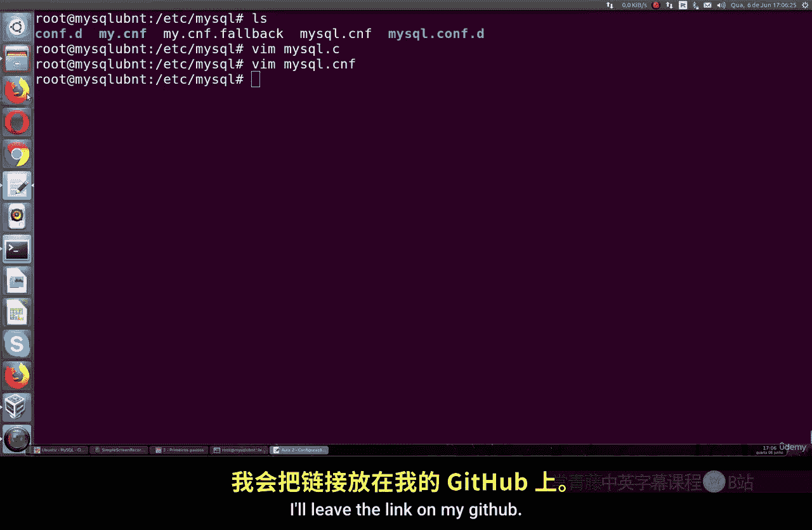
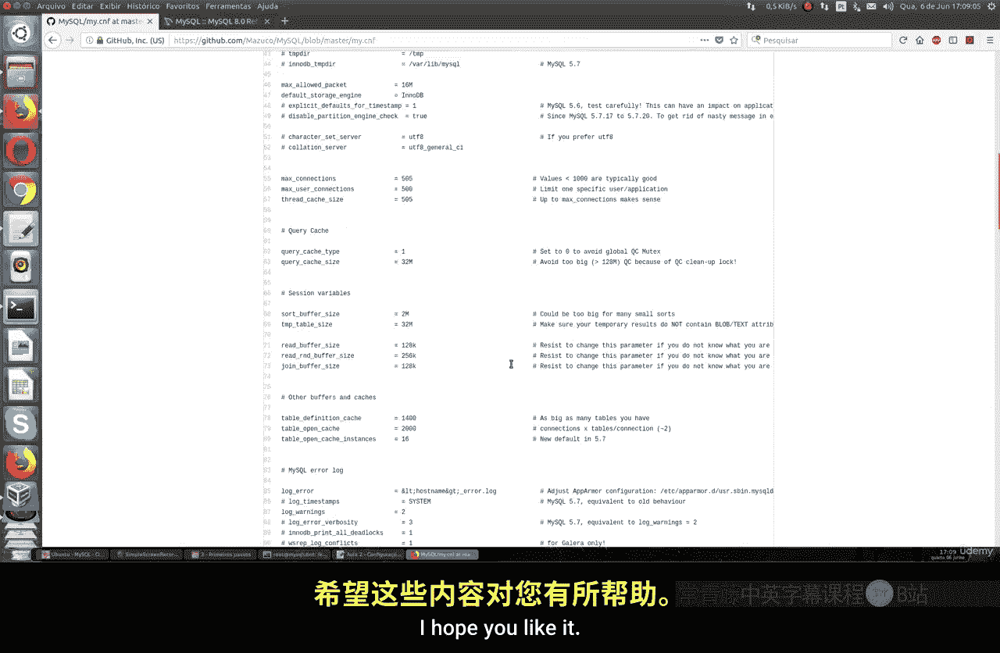
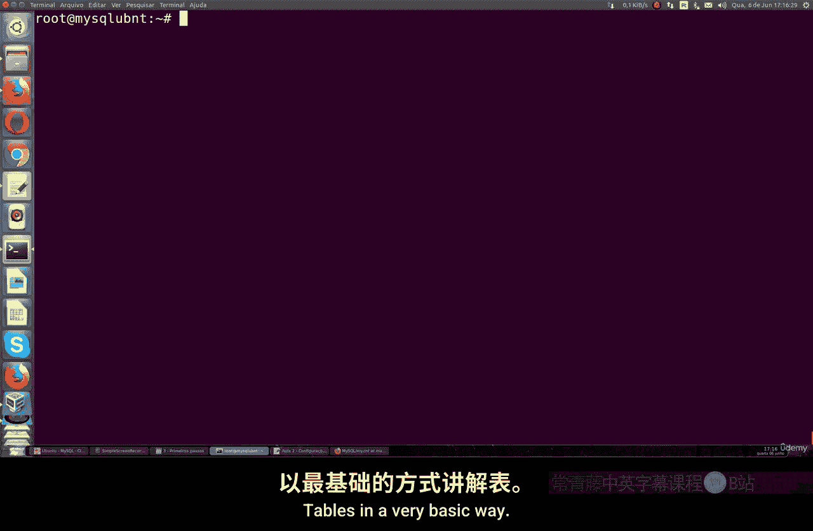

# 044：安装后设置 🔧

在本节课中，我们将学习在Linux系统上完成MySQL安装后，如何进行一些基础的配置。这包括了解配置文件的位置、修改基本设置、管理用户权限等操作。

## 配置文件位置与结构

上一节我们介绍了MySQL的安装，本节中我们来看看如何找到并理解其配置文件。

MySQL在Linux上的主要配置文件位于 `/etc/mysql/` 目录下。核心配置文件是 `my.cnf`。你可以在此文件中进行各种设置。



安装完成后，MySQL会使用默认配置，例如：
*   数据库文件的存储目录
*   日志文件的存储路径
*   Socket文件的位置（通常在 `/run` 目录下）

以下是查看配置文件目录的命令：
```bash
cd /etc/mysql/
ls -la
```
在该目录下，你可能会看到其他配置文件，例如针对特定用途的配置片段。这些文件可能包含更多全局性或细节性的设置。

## 核心配置参数

配置文件中有许多被注释掉的参数，你可以根据需要取消注释并进行修改。以下是一些关键配置项：

*   **端口与Socket**：可以更改MySQL服务的监听端口和Socket文件路径。
*   **客户端配置**：涉及 `mysql` 命令行客户端的部分设置。
*   **数据包大小**：使用 `mysqldump` 命令时可转储的最大数据包大小，由 `max_allowed_packet` 参数控制。
*   **连接数**：通过 `max_connections` 参数设置服务器允许的最大并发连接数。
*   **缓存与缓冲区**：例如 `query_cache_size`（查询缓存）和 `innodb_buffer_pool_size`（InnoDB缓冲池大小），正确配置它们对性能至关重要。
*   **日志**：错误日志、慢查询日志等的位置和级别也可以在此配置。

**注意**：部分配置参数可能因MySQL版本（如5.6、5.7或8.0）而异。修改前，请务必查阅对应版本的官方文档以确认参数是否可用。

## 应用配置更改



修改配置文件后，需要重启MySQL服务才能使更改生效。

使用以下命令重启服务：
```bash
systemctl restart mysql
```
在进行任何配置变更后，都建议执行此操作。

## 管理用户与权限

了解基本配置后，我们来看看如何管理数据库用户。

### 修改root用户密码

安装后，你可能需要修改root用户的密码。可以使用 `mysqladmin` 工具来完成。

使用以下命令修改root密码（示例中将密码改为 `123456`）：
```bash
mysqladmin -u root -p password '123456'
```
系统会提示你输入当前密码，然后进行更改。请注意，在命令行中直接输入密码可能存在安全风险，但在本地或SSL连接环境下通常可以接受。

### 查看现有用户

在开始创建数据库和表之前，可以先查看系统中已存在的用户。

无需进入MySQL交互界面，可以直接在系统命令行执行以下命令：
```bash
mysql -u root -p -e "SELECT user, host FROM mysql.user;"
```
这条命令会列出所有MySQL用户及其允许登录的主机。

### 创建新用户并授权

默认的root用户权限过高。通常我们需要创建普通用户并授予特定权限。

首先，进入MySQL交互界面：
```bash
mysql -u root -p
```

然后，执行以下步骤：

1.  **创建用户**：创建一个名为 `test`，只能从本地主机登录，密码为 `test` 的用户。
    ```sql
    CREATE USER 'test'@'localhost' IDENTIFIED BY 'test';
    ```

2.  **授予权限**：新创建的用户默认没有任何权限。需要为其授予特定数据库的访问权限。例如，授予 `test` 用户对 `mydatabase` 数据库的所有权限。
    ```sql
    GRANT ALL PRIVILEGES ON mydatabase.* TO 'test'@'localhost';
    ```

3.  **刷新权限**：使授权立即生效。
    ```sql
    FLUSH PRIVILEGES;
    ```

你也可以创建允许从特定网络或域名登录的用户，只需将 `'localhost'` 替换为相应的IP地址段或主机名即可。

创建和授权后，可以再次使用 `SELECT user, host FROM mysql.user;` 命令来验证用户是否已成功添加。

## 总结



本节课中我们一起学习了MySQL安装后的基础设置。我们了解了核心配置文件 `my.cnf` 的位置与常见参数，学会了如何修改配置并重启服务。同时，我们也掌握了管理用户的基础操作：包括修改root密码、查看用户列表以及创建新用户并授予数据库权限。这些是进行后续数据库操作的“ABC”基础。在接下来的课程中，我们将继续学习如何创建数据库和表。