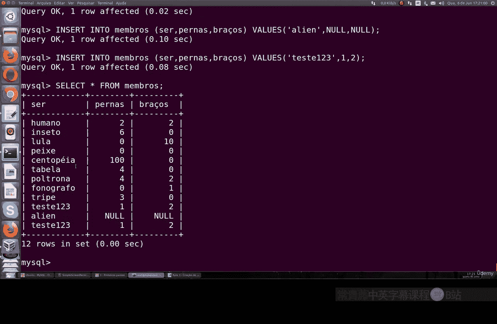
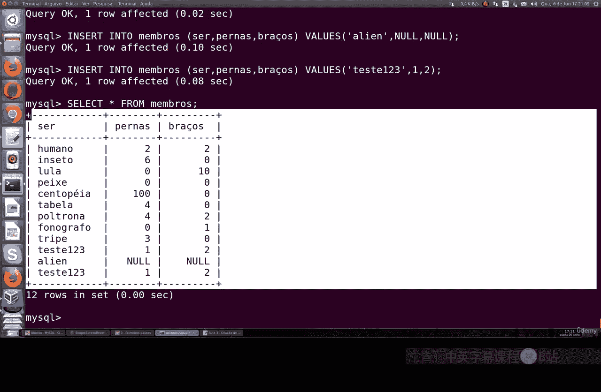

# 045：创建数据库及其表 🗄️

在本节课中，我们将学习如何在MySQL中创建数据库和表，以及进行基本的数据插入和备份操作。整个过程将使用纯SQL命令完成。

## 登录与查看数据库

首先，我们需要以root用户身份登录MySQL。

登录后，第一件事是查看当前已有的数据库。可以使用 `SHOW DATABASES;` 命令。请注意，SQL命令通常以分号结尾。

```sql
SHOW DATABASES;
```

执行该命令后，你会看到一些默认创建的数据库。安装MySQL时，系统会自动生成这些数据库。

## 创建新数据库

在MySQL中，你可以根据需要创建任意数量的数据库。创建数据库的命令非常简单。

```sql
CREATE DATABASE test;
```

这条命令将创建一个名为 `test` 的数据库。之后，你可以为需要的用户授予该数据库的访问权限。

## 在数据库中创建表

创建数据库后，你可以在其中创建表。使用 `CREATE TABLE` 命令来定义表的结构。

以下是创建一个简单表的示例。该表名为 `members`，包含两列：`name`（可变字符，最大长度20）和 `legs`（整数类型）。

```sql
CREATE TABLE members (
    name VARCHAR(20),
    legs INT
);
```

执行后，表就创建好了。你可以使用 `SELECT` 命令查看表中的数据。由于是新表，目前还没有任何记录。



```sql
SELECT * FROM members;
```



## 向表中插入数据

表创建好后，我们可以向其中插入数据。使用 `INSERT INTO` 命令。

例如，向 `members` 表插入一条记录：

```sql
INSERT INTO members (name, legs) VALUES (‘human being’, 2);
```

插入后，再次使用 `SELECT` 命令，就能看到这条数据了。

你可以插入任意多的数据，只要遵守列定义的数据类型和约束。例如，也可以插入 `NULL` 值或重复的值，因为我们没有设置主键约束。

```sql
INSERT INTO members (name, legs) VALUES (NULL, NULL);
INSERT INTO members (name, legs) VALUES (‘human being’, 2); -- 重复插入
```

## 使用SQL文件操作

为了便于管理和重复操作，我们可以将一系列SQL命令写入一个 `.sql` 文件。

例如，创建一个名为 `members.sql` 的文件，内容如下。这段代码会先检查并删除已存在的 `members` 表，然后重新创建它并插入数据。

```sql
DROP TABLE IF EXISTS members;
CREATE TABLE members (
    name VARCHAR(20),
    legs INT
);
INSERT INTO members (name, legs) VALUES (‘human being’, 2);
```

然后，在MySQL中执行这个文件：

```bash
mysql -u root -p test < members.sql
```

执行后，可以进入MySQL验证 `members` 表是否已按文件中的定义被更新。

## 备份数据库

对数据库进行备份是一项重要操作。在MySQL中，可以使用 `mysqldump` 工具。

例如，备份 `test` 数据库到 `backup.sql` 文件：

```bash
mysqldump -u root -p test > backup.sql
```

生成的 `backup.sql` 文件包含了重建数据库和表结构以及所有数据所需的SQL命令。`mysqldump` 命令有很多配置选项，你可以通过 `mysqldump --help` 查看所有可用选项。

---


本节课中，我们一起学习了MySQL的基础操作：包括登录、查看数据库、创建数据库和表、插入数据、通过SQL文件执行命令以及使用 `mysqldump` 进行数据库备份。这些都是进行数据库管理的核心第一步。