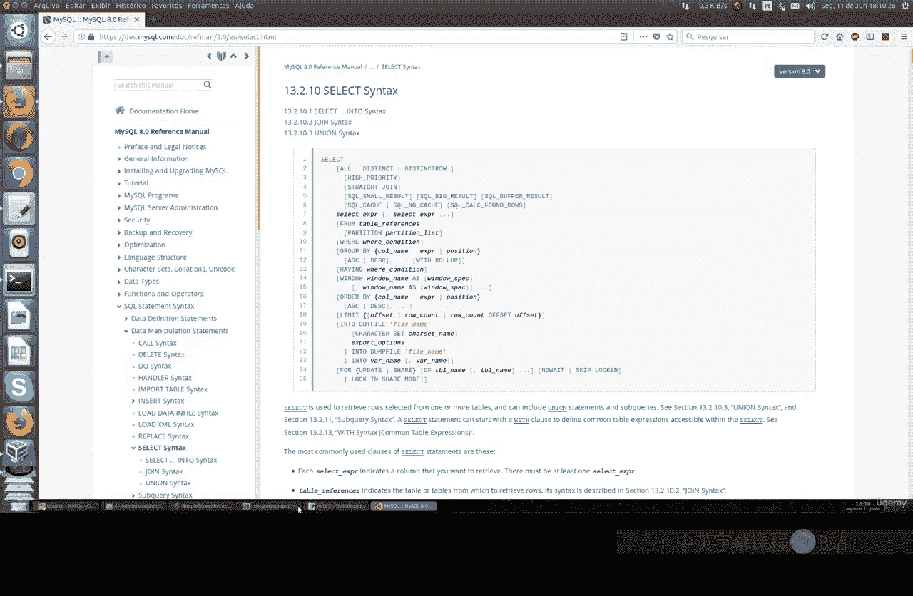
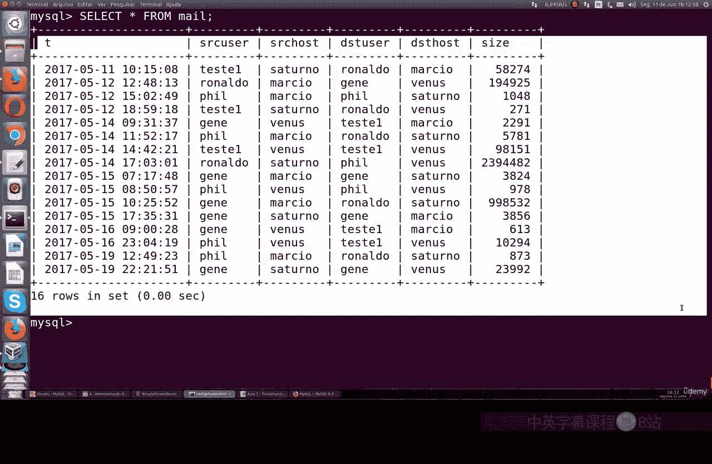
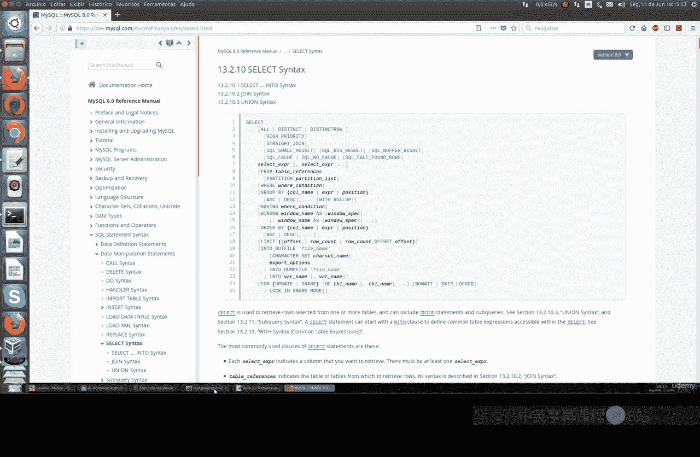
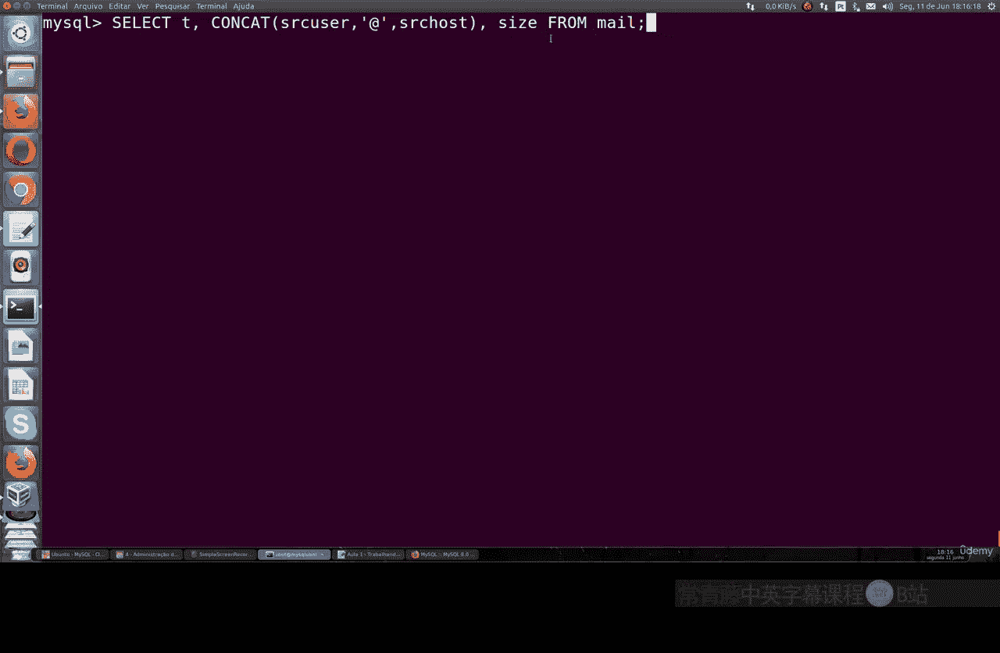
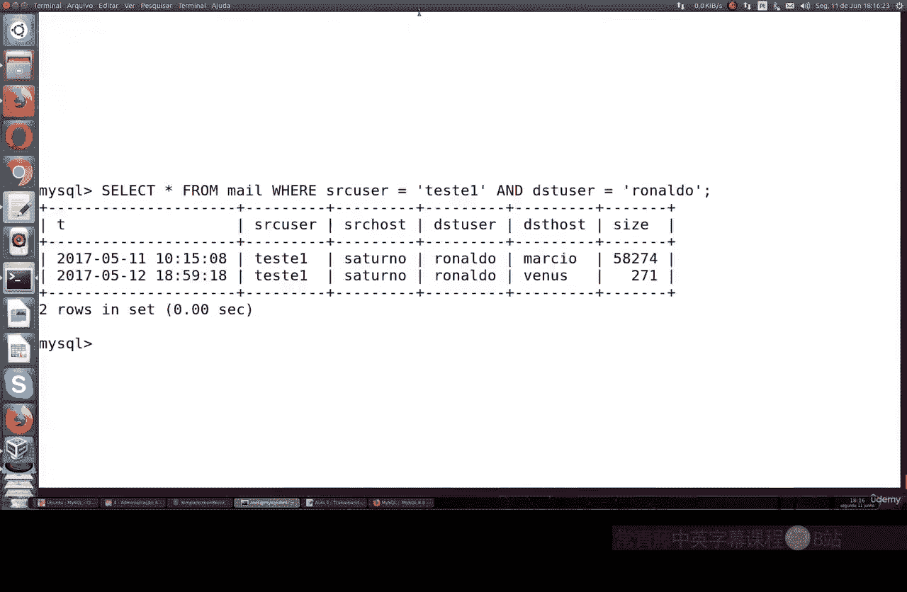
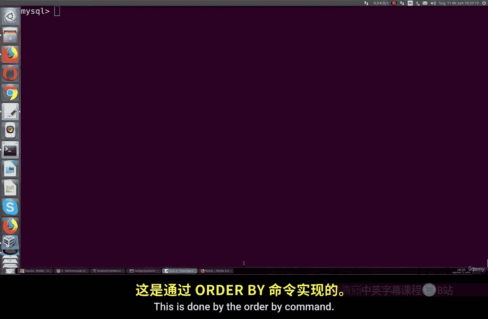
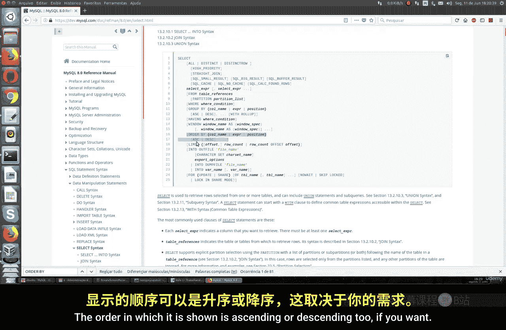
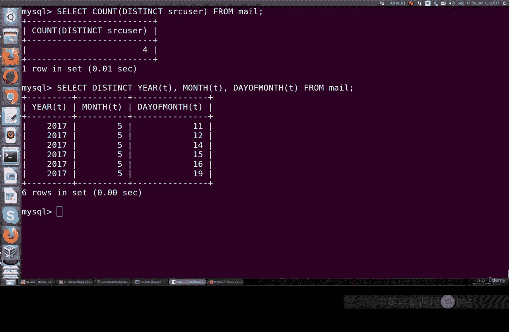
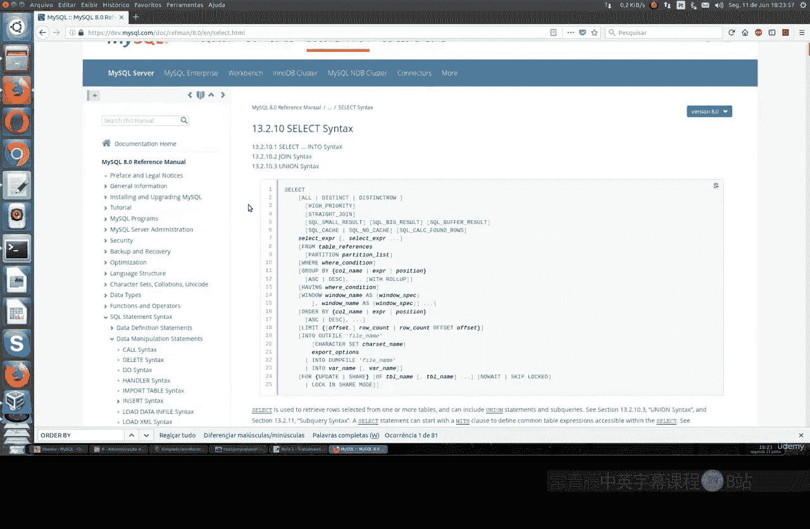

# 046：SELECT 命令详解 🗃️

在本节课中，我们将学习 MySQL 中 `SELECT` 命令的使用。`SELECT` 是数据库中最常用的命令之一，它是一种查询命令，拥有多种参数和选项。我们将重点介绍课程中最常用的部分。如果你想了解更多信息，可以访问 MySQL 官方文档查看完整的 `SELECT` 语法。

## 准备数据



首先，我们需要导入一个数据库。我们将从 GitHub 导入一个 SQL 文件。

```bash
wget [GitHub文件URL]
ls
```

下载的 `.sql` 文件将在 `test` 数据库中创建一个名为 `mail` 的表。该表包含以下列：
*   `dt`：`DATETIME` 类型，表示服务器的日期和时间。
*   `srcuser`：`VARCHAR` 类型，源用户。
*   `srchost`：`VARCHAR` 类型，源主机。
*   `dstuser`：`VARCHAR` 类型，目标用户。
*   `dsthost`：`VARCHAR` 类型，目标主机。
*   `size`：`INT` 类型，邮件大小。
*   `dt` 列是主键索引，用于搜索。由于日期时间值都是唯一的，这非常适合作为索引。

接下来，我们进入 MySQL 并查看数据。

```sql
-- 进入 MySQL 命令行
mysql -u root -p

-- 显示所有数据库
SHOW DATABASES;

-- 使用 test 数据库
USE test;

-- 显示数据库中的所有表
SHOW TABLES;
```

## 基础 SELECT 查询




上一节我们导入了数据，本节中我们来看看最基本的 `SELECT` 命令。

最基本的用法是查询表中的所有数据：

```sql
SELECT * FROM mail;
```

`*` 表示选择所有列。执行后会显示 `mail` 表的全部内容。

如果你想选择特定的列，可以列出列名，并用逗号分隔：

```sql
SELECT srcuser, srchost FROM mail;
```

列将按照你在命令中指定的顺序显示。这是一种排除不需要列并进行针对性查询的简单方法。

## 使用 WHERE 子句进行条件筛选

基础查询可以获取所有数据，但通常我们需要查找特定信息。这时就需要 `WHERE` 子句。

`WHERE` 子句用于指定查询条件，以获取更具体的内容。

以下是 `WHERE` 子句的使用示例：


1.  **精确匹配**：查找 `srchost` 列等于 `'venus'` 的所有行。
    ```sql
    SELECT srcuser, srchost FROM mail WHERE srchost = 'venus';
    ```



2.  **模糊匹配**：使用 `LIKE` 操作符和通配符 `%`。查找 `srchost` 包含 `'saturn'` 的所有行。
    ```sql
    SELECT * FROM mail WHERE srchost LIKE '%saturn%';
    ```



3.  **多条件组合**：使用 `AND` 连接多个条件。查找同时满足 `srcuser` 为 `'tricia'` **且** `dstuser` 为 `'rinaldo'` 的行。
    ```sql
    SELECT * FROM mail WHERE srcuser = 'tricia' AND dstuser = 'rinaldo';
    ```
    只有同时满足两个条件的行才会被返回。



## 使用 CONCAT 函数拼接字段

除了筛选，我们还可以在查询时对数据进行处理和格式化。`CONCAT` 函数用于连接两个或多个字符串。

例如，我们可以模拟一个电子邮件地址：

```sql
SELECT dt, CONCAT(srcuser, '@', srchost) AS email_address FROM mail;
```

在这个例子中：
*   `CONCAT(srcuser, '@', srchost)` 将 `srcuser`、`@` 符号和 `srchost` 连接成一个新的字符串。
*   `AS email_address` 为这个新生成的列设置了一个别名。

## 使用别名和 DATE_FORMAT 函数

我们可以使用别名（`AS`）来改变查询结果中列的名称，使其更易读。同时，`DATE_FORMAT` 函数可以用于格式化日期时间列的显示方式。

以下是一个综合示例：

```sql
SELECT
  DATE_FORMAT(dt, '%d-%m-%Y') AS shipping_date,
  CONCAT(srcuser, '@', srchost) AS sender,
  size / 1024 AS size_kb
FROM mail;
```

在这个命令中：
*   `DATE_FORMAT(dt, '%d-%m-%Y')` 将 `dt` 列格式化为 “日-月-年” 的形式，并重命名为 `shipping_date`。
*   `CONCAT(srcuser, '@', srchost)` 生成发件人邮箱，并重命名为 `sender`。
*   `size / 1024` 将字节大小转换为千字节（KB），并重命名为 `size_kb`。

**请注意**：这些操作仅改变查询结果的显示，并不会修改原始表中的任何数据。

## 使用 ORDER BY 排序结果

处理后的数据可能需要按特定顺序查看。`ORDER BY` 子句用于对结果集进行排序。

默认排序是升序（`ASC`），也可以指定降序（`DESC`）。



以下是排序示例：



1.  **多列排序**：先按 `srchost` 升序排，再按 `srcuser` 升序排。
    ```sql
    SELECT * FROM mail WHERE dstuser = 'rinaldo' ORDER BY srchost, srcuser;
    ```

2.  **降序排序**：按 `size` 列从大到小降序排列。
    ```sql
    SELECT * FROM mail ORDER BY size DESC;
    ```

## 使用 COUNT 和 DISTINCT 处理重复数据

最后，我们来看看如何统计和识别唯一数据。`COUNT` 函数用于计数，`DISTINCT` 关键字用于返回唯一不同的值。

有时数据会有重复项。例如，`srcuser` 列中可能有多个相同的用户名。

以下是相关操作：

1.  **统计总行数**：
    ```sql
    SELECT COUNT(*) FROM mail;
    ```

2.  **统计某列不重复值的数量**：使用 `COUNT(DISTINCT column)`。
    ```sql
    SELECT COUNT(DISTINCT srcuser) FROM mail;
    ```
    这将返回 `srcuser` 列中不同用户名的数量。

3.  **查看所有不重复的值**：直接使用 `DISTINCT`。
    ```sql
    SELECT DISTINCT srcuser FROM mail;
    ```
    这将列出 `srcuser` 列中所有唯一的用户名。

`DISTINCT` 也可以用于多列，以返回多列组合的唯一值。



## 总结

本节课中我们一起学习了 MySQL `SELECT` 命令的核心用法。我们涵盖了从基础数据查询、使用 `WHERE` 子句进行条件筛选，到使用 `CONCAT` 和 `DATE_FORMAT` 函数格式化输出，以及利用 `ORDER BY` 排序和 `COUNT`、`DISTINCT` 处理数据统计与去重。




`SELECT` 命令功能非常强大，还有更多高级用法如 `JOIN`（连接表）等，我们将在后续课程中深入探讨。掌握这些基础是有效使用 MySQL 进行数据检索和分析的关键。