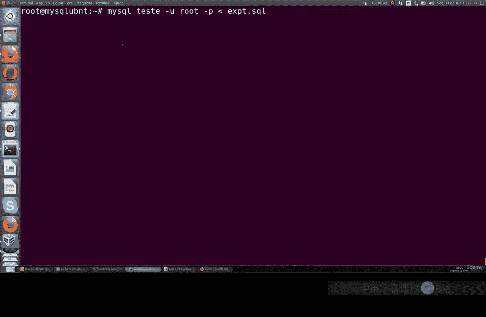
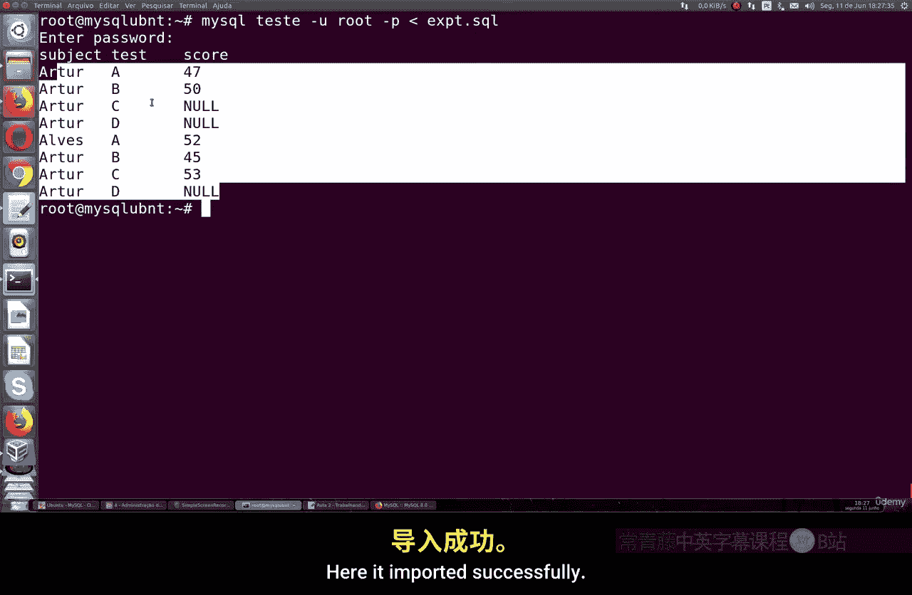
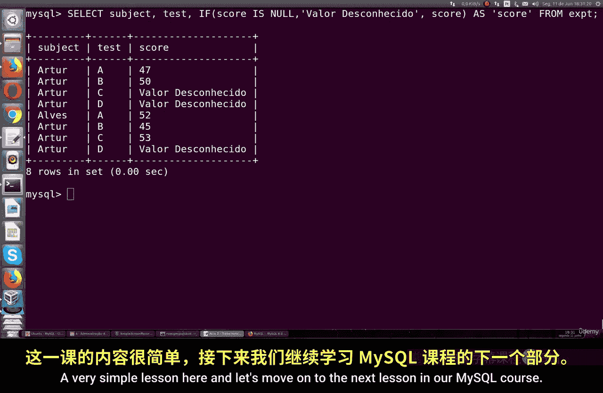

# 047：处理空值 🧩

在本节课中，我们将学习如何在MySQL中处理空值。我们将理解空值、非空值和零值之间的区别，并掌握查询和表示空值的正确方法。

---

## 理解空值

上一节我们介绍了基本的查询操作，本节中我们来看看一种特殊的数据类型：空值。

空值代表未知的值。它既不是真也不是假。如果你试图比较一个空值，你无法确定它是否等于另一个值。



为了更清楚地理解，我们需要导入一个SQL文件到测试数据库中。这个文件会创建一个包含空值数据的新表。



---

## 导入与查看数据

以下是导入SQL文件并查看数据的步骤：

1.  首先，我们导入准备好的SQL文件到名为 `test` 的数据库中。
2.  导入成功后，我们连接到MySQL并查看新表 `Ex` 中的数据。

执行查询 `SELECT * FROM Ex;` 后，我们可以看到表中包含一些空值记录。


---

## 查询空值

空值与数字0不同，它们是未知值，因此不能使用普通的比较运算符（如 `=` 或 `!=`）进行查询。

例如，以下查询无法找到空值记录：
```sql
SELECT * FROM Ex WHERE score = NULL; -- 错误，不会返回结果
SELECT * FROM Ex WHERE score != NULL; -- 错误，不会返回结果
```

在MySQL中，查询空值必须使用特定的操作符 `IS NULL` 或 `IS NOT NULL`。

以下是正确的查询语法：
```sql
-- 查找 score 列为空值的记录
SELECT * FROM Ex WHERE score IS NULL;

-- 查找 score 列不为空值的记录
SELECT * FROM Ex WHERE score IS NOT NULL;
```

---

## 使用别名美化输出

默认情况下，查询结果中空值会直接显示为 `NULL`。为了使结果对用户或应用程序更友好，我们可以使用 `IFNULL()` 函数和别名来替换这个显示值。

`IFNULL()` 函数的语法是：
```
IFNULL(column_name, replacement_value)
```
如果 `column_name` 的值为空，则返回 `replacement_value`；否则返回原值。

我们可以结合别名来美化输出：
```sql
SELECT name, IFNULL(score, ‘未知分数’) AS ‘分数’ FROM Ex;
```
这条命令会将 `score` 列中的 `NULL` 值显示为“未知分数”，使结果更易读。

---

## 课程总结

本节课中我们一起学习了MySQL中空值的处理方法。我们明确了空值代表未知数据，不能使用等号进行比较。我们掌握了使用 `IS NULL` 和 `IS NOT NULL` 操作符来正确查询空值与非空值。最后，我们还学会了使用 `IFNULL()` 函数和别名来替换输出结果中的空值，使数据展示更加清晰和用户友好。



