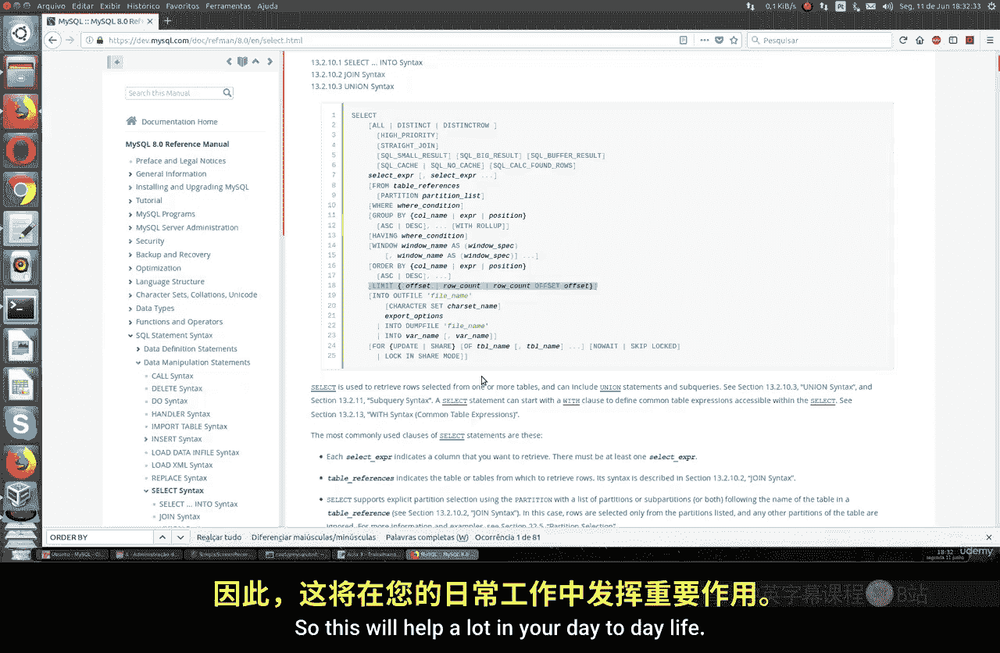
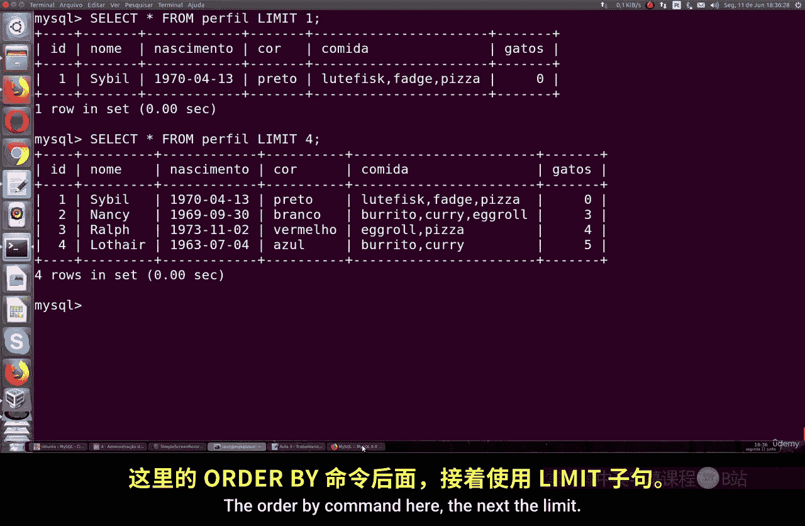
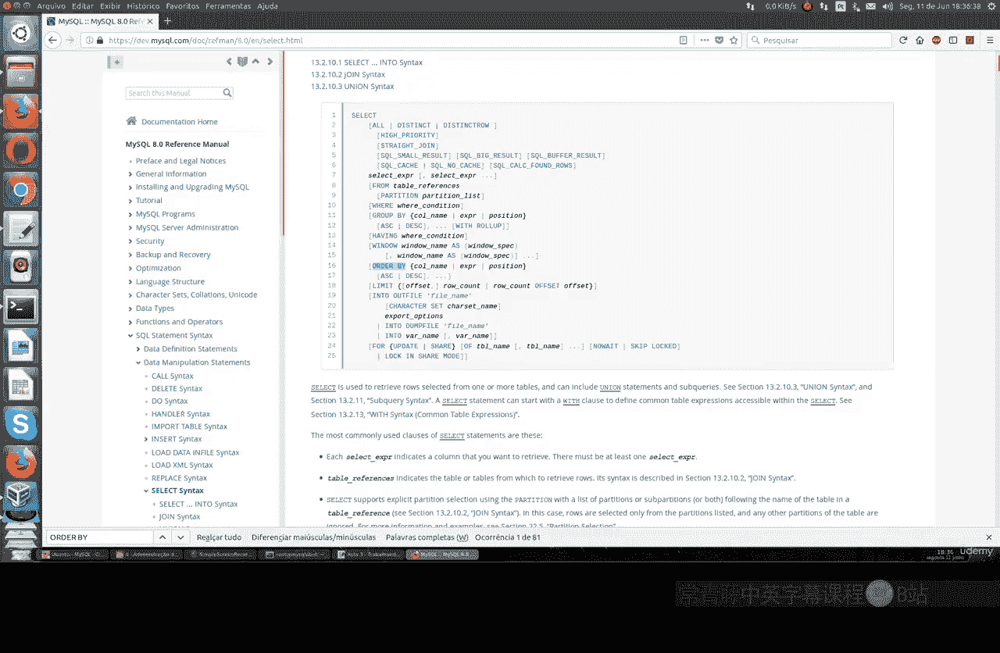
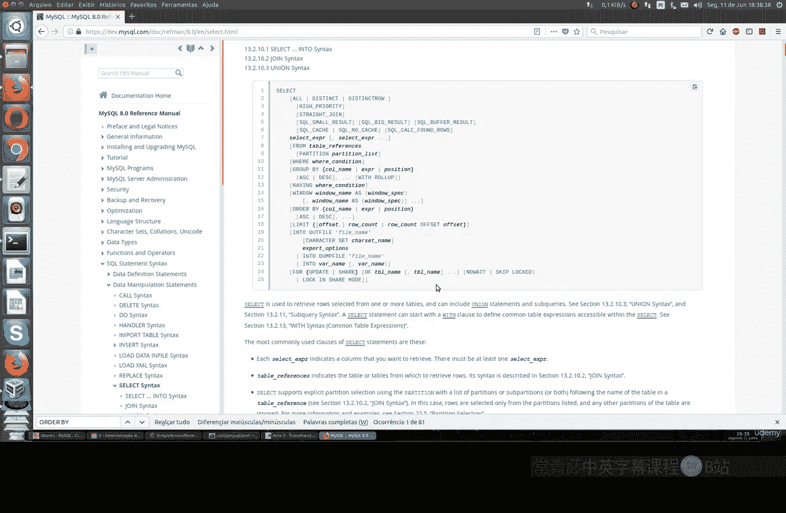

# 048：使用 LIMIT 命令 🎯

在本节课中，我们将学习如何在 `SELECT` 语句中使用 `LIMIT` 命令。`LIMIT` 是数据库管理员和开发者广泛使用的命令，它能帮助你更好地筛选数据，尤其是在执行 `UPDATE` 或 `DELETE` 操作时，能有效控制影响范围，对日常工作有很大帮助。

## 准备数据表



上一节我们介绍了基本的查询语句，本节中我们来看看如何限制查询结果的数量。首先，我们需要一个数据表来演示。我们将从 GitHub 导入一个 SQL 文件，创建一个名为 `profile` 的表。

以下是该表的结构和部分数据：

```sql
CREATE TABLE profile (
    id INT NOT NULL AUTO_INCREMENT PRIMARY KEY,
    name VARCHAR(20),
    birth DATE,
    color VARCHAR(20),
    food VARCHAR(20),
    cats INT
);
```

这张表包含以下列：
*   **`id`**：主键，整数类型，不能为 `NULL`，并且会自动递增（`AUTO_INCREMENT`）。主键是表中每一行的唯一标识，对于包含海量数据（例如1亿行）的表来说，主键对于快速查找和建立索引至关重要。
*   **`name`**：可变长度字符串，最多20个字符。
*   **`birth`**：日期类型。
*   **`color`**：可变长度字符串。
*   **`food`**：可变长度字符串。
*   **`cats`**：整数类型，表示养猫的数量。

数据插入后，表内容大致如下：

| id | name | birth | color | food | cats |
| :--- | :--- | :--- | :--- | :--- | :--- |
| 1 | ... | ... | ... | ... | ... |
| 2 | ... | ... | ... | ... | ... |
| ... | ... | ... | ... | ... | ... |

## 使用 LIMIT 命令

`LIMIT` 命令的基本作用是限制 `SELECT` 语句返回的记录行数。

### 1. 获取指定数量的记录

以下是使用 `LIMIT` 获取前 N 条记录的语法：

```sql
SELECT * FROM 表名 LIMIT N;
```

例如，要查看 `profile` 表的第一条记录，可以执行：

```sql
SELECT * FROM profile LIMIT 1;
```

这条命令会返回 `id` 为 1 的那一行。如果想查看前四条记录，则将数字改为 4 即可。

### 2. 结合 ORDER BY 使用

`LIMIT` 经常与 `ORDER BY` 子句结合使用，先对结果进行排序，再取出特定部分。这在很多实际场景中非常有用。

例如，在电商网站中，我们经常需要找出价格最低的商品。我们可以通过排序和限制来实现类似功能。

假设我们想找出 `profile` 表中生日最早（即年龄最大）的人：



```sql
SELECT * FROM profile ORDER BY birth LIMIT 1;
```



这条命令会先按 `birth` 列升序排列（最早的日期排在最前），然后使用 `LIMIT 1` 取出第一条，即生日最早的人。

反之，如果想找出生日最晚（即最年轻）的人，可以使用降序排列：

```sql
SELECT * FROM profile ORDER BY birth DESC LIMIT 1;
```

你还可以使用 `DATE_FORMAT` 函数按月份和日期排序，来找出即将过生日的人。

### 3. 结合 COUNT 函数使用

`LIMIT` 也可以与聚合函数如 `COUNT` 一起使用。`COUNT` 函数用于统计表中的行数。

例如，统计 `profile` 表中有多少条记录：

```sql
SELECT COUNT(*) FROM profile;
```


虽然这个例子没有直接用到 `LIMIT`，但 `COUNT` 是数据分析中常与数据筛选（包括 `LIMIT`）配合使用的核心函数。

## 总结



本节课中我们一起学习了 `LIMIT` 命令的用法。我们了解到：
1.  `LIMIT N` 可以直接限制查询结果返回的行数。
2.  将 `LIMIT` 与 `ORDER BY` 结合，可以轻松找到排序后“最大”、“最小”或“前N名”的记录，这在数据分析、报告生成和功能开发（如排行榜、最新商品）中非常实用。
3.  `LIMIT` 是进行数据分页和精确控制操作范围的基础。


目前我们学习的仍是 SQL 的基础部分。`LIMIT` 命令在后续更复杂的查询，尤其是在处理大量数据的分页查询时，会发挥更大的作用。掌握这些基础命令是熟练运用 `SELECT` 语句的关键。