# 049：克隆与临时表 🗂️

在本节课中，我们将学习 MySQL 中两个非常实用的功能：克隆表与创建临时表。克隆表可以帮助我们快速复制表结构或数据，用于备份或测试。临时表则是一种会话级别的表，在连接关闭后会自动消失，常用于存储中间计算结果或进行安全的数据操作。

## 克隆表

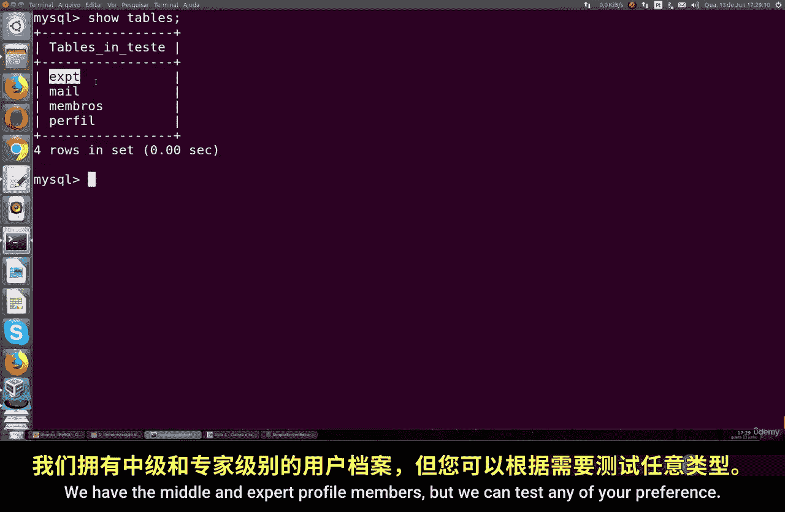

上一节我们介绍了表的基本操作，本节中我们来看看如何克隆一张表。克隆表意味着创建一个与原表结构相同的新表，可以选择是否复制数据。

以下是克隆表的基本语法：

```sql
CREATE TABLE 新表名 LIKE 原表名;
```

这条命令会创建一个与原表结构（包括列定义、索引等）完全相同的新表，但不会复制任何数据。

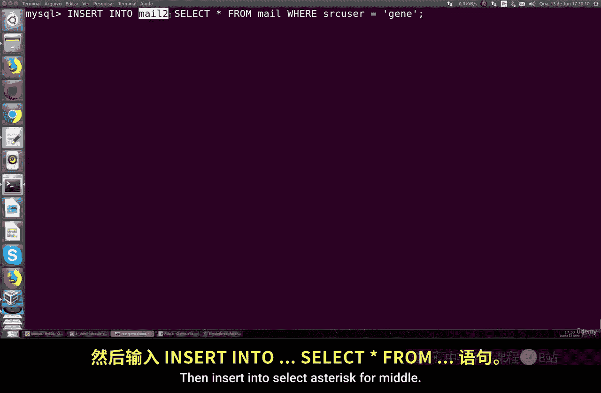

例如，假设我们有一个名为 `medium` 的表，我们可以这样克隆它的结构：

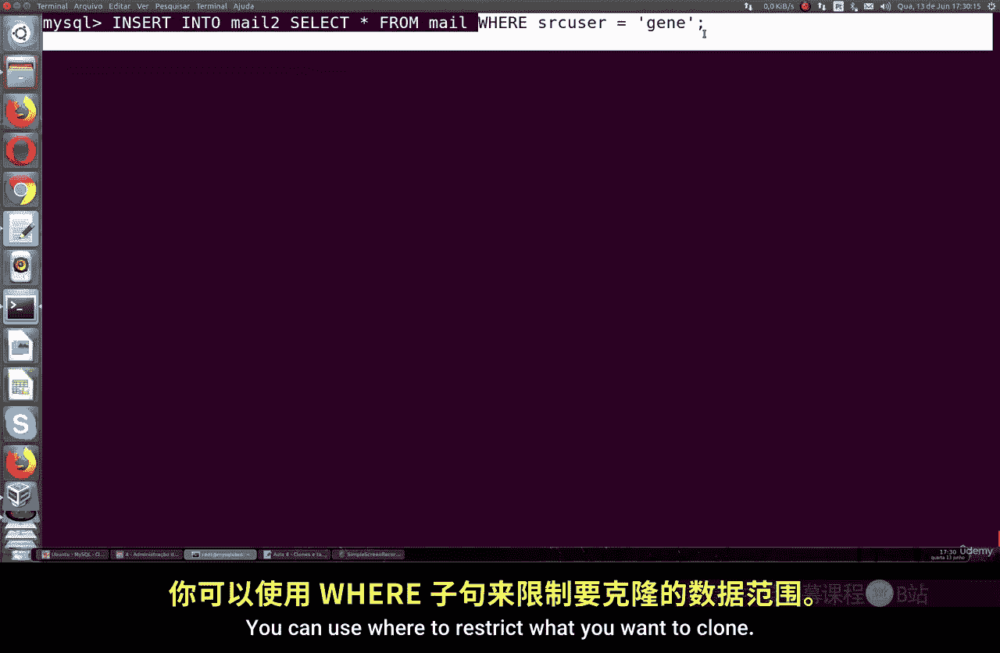

```sql
CREATE TABLE medium2 LIKE medium;
```

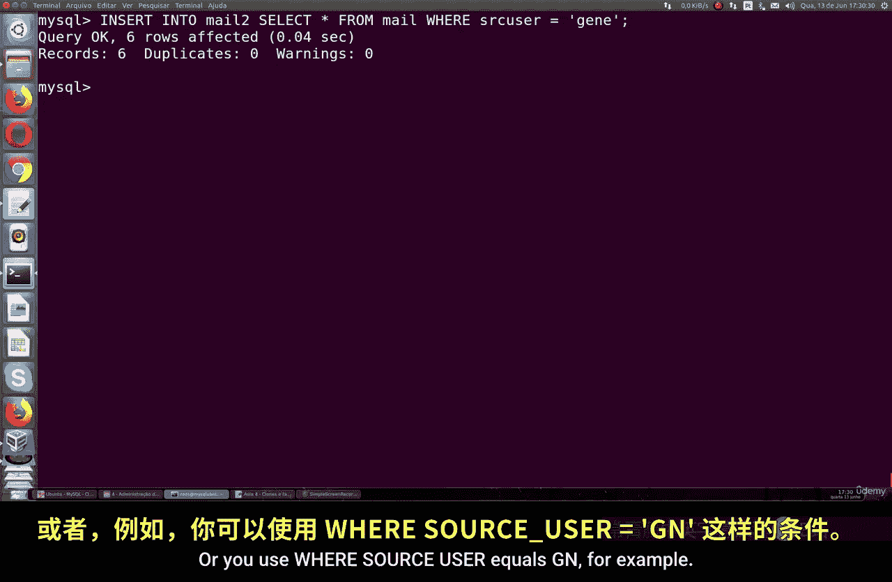

执行后，`medium2` 表的结构与 `medium` 相同，但内容是空的。要验证这一点，可以执行：

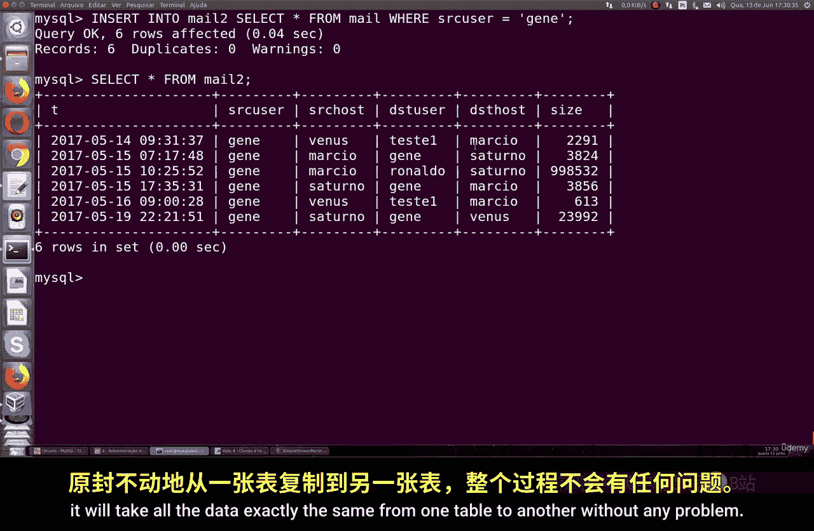

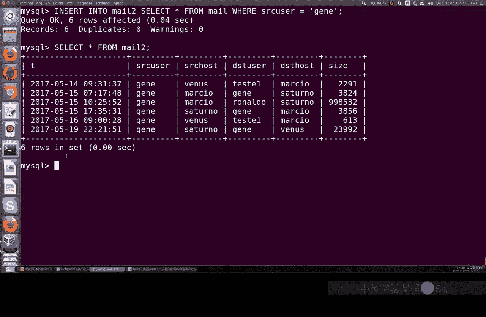

```sql
SELECT * FROM medium2;
```

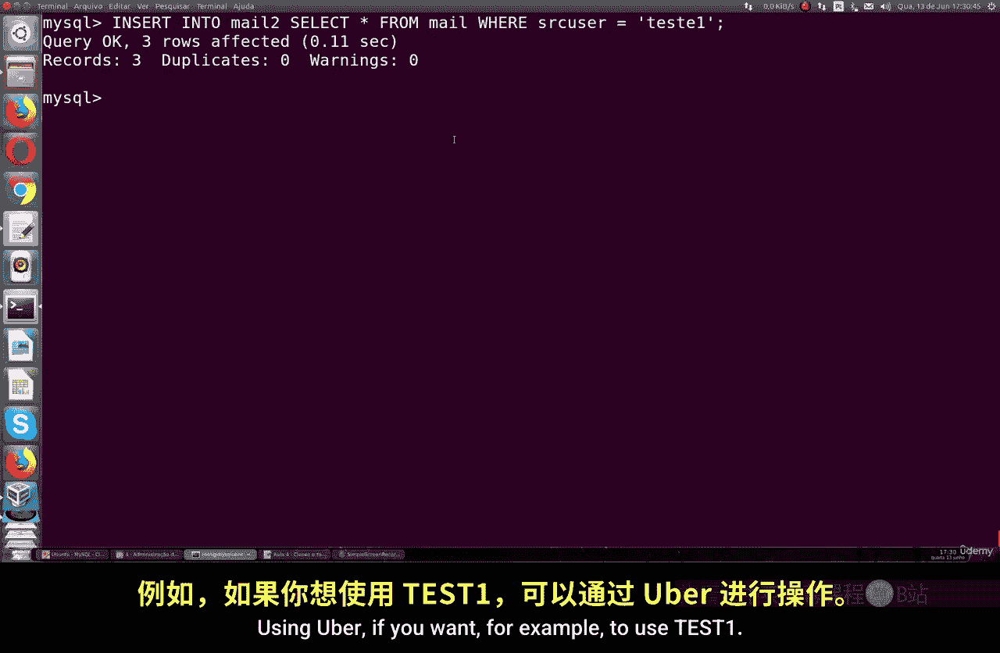

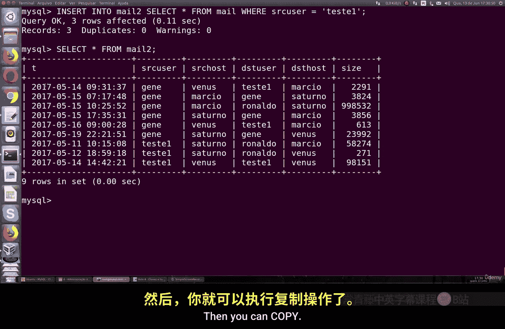

如果希望同时克隆表结构和数据，需要使用 `INSERT INTO ... SELECT` 语句。以下是具体步骤：

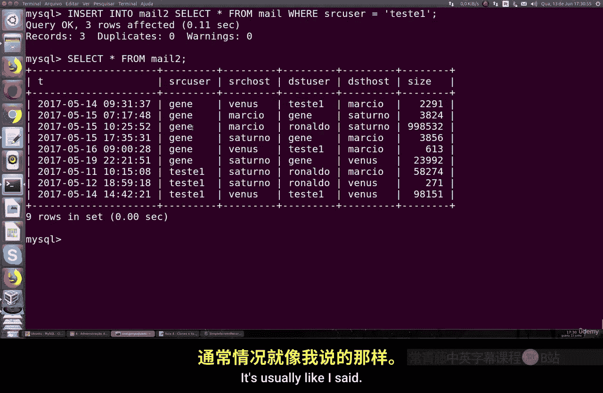

1.  首先，使用 `CREATE TABLE ... LIKE` 创建结构相同的新表。
2.  然后，使用 `INSERT INTO` 语句复制数据。

```sql
-- 第一步：克隆表结构
CREATE TABLE medium_clone LIKE medium;

-- 第二步：复制所有数据
INSERT INTO medium_clone SELECT * FROM medium;
```

你也可以在复制数据时添加条件，只克隆满足特定条件的行。例如，只克隆 `id` 小于 10 的记录：

```sql
INSERT INTO medium_clone SELECT * FROM medium WHERE id < 10;
```

或者，只克隆特定的列：

```sql
INSERT INTO medium_clone (column1, column2) SELECT column1, column2 FROM medium;
```

## 临时表

接下来，我们学习临时表。临时表是一种特殊类型的表，它只在当前数据库会话中存在。会话结束后，临时表会自动被删除。这在处理中间数据或进行不会影响永久数据的操作时非常有用。

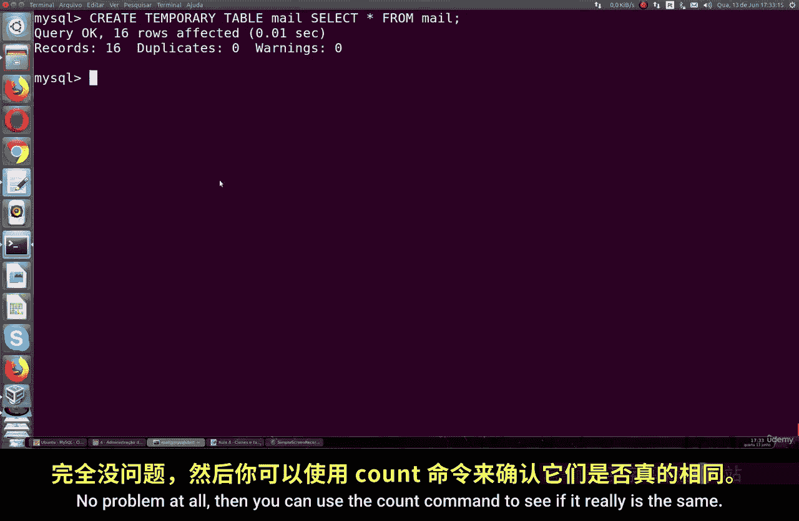

创建临时表的语法如下：

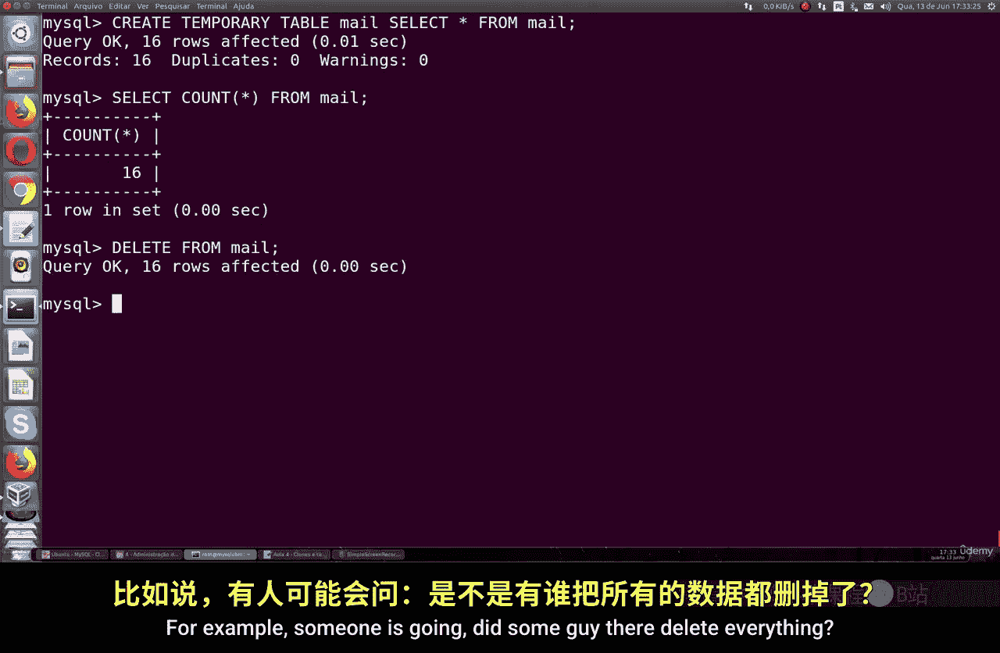

```sql
CREATE TEMPORARY TABLE 临时表名 (列定义);
-- 或者克隆一个现有表的结构
CREATE TEMPORARY TABLE 临时表名 LIKE 原表名;
```

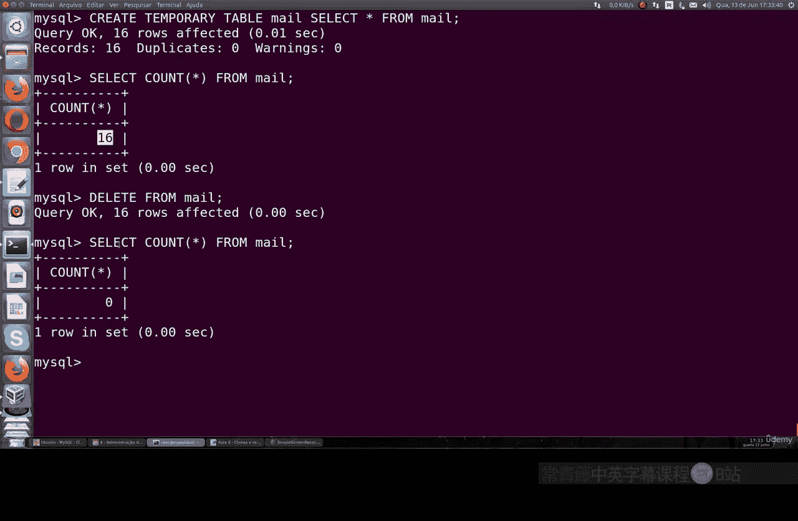

临时表的主要优势在于：
*   **数据隔离**：对临时表的操作不会影响同名的永久表。
*   **自动清理**：连接关闭后，临时表自动删除，无需手动管理。
*   **安全备份**：在对重要表进行危险操作（如大量删除或更新）前，可以将其克隆到临时表中作为备份。

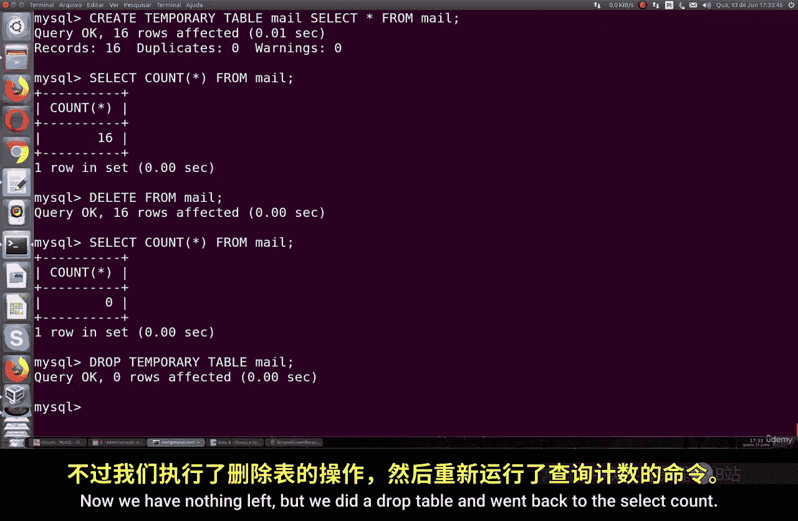

让我们通过一个例子来理解。首先，我们基于 `medium` 表创建一个同名的临时表并复制数据：

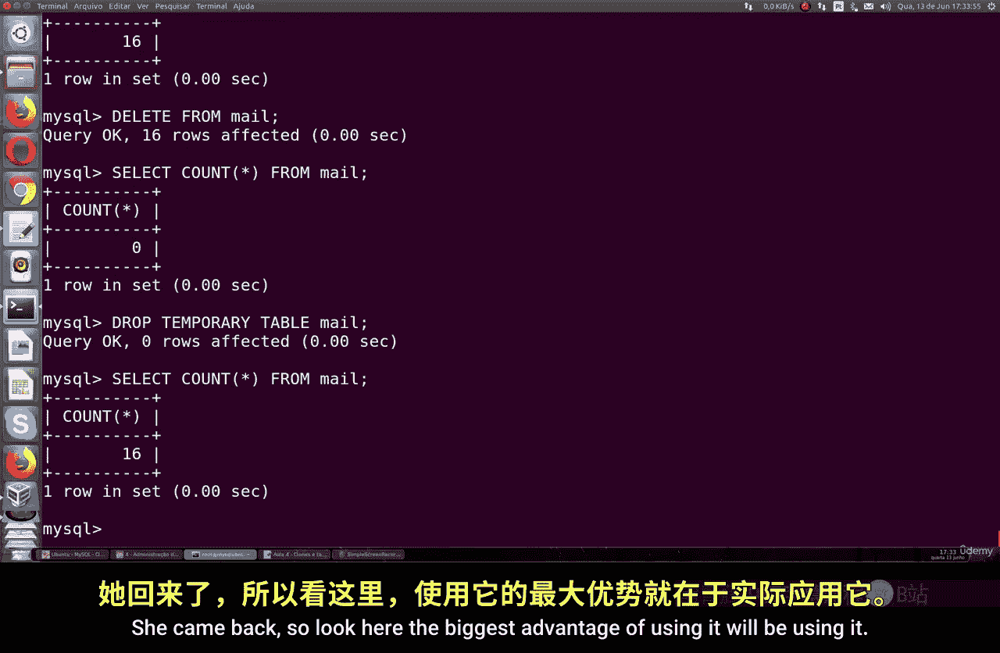

```sql
-- 创建临时表并复制数据
CREATE TEMPORARY TABLE medium LIKE medium;
INSERT INTO medium SELECT * FROM 原medium表; -- 假设原表有别名或不同名
```

> **注意**：在实际操作中，如果已存在同名的永久表，在临时表有效期内，查询会优先指向临时表。

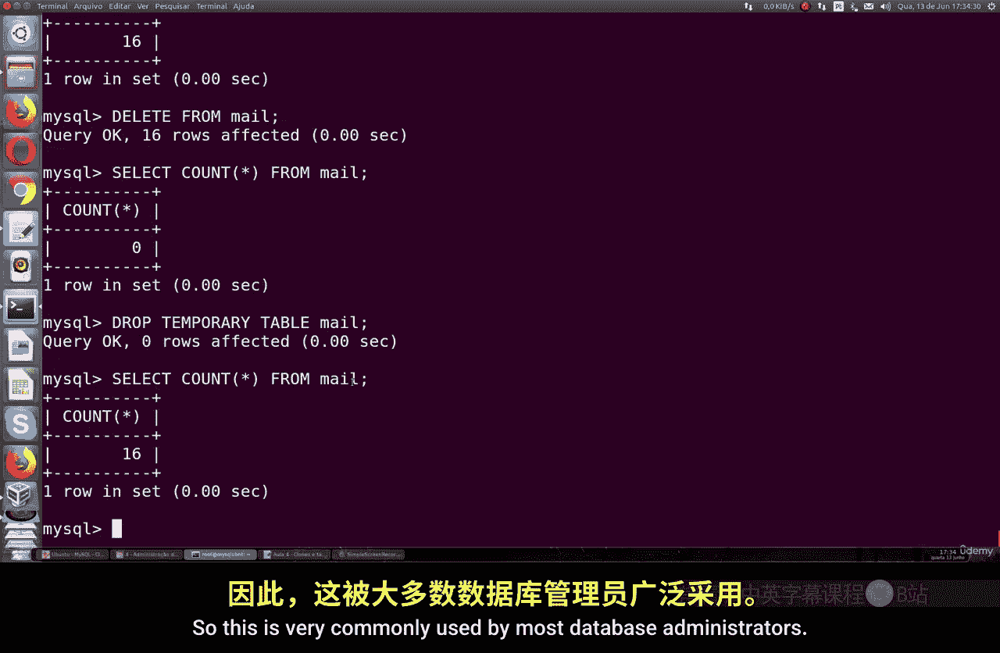

现在，假设我们不小心对原始 `medium` 表执行了删除操作：

```sql
DELETE FROM medium; -- 此操作可能作用于临时表，具体取决于上下文
-- 或者更危险的
DROP TABLE medium;
```

如果之前没有备份，数据可能丢失。但由于我们创建了临时表作为副本，我们可以从这个临时副本中恢复数据。即使永久表被删除，只要会话未结束，临时表中的数据依然存在。

关于临时表，有几个重要的注意事项：
1.  在同一会话中，不能创建两个同名的临时表。在创建新的之前，必须删除旧的。
2.  某些 MySQL 客户端或连接池（如持久连接）可能会使临时表的存在时间超出预期。
3.  删除临时表时，建议使用 `DROP TEMPORARY TABLE IF EXISTS 表名;` 语法。这样可以避免误删同名的永久表。

## 总结

本节课中我们一起学习了 MySQL 中克隆表和创建临时表的方法。
*   **克隆表** 使用 `CREATE TABLE ... LIKE` 和 `INSERT INTO ... SELECT` 组合，可以完整复制表的结构和数据，是进行数据备份或迁移的便捷手段。
*   **临时表** 使用 `CREATE TEMPORARY TABLE` 创建，其生命周期仅限于当前数据库会话。它为安全地操作数据、存储中间结果提供了有效的解决方案，尤其是在进行可能破坏数据的操作之前，创建一个临时副本是良好的实践。

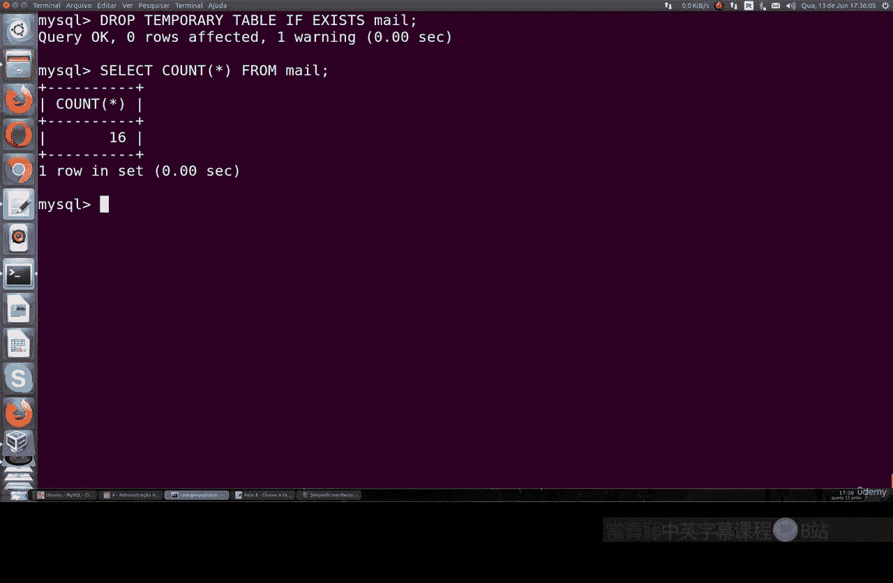

熟练掌握这两种技术，将有助于你更安全、高效地管理和操作数据库。