# 050：创建唯一表 🗂️


在本节课中，我们将学习如何在MySQL数据库中创建一个具有唯一名称的表，确保不会与其他表重名。我们将利用MySQL的`CONNECTION_ID()`函数来实现这一目标。

## 概述

我们将使用`test`数据库，通过获取当前数据库连接的唯一ID，并将其与表名拼接，从而生成一个全局唯一的表名。这种方法在需要避免表名冲突的场景下非常有用。

## 核心概念与步骤

### 1. 获取连接ID

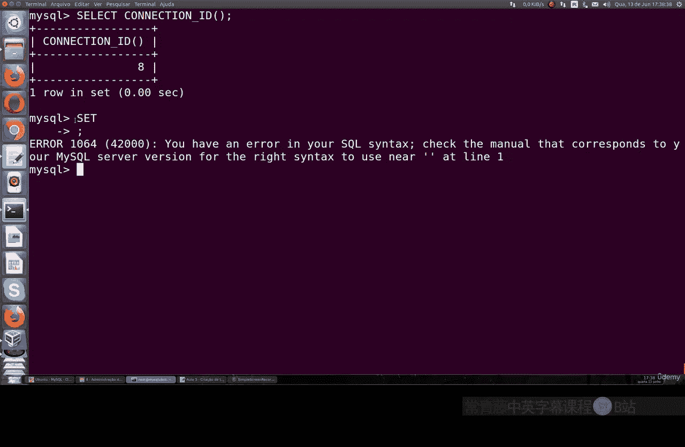

首先，我们需要获取当前MySQL会话的唯一连接ID。这个ID由MySQL自动生成，每次连接都可能不同。

执行以下SQL命令来查看你的连接ID：

```sql
SELECT CONNECTION_ID();
```

命令会返回一个数字，例如 `8`。这就是你当前会话的唯一标识符。

### 2. 准备SQL语句

我们将使用MySQL的预处理语句来动态地创建表。这涉及到设置用户变量和拼接字符串。

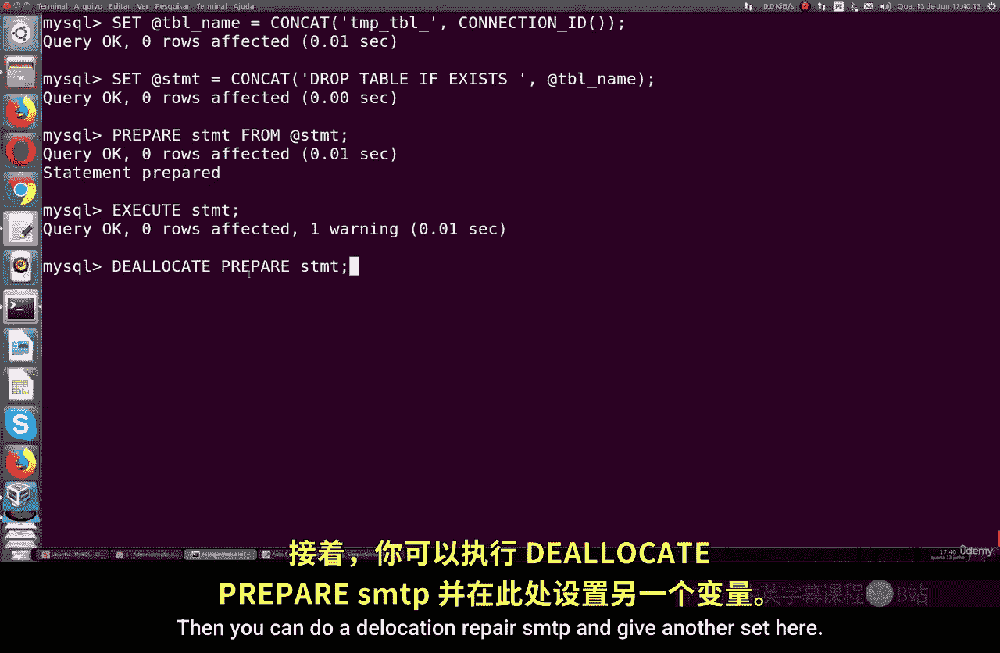

以下是创建唯一表所需的步骤：

*   **设置表名变量**：我们将创建一个变量来存储最终的表名。这个表名由固定前缀和连接ID拼接而成。
    ```sql
    SET @tbl_name = CONCAT(‘tmp_tbl_‘, CONNECTION_ID());
    ```
    这行代码创建了一个名为 `@tbl_name` 的变量，其值可能是 `tmp_tbl_8`。

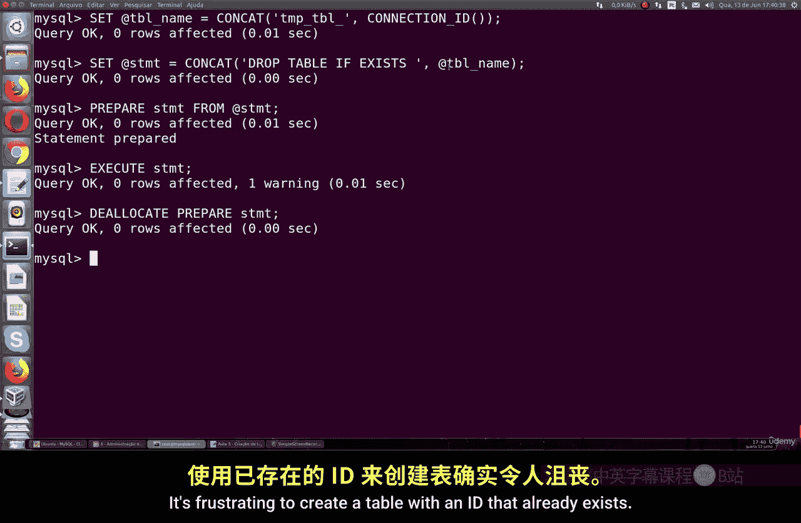

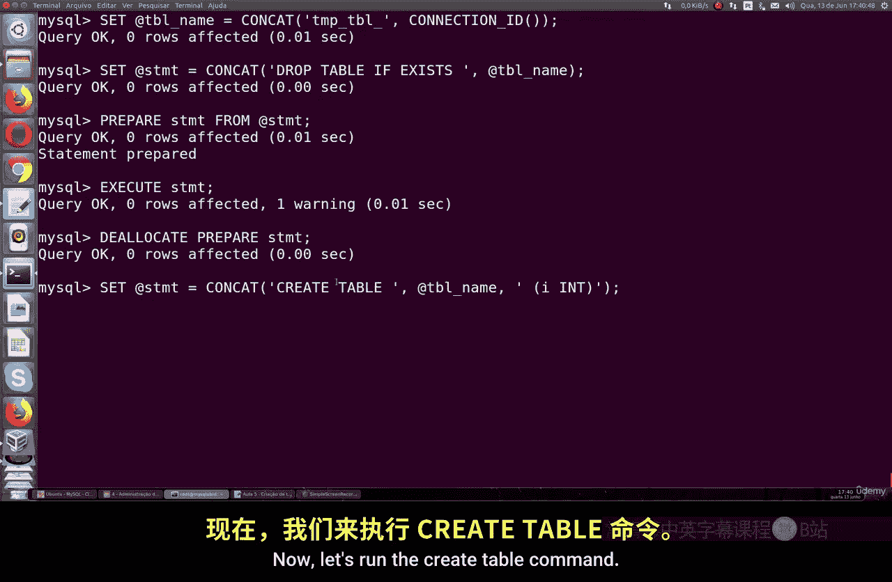

*   **删除可能存在的同名表**：为了确保创建过程干净，我们先检查并删除可能已经存在的同名表。
    ```sql
    SET @drop_sql = CONCAT(‘DROP TABLE IF EXISTS ‘, @tbl_name, ‘;’);
    PREPARE drop_stmt FROM @drop_sql;
    EXECUTE drop_stmt;
    DEALLOCATE PREPARE drop_stmt;
    ```

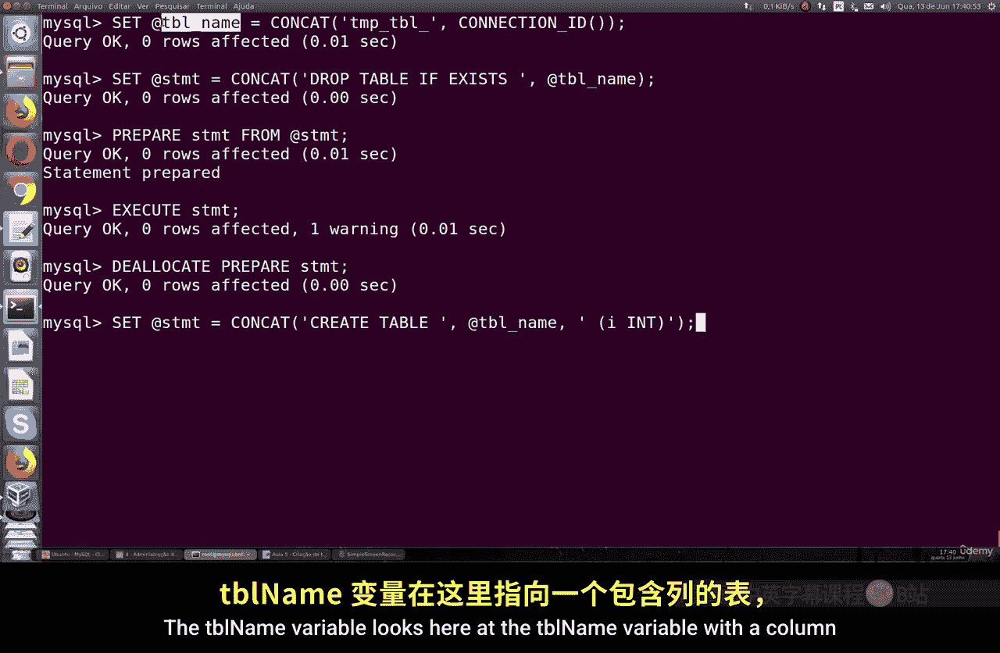

### 3. 创建唯一表

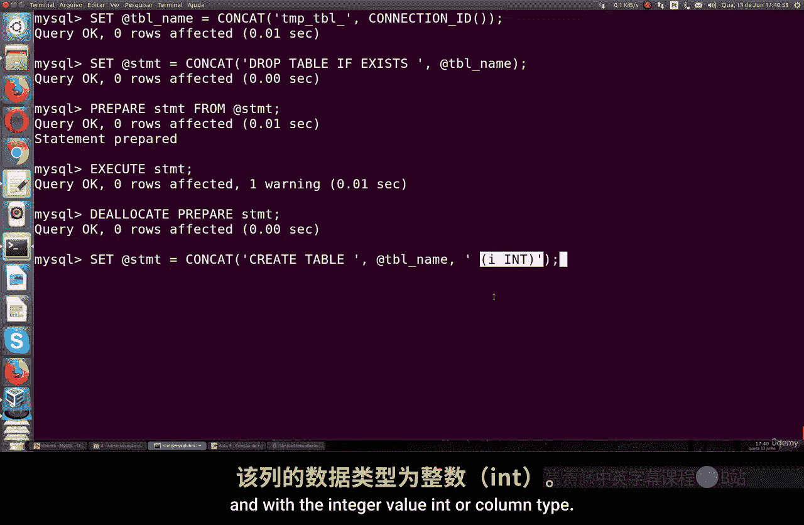

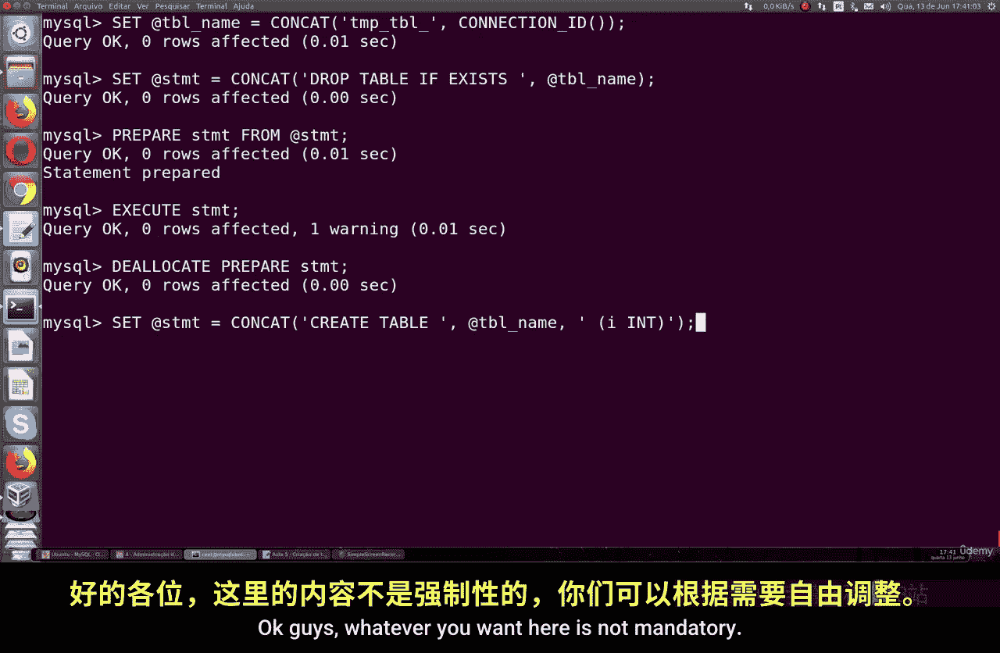

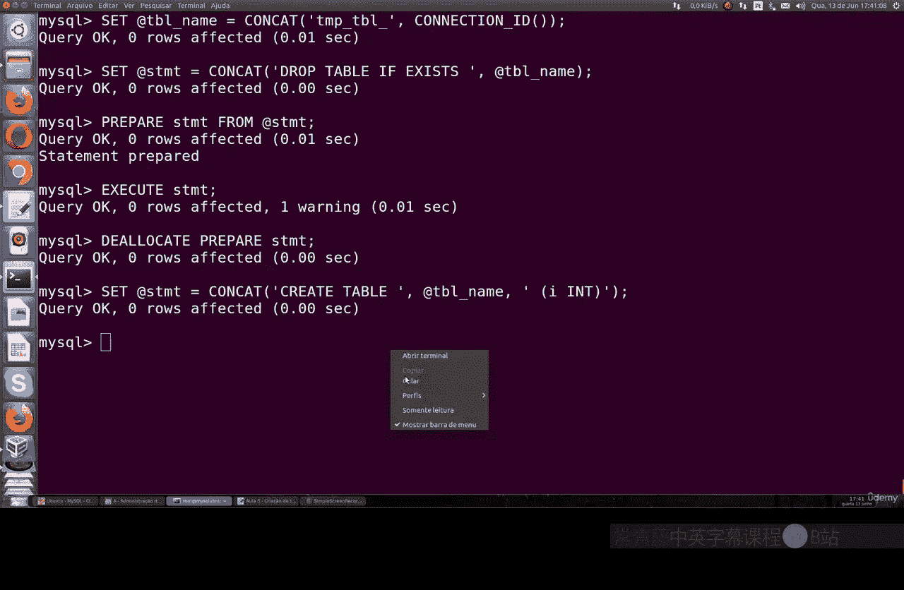

在清理了可能的冲突之后，我们现在可以创建新表了。

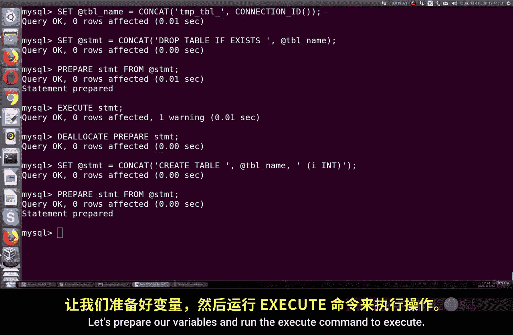

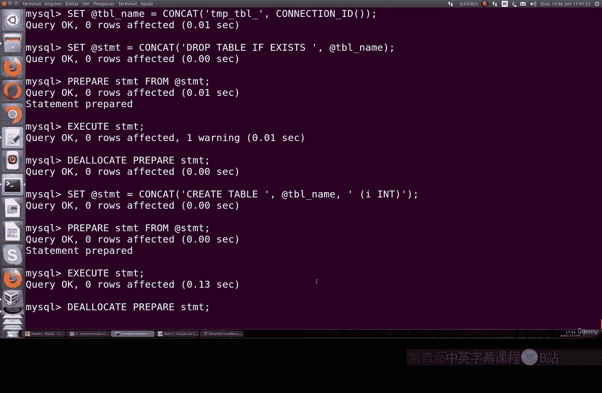

*   **构建创建表的SQL语句**：我们使用之前生成的唯一表名变量来构建 `CREATE TABLE` 语句。
    ```sql
    SET @create_sql = CONCAT(‘CREATE TABLE ‘, @tbl_name, ‘ (id INT);’);
    ```
    这行代码生成的语句可能是 `CREATE TABLE tmp_tbl_8 (id INT);`，表示创建一个包含一个整数类型`id`列的表。

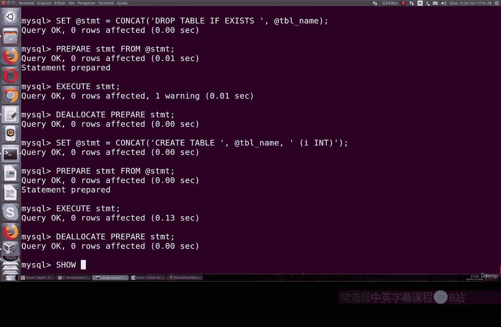

*   **执行创建语句**：最后，我们准备并执行这条动态生成的创建表语句。
    ```sql
    PREPARE create_stmt FROM @create_sql;
    EXECUTE create_stmt;
    DEALLOCATE PREPARE create_stmt;
    ```

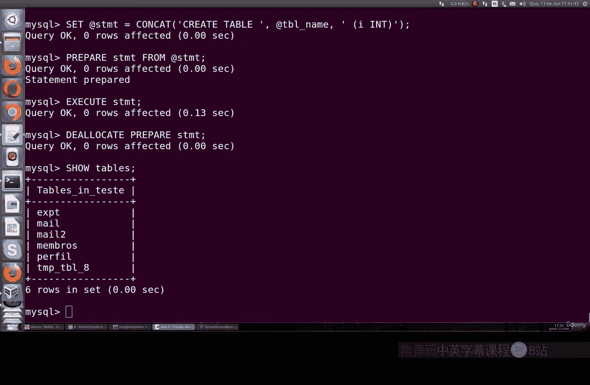

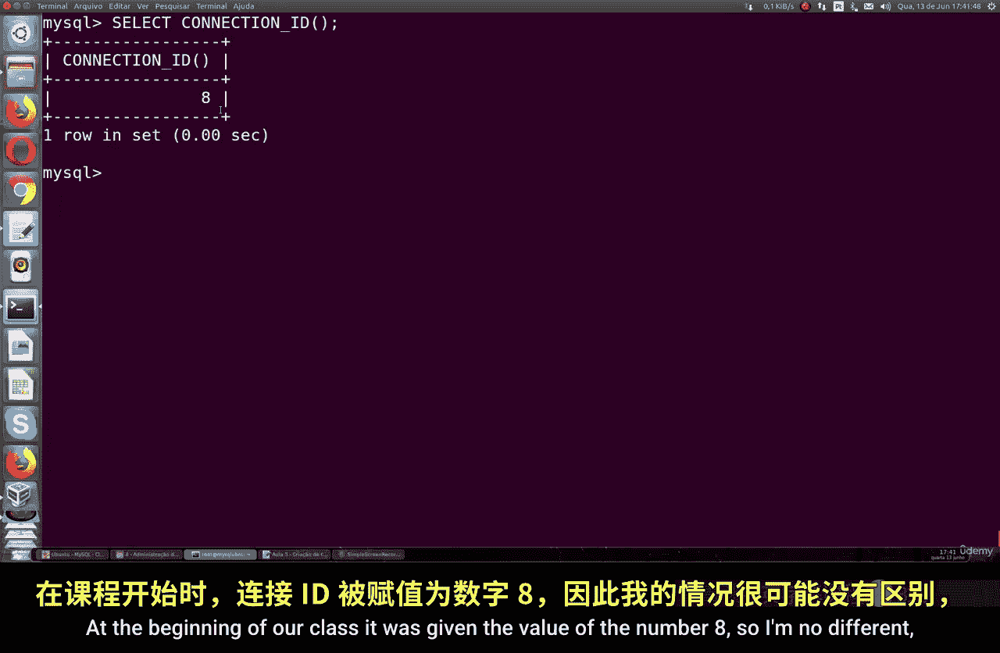

### 4. 验证结果

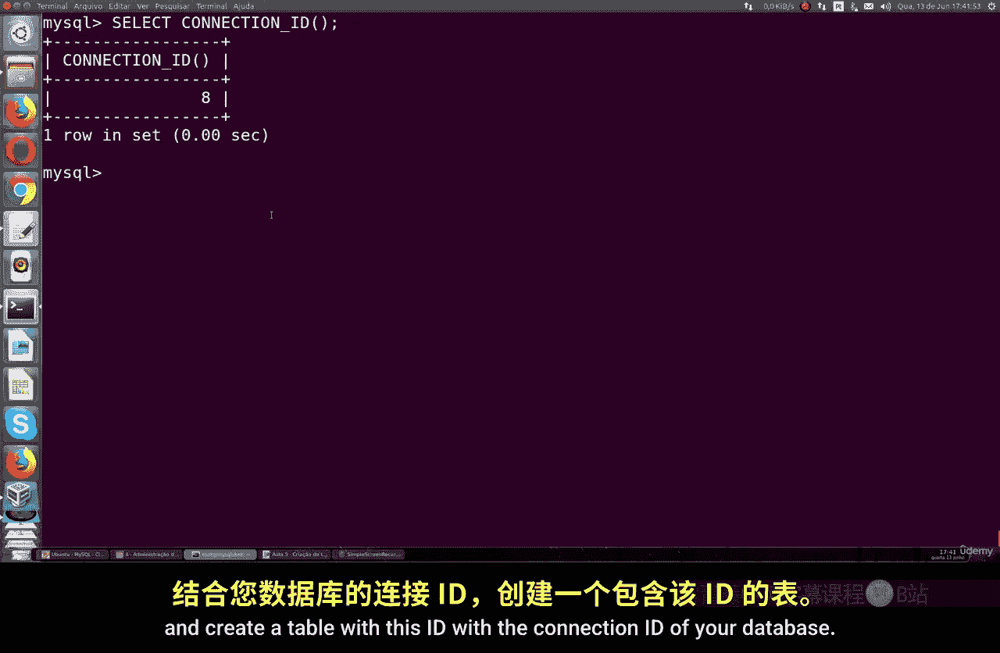

表创建完成后，我们可以验证它是否已成功添加到数据库中。

执行 `SHOW TABLES;` 命令，你应该能在列表中看到以 `tmp_tbl_` 开头，后接你的连接ID的新表，例如 `tmp_tbl_8`。

## 总结

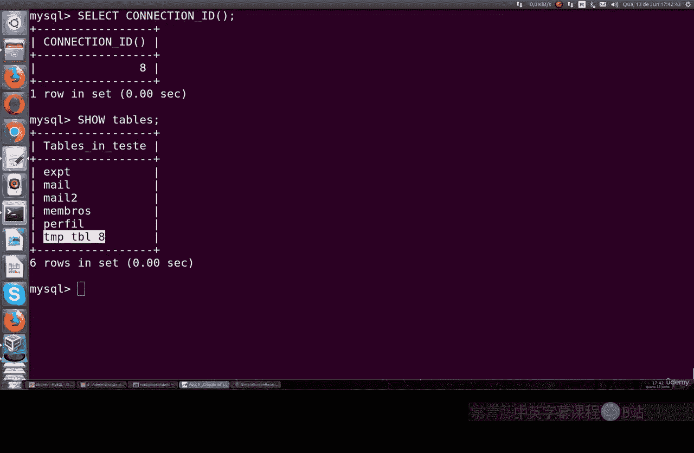

本节课我们一起学习了在MySQL中创建唯一名称表的方法。核心要点是利用 `CONNECTION_ID()` 函数获取会话唯一ID，并通过字符串拼接与预处理语句，动态地生成和执行SQL命令。这个技巧能有效避免表名冲突，在开发和生产环境中都很有实用价值。