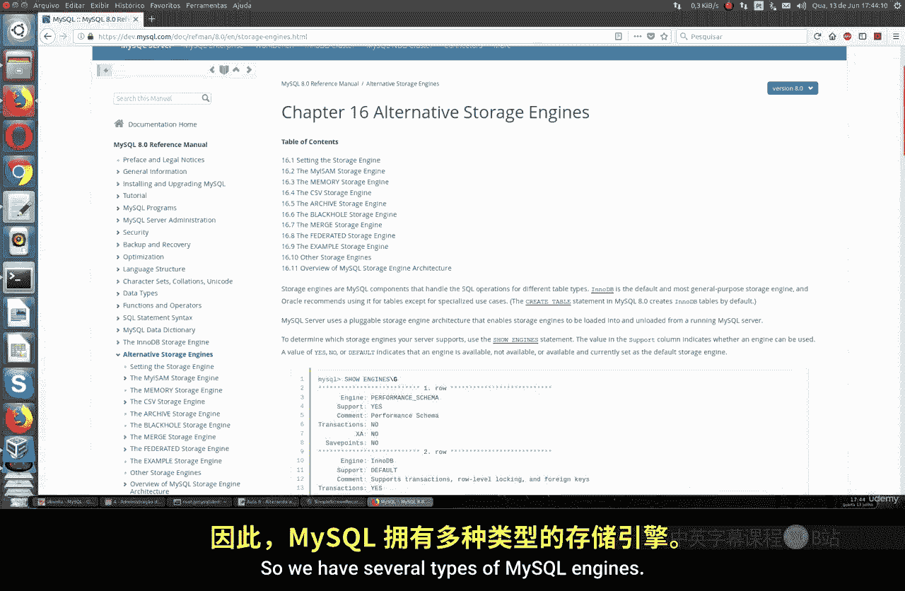
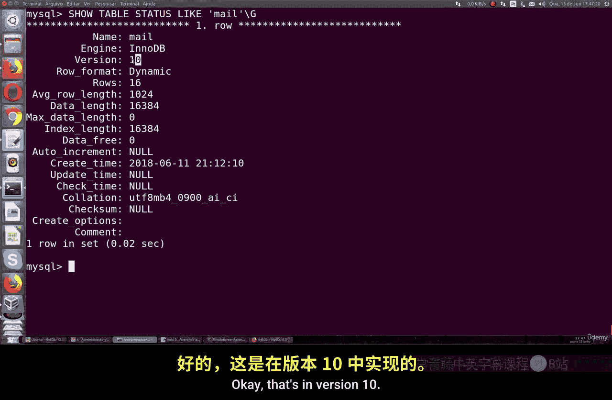
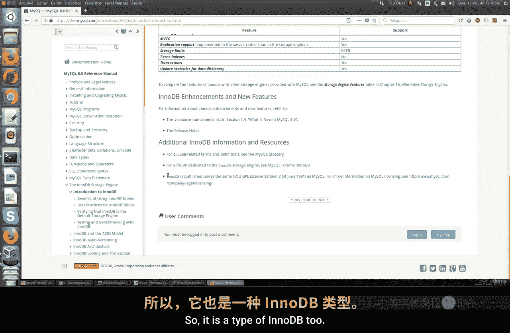
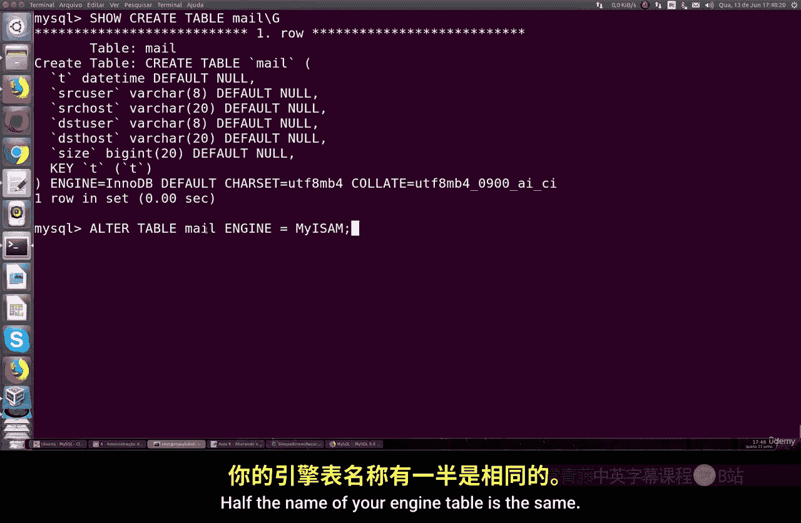
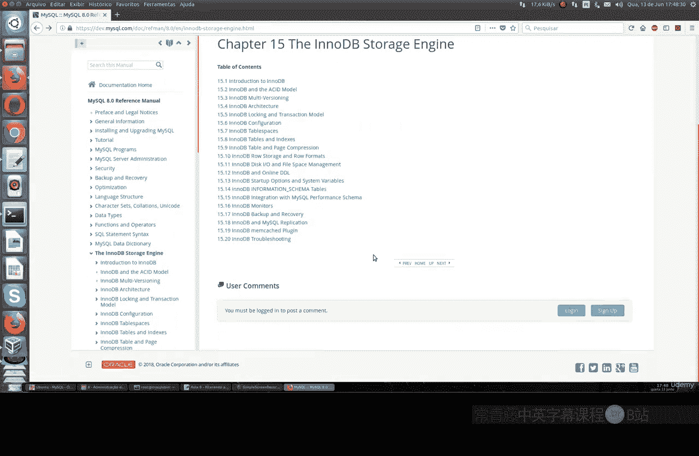
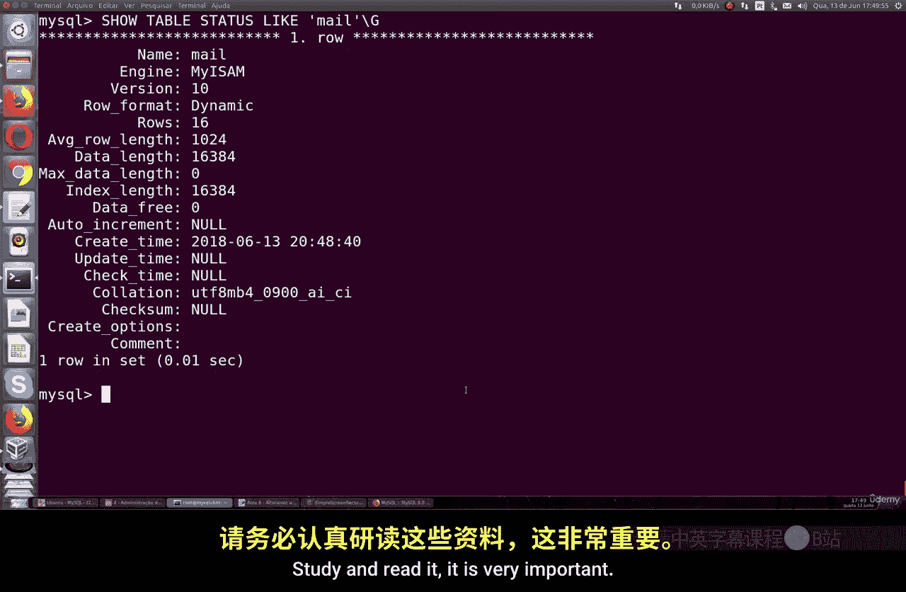

# 051：更改MySQL存储引擎 🛠️

在本节课中，我们将学习MySQL的存储引擎，了解其作用，并掌握如何查看和更改表的存储引擎。


## 概述



存储引擎是MySQL用于存储、管理和检索数据的方式。MySQL支持多种存储引擎，每种引擎都有其特定的特性和适用场景。理解并选择合适的存储引擎，对于数据库的性能和功能至关重要。

## 什么是存储引擎？

存储引擎决定了MySQL如何存储你放入其中的数据。它并非一个简单的概念，MySQL提供了多种类型的引擎。

以下是MySQL支持的部分引擎类型：
*   **InnoDB**：这是MySQL 8.0及以后版本的默认引擎。它支持事务、行级锁定、外键约束，并提供了提交、回滚和崩溃恢复能力。它适用于需要高可靠性和并发读写的大多数应用场景。
*   **MyISAM**：这是MySQL 5.5版本之前的默认引擎。它的主要特点是读取速度快，但不支持事务和行级锁定。它更适用于主要进行读取操作、且对事务完整性要求不高的场景，例如数据仓库或只读网站。
*   **MEMORY**：该引擎将表数据存储在内存中，因此速度极快，但服务器重启后数据会丢失。它适用于临时表或缓存。
*   **CSV**：该引擎将数据以逗号分隔值（CSV）格式存储，便于与其他程序交换数据。

其中，**InnoDB**和**MyISAM**是最常用的两种引擎。

## 查看表的存储引擎

在更改引擎之前，我们首先需要知道当前表使用的是哪种引擎。

你可以使用以下SQL命令来查看指定表的详细信息，包括其存储引擎：

```sql
SHOW TABLE STATUS LIKE 'your_table_name'\G
```

执行此命令后，在返回的结果中，找到 **`Engine`** 字段，其值就是当前表所使用的存储引擎。如果你从未更改过，那么它很可能就是默认的 **InnoDB**。

> **注意**：命令中的 `\G` 用于将结果以垂直格式（每行一个字段）显示，这样在终端中阅读更清晰。`your_table_name` 需要替换为你实际的表名。

## 更改表的存储引擎



上一节我们介绍了如何查看存储引擎，本节中我们来看看如何更改它。



如果你需要将表的存储引擎从一种类型更改为另一种（例如从MyISAM改为InnoDB），可以使用 `ALTER TABLE` 命令。

以下是更改存储引擎的命令格式：



```sql
ALTER TABLE table_name ENGINE = engine_name;
```



*   **`table_name`**：需要更改引擎的表名。
*   **`engine_name`**：你想要更改为的目标引擎名称，例如 `InnoDB`、`MyISAM` 等。

**操作示例**：
假设我们有一个名为 `users` 的表，现在想将其引擎从 MyISAM 改为 InnoDB。

1.  首先，确认当前引擎：
    ```sql
    SHOW TABLE STATUS LIKE 'users'\G
    ```
    （假设我们看到 `Engine: MyISAM`）

2.  然后，执行更改命令：
    ```sql
    ALTER TABLE users ENGINE = InnoDB;
    ```

3.  最后，再次查看状态以确认更改是否成功：
    ```sql
    SHOW TABLE STATUS LIKE 'users'\G
    ```
    （此时应显示 `Engine: InnoDB`）

**重要注意事项**：
*   更改存储引擎是一个**重写表结构**的操作。如果表中有数百万甚至更多数据，此操作可能会**耗费很长时间**，具体时间取决于你的服务器性能和表的大小。
*   在执行此类结构变更时，会占用大量的CPU和I/O资源，可能影响数据库的整体性能。因此，请在业务低峰期进行操作，并提前做好数据备份。
*   引擎名称（如 `InnoDB`）是**大小写敏感**的。在命令中必须严格按照规定的大小写格式书写，否则会导致错误。



## 总结

本节课中我们一起学习了MySQL存储引擎的核心知识。我们了解到存储引擎是MySQL管理数据的基础，InnoDB和MyISAM是最主要的两种类型，各有其适用场景。我们掌握了使用 `SHOW TABLE STATUS` 命令查看表引擎，以及使用 `ALTER TABLE ... ENGINE = ...` 命令来更改表引擎的方法。请记住，在大型生产数据库上更改引擎是一项需要谨慎规划的操作。