# 052：使用CHAR、VARCHAR、ENUM与JSON

在本节课中，我们将学习MySQL中几种重要的字符串数据类型，包括`CHAR`、`VARCHAR`、`ENUM`和`JSON`。我们将通过对比和实例，理解它们各自的特性、存储方式以及适用场景。

## 字符类型：CHAR与VARCHAR

上一节我们介绍了MySQL的基础概念，本节中我们来看看最基础的字符类型。`CHAR`和`VARCHAR`是MySQL中用于存储字符串的两种主要数据类型。

它们之间的核心区别在于存储方式：
*   **`CHAR`** 类型在声明时需要指定一个固定的最大字符长度。无论实际存储的字符串多短，它都会占用该固定长度的存储空间，不足的部分会用空格填充。
*   **`VARCHAR`** 类型存储的是可变长度的字符串。它只占用实际字符串长度加上少量额外字节（用于记录长度）的存储空间，不会用空格填充。

因此，`VARCHAR`在存储空间利用上通常更高效，这也是它更常用的原因。

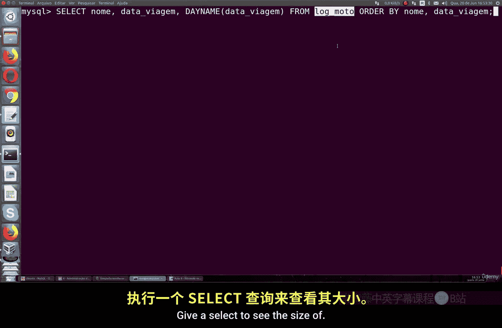

以下是演示两者区别的代码示例：

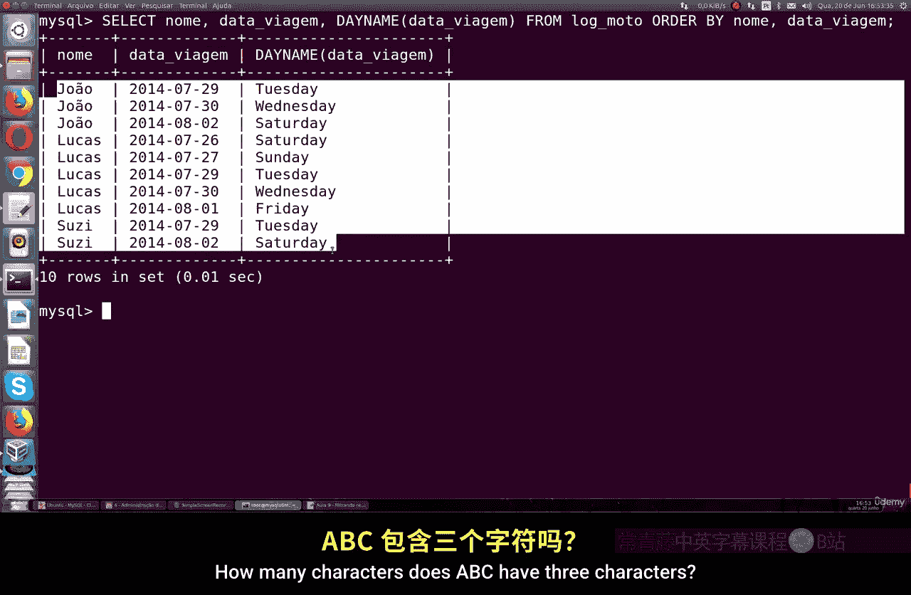

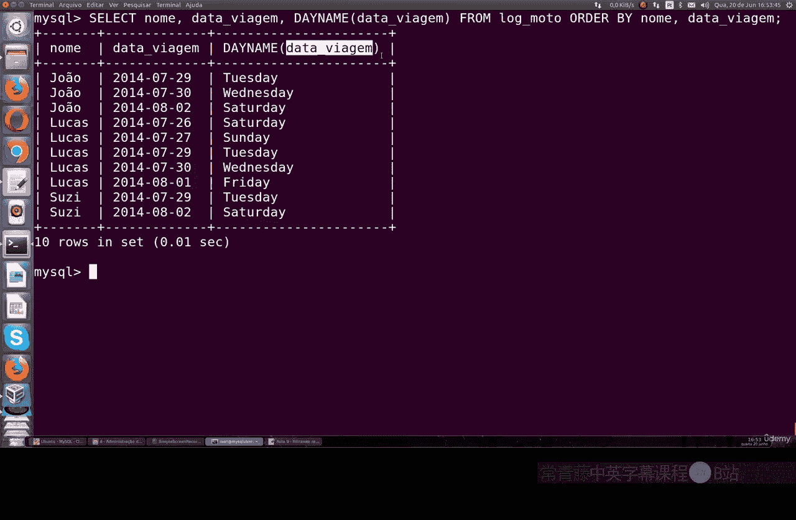

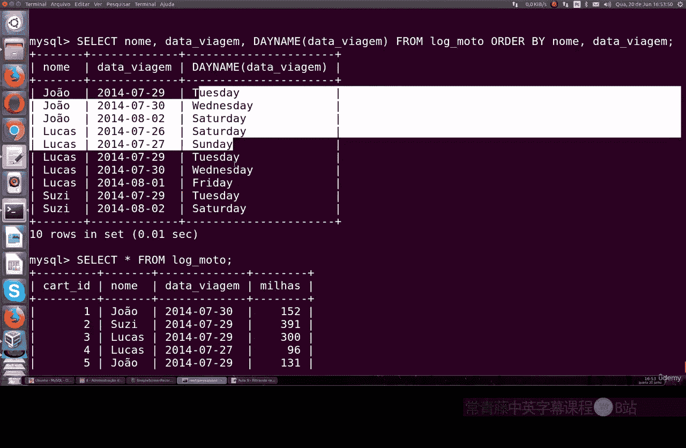

```sql
-- 创建一个CHAR类型的列，最大长度为3
CREATE TABLE test_char (col CHAR(3));
-- 插入数据
INSERT INTO test_char VALUES ('ABC'), ('AB');
-- 查询数据及其长度
SELECT col, LENGTH(col) FROM test_char;
```
执行后，`‘ABC’`显示长度为3，`‘AB’`显示长度可能为3（因为填充了空格），具体取决于客户端设置。

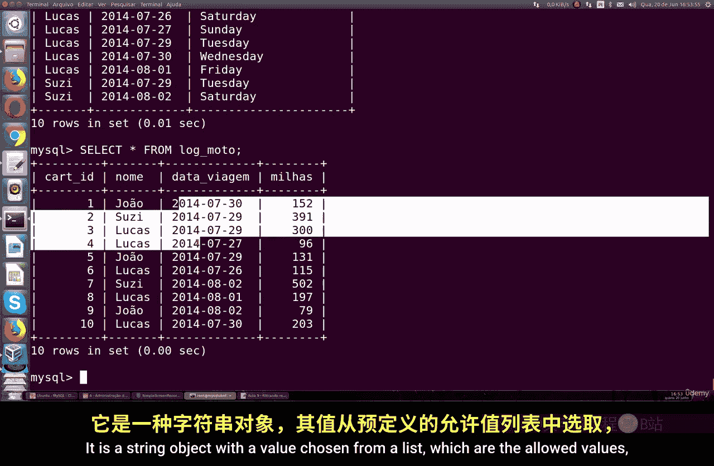

```sql
-- 创建一个VARCHAR类型的列，最大长度为255
CREATE TABLE test_varchar (col VARCHAR(255));
-- 插入相同的数据
INSERT INTO test_varchar VALUES ('ABC'), ('AB');
-- 查询数据及其长度
SELECT col, LENGTH(col) FROM test_varchar;
```
执行后，`‘ABC’`和`‘AB’`将分别显示长度为3和2，反映了它们的实际长度。

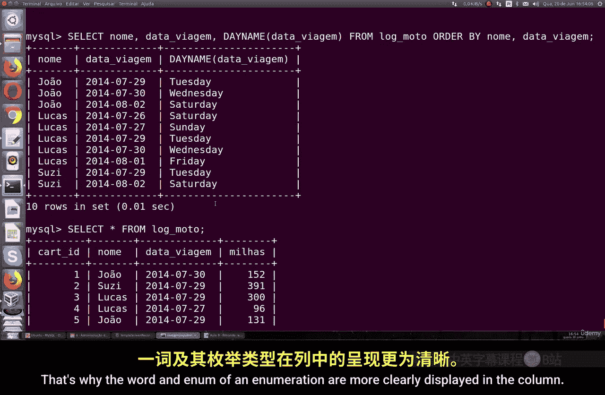

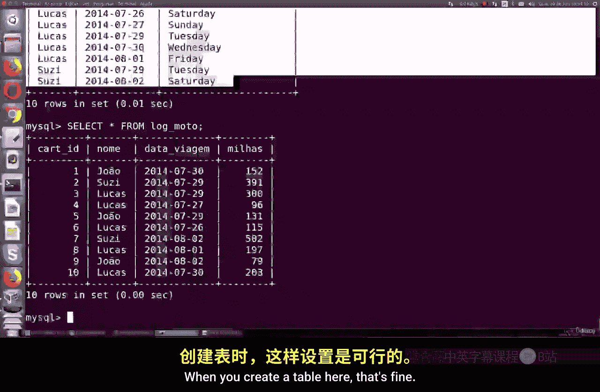

## 枚举类型：ENUM

了解了基本的字符类型后，我们来看一种特殊的字符串对象——`ENUM`（枚举）类型。

`ENUM`是一个字符串对象，其值只能从创建时预定义的值列表中选择。它在数据库内部以整数的形式紧凑存储，但在查询输出时显示为清晰可读的字符串。

使用`ENUM`有两个主要优点：
1.  节省存储空间。
2.  使查询输出更易读。

以下是创建和使用`ENUM`的示例：

```sql
-- 创建包含ENUM列的表
CREATE TABLE subjects (
    name VARCHAR(50),
    stream ENUM('arts', 'commerce', 'science')
);
-- 插入数据
INSERT INTO subjects VALUES ('Alice', 'commerce');
-- 查询数据
SELECT * FROM subjects;
-- 更新数据
UPDATE subjects SET stream = 'science' WHERE stream = 'commerce';
-- 再次查询，观察变化
SELECT * FROM subjects;
```
记住，`ENUM`通常只需要1个字节的存储空间（对于少于256个枚举值的情况），而`VARCHAR`则需要更多。如果记录数量庞大，这种存储效率的差异会非常明显。

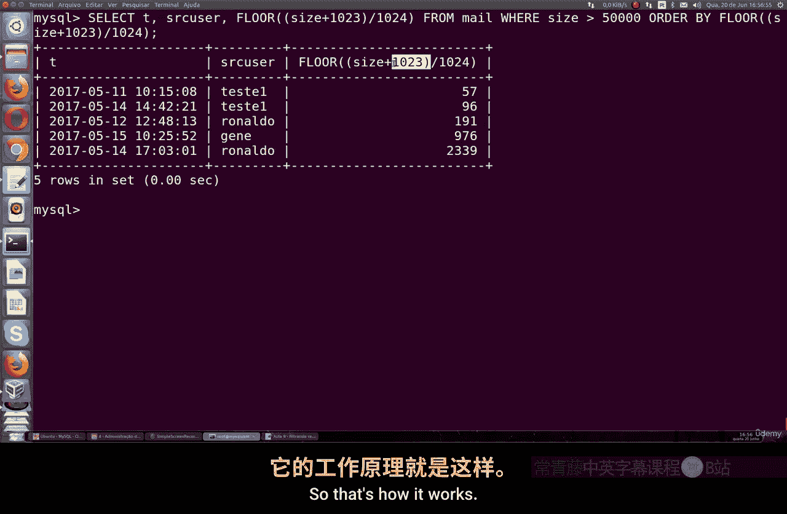

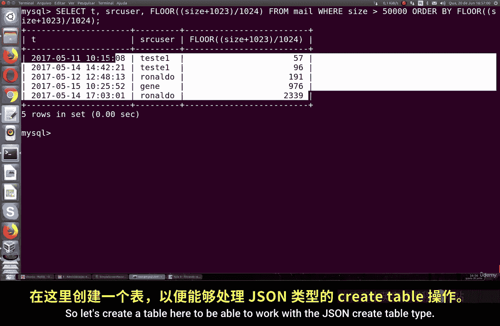

## JSON类型

最后，我们探讨一下在现代应用中广泛使用的`JSON`数据类型。虽然MySQL不是像MongoDB那样的原生文档数据库，但它提供了对`JSON`类型的良好支持，可以方便地存储和查询键值对数据。

`JSON`类型允许你存储结构化的`JSON`文档，并提供了丰富的函数来操作和查询这些数据。

以下是使用`JSON`类型的示例：

```sql
-- 创建包含JSON列的表
CREATE TABLE users (
    id INT NOT NULL,
    preferences JSON
);
-- 插入JSON数据
INSERT INTO users (id, preferences) VALUES (1, '{"theme": "dark", "language": "en"}');
-- 查询数据
SELECT * FROM users;
```
你可以插入更复杂的`JSON`对象或数组。MySQL提供了诸如`JSON_OBJECT()`, `JSON_ARRAY()`, `JSON_MERGE()`等函数来构建`JSON`值，以及`JSON_VALID()`来验证`JSON`格式。

查询`JSON`数据中的特定值也很方便：

```sql
-- 查询preferences字段中theme键对应的值
SELECT id, JSON_EXTRACT(preferences, '$.theme') AS theme FROM users;
-- 或者使用简洁的箭头操作符（MySQL 5.7.13+）
SELECT id, preferences->'$.theme' AS theme FROM users;
```
在`JSON`中，键必须是唯一的字符串。

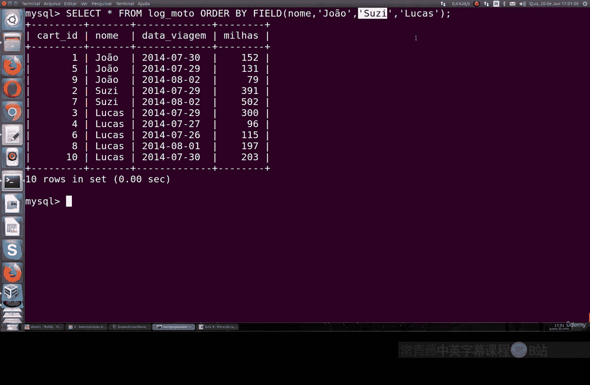

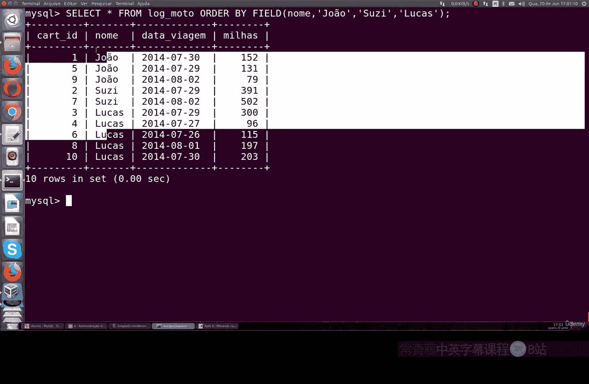

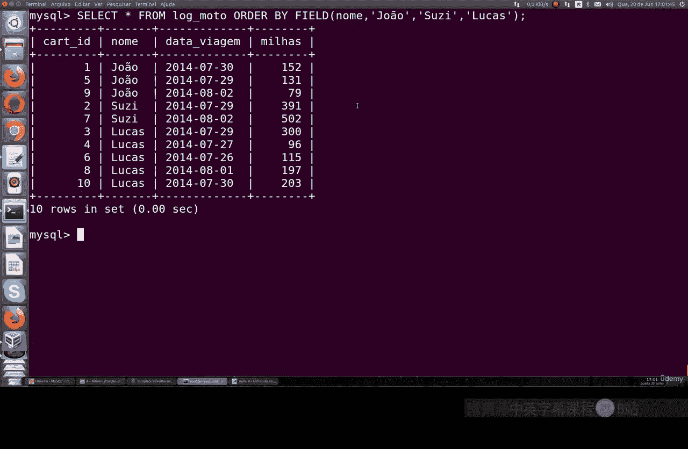

本节课中我们一起学习了MySQL中的四种字符串相关数据类型：固定长度的`CHAR`、可变长度的`VARCHAR`、用于限定值列表的`ENUM`以及用于存储结构化数据的`JSON`。理解它们各自的特性、存储差异和适用场景，对于设计高效、可读的数据库表结构至关重要。`VARCHAR`和`JSON`在现代开发中尤为常用。