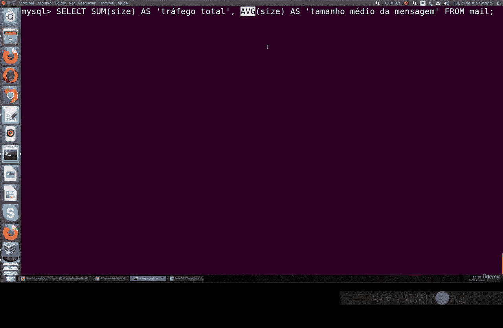
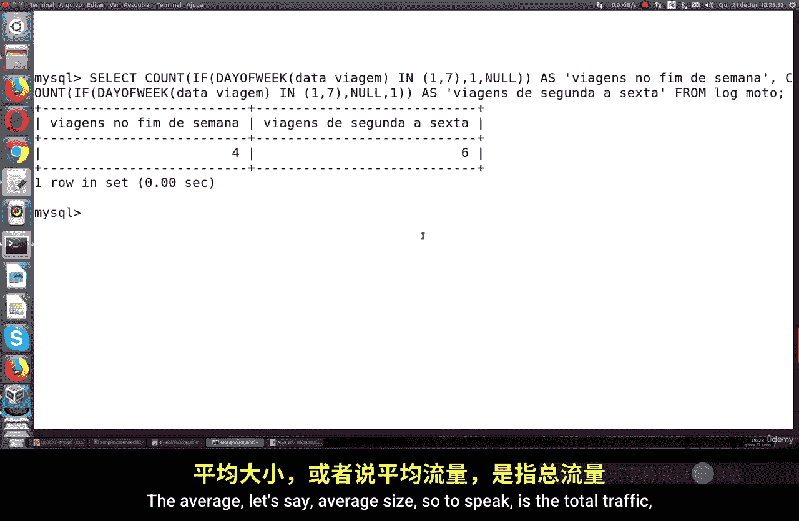
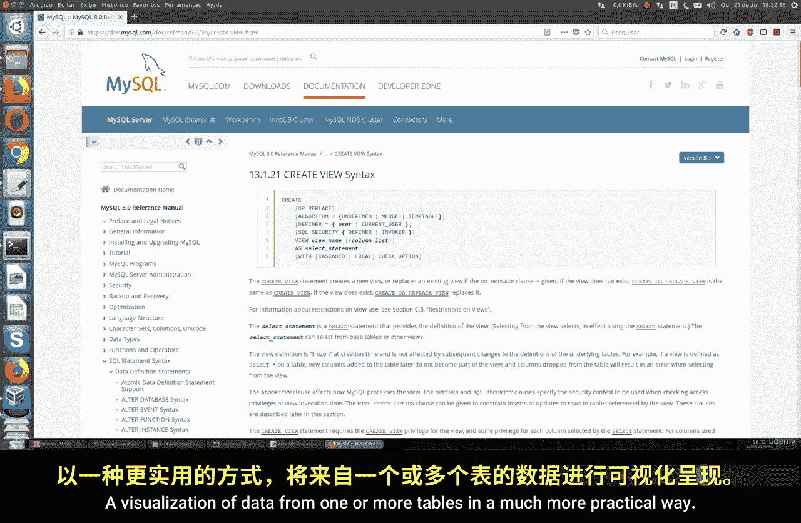
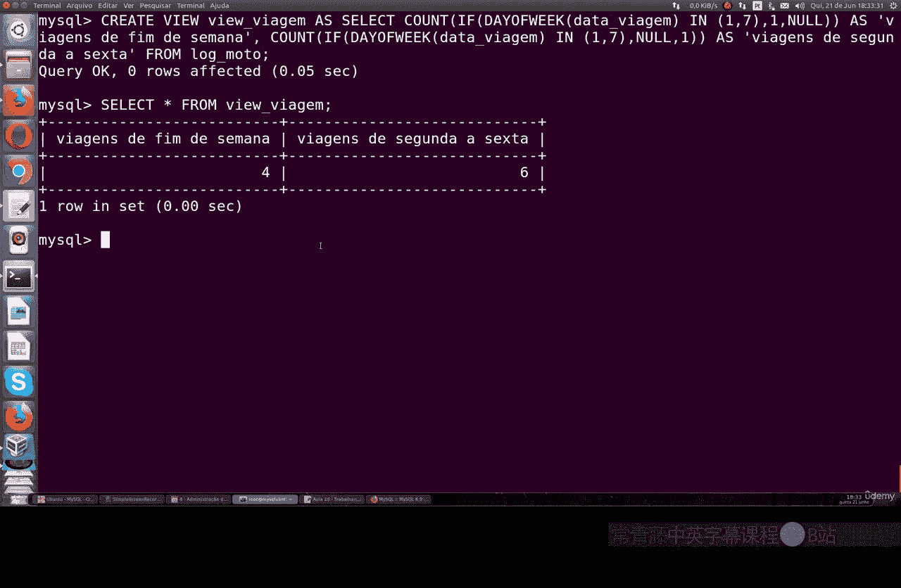
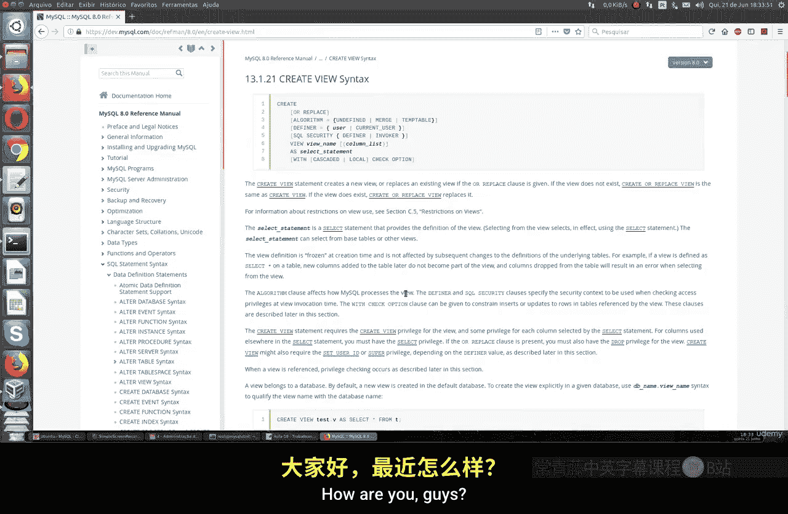

# 053：聚合函数与视图

在本节课中，我们将学习如何在 MySQL 中使用聚合操作符，例如 `COUNT`、`SUM`、`AVG`、`MAX` 和 `MIN`。这些函数对于数据分析至关重要，能够帮助我们回答诸如“总数是多少？”、“平均值是多少？”或“范围是什么？”等问题。我们还将介绍如何创建和使用视图来简化复杂的查询。

## 概述

聚合函数允许我们对一组数据进行计算并返回单个汇总值。这在电子商务、销售分析或任何需要数据汇总的场景中非常有用。例如，你可以计算月度总销售额、找出最贵的产品或统计特定条件下的记录数量。

## 使用 COUNT 函数计数

`COUNT` 函数用于统计表中记录的数量。其基本语法是 `SELECT COUNT(column_name) FROM table_name;`。使用星号 (`*`) 可以统计所有行。

以下是使用 `COUNT` 函数的一些示例：

*   **统计总司机数**：`SELECT COUNT(*) FROM moto_log;` 此查询返回司机总数。
*   **统计行驶超过200英里的司机数**：`SELECT COUNT(*) FROM moto_log WHERE miles > 200;` 此查询返回满足条件的司机数量。
*   **按星期几统计行程**：`SELECT COUNT(*) AS trips_on_saturday FROM moto_log WHERE day_of_week = 7;` 此查询统计星期六的行程数量。在MySQL中，星期天是1，星期六是7。
*   **区分工作日与周末行程**：你可以组合条件来分别统计工作日（周一至周五）和周末（周六、周日）的行程数量。

## 使用 MAX 和 MIN 函数查找极值

`MAX` 和 `MIN` 函数分别用于查找指定列中的最大值和最小值。

上一节我们介绍了如何计数，本节中我们来看看如何查找数据中的边界值。

以下是使用 `MAX` 和 `MIN` 函数的示例：

*   **查找最旧和最新的邮件时间**：`SELECT MIN(send_time) AS oldest, MAX(send_time) AS newest FROM mail_log;` 此查询返回邮件发送时间的最早值和最晚值。
*   **查找最小和最大的邮件大小**：`SELECT MIN(size) AS smallest, MAX(size) AS largest FROM mail_log;` 此查询返回邮件大小的最小值和最大值。



## 使用 SUM 和 AVG 函数进行求和与求平均



`SUM` 函数计算某列值的总和，而 `AVG` 函数计算其平均值。

了解了如何查找极值后，我们继续学习如何对数据进行求和与求平均计算。

以下是相关示例：

*   **计算总流量和平均邮件大小**：
    ```sql
    SELECT SUM(size) AS total_traffic,
           AVG(size) AS average_size
    FROM mail_log;
    ```
    此查询计算邮件流量的总和以及每封邮件的平均大小。
*   **计算司机日均行驶里程**：
    ```sql
    SELECT SUM(miles) / COUNT(DISTINCT travel_date) AS avg_miles_per_day
    FROM moto_log;
    ```
    此查询先计算总里程，再除以不同的出行天数，得到日均里程。

## 使用 DISTINCT 关键字消除重复

`DISTINCT` 关键字用于返回唯一不同的值。当与 `COUNT` 结合使用时，可以统计不重复项的数量。

在汇总数据时，我们经常需要处理重复值。`DISTINCT` 关键字可以帮助我们轻松解决这个问题。

以下是使用 `DISTINCT` 的示例：


*   **查看不重复的司机姓名**：`SELECT DISTINCT driver_name FROM moto_log;` 此查询列出所有不重复的司机名字。
*   **统计不重复的司机数量**：`SELECT COUNT(DISTINCT driver_name) FROM moto_log;` 此查询精确统计有多少位不同的司机。
*   **查找并排序不重复的发件人-收件人对**：`SELECT DISTINCT sender, recipient FROM correspondence ORDER BY sender;` 此查询列出所有唯一的发件人和收件人组合，并按发件人排序。

## 创建和使用视图简化查询



视图（View）是基于 SQL 语句结果集的虚拟表。它封装了复杂的查询逻辑，使得数据访问更加简单和安全。

执行多次复杂查询可能会很繁琐。视图可以将这些查询保存为一个虚拟表，便于重复使用。

创建视图的语法是 `CREATE VIEW view_name AS SELECT ...;`。

例如，创建一个统计工作日和周末行程的视图：
```sql
CREATE VIEW trip_summary AS
SELECT
    COUNT(CASE WHEN day_of_week IN (1,7) THEN 1 END) AS weekend_trips,
    COUNT(CASE WHEN day_of_week BETWEEN 2 AND 6 THEN 1 END) AS weekday_trips
FROM moto_log;
```
创建后，你可以像查询普通表一样使用视图：`SELECT * FROM trip_summary;`。视图会自动执行底层定义的所有计算。



## 总结



本节课中我们一起学习了 MySQL 中几个核心的聚合操作符：用于计数的 `COUNT`、用于求和的 `SUM`、用于求平均的 `AVG`、以及用于查找极值的 `MAX` 和 `MIN`。我们还学习了如何使用 `DISTINCT` 关键字来消除重复值，以及如何通过创建 `视图` 来封装和简化复杂的查询逻辑。掌握这些工具将极大地增强你从数据库中提取和分析汇总信息的能力。