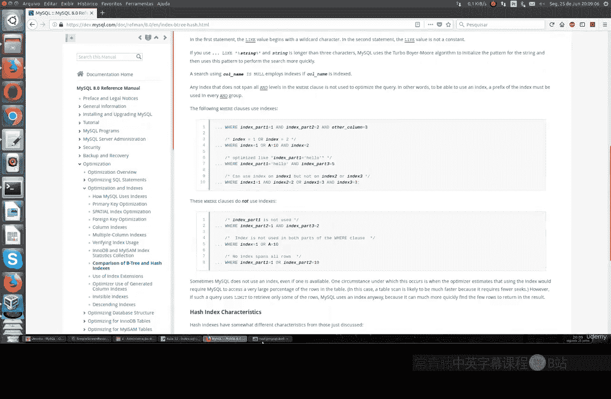
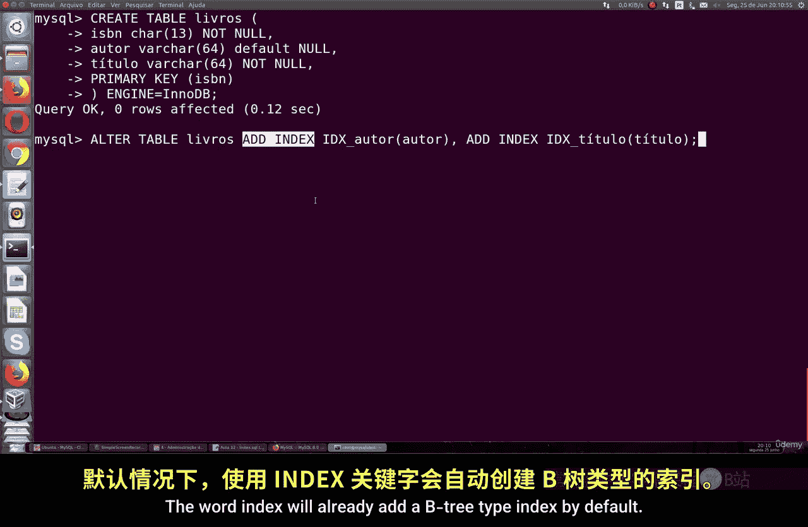
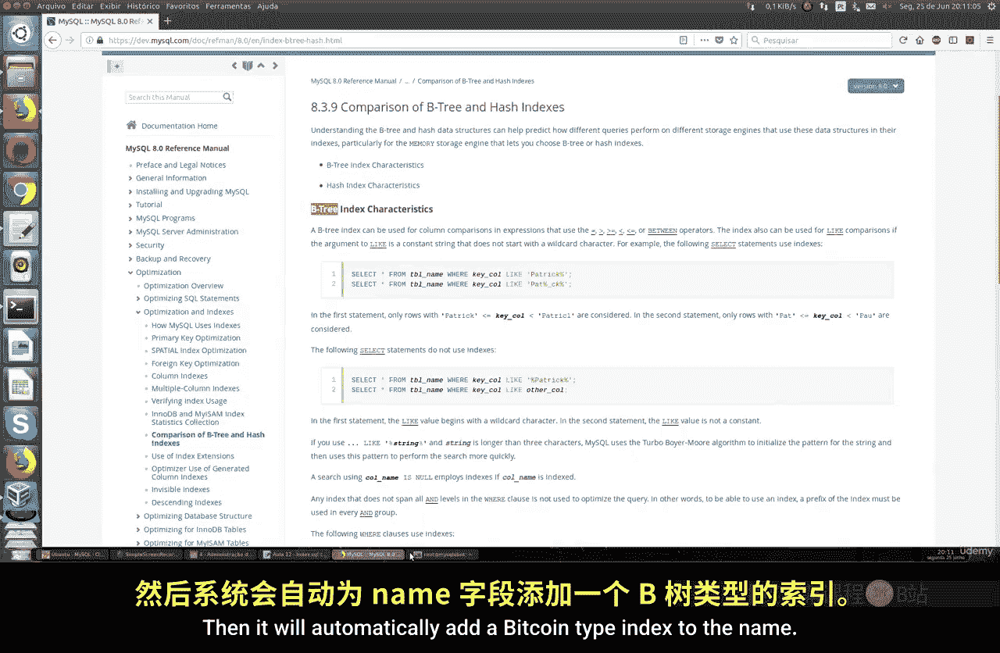
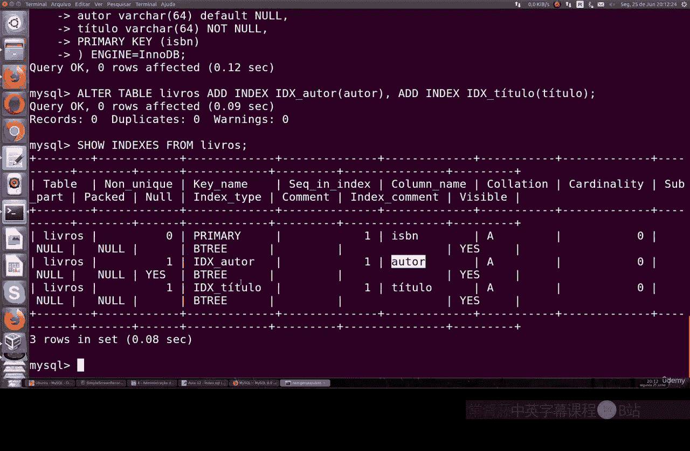
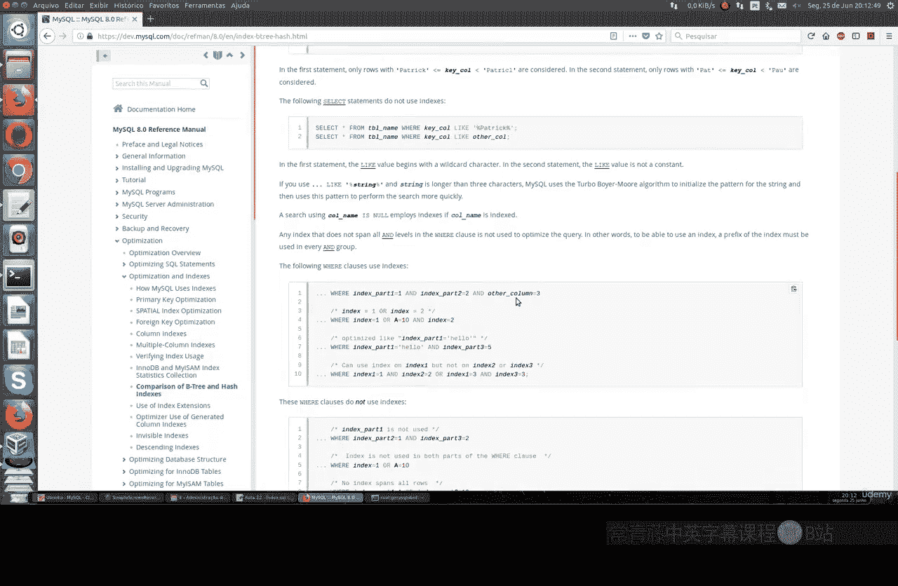
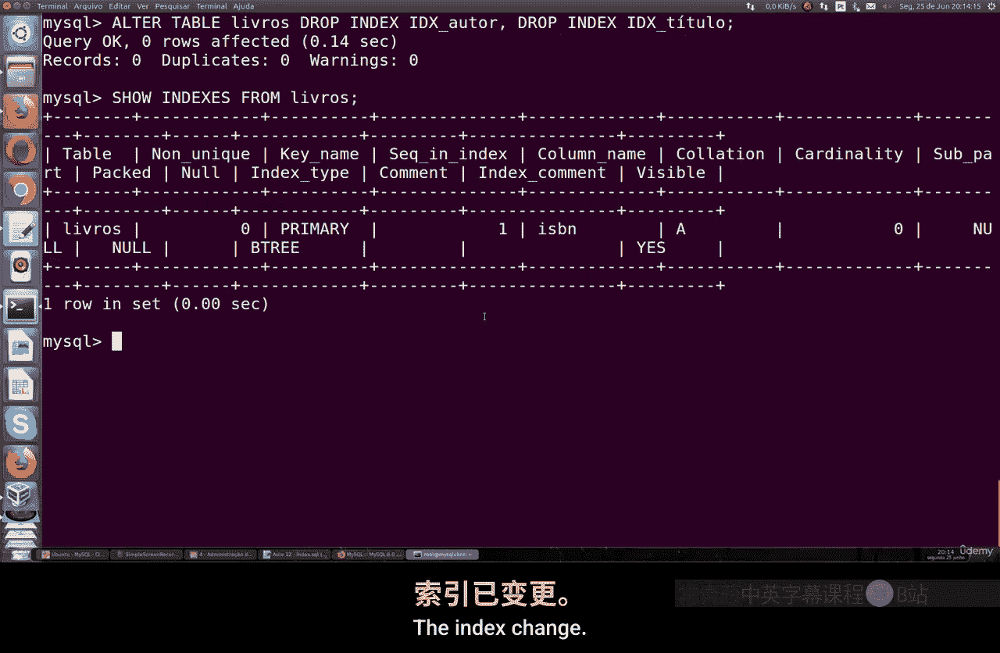
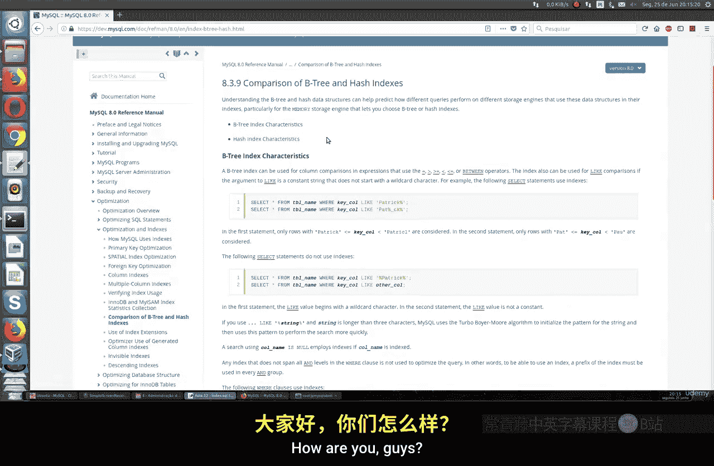

# 055：使用索引 🗂️

在本节课中，我们将要学习数据库中的索引。索引是一种信息结构，用于提升查询执行速度、优化数据检索过程。理解并学会使用索引，对于高效管理数据库至关重要。

## 什么是索引？

上一节我们介绍了数据库的基本操作，本节中我们来看看索引。索引是数据库中的一种信息结构，旨在优化查询速度。它类似于一本书的目录或索引，让你能直接定位到特定内容，而无需逐页翻阅。

在数据库中，索引的作用是**组织数据**、**节省查询时间**并**优化性能**。当你执行查询时，如果相关列已建立索引，数据库引擎能更快地找到所需数据。

## MySQL中的索引类型

以下是MySQL中最常用的索引类型：

*   **B-Tree索引**：这是MySQL默认且最常用的索引类型。它适用于全值匹配、范围查询和排序操作。
*   **哈希索引**：仅用于精确匹配（`=` 操作符）的查询，使用场景相对较少。
*   **全文索引**：用于对文本内容进行全文搜索，现在使用频率较低。



对于初学者，我们主要需要掌握的是**如何创建索引**、**如何查看索引**以及**如何利用索引进行工作**。

## 创建索引

要创建索引，你必须拥有对目标表的 `ALTER TABLE` 权限。

让我们通过一个例子来学习。假设我们有一个名为 `test` 的数据库，其中包含一些表。现在，我们创建一个新表 `books`：

```sql
CREATE TABLE books (
    isbn VARCHAR(20) PRIMARY KEY,
    author VARCHAR(100),
    title VARCHAR(255)
) ENGINE=InnoDB;
```

在这个表中，`isbn`（国际标准书号）被设为主键。主键本身也是一种索引。然而，我们经常需要根据作者和书名进行查询，因此为这两列创建索引会非常有用。

创建索引的语法如下：



```sql
ALTER TABLE table_name ADD INDEX index_name (column_name);
```



为 `books` 表的 `author` 和 `title` 列创建索引：

```sql
ALTER TABLE books ADD INDEX idx_author (author);
ALTER TABLE books ADD INDEX idx_title (title);
```

你也可以在一条语句中创建多个索引：

```sql
ALTER TABLE books
ADD INDEX idx_author (author),
ADD INDEX idx_title (title);
```



执行后，使用以下命令查看表的索引信息：



```sql
SHOW INDEX FROM books;
```

你将看到除了主键 `isbn` 的索引外，还有 `author` 和 `title` 列的索引。当你执行包含 `WHERE author='...'` 或 `WHERE title='...'` 的 `SELECT` 语句时，数据库就会利用这些索引来加速查询。

## 删除索引

如果不再需要某个索引，可以将其删除。删除索引的语法是：

```sql
ALTER TABLE table_name DROP INDEX index_name;
```

例如，删除我们刚才创建的索引：



```sql
ALTER TABLE books DROP INDEX idx_author, DROP INDEX idx_title;
```

再次运行 `SHOW INDEX FROM books;`，你会发现只剩下主键索引。

## 索引使用建议

*   你可以为任意列创建索引，没有数量限制。
*   为经常出现在 `WHERE`、`JOIN` 或 `ORDER BY` 子句中的列创建索引，收益最大。
*   对于包含数百万行数据的大表，合理使用索引对性能提升至关重要。
*   需要注意的是，虽然索引能极大提高查询速度，但也会增加数据插入、更新和删除时的开销，因为索引本身也需要维护。



本节课中我们一起学习了数据库索引的核心概念。我们了解了索引的作用类似于书目录，能显著提升查询效率。重点掌握了在MySQL中如何使用 `ALTER TABLE ... ADD INDEX` 命令创建B-Tree索引，以及如何使用 `DROP INDEX` 命令删除索引。记住，为主键和常用的查询条件列创建索引，是优化数据库性能的基本手段。