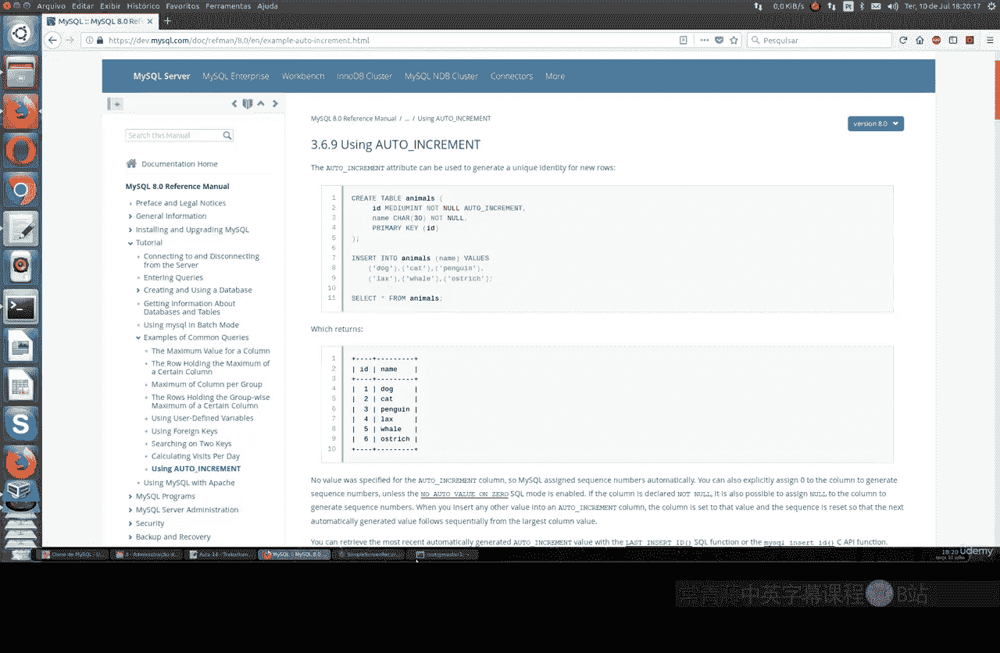
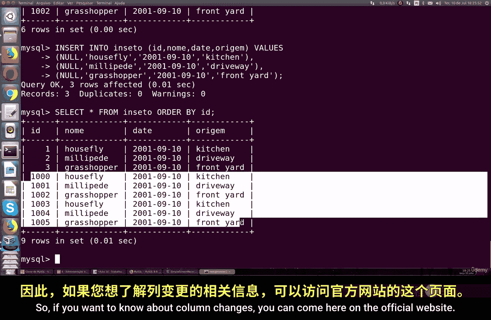
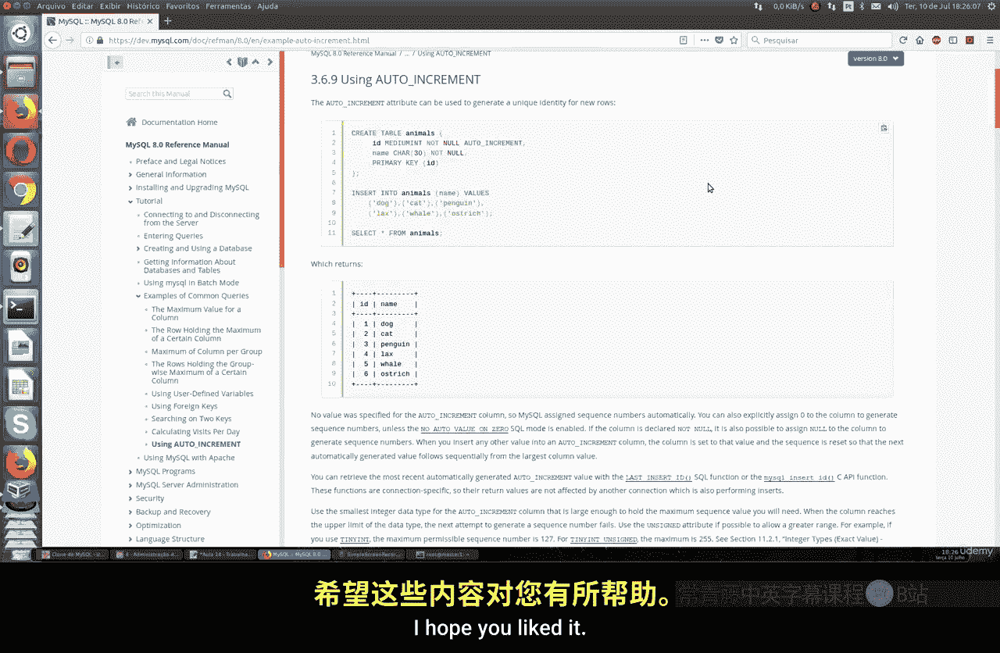

# 056：使用 AUTO_INCREMENT 🚀

在本节课中，我们将学习 MySQL 中 `AUTO_INCREMENT` 属性的基本用法。这是一个非常基础但极其常用的功能，它允许数据库自动为表中的新记录生成唯一的、递增的 ID 值，通常用作主键。

许多应用程序和系统都要求表中的每一行包含一个唯一值，而主键正是这样的唯一标识。使用 `AUTO_INCREMENT` 是生成和使用 ID 最简单的方式。

## 创建带有 AUTO_INCREMENT 的表

首先，我们来看如何创建一个包含 `AUTO_INCREMENT` 列的表。以下是一个创建名为 `insect` 的表的示例。

```sql
CREATE TABLE insect (
    id INT UNSIGNED NOT NULL AUTO_INCREMENT,
    name VARCHAR(30) NOT NULL,
    date DATE NOT NULL,
    origin VARCHAR(30) NOT NULL,
    PRIMARY KEY (id)
);
```

在这个表中，`id` 列被定义为无符号整数、非空且具有 `AUTO_INCREMENT` 属性，它同时被指定为主键。其他列用于存储昆虫的名称、日期和来源信息。



## 插入数据

当向带有 `AUTO_INCREMENT` 列的表中插入数据时，我们无需为 `id` 列指定值，MySQL 会自动为我们生成。

以下是插入数据的示例：

```sql
INSERT INTO insect (id, name, date, origin) VALUES
    (NULL, 'Housefly', '2023-10-01', 'Kitchen'),
    (NULL, 'Honeybee', '2023-10-02', 'Garden'),
    (NULL, 'Ladybug', '2023-10-03', 'Park');
```

执行 `SELECT * FROM insect;` 查询，你会看到 `id` 值已自动生成为 1, 2, 3。

## 重置 AUTO_INCREMENT 序列

有时，你可能需要重置表的 `AUTO_INCREMENT` 计数器，例如从一个新的数字开始。这需要谨慎操作，特别是当该表与其他表有关联时。

以下是重置 `AUTO_INCREMENT` 值的步骤：

1.  首先，删除现有的 `id` 列。
2.  然后，重新添加一个具有 `AUTO_INCREMENT` 属性的 `id` 列。

具体操作如下：

```sql
-- 第一步：删除 id 列
ALTER TABLE insect DROP COLUMN id;

-- 第二步：重新添加 id 列并设置为 AUTO_INCREMENT
ALTER TABLE insect ADD id INT UNSIGNED NOT NULL AUTO_INCREMENT FIRST,
    ADD PRIMARY KEY (id);
```

执行后，`id` 列会重新生成，序列从 1 开始。表中的其他数据保持不变。

## 设置 AUTO_INCREMENT 的起始值

上一节我们介绍了如何重置序列，本节中我们来看看如何设置 `AUTO_INCREMENT` 从一个特定的数字开始，而不是默认的 1。

你可以使用 `ALTER TABLE` 语句来修改表的 `AUTO_INCREMENT` 起始值。

例如，将 `insect` 表的自增起始值设置为 1000：

```sql
ALTER TABLE insect AUTO_INCREMENT = 1000;
```

设置之后，新插入的记录其 `id` 将从 1000 开始递增。

```sql
INSERT INTO insect (name, date, origin) VALUES ('Dragonfly', '2023-10-04', 'Pond');
```



执行 `SELECT * FROM insect;`，你会看到新记录的 `id` 是 1000。

## 总结



本节课中我们一起学习了 MySQL `AUTO_INCREMENT` 的核心用法。我们掌握了如何创建带有自增主键的表、如何插入数据让数据库自动生成ID、以及如何重置或修改自增序列的起始值。这个功能对于确保数据唯一性和简化开发至关重要，是数据库设计中的基础工具。