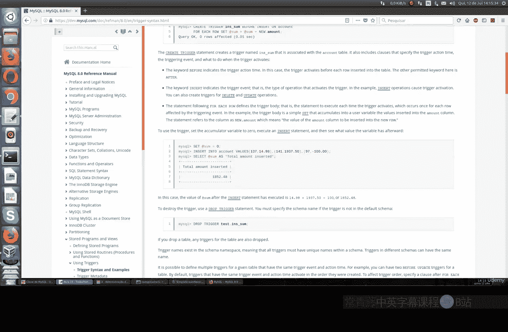
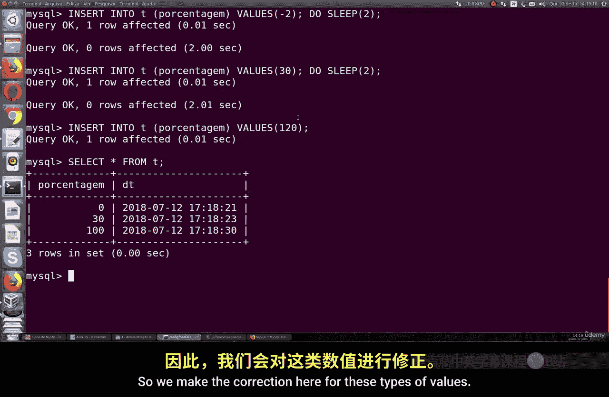
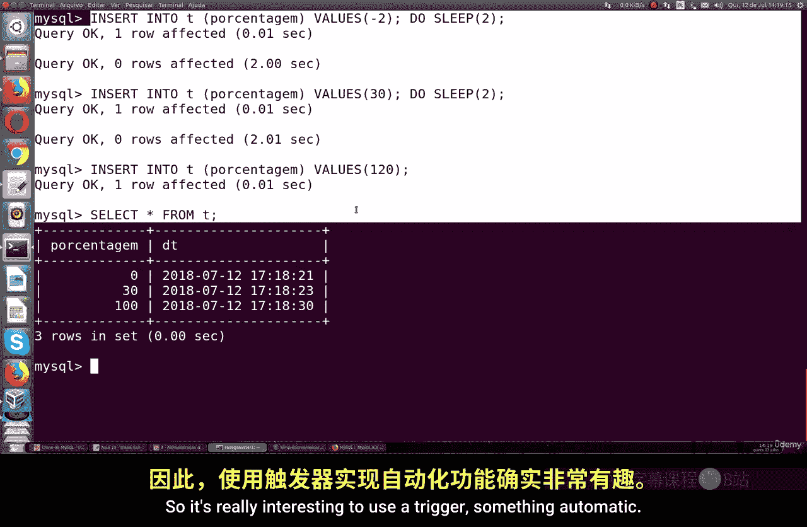
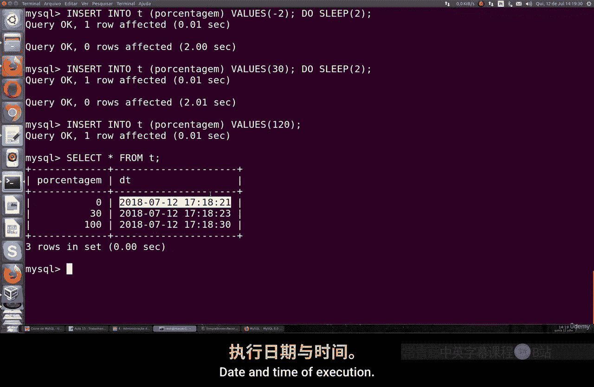
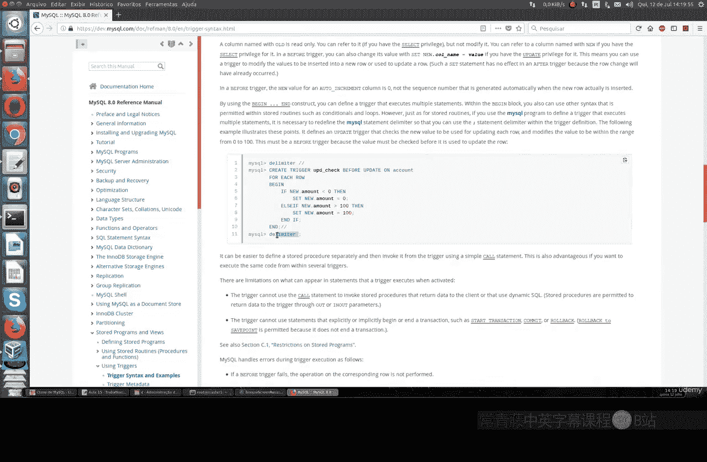

# 057：触发器详解 🚀

在本节课中，我们将要学习 MySQL 中的触发器。触发器是一种与特定表关联的存储程序，它会在执行某些数据操作语言语句时自动激活。通过本教程，你将学会如何创建和使用触发器来实现数据验证和自动化处理。

## 什么是触发器？

触发器是一种存储程序，它总是与数据库中的特定表相关联。触发器被设置为在某些 DML 语句执行时自动激活。根据官方文档，这些语句包括 `INSERT`、`DELETE` 或 `UPDATE`。

触发器可以配置为在命令处理每一行数据之前或之后激活。触发器的定义中包含一个语句，该语句在触发器激活时执行。因此，我们可以选择激活或不激活触发器。

触发器能够检查并修改待插入或用于更新行的新数据值。这一功能被广泛使用，它允许你强制执行数据完整性约束。例如，如果你需要处理一个范围在 0 到 100 之间的百分比值，触发器可以帮助你实现数据过滤。

## 触发器语法结构



以下是创建触发器的基本语法。我们将通过一个具体的例子来演示其用法。

```sql
CREATE TRIGGER trigger_name
BEFORE | AFTER INSERT | UPDATE | DELETE
ON table_name FOR EACH ROW
BEGIN
    -- 触发器执行的语句
END;
```

## 实战演练：创建一个触发器

上一节我们介绍了触发器的基本概念和语法，本节中我们来看看如何创建一个实际的触发器。

首先，我们使用 `Test` 数据库，并创建一个名为 `T` 的表。这个表包含两列：一列用于存储百分比值，另一列用于存储日期和时间。

```sql
CREATE TABLE T (
    percentage INT,
    dt DATETIME
);
```

接下来，我们将使用 `DELIMITER` 命令。这是一个系统命令，用于告诉 MySQL 你的脚本从何处开始，到何处结束。

以下是创建触发器的完整步骤：

1.  使用 `CREATE TRIGGER` 命令。
2.  创建一个在向表 `T` 插入新行**之前**激活的触发器。
3.  在每一行插入开始之前，我们自动设置时间戳。
4.  同时，我们检查插入的百分比值是否在 0 到 100 的范围内。

以下是具体的 SQL 代码：

```sql
DELIMITER $$

CREATE TRIGGER before_insert_percentage
BEFORE INSERT ON T
FOR EACH ROW
BEGIN
    -- 自动为 datetime 列提供时间戳值
    SET NEW.dt = NOW();

    -- 如果尝试插入的百分比值超出 0 到 100 的范围，则自动修正为最接近的边界值
    IF NEW.percentage < 0 THEN
        SET NEW.percentage = 0;
    ELSEIF NEW.percentage > 100 THEN
        SET NEW.percentage = 100;
    END IF;
END$$

DELIMITER ;
```

## 测试触发器功能

触发器创建完成后，让我们测试它的功能。我们将尝试插入一些超出范围的值，观察触发器是否会自动修正。

以下是插入测试数据的语句：



```sql
INSERT INTO T (percentage) VALUES (-2), (30), (120);
```



执行上述插入操作后，触发器会自动进行修正：
*   值 `-2` 会被修正为最接近的边界值 `0`。
*   值 `120` 会被修正为最接近的边界值 `100`。
*   值 `30` 在范围内，保持不变。

这样，如果有人插入了错误的值，触发器会自动将其修正到有效范围内（例如，百分比必须是 0% 到 100%）。同时，`dt` 列也会被自动填入当前的时间戳。



## 总结与最佳实践

本节课中我们一起学习了 MySQL 触发器的创建和使用。触发器是一种强大的自动化工具，可以用于数据验证、自动填充字段等场景。



以下是使用触发器时的一些关键点：
*   触发器总是与特定的表关联。
*   它可以在 `INSERT`、`UPDATE` 或 `DELETE` 操作之前或之后执行。
*   使用 `DELIMITER` 命令来定义复杂的触发器语句块。
*   在触发器内部，可以使用 `NEW` 关键字来访问和修改待插入或更新的数据行。

当你在工作中使用触发器时，建议查阅官方文档以获取更详细的信息。`DELIMITER` 命令在处理包含多条语句的触发器时非常有用。