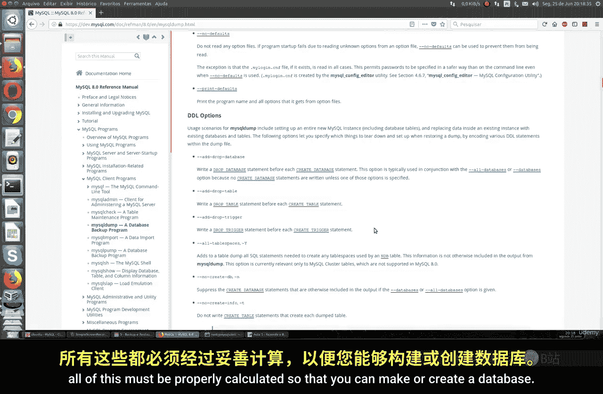
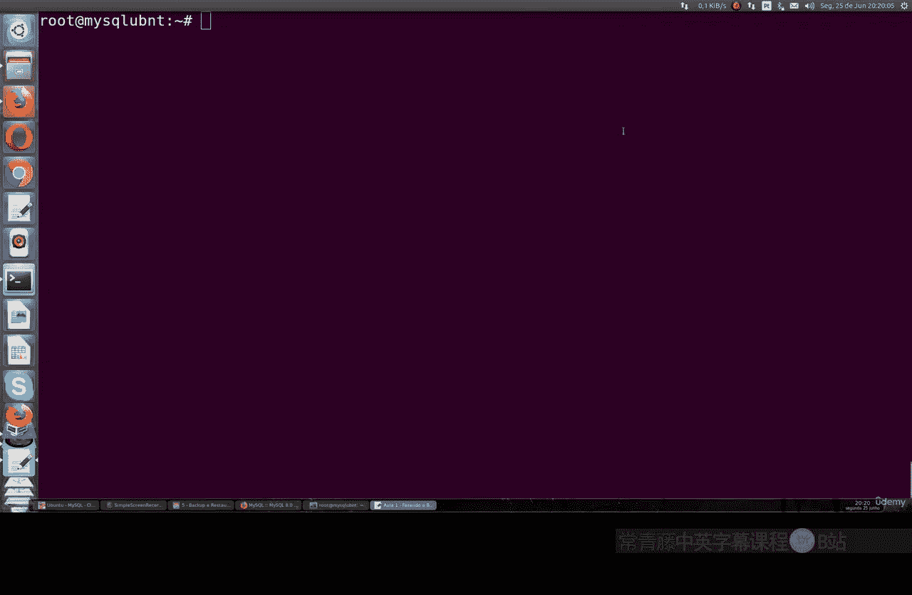
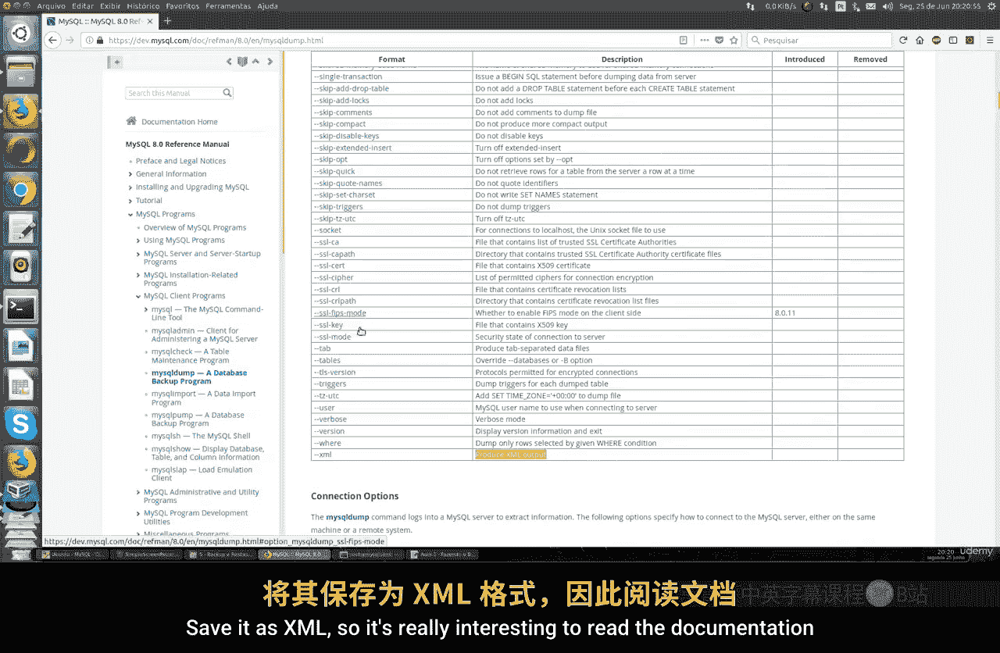
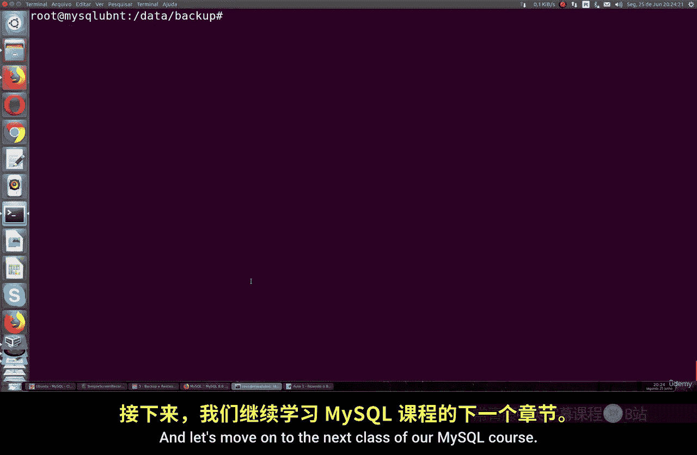

# 058：备份与恢复 📂

在本节课中，我们将要学习 MySQL 数据库的备份与恢复操作。备份是数据库管理中的核心任务，它不仅仅是执行一个简单的命令，更涉及策略规划、资源评估和系统架构考量。我们将从基础命令开始，逐步了解如何安全、高效地备份和恢复数据。

上一节我们介绍了数据库的基本操作，本节中我们来看看如何保护这些数据。

## 概述：备份的重要性与考量

在 MySQL 或任何类型的数据库中，备份工作远比一个简单的 `mysqldump` 命令复杂。它需要你制定备份策略，并了解系统的具体需求。MySQL 的存储引擎架构、Linux 操作系统环境、集群配置以及性能调优都会对备份产生影响。

本质上，备份就是通过 `mysqldump` 等工具，在不中断服务的情况下，将数据库或表复制到一个 SQL 文件中。你可以为备份文件加密、设置密码，但这些额外的安全措施会增加备份所需的时间和系统资源。因此，你必须精确计算这些因素。

你需要了解备份的时机，例如，是否只在从服务器上进行备份以避免主服务器停机或消耗过多 CPU 和内存资源。所有这些都必须经过妥善规划，才能建立一套安全可靠的备份流程。



## 基础备份操作

现在，让我们通过一个名为 `test` 的示例数据库来演示基础备份操作。

首先，我们查看当前存在的数据库：
```sql
SHOW DATABASES;
```
你会看到一些标准数据库，如 `mysql`，以及我们课程中使用的 `test` 数据库。

我们将为 `test` 数据库创建一个备份。使用 `mysqldump` 命令的基本格式如下：
```bash
mysqldump -u [用户名] -p [数据库名] > [备份文件名].sql
```
执行此命令时，系统会提示你输入相应用户的密码。该命令会生成一个包含指定数据库所有结构和数据的 SQL 文件。

备份成功完成后，你就得到了一个完整的数据库快照文件。



## 备份命令的进阶选项

`mysqldump` 命令提供了许多可选参数，以适应不同的备份需求。

以下是部分常用选项：
*   **`--all-databases`**：备份所有数据库。
*   **`--host`**：指定要连接的 MySQL 主机。
*   **`--password`**：在命令中直接提供密码（需注意安全）。
*   **`--xml`**：将备份输出为 XML 格式。
*   **`--result-file`**：指定备份文件的保存路径和名称。



例如，你可以将备份保存到 Linux 系统的其他目录，比如一个专门用于存储备份的独立硬盘或网络位置：
```bash
mysqldump -u root -p --all-databases > /mnt/backup_drive/full_backup.sql
```
阅读官方文档以了解所有可选功能是非常有益的。

## 备份特定表与自动化脚本

你不仅可以备份整个数据库，还可以只备份特定的表。

例如，只备份 `test` 数据库中的 `customers` 表：
```bash
mysqldump -u root -p test customers > test_customers_backup.sql
```

最实用的方法是创建自动化备份脚本。你可以在 Linux 上编写一个 Shell 脚本，定期执行备份任务。

以下是一个简单的脚本示例：
```bash
#!/bin/bash
# 定义变量
BACKUP_DIR="/path/to/backup"
MYSQL_USER="backup_user"
MYSQL_PASSWORD="your_password"
DATE=$(date +%Y%m%d_%H%M%S)

# 执行备份
mysqldump -u $MYSQL_USER -p$MYSQL_PASSWORD --all-databases > $BACKUP_DIR/full_backup_$DATE.sql

# 输出完成信息
echo "Backup completed successfully at $BACKUP_DIR/full_backup_$DATE.sql"
```
这个脚本会为备份文件加上时间戳，并保存到指定目录。你可以在互联网上找到更多功能丰富的脚本范例。

## 总结

本节课中我们一起学习了 MySQL 数据库备份与恢复的基础知识。我们了解到备份是一个需要综合考虑策略、资源和系统架构的复杂过程。我们掌握了使用 `mysqldump` 工具进行完整数据库备份、特定表备份的方法，并探讨了利用各种选项定制备份流程，以及通过编写脚本实现备份自动化的可能性。



记住，可靠的备份是数据安全的最后一道防线，务必根据你的实际业务需求来设计和测试备份方案。