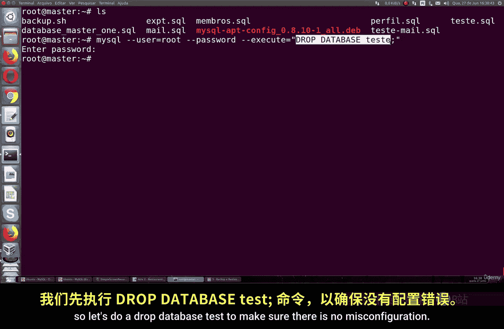
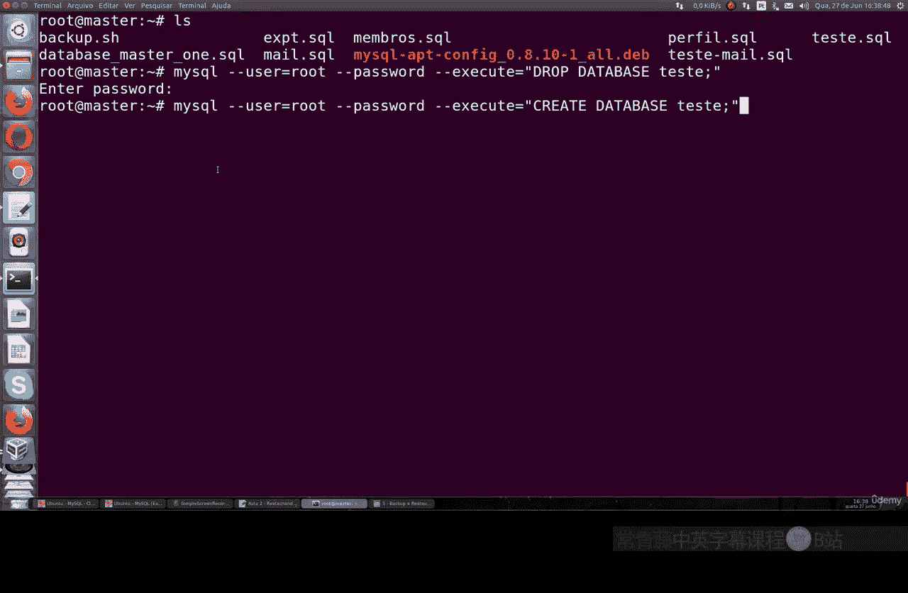
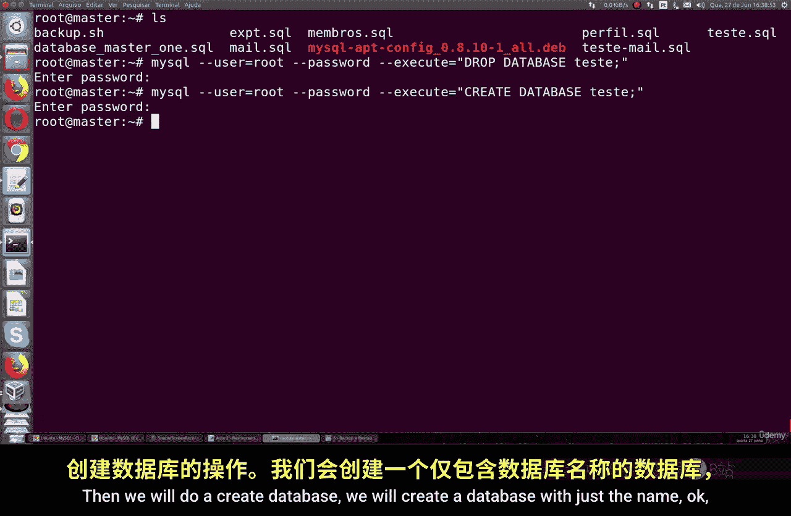
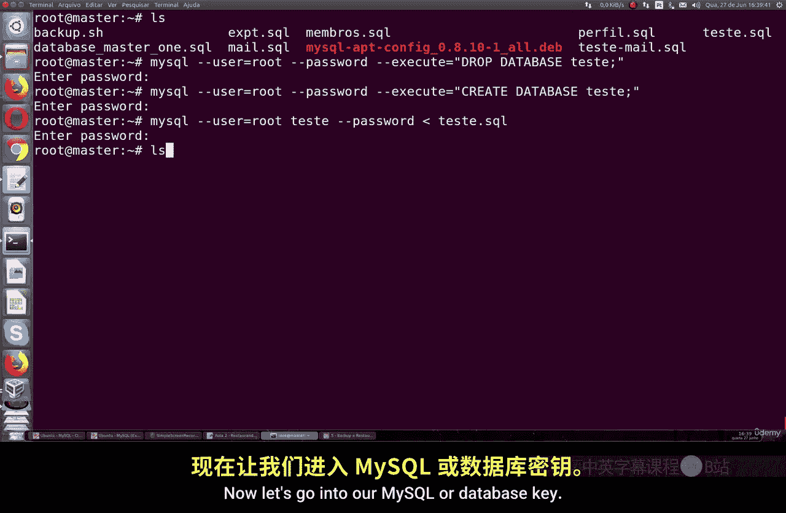
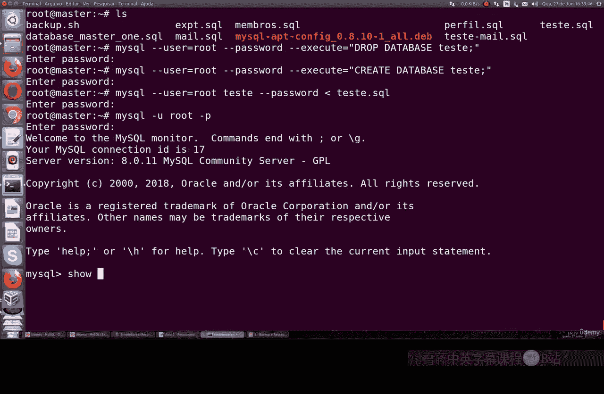
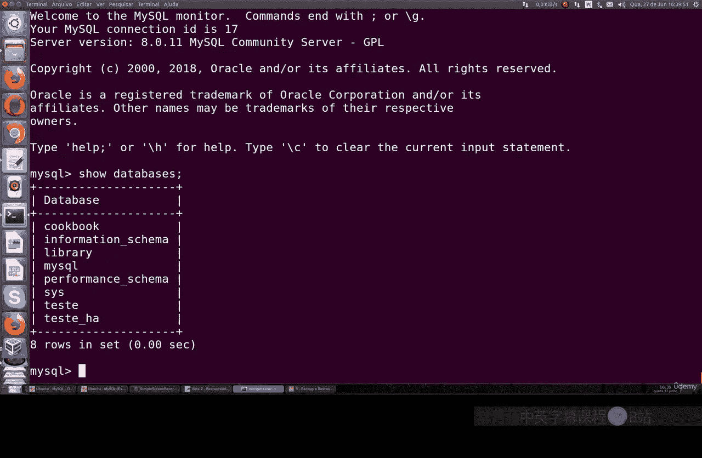
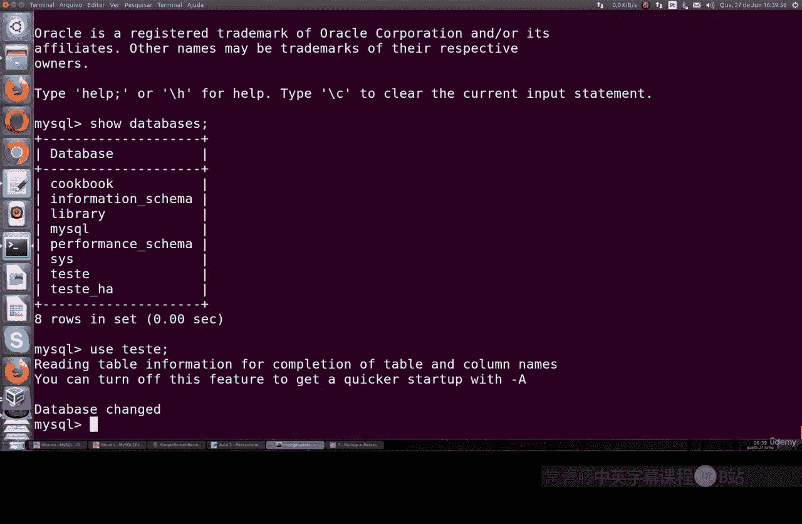

# 059：恢复MySQL数据库备份 🗄️


在本节课中，我们将学习如何使用命令行恢复一个MySQL数据库备份。我们将从删除现有数据库开始，然后创建新的空数据库，最后使用备份文件进行恢复。


---

上一节我们介绍了数据库备份，本节中我们来看看如何从备份文件中恢复数据。

假设你有一个名为 `sql_test.sql`  的备份文件，它包含一个名为 `test` 的数据库及其数据。以下是恢复该数据库的完整步骤。



首先，我们需要确保目标数据库不存在或处于可被替换的状态。我们将删除可能已存在的 `test` 数据库。

```bash
mysql -u root -p -e "DROP DATABASE IF EXISTS test;"
```
执行此命令会删除名为 `test` 的数据库，以避免在恢复时产生冲突。

接下来，我们需要创建一个新的、同名的空数据库，以便将备份数据导入其中。





```bash
mysql -u root -p -e "CREATE DATABASE test;"
```
此命令创建了一个名为 `test`  的新数据库，目前它是空的。

现在，我们已经准备好从备份文件恢复数据了。以下是恢复过程的核心命令。

```bash
mysql -u root -p test < sql_test.sql
```
这个命令的含义是：使用 `root` 用户登录MySQL，将 `sql_test.sql` 文件中的SQL语句导入到 `test` 数据库中。





命令执行成功后，我们可以登录MySQL来验证数据是否已成功恢复。



以下是验证步骤：
1.  登录MySQL命令行：`mysql -u root -p`
2.  切换到 `test` 数据库：`USE test;`
3.  查看所有表：`SHOW TABLES;`
4.  此时，你应该能看到备份文件中包含的所有数据表都已成功恢复。




如果您的备份文件是压缩格式（例如 `.sql.gz`），则需要先解压，再进行恢复。可以使用以下管道命令一步完成：

```bash
gunzip < backup.sql.gz | mysql -u root -p test
```
这个命令先将压缩文件解压，然后将输出的SQL语句直接传递给 `mysql` 命令进行恢复，非常高效。

---


本节课中我们一起学习了恢复MySQL数据库备份的完整流程。我们首先清理了旧数据库环境，然后创建了新的目标数据库，最后使用 `mysql < backup_file.sql` 命令成功恢复了数据。记住，对于压缩备份，需要先解压或使用管道命令。掌握这些步骤，你就能轻松应对数据库的恢复工作。