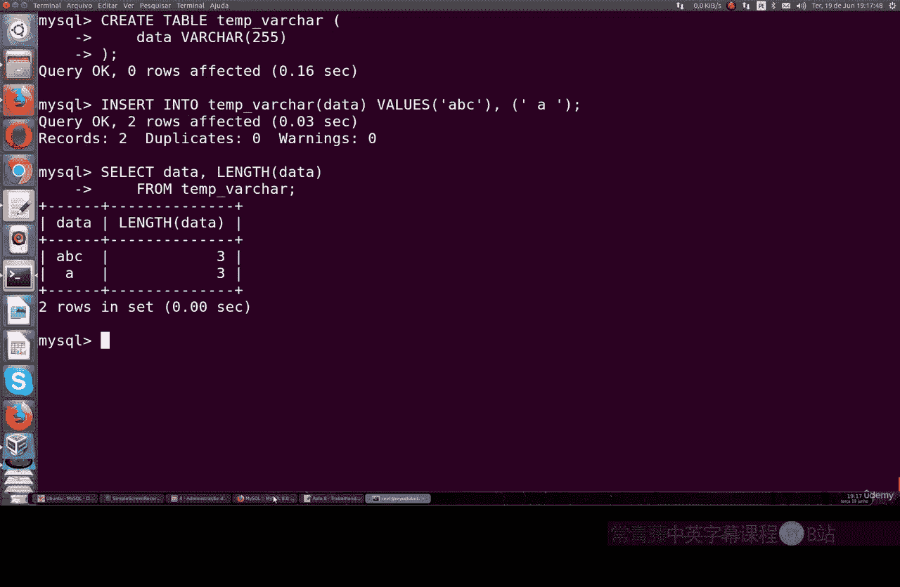
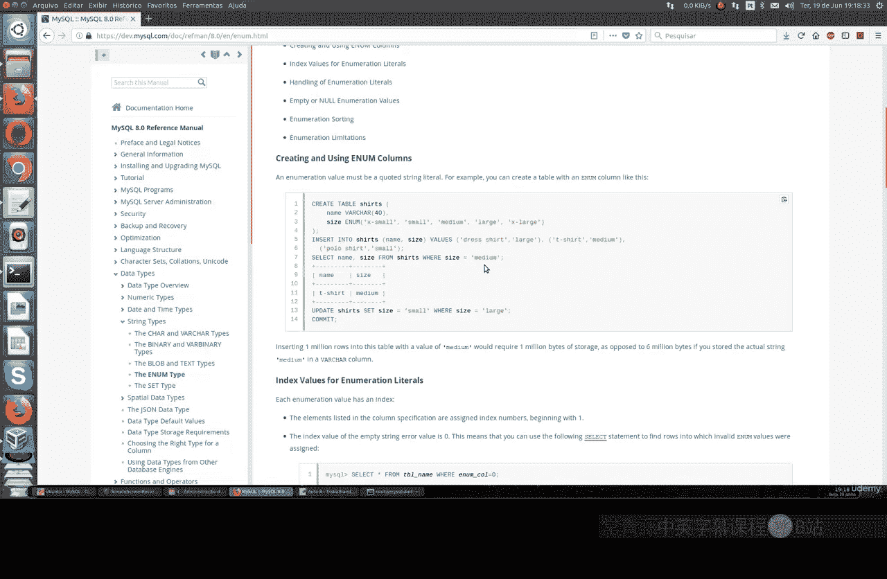
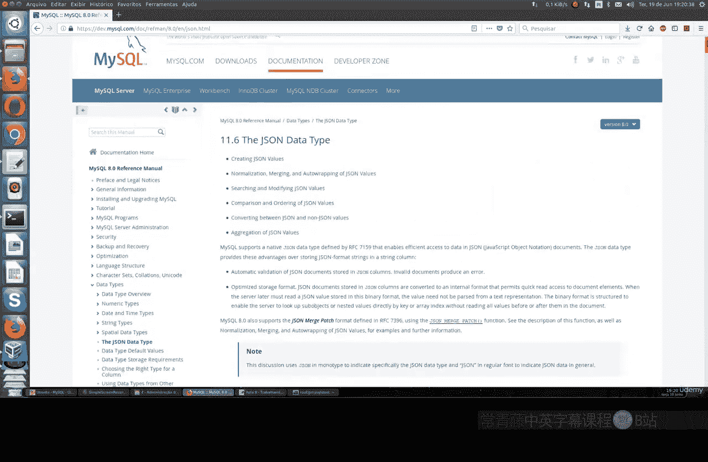
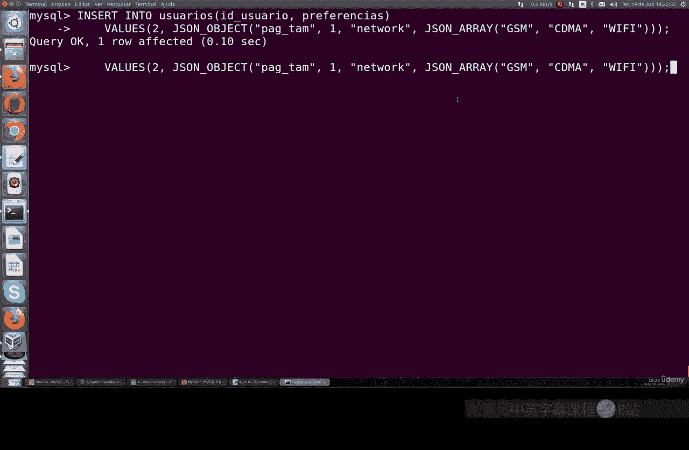
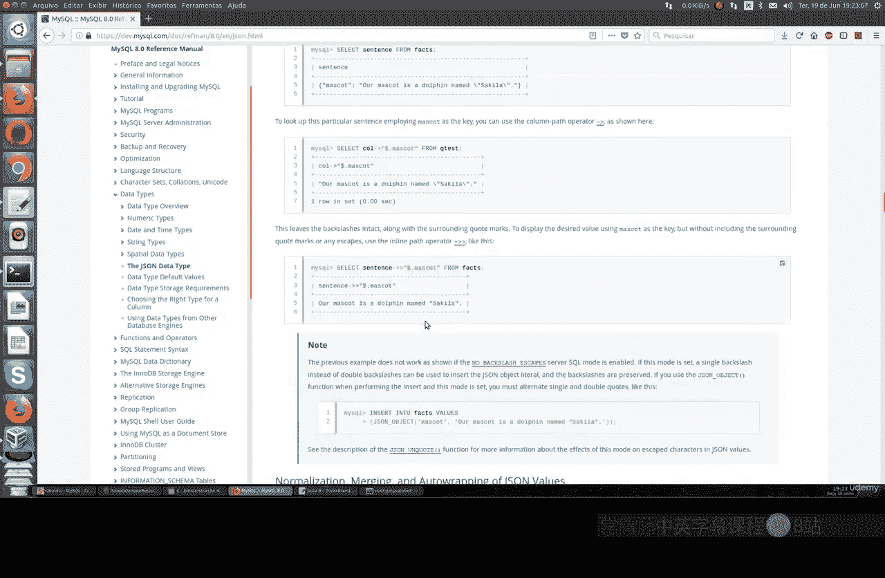
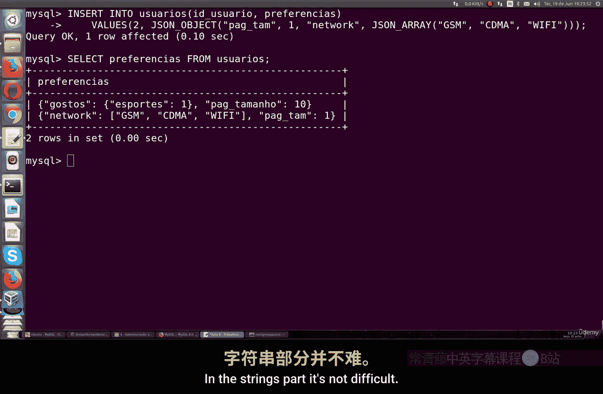
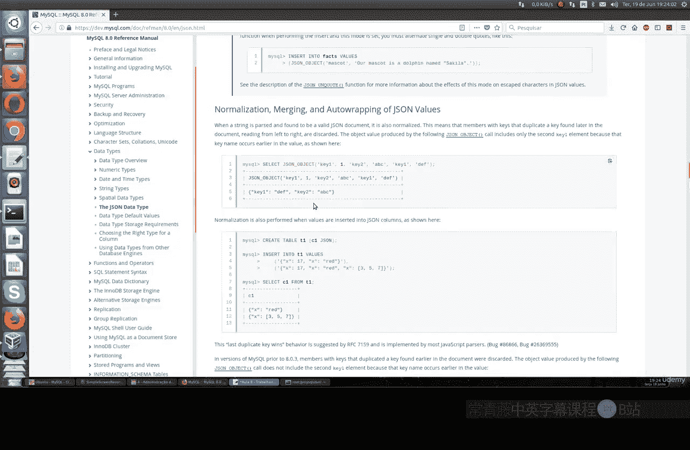
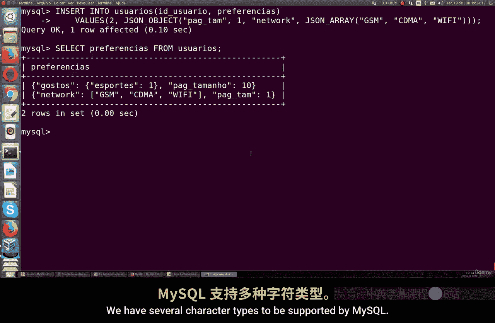

# 060：处理字符串 🧵

在本节课中，我们将学习MySQL中字符串数据类型的处理。我们将探讨`CHAR`、`VARCHAR`、`ENUM`和`JSON`等类型，了解它们的特性、区别以及适用场景。

## CHAR与VARCHAR类型

上一节我们介绍了字符串的基本概念，本节中我们来看看`CHAR`和`VARCHAR`这两种最基础的字符串类型。

`CHAR`和`VARCHAR`都是MySQL中用于存储字符的数据类型。它们的主要区别在于存储方式。

*   `CHAR`类型在声明时需要指定一个固定的最大字符长度，例如`CHAR(3)`。无论实际存储的字符串多短，它都会占用指定长度的存储空间，不足的部分会用空格填充。
*   `VARCHAR`类型也声明最大长度，例如`VARCHAR(255)`，但它只存储实际的字符串内容，不会用空格填充，因此通常更节省存储空间。



以下是它们的核心区别公式：
*   **CHAR存储** = 声明长度 × 字符字节数
*   **VARCHAR存储** = 实际字符长度 × 字符字节数 + 长度标识位

让我们通过创建表来观察这一区别。

```sql
-- 创建一个使用CHAR类型的表
CREATE TABLE test_char (col CHAR(3));
-- 插入数据
INSERT INTO test_char VALUES ('ABC'), ('AB');
-- 查询数据及其长度
SELECT col, LENGTH(col) FROM test_char;
```
执行上述代码，你会发现即使插入`'AB'`（两个字符），`LENGTH()`函数返回的长度也可能是3，因为`CHAR`类型填充了空格。



```sql
-- 创建一个使用VARCHAR类型的表
CREATE TABLE test_varchar (col VARCHAR(255));
-- 插入相同数据
INSERT INTO test_varchar VALUES ('ABC'), ('AB');
-- 查询数据及其长度
SELECT col, LENGTH(col) FROM test_varchar;
```
此时，`'AB'`的长度显示为2，因为`VARCHAR`只存储有效字符。

因此，在大多数需要可变长度字符串的场景下，使用`VARCHAR`更为高效。

## ENUM枚举类型


了解了变长与定长字符串后，我们来看一种特殊的字符串类型——`ENUM`。



`ENUM`是一个字符串对象，其值从创建时定义的一个允许值列表中选择。它本质上是将一个有限的选项集合映射为数字进行存储，使得数据存储非常紧凑，查询输出也更易读。

以下是`ENUM`类型的一个应用示例：
```sql
-- 创建一个包含ENUM类型的表
CREATE TABLE students (
    name VARCHAR(50),
    subject ENUM('Arts', 'Commerce', 'Science')
);
-- 插入数据，值必须为枚举项之一
INSERT INTO students VALUES ('Alice', 'Science'), ('Bob', 'Commerce');
-- 查询数据
SELECT * FROM students;
-- 更新数据
UPDATE students SET subject = 'Science' WHERE name = 'Bob';
```
`ENUM`每个值通常只占用1-2个字节的存储空间。相比之下，如果使用`VARCHAR`存储同样的选项，会占用更多空间。例如，一百万条记录使用`ENUM`可能只需约1MB，而使用`VARCHAR`可能需要数MB。

## JSON类型

最后，我们探讨一下在现代应用中日益重要的`JSON`类型。



虽然MySQL不是像MongoDB那样的原生文档数据库，但它提供了对`JSON`数据类型的良好支持，允许你以键值对的形式存储和查询结构化数据。



以下是使用`JSON`类型的基本操作：
```sql
-- 创建包含JSON列的表
CREATE TABLE users (
    id INT NOT NULL,
    preferences JSON
);
-- 插入JSON数据
INSERT INTO users (id, preferences) VALUES (1, '{"theme": "dark", "language": "zh_CN"}');
-- 查询JSON数据
SELECT * FROM users;
-- 从JSON字段中提取特定键的值
SELECT id, preferences->'$.theme' AS theme FROM users;
```
MySQL提供了丰富的`JSON`函数，用于验证、查询、修改`JSON`文档中的数据，例如`JSON_VALID()`、`JSON_EXTRACT()`、`JSON_SET()`等，使得处理半结构化数据变得非常灵活。

---



**本节课总结**：
本节课我们一起学习了MySQL中处理字符串的几种核心数据类型。
1.  我们比较了**`CHAR`**（定长，空格填充）和**`VARCHAR`**（变长，节省空间）的区别与选用原则。
2.  我们介绍了**`ENUM`**类型，它适合存储固定选项，具有存储紧凑和查询可读性高的优点。
3.  我们探讨了**`JSON`**类型，它使MySQL能够有效存储和查询灵活的键值对结构化数据。





掌握这些字符串类型的特点，能帮助你在设计数据库表时，根据数据的实际特征选择最合适、最高效的数据类型。