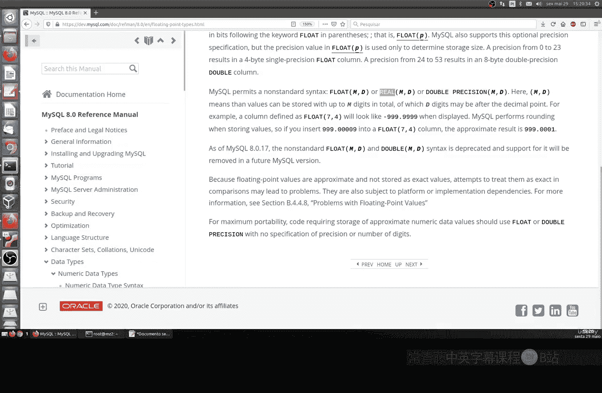
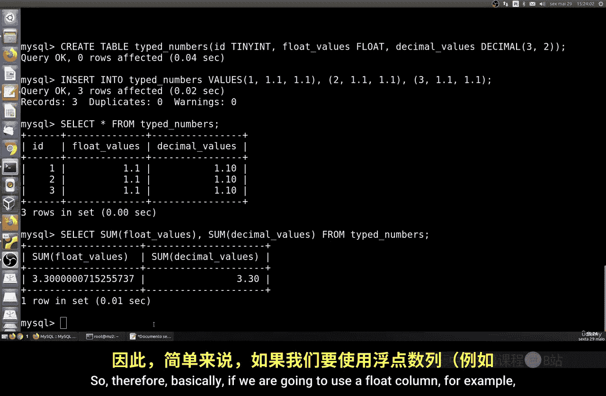
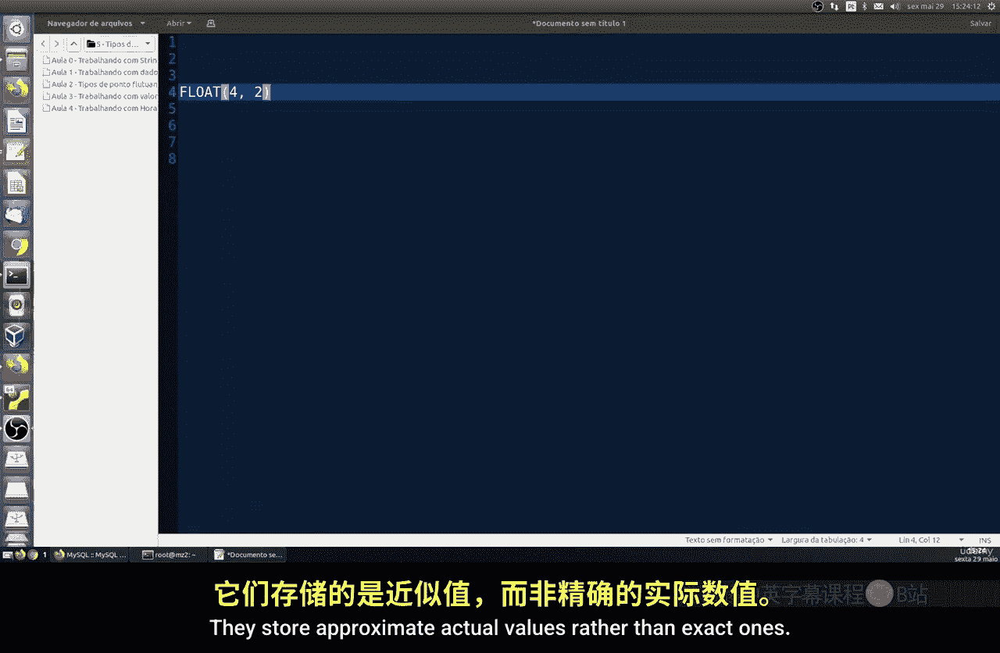

# 062：浮点类型 🧮

在本节课中，我们将要学习 MySQL 中的浮点类型。浮点类型用于在计算中表示实数，这对于测量连续值（如重量、高度或速度）非常有用。MySQL 提供了两种浮点数据类型来存储这类值：`FLOAT` 和 `DOUBLE`。

## 浮点类型概述

浮点类型用于表示实数。实数对于测量连续值非常有用，例如重量、高度或速度。MySQL 有两种浮点数据类型来存储这些类型的值：`FLOAT` 和 `DOUBLE`。

那么，它们之间有什么区别呢？对于浮点数，精度是一个非常重要的因素，因为它定义了数据的准确性和重要性。MySQL 支持单精度或双精度的浮点数，因此得名 `FLOAT` 或 `DOUBLE`。

基本上，存储单精度浮点数（`FLOAT` 类型）需要消耗 4 个字节。而存储双精度浮点数（`DOUBLE` 类型）则需要大约 8 个字节。在 MySQL 中，我们还有另一个命令 `REAL`，它是 `DOUBLE PRECISION` 的同义词。此外，如果启用了 `REAL_AS_FLOAT` 模式，`REAL` 也会被当作 `FLOAT` 使用，至少在之前的版本中是如此。但基本上，`DOUBLE` 就是 `FLOAT` 的双精度版本。

## 浮点类型与 DECIMAL 类型的区别



它们与 `DECIMAL` 类型有些相似，但 `DECIMAL` 是数字类型，可以存储精确值直到某个最大值。而浮点类型（例如 `FLOAT`）存储的是近似值而非精确值。这就是两者之间的主要区别。在之前的课程中，我们学习了 `DECIMAL` 和 `NUMERIC` 类型，以更好地理解它们在实际中的应用。

## 实践操作：创建表并插入数据

以下是理论部分，现在让我们在 MySQL 数据库中实际操作。首先，我们创建一个表。

```sql
CREATE TABLE tipo_numerico (
    id INT,
    valor_float FLOAT,
    valor_decimal DECIMAL(3,2)
);
```

接下来，我们向表中插入数据。

```sql
INSERT INTO tipo_numerico VALUES
(1, 1.1, 1.1),
(2, 1.1, 1.1),
(3, 1.1, 1.1);
```

然后，我们执行查询来查看表中的数据。

```sql
SELECT * FROM tipo_numerico;
```

最后，我们计算存储值的总和。

```sql
SELECT SUM(valor_float), SUM(valor_decimal) FROM tipo_numerico;
```

这里我们可以看到，首先我们创建了一个包含 `FLOAT` 和 `DECIMAL` 类型列的表，以便可视化并比较两者。然后，我们向名为 `valor_float` 和 `valor_decimal` 的两列插入了相同的值。接着，我们运行了一个 `SELECT` 查询来搜索存储值的总和。结果显示，`FLOAT` 列的总和始终是近似值，而不是精确值。而 `DECIMAL` 列则给出了精确值，包括插入的小数位。这就是我们在精度使用上的主要区别。

## 浮点类型的精度指定



基本上，标准 SQL 允许我们指定 `FLOAT` 列的精度，单位是位。我们在配置中使用 `FLOAT(P)` 来指定精度。例如，精度从 0 到 23 会得到一个 4 字节的 `FLOAT` 列；精度从 24 到 53 则会得到一个 `DOUBLE` 类型的格式，即 8 字节。因此，如果我们使用 `FLOAT` 列，这些浮点数存储的是近似的实际值，而不是精确值。

## 浮点数的比较问题



例如，不同类型的 CPU 和操作系统可能以不同的方式评估浮点数。这基本上意味着，我们将要存储在列中的浮点值可能与以整数形式表示的实际值不同。因此，在比较中使用浮点数时，这一点变得至关重要。

让我们通过另一个例子来说明这一点。我们创建另一个表。

```sql
CREATE TABLE exemplo (
    id INT,
    coluna1 DOUBLE,
    coluna2 DOUBLE
);
```

插入一些相似的值。

```sql
INSERT INTO exemplo VALUES
(1, 5.3, 5.3),
(2, -3.0, -3.0),
(3, 0.1, 0.1),
(4, 0.0, 0.0),
(5, 2.3, 2.3);
```

然后，我们执行查询来计算总和并比较。

```sql
SELECT id, coluna1, coluna2, (coluna1 + coluna2) AS soma FROM exemplo;
```

如果我们想确保相似的值被正确比较，我们必须精确地比较它们与预定义数字的差异。在这个例子中，如果我们修改 `HAVING` 子句来检查条件，例如使用 `ABS(coluna1 - coluna2)`，它将返回基本预期的输出。

## 总结


本节课中我们一起学习了 MySQL 中的浮点类型。我们了解了 `FLOAT` 和 `DOUBLE` 类型的区别，以及它们与 `DECIMAL` 类型在存储精确值和近似值方面的不同。通过实际操作，我们看到了浮点数在求和和比较时可能产生的精度问题。理解这些差异对于在数据库中选择合适的数据类型至关重要。