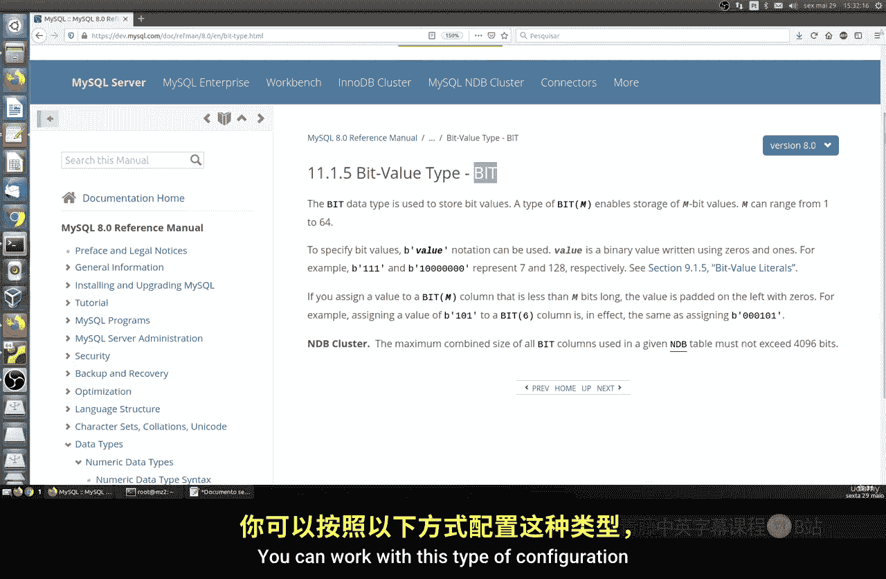
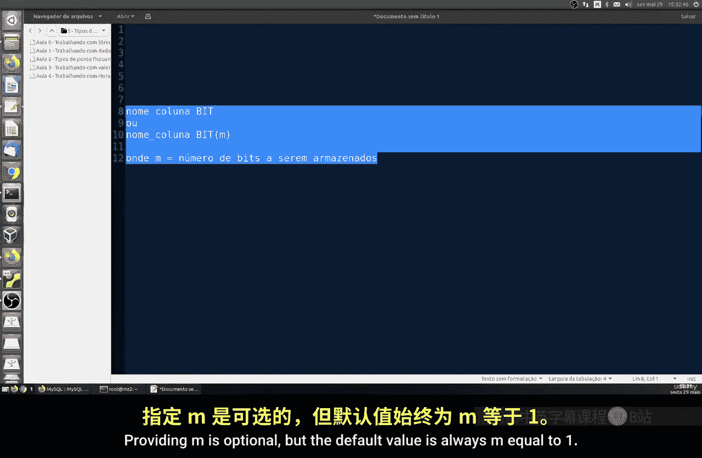
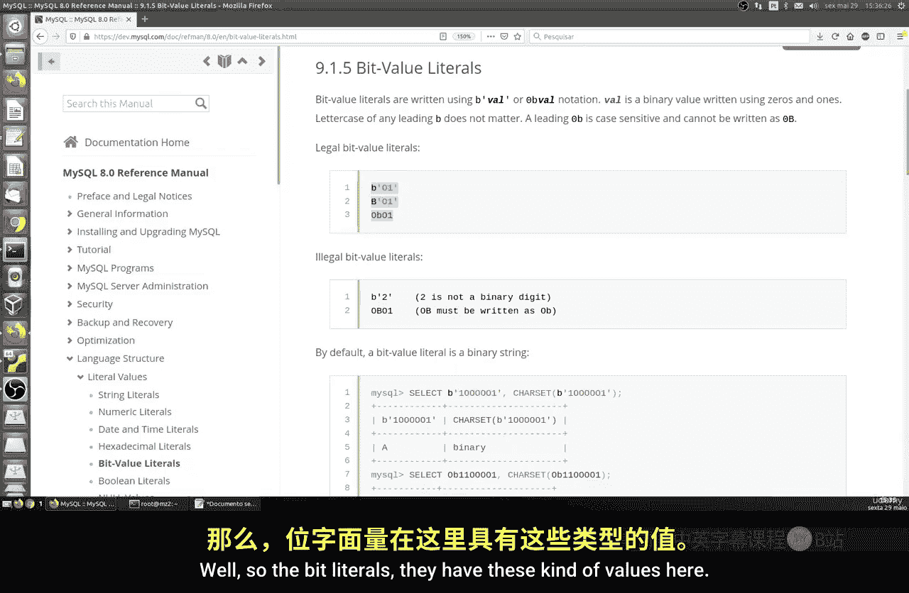
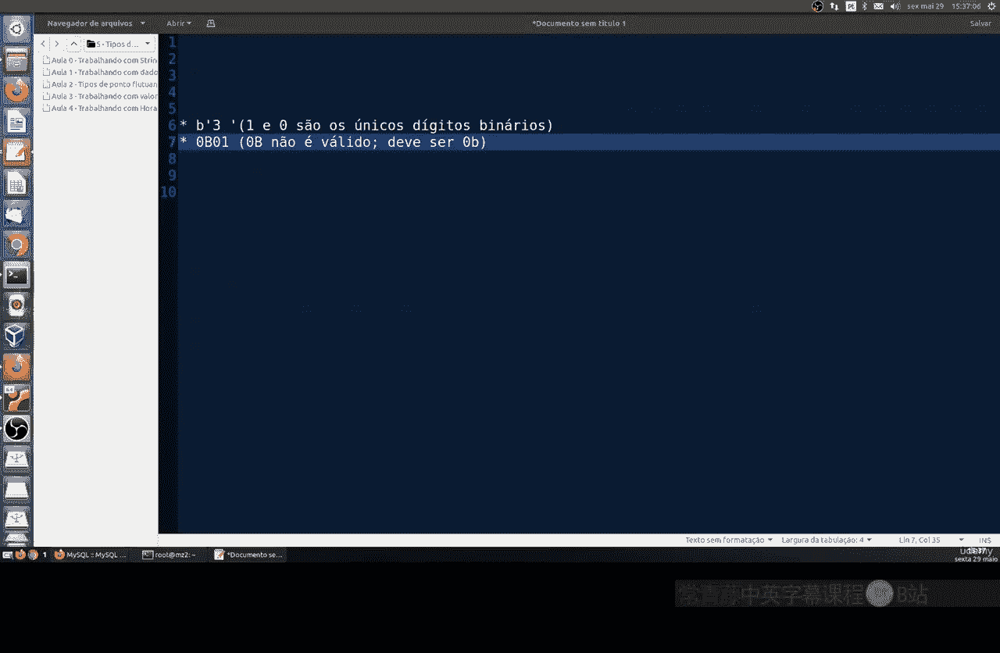
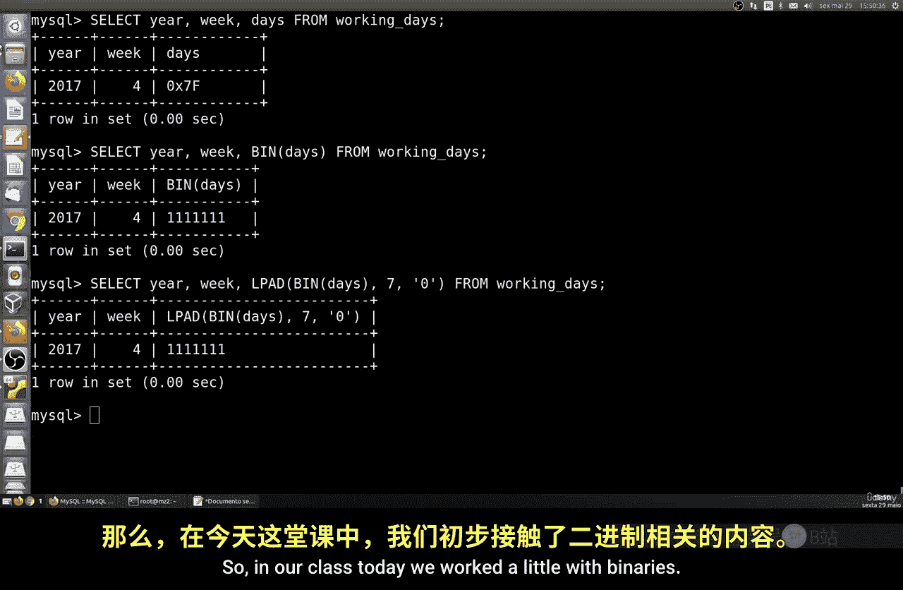
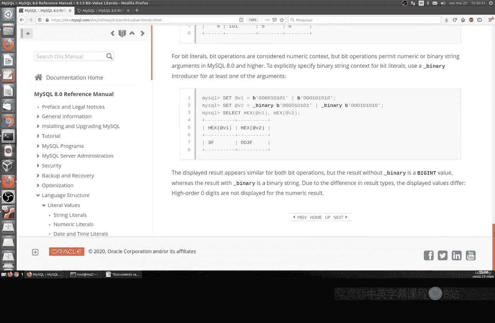

# 063：处理位值 🧮

在本节课中，我们将学习如何在 MySQL 中处理位（bit）数据类型。位数据本质上是二进制值，用于表示是/否、真/假或 0/1 状态。我们将了解如何定义位类型的列，如何插入和查询位数据，以及一些相关的注意事项。



## 位数据类型简介



位（BIT）是 MySQL 中的一种数据类型，用于存储二进制位值。一个位只能是 0 或 1，这对应于布尔逻辑中的假（FALSE）或真（TRUE）。

在 MySQL 中定义位类型列的基本语法如下：
```sql
column_name BIT
```
或者，可以指定存储的位数（M）：
```sql
column_name BIT(M)
```
其中，`M` 表示要存储的位数，其取值范围是 1 到 64。如果省略 `M`，则默认值为 1。

## 创建示例表

为了更直观地理解，让我们创建一个示例表。假设我们要记录每年的每一周中，哪些天是工作日。

以下是创建 `working_days` 表的 SQL 语句：
```sql
CREATE TABLE working_days (
    year INT,
    week INT,
    day BIT(7),
    PRIMARY KEY (year, week)
);
```
在这个表中，`year` 和 `week` 列是整数，而 `day` 列被定义为 `BIT(7)`，这意味着它可以存储一个 7 位的二进制值，例如 `b‘1111100’`，其中每一位可以代表一周中的一天（例如，1 表示工作日，0 表示非工作日）。


## 插入位数据

我们可以使用二进制字面量（binary literals）向位类型的列插入数据。MySQL 支持两种表示法：`b‘value’` 或 `0bvalue`。

例如，要向 `day` 列插入二进制值 `10111`（即十进制 23），可以使用以下语句：
```sql
INSERT INTO working_days (year, week, day) VALUES (2017, 4, b‘10111’);
-- 或者
INSERT INTO working_days (year, week, day) VALUES (2017, 4, 0b10111);
```
需要注意的是，如果插入值的位数少于列定义的长度（M），MySQL 会自动在左侧用 0 填充。



## 查询与显示位数据



直接查询位类型的列时，结果可能会以二进制字符串或整数的形式显示，这取决于客户端和设置。

例如，执行简单的查询：
```sql
SELECT year, week, day FROM working_days;
```
结果可能直接显示为整数（如 `23`），而不是直观的二进制格式。

为了以清晰的二进制格式查看位数据，可以使用 `BIN()` 函数：
```sql
SELECT year, week, BIN(day) FROM working_days;
```
`BIN()` 函数会将数值转换为其二进制字符串表示，但会省略前导零。

如果需要保留指定位数的格式（包括前导零），可以结合使用 `LPAD` 和 `BIN` 函数：
```sql
SELECT year, week, LPAD(BIN(day), 7, ‘0’) AS binary_day FROM working_days;
```
这条命令会确保输出一个长度为 7 的字符串，不足部分用 ‘0’ 在左侧填充。

## 位字面量与注意事项

位字面量是直接在 SQL 中表示二进制值的方式。有效的写法包括 `b‘1010’` 或 `0b1010`。字母 ‘b’ 不区分大小写。

以下是一些非法位字面量的例子，因为它们包含了非 0/1 的字符或格式错误：
*   `b‘2’` （错误：包含数字 2）
*   `0b` （错误：没有具体值）
*   `‘1010’` （错误：缺少 ‘b’ 前缀，这会被解释为字符串）

在操作时，可能会遇到与 SQL 模式（SQL Modes）相关的错误。如果插入位数据时出现问题，可以检查并调整全局 SQL 模式设置。一个常见的解决命令是：
```sql
SET GLOBAL sql_mode=‘<desired_mode>‘;
```
具体的模式设置需根据实际情况调整。

## 实践示例

让我们完成一个完整的流程。首先插入一条数据，表示 2017 年第 4 周的工作日情况（例如，周一到周五工作）：
```sql
INSERT INTO working_days (year, week, day) VALUES (2017, 4, b‘1111100’);
```
然后，使用格式化的查询来查看结果：
```sql
SELECT year, week, LPAD(BIN(day), 7, ‘0’) AS work_schedule FROM working_days WHERE year=2017 AND week=4;
```
这条查询会输出类似 `01111100` 的结果，从左到右可能分别代表周一到周日，1 表示工作日。



## 总结




本节课中，我们一起学习了 MySQL 中的位（BIT）数据类型。我们了解了如何定义位列，如何使用 `b‘...’` 和 `0b...` 字面量插入数据，以及如何利用 `BIN()` 和 `LPAD()` 函数以易于阅读的二进制格式查询结果。位类型非常适合存储状态标志、权限位图等紧凑的布尔信息。记住处理可能出现的 SQL 模式问题，并多加练习以熟悉位的操作。