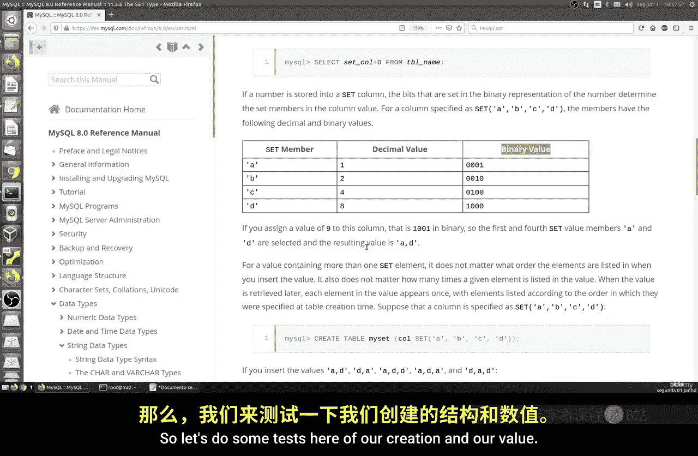
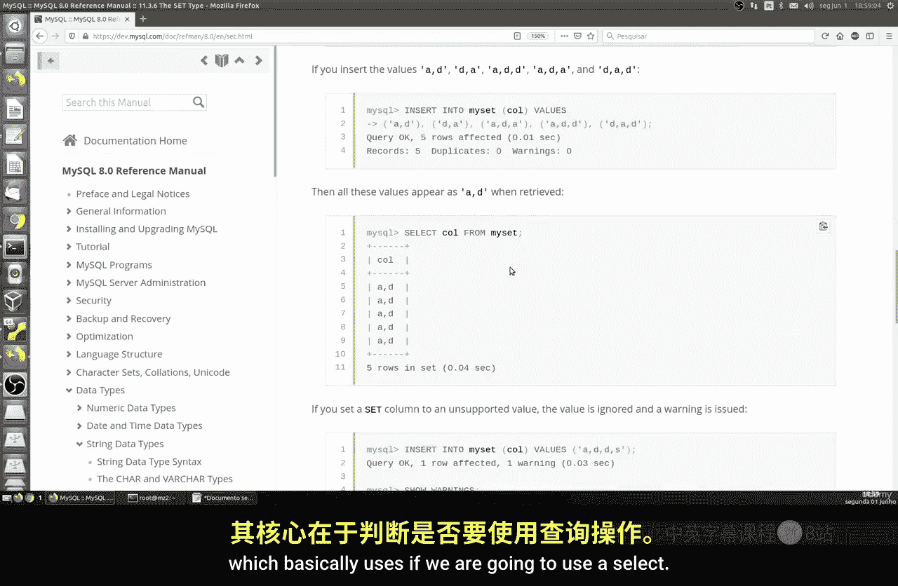
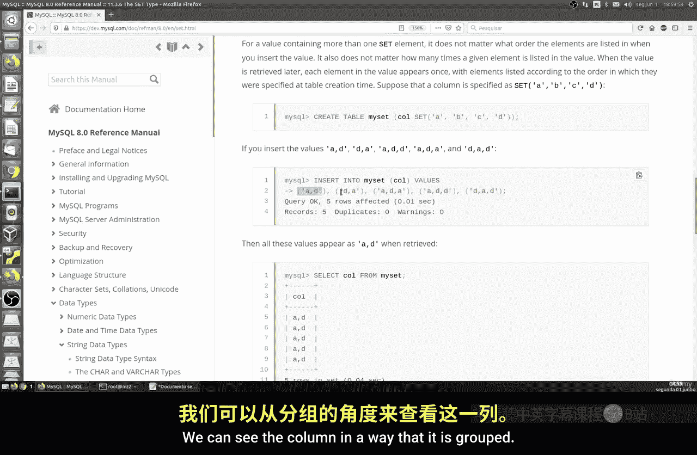
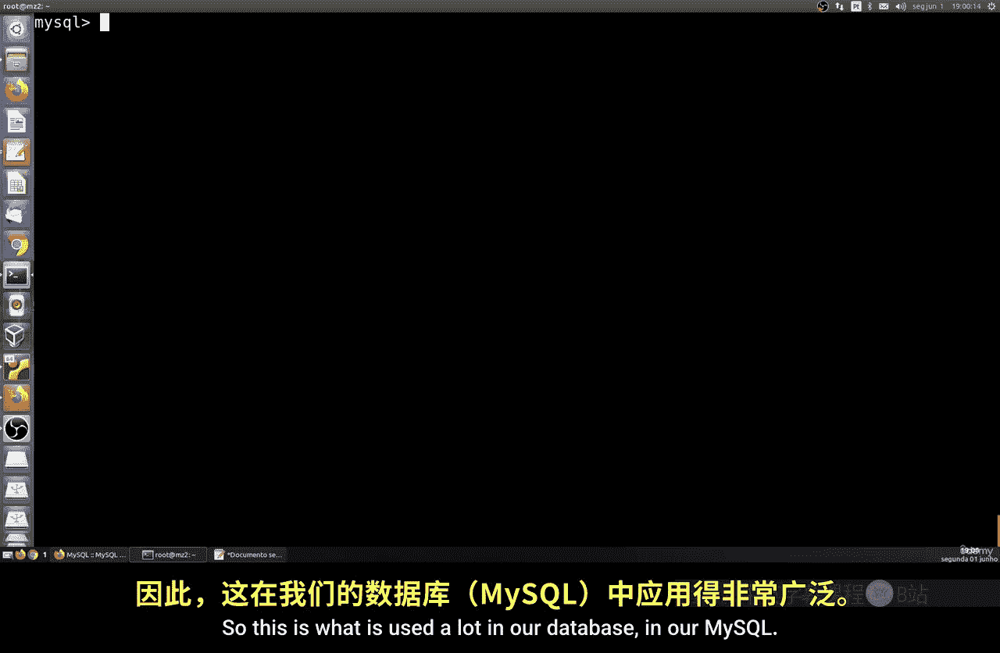
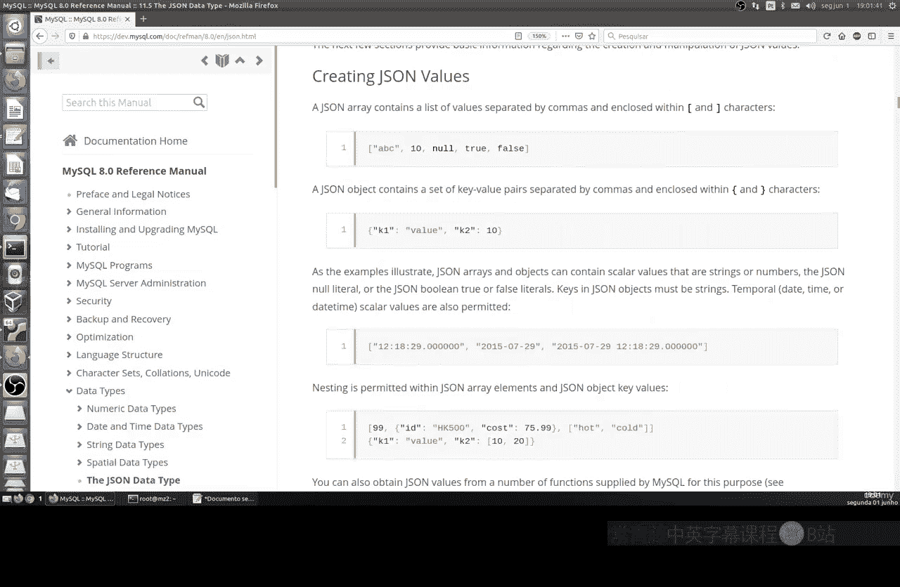
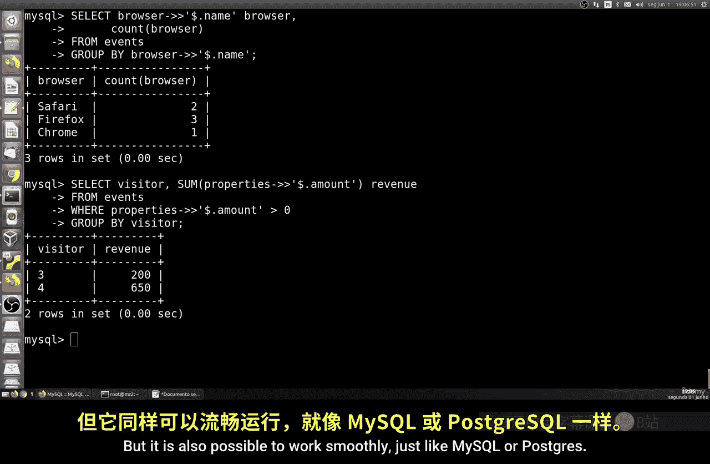
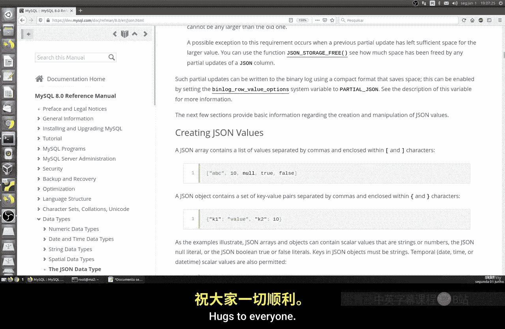

# 064：SET与JSON类型

在本节课中，我们将要学习MySQL中的两种特殊数据类型：SET类型和JSON类型。我们将了解它们的基本概念、创建方法、数据插入方式以及如何查询其中的数据。

## SET类型

上一节我们介绍了其他数据类型，本节中我们来看看SET类型。



SET类型是一种可以包含零个或多个值的数据类型。它本质上是一个允许值的列表，这个列表在创建表时定义。列表中的每个值用逗号分隔。一个SET列最多可以包含64个不同的成员。

以下是SET类型成员与其二进制值的对应关系示例：
```
SET成员： 十进制值 -> 二进制值
'member1' -> 1 -> 0001
'member2' -> 2 -> 0010
'member3' -> 4 -> 0100
'member4' -> 8 -> 1000
```


### 创建与使用SET类型



以下是创建包含SET类型列的表的示例：


```sql
CREATE TABLE user_hobbies (
    id INT AUTO_INCREMENT PRIMARY KEY,
    username VARCHAR(50),
    hobbies SET('travel', 'sports', 'music', 'dance')
);
```



现在让我们向表中插入数据。在SET列中插入值时，值会被存储为位图类型。



```sql
INSERT INTO user_hobbies (username, hobbies)
VALUES ('Alice', 'travel,dance');
```

当我们查询数据时，可以看到SET列的值以逗号分隔的字符串形式显示。

```sql
SELECT * FROM user_hobbies;
```

我们也可以使用`FIND_IN_SET`函数或位运算符来查询包含特定SET成员的行。

```sql
-- 查找喜欢旅行的人
SELECT * FROM user_hobbies WHERE FIND_IN_SET('travel', hobbies) > 0;
```



## JSON类型

上一节我们介绍了SET类型，本节中我们来看看更现代、更灵活的JSON类型。

JSON是JavaScript Object Notation的缩写，是一种轻量级的数据交换格式。它在Web应用和大数据处理中非常流行。MySQL从5.7.8版本开始原生支持JSON数据类型。

### 创建与使用JSON类型

以下是创建包含JSON类型列的表的示例：

```sql
CREATE TABLE events (
    id INT AUTO_INCREMENT PRIMARY KEY,
    event_name VARCHAR(100),
    visitor VARCHAR(100),
    properties JSON,
    browser JSON
);
```

以下是向JSON列插入数据的示例。JSON数据必须符合标准格式。

```sql
INSERT INTO events (event_name, visitor, properties, browser)
VALUES (
    'page_view',
    'visitor1',
    '{"amount": 500, "resolution": {"x": 1920, "y": 1080}}',
    '{"name": "Safari", "os": "Mac", "resolution": "Retina"}'
);
```

我们可以插入更多遵循相同结构但值不同的记录。

```sql
INSERT INTO events (event_name, visitor, properties, browser)
VALUES
('purchase', 'visitor2', '{"amount": 150}', '{"name": "Firefox", "os": "Windows"}'),
('click', 'visitor3', '{"amount": 200}', '{"name": "Chrome", "os": "Windows"}');
```

### 查询JSON数据

MySQL提供了一系列操作符和函数来查询和操作JSON数据。

以下是提取JSON对象中特定键值的示例：

```sql
-- 提取浏览器名称
SELECT visitor, browser->'$.name' AS browser_name FROM events;
```

使用`->>`操作符可以去除提取值两端的引号。

```sql
SELECT visitor, browser->>'$.name' AS browser_name FROM events;
```

我们可以对JSON数据进行聚合查询，例如统计每种浏览器的使用次数。

```sql
SELECT browser->>'$.name' AS browser_name, COUNT(*) AS count
FROM events
GROUP BY browser->>'$.name';
```

我们还可以计算每位访客的总交易金额。



```sql
SELECT visitor, SUM(properties->>'$.amount') AS total_amount
FROM events
WHERE properties->>'$.amount' IS NOT NULL
GROUP BY visitor;
```

JSON类型在MySQL中非常强大，虽然对于大规模、专门的文档数据库场景，MongoDB等NoSQL数据库可能更常用，但MySQL的JSON支持足以应对许多实际应用场景。



本节课中我们一起学习了MySQL中的SET和JSON数据类型。SET类型适用于存储预定义值的集合，而JSON类型提供了存储和查询半结构化数据的强大能力。这两种类型极大地扩展了MySQL处理复杂数据的能力。