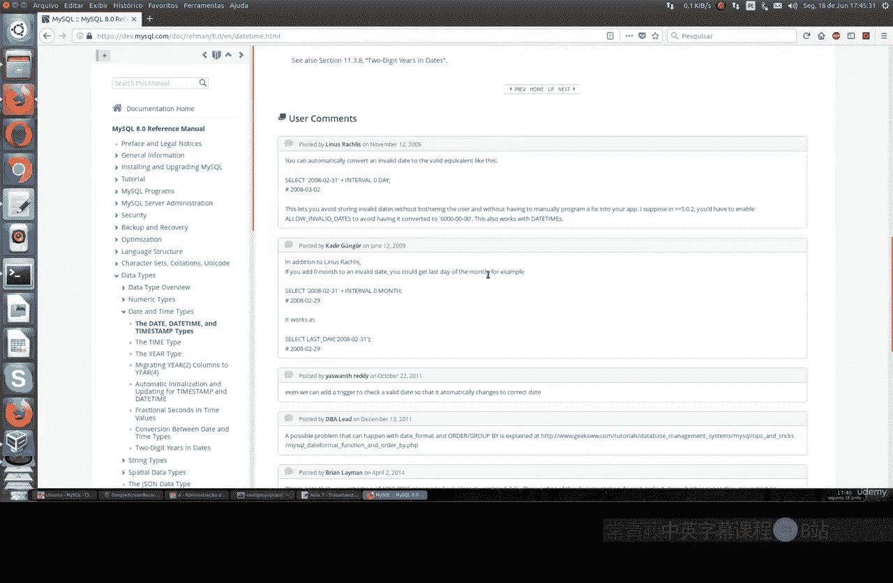
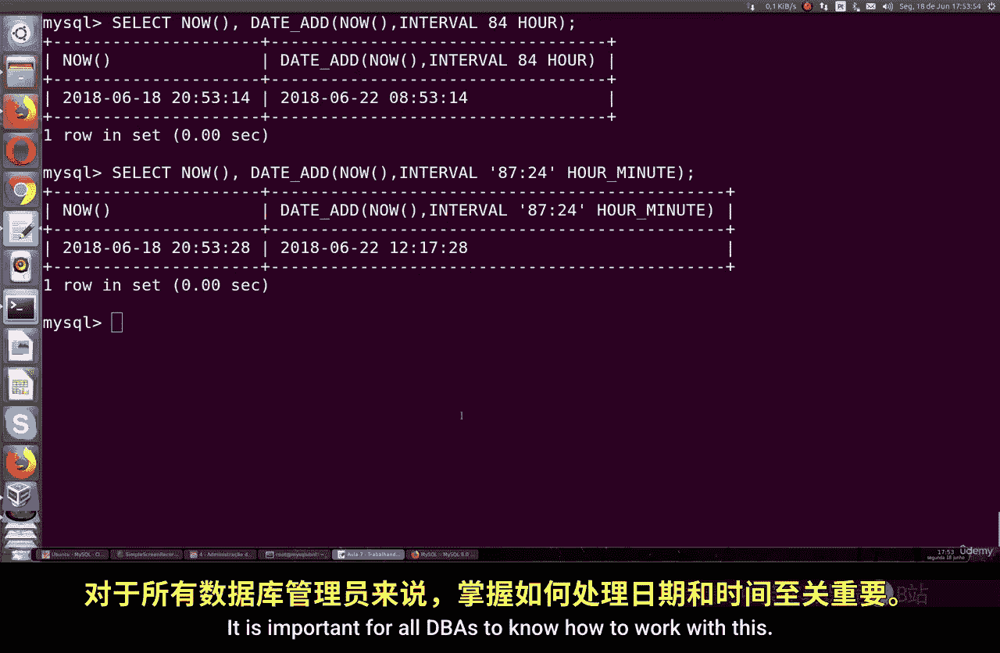
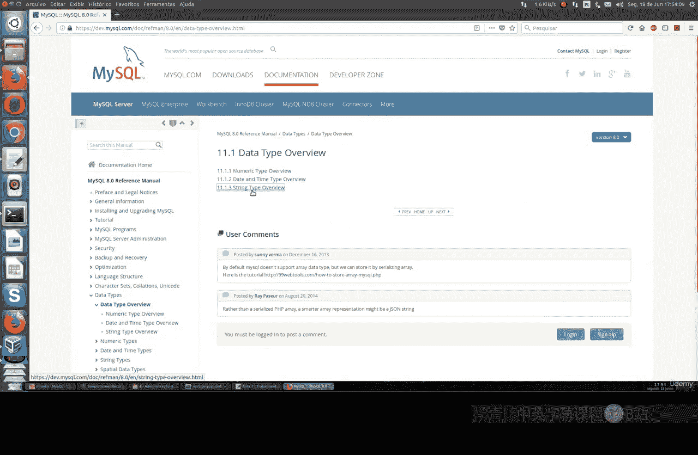
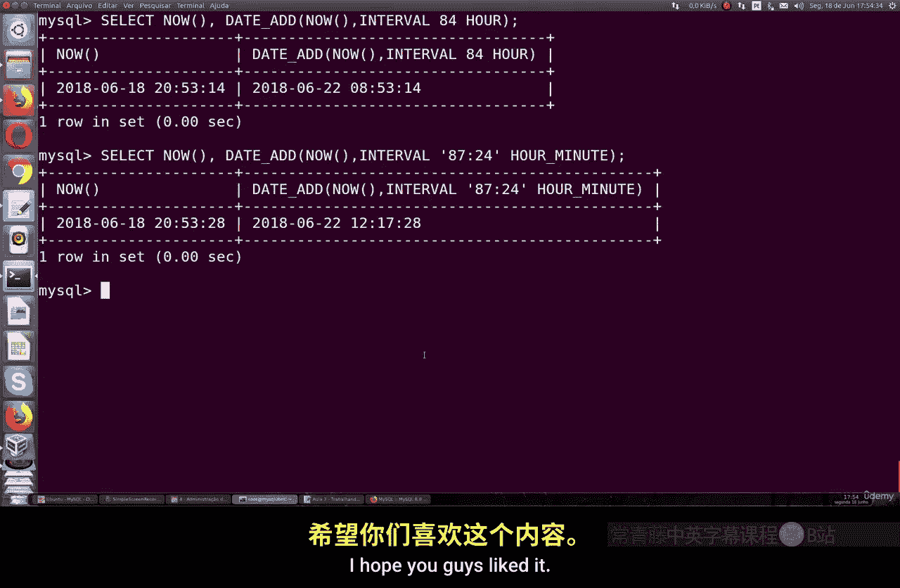

MySQL命令行基础：Part2：处理时间与日期 📅⏰

在本节课中，我们将学习如何在MySQL中处理时间和日期。时间和日期是数据库中非常重要的数据类型，许多应用场景都依赖于精确的时间记录。我们将学习相关的数据类型、函数以及如何对它们进行操作和格式化。



上一节我们介绍了MySQL的基础操作，本节中我们来看看如何处理时间和日期。

---

### 创建包含时间与日期的表

首先，我们创建两个简单的表来分别存储时间和日期数据。

以下是创建仅存储时间（`TIME`）的表的命令：

```sql
CREATE TABLE time_table (
    time_value TIME
);
```

接下来，我们向表中插入一些时间值：

```sql
INSERT INTO time_table (time_value) VALUES ('12:00:00'), ('03:02:00'), ('05:00:00'), ('06:00:00');
```

然后，我们创建一个仅存储日期（`DATE`）的表：

```sql
CREATE TABLE date_table (
    date_value DATE
);
```

并向其中插入一些日期值：

```sql
INSERT INTO date_table (date_value) VALUES ('2023-06-15'), ('2022-12-01'), ('2024-01-20');
```

执行查询命令 `SELECT * FROM time_table;` 和 `SELECT * FROM date_table;`，可以看到两个表分别存储了时间和日期信息。

---

### 使用NOW()函数获取当前时间

MySQL提供了 `NOW()` 函数，可以自动获取服务器当前的日期和时间。

以下是使用 `NOW()` 函数的示例：

```sql
SELECT NOW();
```

这条命令会返回一个包含当前日期和时间的 `DATETIME` 值，格式类似于 `2023-10-27 14:30:45`。其精度取决于操作系统。

你还可以通过指定小数位数来获取更精确的时间戳：

```sql
SELECT NOW(6);
```

`NOW(6)` 会返回包含微秒精度的当前时间。

---

### 格式化时间与日期输出

我们可以使用 `DATE_FORMAT()` 和 `TIME_FORMAT()` 函数来按照特定格式显示时间和日期。

以下是一些格式化示例：

```sql
-- 格式化日期
SELECT DATE_FORMAT(NOW(), '%Y年%m月%d日') AS formatted_date;

-- 格式化时间
SELECT TIME_FORMAT(NOW(), '%H时%i分%s秒') AS formatted_time;
```

在格式化字符串中，`%Y` 代表四位年份，`%m` 代表月份，`%d` 代表日期，`%H` 代表24小时制的小时，`%i` 代表分钟，`%s` 代表秒。

---

### 创建包含DATETIME字段的表

我们也可以创建一个同时包含日期和时间的表。

以下是创建 `DATETIME` 类型字段的命令：

```sql
CREATE TABLE datetime_table (
    event_datetime DATETIME
);
```

插入数据时，需要提供完整的日期和时间：

```sql
INSERT INTO datetime_table (event_datetime) VALUES ('2023-10-27 14:30:00'), (NOW());
```

使用别名（`AS`）可以让查询结果的列名更清晰：

```sql
SELECT event_datetime AS ‘事件时间’ FROM datetime_table;
```

---

### 对时间与日期进行计算

MySQL允许我们对时间和日期进行加减运算，这在计算时长、截止日期等场景中非常有用。

以下是日期计算的示例：

```sql
-- 计算3天后的日期
SELECT NOW() AS ‘当前时间’, DATE_ADD(NOW(), INTERVAL 3 DAY) AS ‘三天后’;

-- 计算84小时后的时间
SELECT NOW() AS ‘当前时间’, DATE_ADD(NOW(), INTERVAL 84 HOUR) AS ‘84小时后’;

-- 计算一周前的日期
SELECT NOW() AS ‘当前时间’, DATE_SUB(NOW(), INTERVAL 1 WEEK) AS ‘一周前’;
```



`DATE_ADD()` 函数用于增加时间间隔，`DATE_SUB()` 函数用于减少时间间隔。`INTERVAL` 关键字后面可以跟 `DAY`、`HOUR`、`MINUTE`、`WEEK`、`MONTH`、`YEAR` 等单位。



---

### 官方文档参考

关于时间和日期函数的更完整信息，可以查阅MySQL官方文档。虽然内容不是特别庞杂，但这些函数逻辑清晰，是数据库管理员必须掌握的知识。

---



本节课中我们一起学习了MySQL中时间和日期的基本操作。我们掌握了如何创建存储时间和日期的表，如何使用 `NOW()` 函数获取当前时间，如何格式化输出，以及如何对时间和日期进行简单的计算。这些技能对于管理数据库记录、生成报告和实现业务逻辑都至关重要。