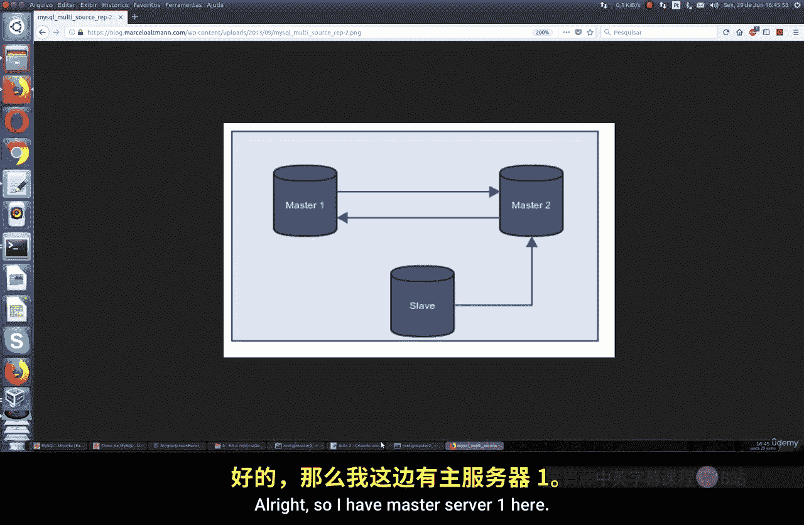
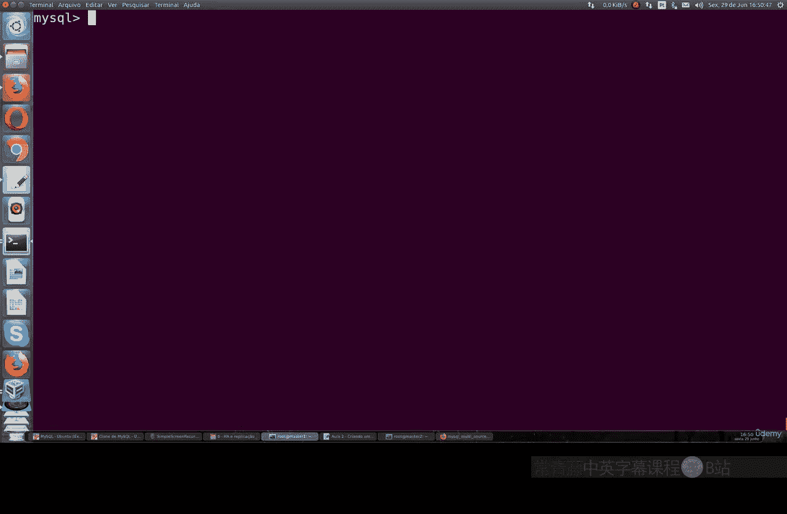
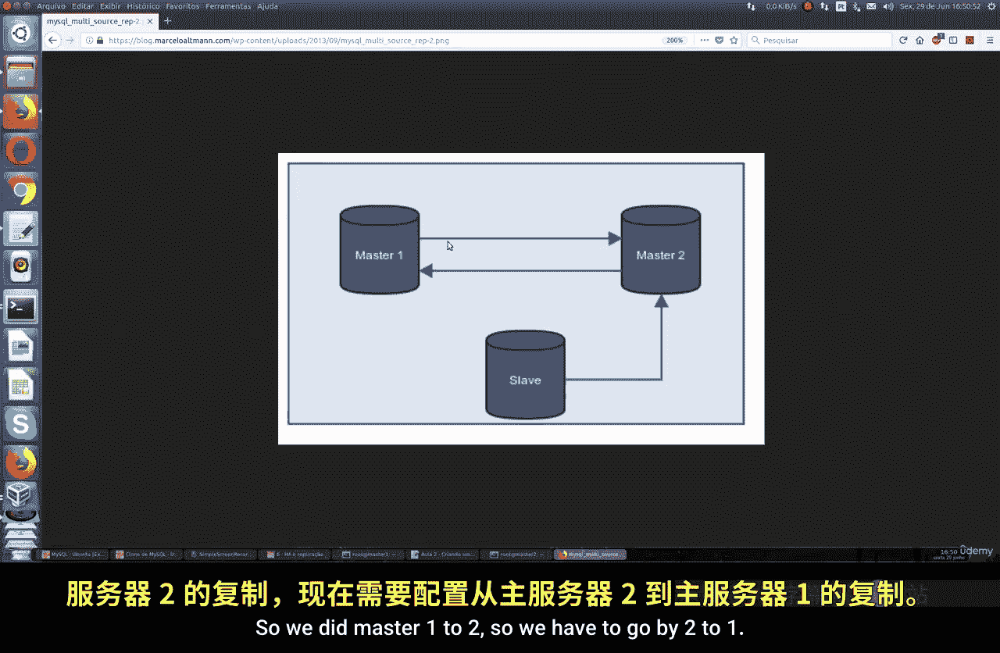
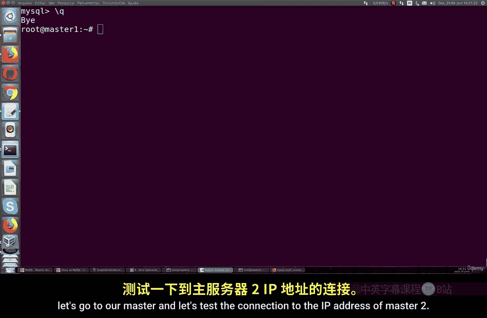
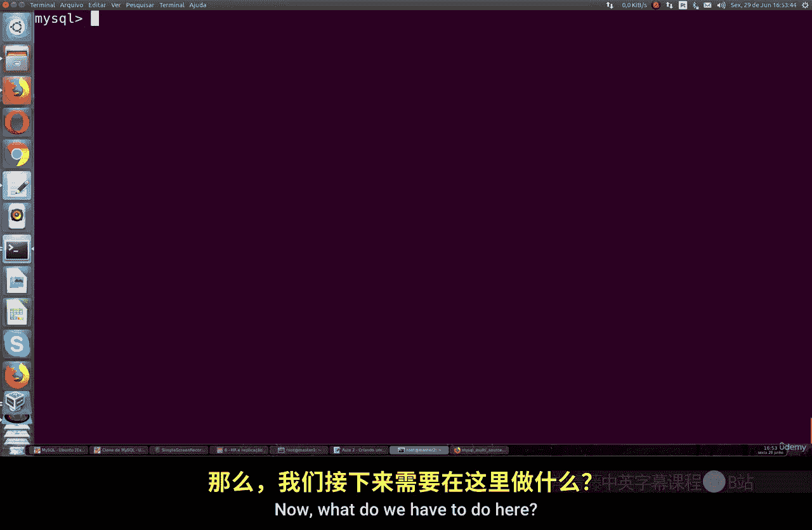
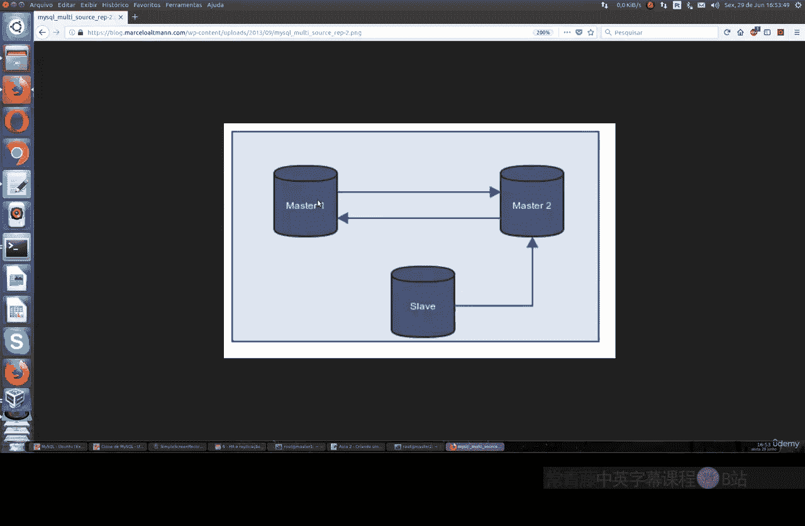
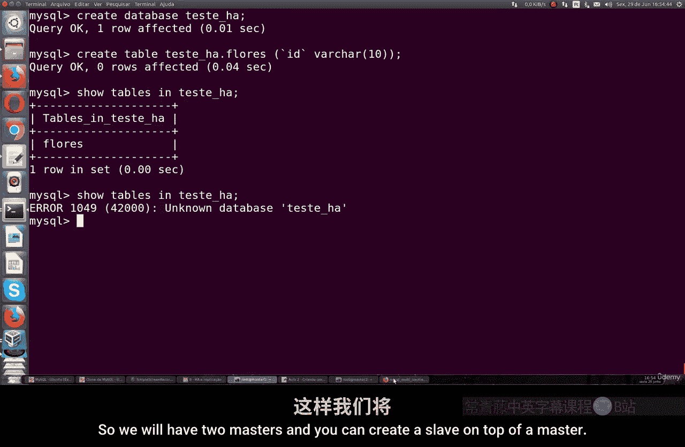
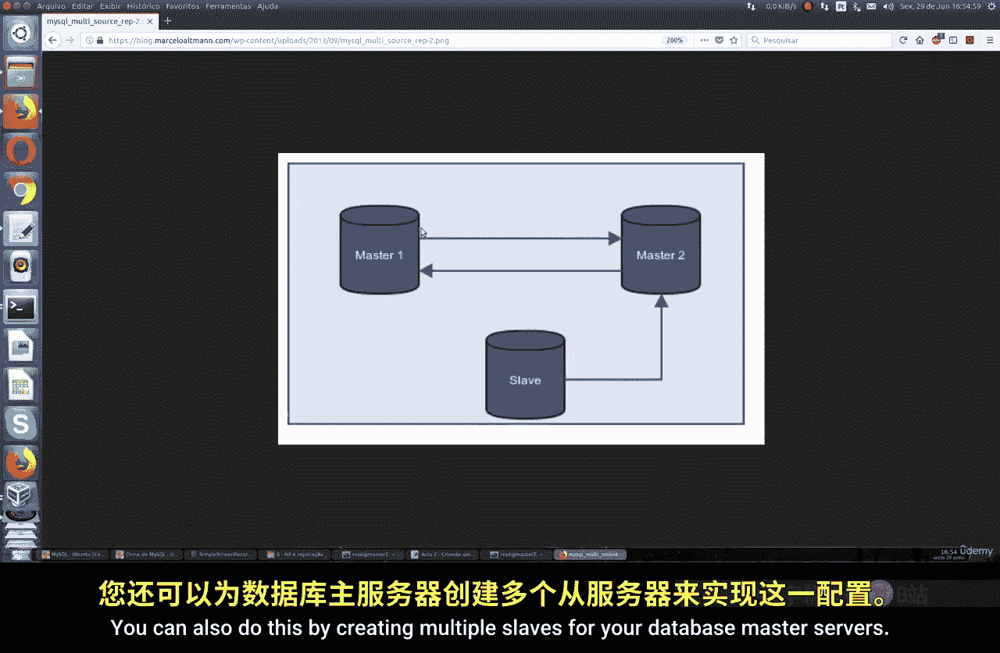
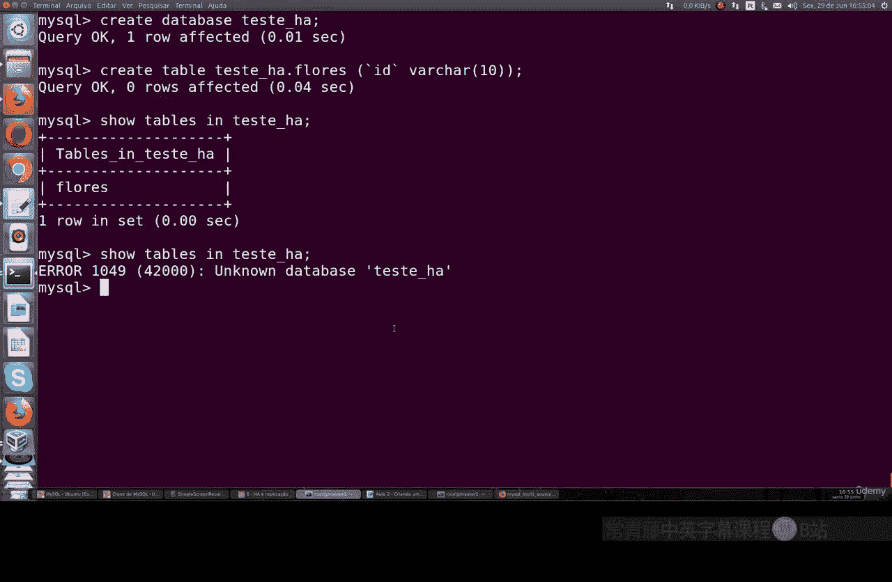

# 067：配置MySQL主-主复制 🔄

在本节课中，我们将学习如何配置MySQL的主-主复制。这种配置允许两个数据库服务器互为主服务器，任何一方的数据变更（如创建、修改、删除）都会自动同步到另一方。这为构建高可用、可扩展的数据库集群奠定了基础。

## 概述与原理

上一节我们介绍了主-从复制的基本配置。本节中，我们来看看如何配置更高级的主-主复制。

主-主复制的核心是让两个MySQL服务器互为主从。这意味着：
*   **服务器A** 既是主服务器，也是**服务器B**的从服务器。
*   **服务器B** 既是主服务器，也是**服务器A**的从服务器。

任何在**服务器A**上执行的数据操作，都会复制到**服务器B**；反之亦然。这种配置可以实现负载均衡和高可用性。

## 环境准备

开始配置前，请确保你有两台已安装MySQL的服务器。在本教程中，我们称它们为：
*   **Master1**：IP地址为 `192.168.0.20`
*   **Master2**：IP地址为 `192.168.0.21`

## 第一步：配置Master1服务器

首先，我们需要登录到Master1服务器，修改其MySQL配置文件。

以下是需要修改或确认的配置项：
*   `server-id = 1`：设置服务器唯一ID。
*   `log-bin = mysql-bin`：启用二进制日志。
*   `binlog_format = ROW`：建议使用ROW格式。
*   `expire_logs_days = 10`：设置日志过期天数。
*   `bind-address = 0.0.0.0`：允许远程连接。

修改完成后，重启MySQL服务使配置生效。



```bash
sudo systemctl restart mysql
```

## 第二步：在Master1上创建复制用户

重启服务后，登录到Master1的MySQL命令行，创建一个专用于复制的用户，并授予相应的权限。

```sql
-- 创建复制用户
CREATE USER 'replication'@'%' IDENTIFIED BY '123456';

-- 授予复制权限
GRANT REPLICATION SLAVE ON *.* TO 'replication'@'%';

-- 刷新权限
FLUSH PRIVILEGES;
```

## 第三步：配置Master2服务器

现在，切换到Master2服务器。其配置步骤与Master1类似，但`server-id`必须不同。

以下是Master2的关键配置：
*   `server-id = 2`
*   其他配置（如`log-bin`）与Master1保持一致。

修改并保存配置文件后，同样需要重启MySQL服务。

```bash
sudo systemctl restart mysql
```

## 第四步：在Master2上创建复制用户并测试连接

登录Master2的MySQL，创建相同的复制用户。

```sql
CREATE USER 'replication'@'%' IDENTIFIED BY '123456';
GRANT REPLICATION SLAVE ON *.* TO 'replication'@'%';
FLUSH PRIVILEGES;
```

接着，从Master2测试到Master1的网络连接和用户权限，确保Master2能访问Master1。

```bash
mysql -h 192.168.0.20 -u replication -p
```

输入密码`123456`后，若成功登录，则连接测试通过。

## 第五步：将Master2设置为Master1的从服务器

这是建立双向复制的关键一步。我们需要获取Master1当前的二进制日志状态，然后在Master2上配置。

首先，在**Master1**上执行：

```sql
SHOW MASTER STATUS;
```



记录下返回结果中的 `File`（例如 `mysql-bin.000005`）和 `Position`（例如 `1761`）值。



然后，在**Master2**的MySQL中，执行以下命令来配置其作为Master1的从服务器：

```sql
-- 停止从服务
STOP SLAVE;

-- 配置主库信息
CHANGE MASTER TO
MASTER_HOST='192.168.0.20',
MASTER_USER='replication',
MASTER_PASSWORD='123456',
MASTER_LOG_FILE='mysql-bin.000005',
MASTER_LOG_POS=1761;

-- 启动从服务
START SLAVE;
```




配置完成后，检查从服务器状态：

```sql
SHOW SLAVE STATUS\G
```

查看输出中的 `Slave_IO_Running` 和 `Slave_SQL_Running` 两项，确保其值均为 `Yes`，表示复制线程运行正常。

## 第六步：将Master1设置为Master2的从服务器

现在，我们需要建立反向的复制链路，让Master1也成为Master2的从服务器。

首先，在**Master2**上执行 `SHOW MASTER STATUS;`，记录其 `File`（例如 `mysql-bin.000004`）和 `Position`（例如 `701`）值。

然后，在**Master1**的MySQL中，执行类似的配置命令：

```sql
STOP SLAVE;

CHANGE MASTER TO
MASTER_HOST='192.168.0.21',
MASTER_USER='replication',
MASTER_PASSWORD='123456',
MASTER_LOG_FILE='mysql-bin.000004',
MASTER_LOG_POS=701;

START SLAVE;
```

同样，使用 `SHOW SLAVE STATUS\G` 命令验证复制状态是否正常。



## 第七步：测试主-主复制功能



至此，双向复制已配置完成。我们可以进行测试来验证其效果。

1.  在 **Master1** 上创建一个数据库和表：
    ```sql
    CREATE DATABASE test_db;
    USE test_db;
    CREATE TABLE test_table (id INT, name VARCHAR(50));
    ```

2.  切换到 **Master2**，查看数据库和表是否已同步：
    ```sql
    SHOW DATABASES;
    USE test_db;
    SHOW TABLES;
    ```
    你应该能看到 `test_db` 数据库和其中的 `test_table` 表。

3.  在 **Master2** 上删除这个表：
    ```sql
    DROP TABLE test_table;
    ```

4.  再回到 **Master1** 查看，会发现 `test_table` 表也已被自动删除。

## 扩展思考



主-主复制配置成功后，你可以在其基础上进一步扩展架构。

例如，你可以在任一主服务器下挂载多个从服务器，形成一个更复杂的复制拓扑，以满足读写分离、数据备份等不同需求。





## 总结

本节课中我们一起学习了MySQL主-主复制的完整配置流程。我们首先分别在两台服务器上进行了基础配置并创建了复制用户，然后分两步建立了双向的复制关系，最后通过测试验证了数据的双向同步。掌握主-主复制是构建高可用数据库系统的重要一步，你可以在此基础上，结合主-从复制，设计出适合自己业务需求的数据库集群架构。