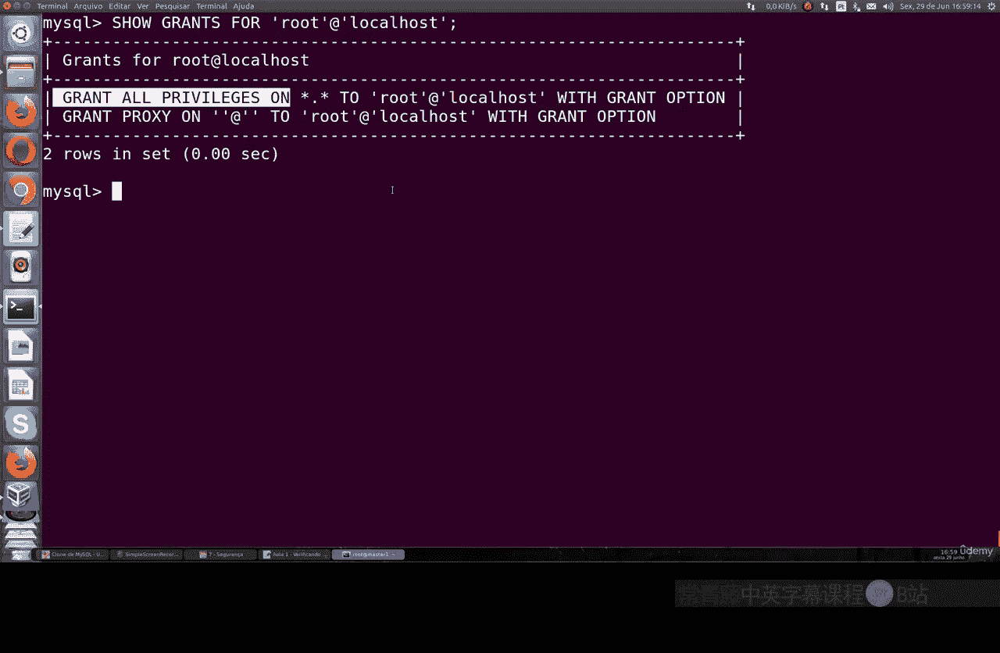
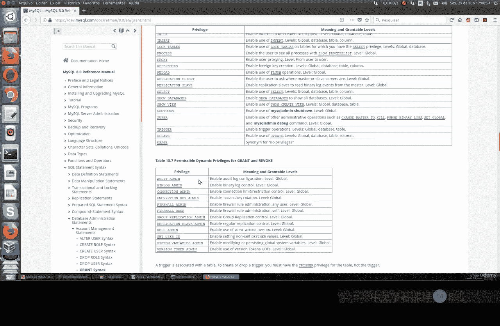
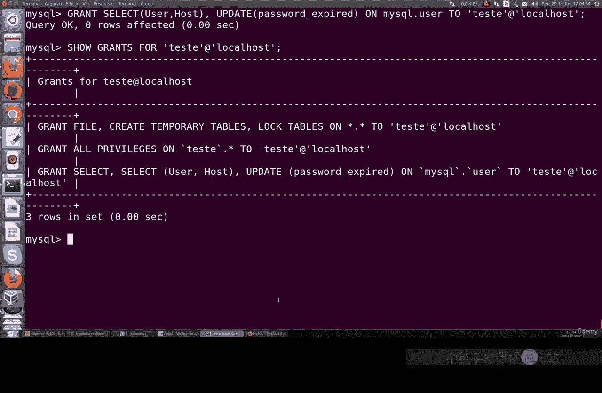
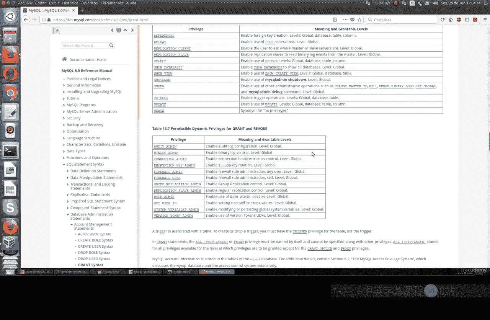
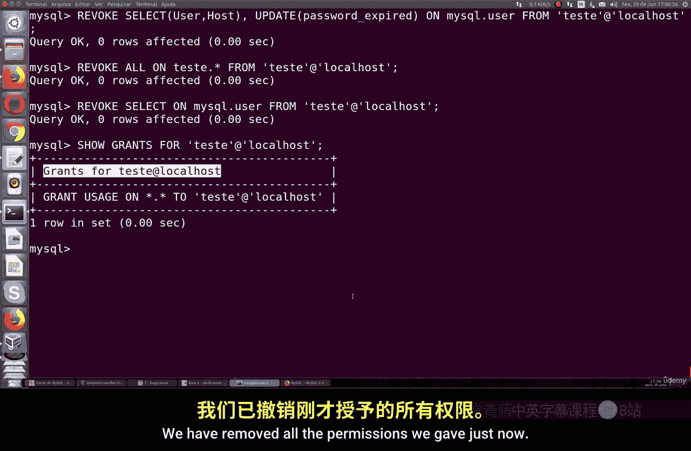
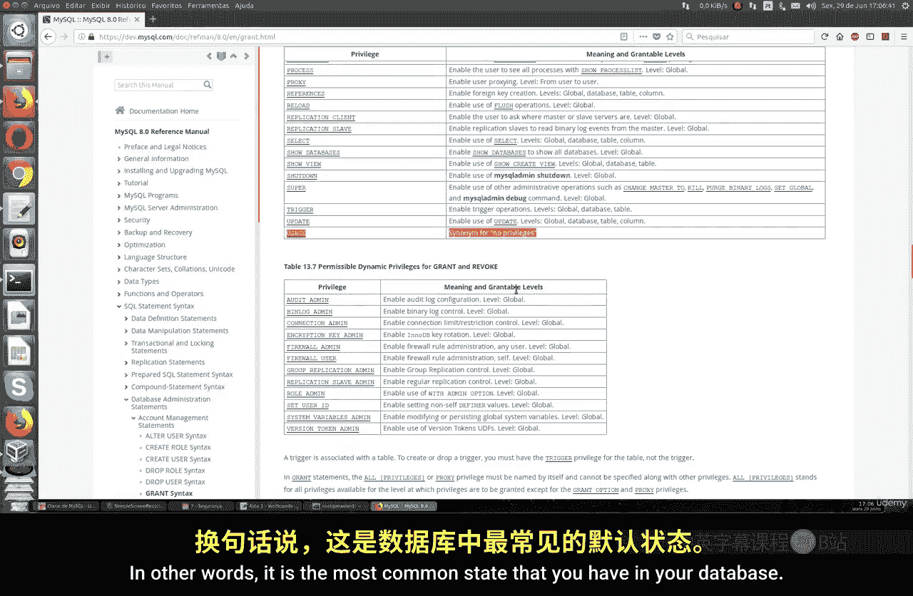
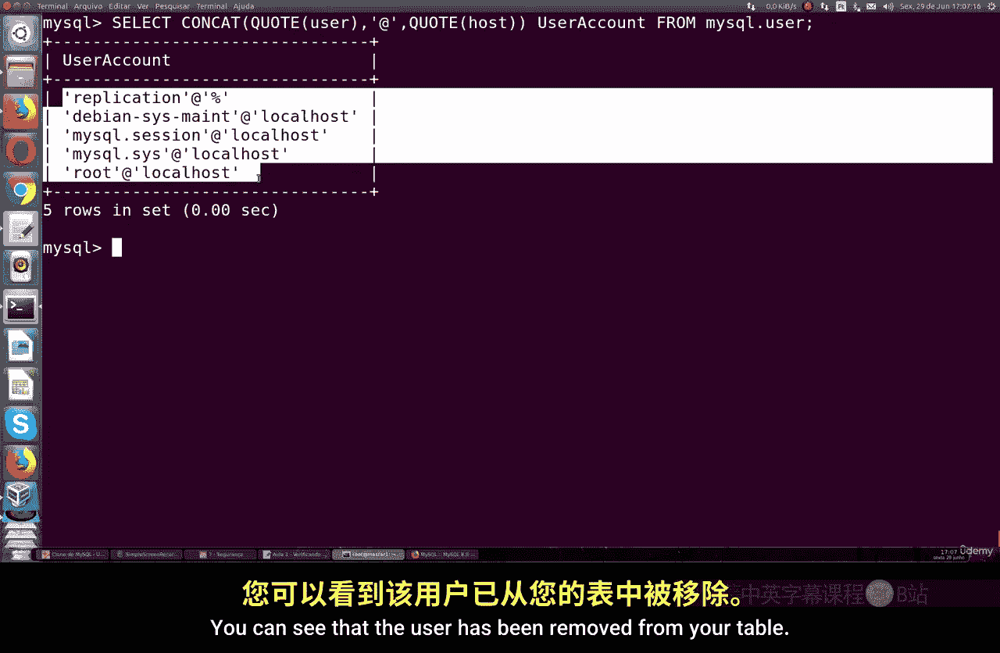
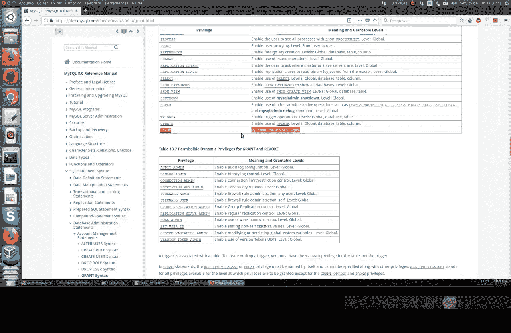

# 068：检查用户权限 🔐

在本节课中，我们将要学习如何检查和管理MySQL数据库中的用户权限。数据库安全的基础在于为每个用户分配恰当的访问权限，确保他们只能访问必要的数据和功能。

上一节我们介绍了数据库的基本概念，本节中我们来看看如何具体管理用户权限。

## 查看现有用户

首先，我们需要列出数据库中所有已存在的用户。用户信息存储在 `mysql.user` 表中。

以下是查看所有用户的SQL命令：

```sql
SELECT CONCAT(user, '@', host) AS 'User Account' FROM mysql.user;
```

执行此命令后，你将看到类似 `root@localhost`  或 `test_user@%` 的用户列表。`root` 用户是拥有所有权限的超级管理员。

## 理解权限类型

MySQL提供了多种类型的权限，可以授予给用户。这些权限范围从全局（影响整个服务器）到特定数据库、表甚至列。

以下是主要的权限类别：
*   **全局权限**：影响整个MySQL服务器实例。
*   **数据库权限**：针对特定数据库。
*   **表权限**：针对特定表。
*   **列权限**：针对表中的特定列。
*   **其他权限**：如创建用户、管理复制进程等。



## 授予用户权限

创建用户后，默认只有最基本的登录权限（`USAGE`）。我们需要使用 `GRANT` 语句为其分配具体权限。

以下是授予权限的基本语法：

```sql
GRANT 权限类型 ON 数据库名.表名 TO ‘用户名’@‘主机名’;
```

例如，创建一个只能从本地登录的用户 `test`，并授予其对 `test_db` 数据库中所有表的全部权限：



```sql
CREATE USER ‘test’@‘localhost’ IDENTIFIED BY ‘your_password’;
GRANT ALL PRIVILEGES ON test_db.* TO ‘test’@‘localhost’;
```

你也可以授予更细粒度的权限。例如，只允许用户读取和写入文件：

```sql
GRANT FILE ON *.* TO ‘test’@‘localhost’;
```

或者允许用户锁定表和创建临时表：

```sql
GRANT LOCK TABLES, CREATE TEMPORARY TABLES ON *.* TO ‘test’@‘localhost’;
```

**最佳实践是遵循最小权限原则，即只授予用户完成其工作所必需的最低权限。**

## 查看用户权限

要查看特定用户拥有哪些权限，可以使用 `SHOW GRANTS` 命令。

以下是查看用户权限的命令：

```sql
SHOW GRANTS FOR ‘用户名’@‘主机名’;
```

例如，查看 `root` 用户的权限：

```sql
SHOW GRANTS FOR ‘root’@‘localhost’;
```

## 撤销用户权限



如果不再需要某个用户的某些权限，可以使用 `REVOKE` 语句将其撤销。



以下是撤销权限的基本语法：

```sql
REVOKE 权限类型 ON 数据库名.表名 FROM ‘用户名’@‘主机名’;
```

例如，撤销 `test` 用户对 `test_db` 数据库的所有权限：

```sql
REVOKE ALL PRIVILEGES ON test_db.* FROM ‘test’@‘localhost’;
```

撤销其文件操作权限：



```sql
REVOKE FILE ON *.* FROM ‘test’@‘localhost’;
```

执行撤销操作后，该用户的权限状态将恢复到你授予之前的水平。



## 其他用户管理操作

除了权限管理，你还可以执行其他用户账户操作。

以下是两个常用的操作：
*   **重命名用户**：使用 `RENAME USER` 命令。
    ```sql
    RENAME USER ‘old_user’@‘localhost’ TO ‘new_user’@‘localhost’;
    ```
*   **删除用户**：使用 `DROP USER` 命令。
    ```sql
    DROP USER ‘username’@‘localhost’;
    ```





**注意：删除用户是一个不可逆的操作，请谨慎执行。**

## 总结

本节课中我们一起学习了MySQL用户权限管理的核心操作。我们了解了如何查看现有用户、理解不同的权限类型、使用 `GRANT` 语句授予权限、使用 `SHOW GRANTS` 检查权限、以及使用 `REVOKE` 语句撤销权限。记住，良好的数据库安全始于为每个用户配置严格且必要的访问权限。建议你查阅MySQL官方文档，以深入了解所有可用的权限选项。