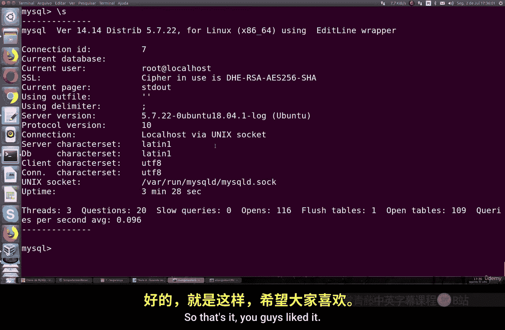

# 071：建立加密连接 🔐

在本节课中，我们将学习如何为MySQL数据库服务器配置强制性的加密连接。默认情况下，MySQL的连接是不加密的，这存在安全风险。我们将通过生成加密密钥、修改配置并创建强制使用SSL的用户，来确保所有数据传输的安全。

## 检查当前加密状态

首先，我们需要检查MySQL服务器当前的加密连接状态。默认情况下，加密功能是禁用的。

运行以下SQL命令来查看SSL相关的系统变量：

```sql
SHOW VARIABLES LIKE '%ssl%';
```

执行此命令后，你会看到所有SSL相关的变量都是`OFF`状态，并且服务器没有配置任何加密密钥或证书。这意味着当前的连接是明文的，存在被窃听的风险。

**因此，绝对不要在生产环境中使用未加密的MySQL连接。**

## 生成加密密钥与证书

为了让MySQL支持加密连接，我们需要先生成必要的密钥和证书文件。幸运的是，MySQL提供了一个便捷的工具来完成这项工作。

在Ubuntu服务器上，运行以下命令：

```bash
sudo mysql_ssl_rsa_setup
```

这个命令会自动生成一套2048位的RSA密钥对，包括客户端和服务器端所需的证书和私钥。

生成完成后，你可以使用`find`命令来定位这些密钥文件的位置。默认情况下，它们存放在MySQL的数据目录中，通常是`/var/lib/mysql/`。

进入该目录，你可以看到类似以下文件：
*   `ca-key.pem`
*   `ca.pem`
*   `server-cert.pem`
*   `server-key.pem`
*   `client-cert.pem`
*   `client-key.pem`

这些就是我们接下来要使用的密钥和证书文件。

## 配置MySQL服务器

生成了密钥文件后，下一步是修改MySQL的配置文件，告诉服务器使用这些文件来启用SSL加密。

打开MySQL的主配置文件（通常是`/etc/mysql/mysql.conf.d/mysqld.cnf`或`/etc/my.cnf`），在`[mysqld]`配置段中添加以下行：

```ini
[mysqld]
ssl-ca=/var/lib/mysql/ca.pem
ssl-cert=/var/lib/mysql/server-cert.pem
ssl-key=/var/lib/mysql/server-key.pem
```

这些配置项的含义是：
*   `ssl-ca`: 指定证书颁发机构(CA)证书的路径。
*   `ssl-cert`: 指定服务器公钥证书的路径。
*   `ssl-key`: 指定服务器私钥的路径。

保存并关闭配置文件。为了使更改生效，需要重启MySQL服务：

```bash
sudo systemctl restart mysql
```

## 验证加密连接

服务器重启后，让我们验证加密是否已成功启用。

首先，使用`root`账户登录MySQL（注意，此时`root`登录可能仍不需要SSL，这本身也是一个安全风险，建议仅允许`root`从本地登录）。

再次运行检查SSL状态的命令：

```sql
SHOW VARIABLES LIKE '%ssl%';
```

现在，你应该会看到`have_ssl`和`have_openssl`等变量的值变为`YES`，并且证书文件的路径也已正确显示。

你还可以在MySQL客户端中使用`\s`（或`status`）命令来查看当前连接的状态。在连接信息中，你应该能看到`SSL`被使用，并且会显示加密的密码套件，例如`Cipher in use is ECDHE-RSA-AES256-GCM-SHA384`。

## 创建强制使用SSL的用户

上一节我们配置了服务器端的SSL，但默认用户仍可能使用非加密连接。为了确保安全，我们可以创建强制要求使用SSL连接的用户。

以下是创建此类用户的步骤：

1.  创建一个新用户，并在创建时指定`REQUIRE SSL`选项。

    ```sql
    CREATE USER 'ssl_user'@'%' IDENTIFIED BY 'YourStrongPassword123!' REQUIRE SSL;
    ```

    这条命令创建了一个名为`ssl_user`的用户，并强制要求该用户的所有连接都必须使用SSL。

2.  为新用户授予权限。例如，授予其对`test_db`数据库的所有权限。

    ```sql
    GRANT ALL PRIVILEGES ON test_db.* TO 'ssl_user'@'%';
    FLUSH PRIVILEGES;
    ```

## 测试强制SSL连接

现在，让我们从另一台客户端机器测试这个用户的连接。

尝试不使用SSL进行连接（假设服务器IP是`192.168.1.100`）：

```bash
mysql -u ssl_user -p -h 192.168.1.100
```

即使输入了正确的密码，连接也会被拒绝，并提示错误，因为服务器要求必须使用SSL。

现在，使用SSL选项进行连接：

```bash
mysql -u ssl_user -p -h 192.168.1.100 --ssl-mode=REQUIRED
```

这次，你应该能成功登录。登录后，再次使用`\s`命令，确认连接确实正在使用SSL加密。

## 总结

本节课中，我们一起学习了如何为MySQL数据库建立加密连接。我们从检查默认的不安全状态开始，然后逐步生成了SSL密钥对，配置了MySQL服务器以启用加密，并最终创建了强制使用SSL的用户账户进行验证。

核心要点包括：
*   **默认风险**：MySQL默认不加密连接，需手动启用。
*   **密钥生成**：使用`mysql_ssl_rsa_setup`命令快速生成密钥。
*   **服务器配置**：在配置文件中通过`ssl-ca`、`ssl-cert`、`ssl-key`参数指定密钥路径。
*   **用户策略**：使用`CREATE USER ... REQUIRE SSL`语法创建强制加密连接的用户。
*   **安全连接**：使用`--ssl-mode=REQUIRED`客户端选项确保连接加密。




为数据库连接启用加密是系统安全中最基础且关键的一环，能有效防止数据在传输过程中被窃听或篡改。请务必在你的生产环境中应用此配置。