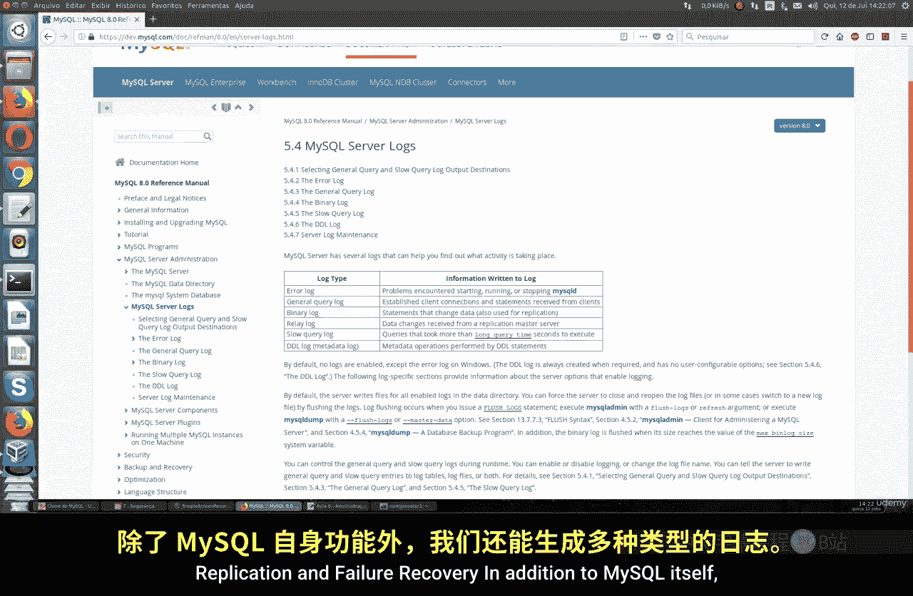

# 073：日志文件配置与管理

在本节课中，我们将学习如何在MySQL中配置和管理日志文件。日志对于数据库管理员至关重要，它能帮助我们发现错误、监控系统活动、进行故障恢复和性能调优。



## 概述

MySQL提供了多种类型的日志，用于记录服务器活动、错误信息、慢查询等。默认情况下，并非所有日志都已启用，因此我们需要了解如何配置它们。本节将介绍主要的日志类型及其配置方法。

## 日志类型与配置

上一节我们介绍了日志的重要性，本节中我们来看看MySQL中具体有哪些日志类型以及如何配置它们。

以下是MySQL中几种关键的日志文件及其作用：

1.  **通用查询日志**
    *   **作用**：记录所有客户端连接、接收到的SQL语句以及其他杂项事件。用于监控服务器活动，例如谁在连接、从哪里连接以及执行了什么操作。
    *   **配置参数**：`general_log_file`
    *   **启用方法**：在MySQL配置文件中设置 `general_log = 1`。

2.  **错误日志**
    *   **作用**：记录MySQL服务器启动、关闭过程中的信息，以及运行中出现的错误、警告和异常事件。是排查服务器启动失败等问题的主要依据。
    *   **配置参数**：`log_error`
    *   **说明**：这是最常用的日志之一，默认启用。

3.  **慢查询日志**
    *   **作用**：记录执行时间超过指定阈值的查询语句，有助于识别需要优化的低效SQL。也可以配置为记录未使用索引的查询。
    *   **配置参数**：`slow_query_log`, `long_query_time`, `log_queries_not_using_indexes`
    *   **阈值定义**：通过 `long_query_time` 变量定义“慢”的阈值，单位是秒。例如，设置为 `10` 表示执行时间超过10秒的查询将被记录。

## 配置文件设置

了解了各类日志的作用后，我们需要知道在哪里进行配置。MySQL的日志配置主要在它的配置文件中进行。

1.  找到MySQL的配置文件（通常是 `my.cnf` 或 `my.ini`）。
2.  在 `[mysqld]` 部分添加或修改日志相关的参数。
3.  一个基础的配置示例如下：

    ```ini
    [mysqld]
    # 启用通用查询日志并指定文件路径
    general_log = 1
    general_log_file = /var/log/mysql/general.log

    # 指定错误日志文件路径
    log_error = /var/log/mysql/error.log

    # 启用慢查询日志并设置阈值
    slow_query_log = 1
    slow_query_log_file = /var/log/mysql/slow.log
    long_query_time = 2
    # 可选：记录未使用索引的查询
    # log_queries_not_using_indexes = 1
    ```

4.  保存配置文件后，需要重启MySQL服务以使更改生效。

    ```bash
    sudo systemctl restart mysql
    ```

## 动态启用与查看日志

除了修改配置文件，我们还可以在MySQL运行时动态地启用或禁用某些日志，这对于临时诊断问题非常方便。

*   **动态启用通用日志**：
    ```sql
    SET GLOBAL general_log = 'ON';
    ```
*   **动态启用慢查询日志**：
    ```sql
    SET GLOBAL slow_query_log = 'ON';
    ```
*   **查看日志相关变量**：要检查当前所有与日志相关的配置，可以使用以下命令：
    ```sql
    SHOW VARIABLES LIKE '%log%';
    ```
    这条命令会列出包括日志是否开启、文件路径、日志轮转周期等在内的所有配置。

## 日志轮转与维护

日志文件会不断增长，如果不加管理，可能会占用大量磁盘空间。因此，配置日志轮转至关重要。

*   **目的**：定期归档、压缩或删除旧的日志文件，防止单个日志文件过大。
*   **方法**：通常使用Linux系统自带的 `logrotate` 工具来管理MySQL日志。可以配置轮转周期（如每天、每周）、保留的日志份数（如保留7天）等。
*   **重要性**：对于高并发、连接数众多的数据库，日志产生速度极快，必须设置合理的轮转策略。

## 查看日志内容

配置完成后，我们可以使用命令行工具查看日志内容，以验证配置或进行问题排查。

*   **查看错误日志尾部**：
    ```bash
    sudo tail -f /var/log/mysql/error.log
    ```
*   **查看通用查询日志**：
    ```bash
    sudo tail -f /var/log/mysql/general.log
    ```
    这里会记录连接的来源、执行的SQL命令、执行时间等详细信息。
*   **查看慢查询日志**：
    ```bash
    sudo tail -f /var/log/mysql/slow.log
    ```

## 总结


本节课中我们一起学习了MySQL日志文件的管理。我们首先了解了**通用查询日志**、**错误日志**和**慢查询日志**这几种核心日志的作用。然后，我们学习了如何在MySQL配置文件中进行静态配置，以及如何在MySQL命令行中动态启用日志。此外，我们还强调了**日志轮转**对于系统维护的重要性，并介绍了查看日志内容的基本命令。定期检查和分析日志是保障数据库安全、稳定和高效运行的关键习惯。