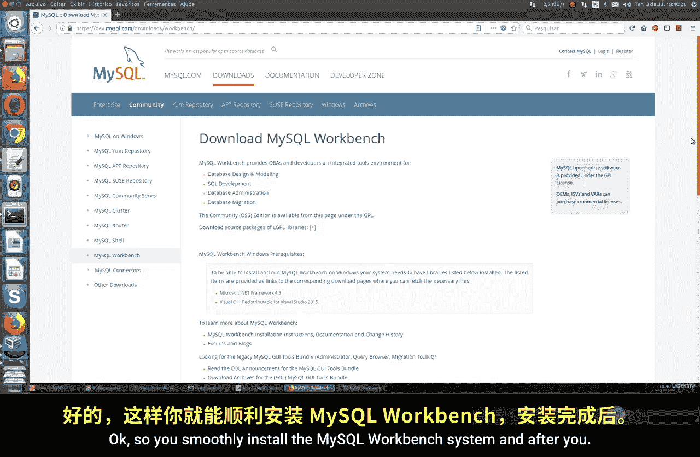
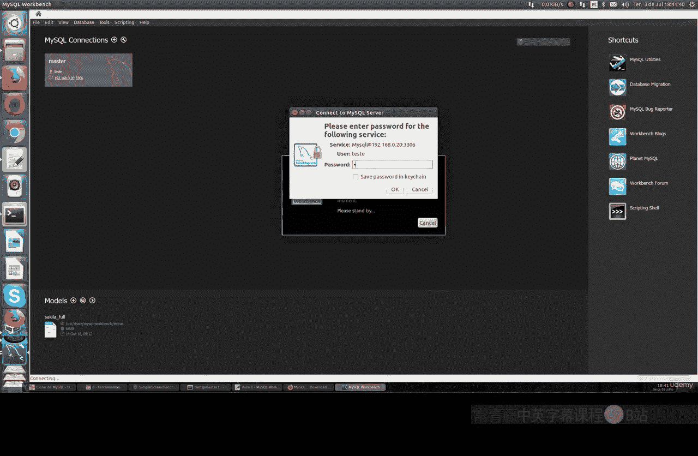
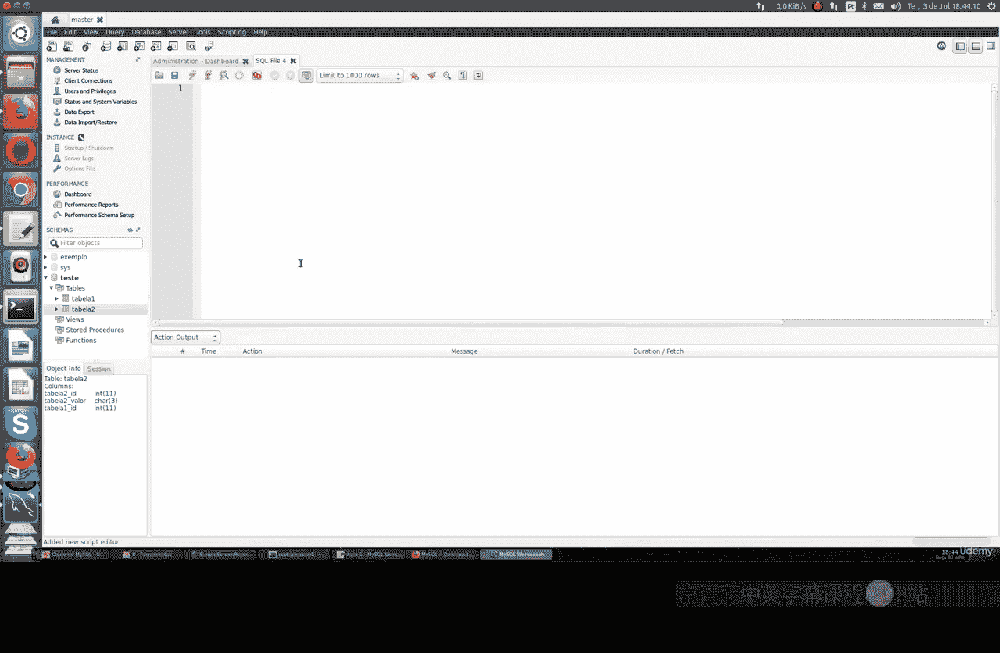

# 074：MySQL Workbench工具介绍 🛠️

在本节课中，我们将要学习MySQL Workbench，这是一个用于管理和操作MySQL数据库的图形化工具。我们将介绍它的主要功能、如何安装以及基本使用方法。

---

上一节我们介绍了命令行操作MySQL的基础，本节中我们来看看一个强大的图形化管理工具——MySQL Workbench。

MySQL Workbench是一个完整的系统，用于执行各种数据库任务，例如管理服务器、编写查询语句以及开发存储过程。简而言之，它在一个简单且免费的系统中集成了所有这些功能。Oracle提供了付费版本，但也有免费版本可供使用。

MySQL Workbench是跨平台的。你可以为Windows、Linux和macOS系统下载它。

以下是各平台的安装包类型：
*   **Windows**：可执行文件（.exe）。
*   **Linux**：Debian/Ubuntu系统使用`.deb`包，Red Hat/Fedora系统使用`.rpm`包。
*   **macOS**：磁盘映像文件（.img）。

你可以顺利安装MySQL Workbench系统。

---

安装完成后，一切就绪，我们基本上会看到一个仪表盘界面，用于连接MySQL数据库。

例如，这里有一个名为“test”的连接指向我们的MySQL服务器。我们将在此建立主连接。

在连接设置中，你需要填写地址和端口、测试用户名。如果你需要连接特定的数据库架构（Schema），也可以在这里设置。密码可以保存在密钥链中。你可以在选项中进行清晰设置。如果使用SSL连接，只需在“高级”选项卡中配置。我们还有另一种连接模式。

以下是可用的连接模式：
*   **TCP/IP**：标准的网络连接。
*   **通过SSH的IP**：这种方式非常有趣且更安全。它是一种间接连接，首先通过SSH建立连接，然后再进行数据库连接。正如之前所说，安全措施永远不嫌多，对于数据库尤其如此。

点击“OK”后，系统会要求输入密码（例如：123456）。输入密码后，我们以“test”用户身份进入。

---

连接成功后，我们在这里可以看到我们的数据库。如果你有任何数据库配置，你可以连接到其中一个。如果你想连接另一个数据库实例，也可以操作。

这里还有一些工具和信息。例如，关于你的数据库流量信息：当前有多少流量？在InnoDB存储引擎方面，我们也有一些信息。

这里还提供了一些其他类型的信息，例如当前连接数、服务器是否正在运行、版本信息等。我们还可以在这里导出某些类型的内容，比如“Test master”数据库的表。

我们还能看到一些信息，比如用户和权限。目前我们没有太多权限，只有root用户。这里有一个小的SQL文件示例。

此外，这里也有数据库架构（Schema）信息，以防你需要查看。侧边栏显示了数据库和表的信息，并提供了一些相关详情。总之，它相当简单易用。

---

那么，核心要点是什么？关键在于你的MySQL密码。请确保妥善保管你的MySQL密码。

如果你想了解更多关于MySQL Workbench的详细信息，可以查看我们的完整课程。显然，本节不会深入探讨MySQL Workbench的所有功能，未来可能会有专门的课程。如果你需要，可以在那里查找。

你可以在这里查看网络状态、MySQL状态，以及缓存的使用情况。总之，InnoDB提供了一些有趣的信息。在某些情况下，你可能需要据此优化（tune）你的MySQL配置。

---

本节课中我们一起学习了MySQL Workbench图形化管理工具。我们了解了它的跨平台特性、安装方法、如何建立数据库连接（包括标准的TCP/IP和更安全的SSH隧道方式），以及其界面提供的基本信息查看和管理功能。记住，妥善管理你的数据库密码是安全操作的关键。